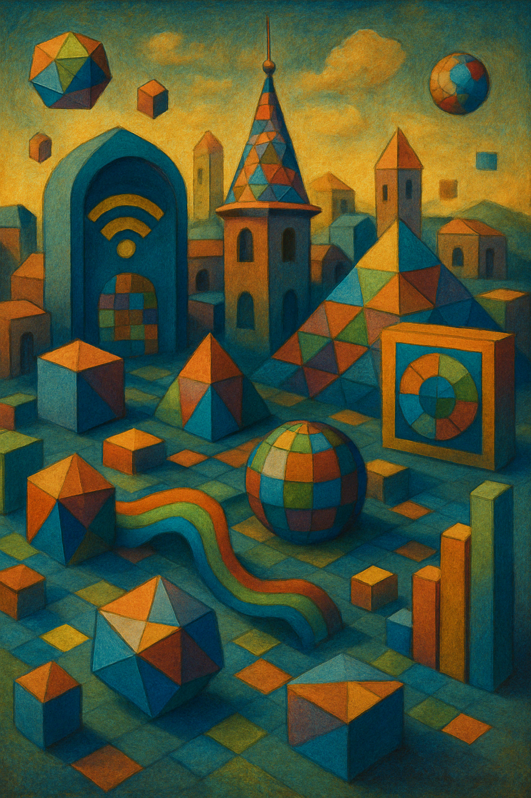
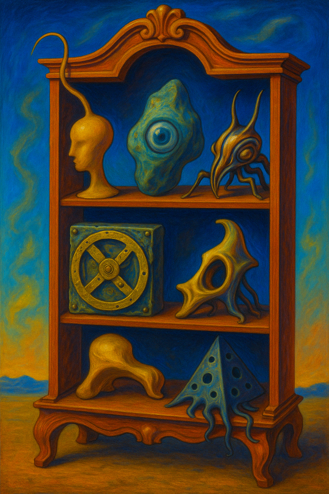

::: {.homepage-introduction}

This site examines how complex technologies, organizations and regulatory systems can be understood, designed and governed.

It brings together structured long-form analysis and shorter research notes developed through consulting practice, technical investigation and independent study.

::: {.d-flex .flex-wrap .gap-2 .mt-4 .mb-4}

[Explore longforms](longforms.qmd){.btn .btn-primary}

[Read recent posts](posts.qmd){.btn .btn-outline-primary}

[Check services](contents/services.qmd){.btn .btn-outline-secondary}

[About Antonio](about.qmd){.btn .btn-outline-secondary}

:::

:::

## Explore the content

<!-- First row: headings -->

<h3>By editorial form</h3>

<h3>By format</h3>

<h3 class="homepage-language-heading">
🇬🇧
English
</h3>

<h3 class="homepage-language-heading">
🇮🇹
Italiano
</h3>

<!-- Second row: longforms -->

<a class="btn btn-outline-secondary btn-sm" href="/topics.html#category=essay">Essays</a>
<a class="btn btn-outline-secondary btn-sm" href="/topics.html#category=position%20paper">Position papers</a>
<a class="btn btn-outline-secondary btn-sm" href="/topics.html#category=tutorial">Tutorials</a>

<a class="btn btn-outline-secondary btn-sm" href="/longforms.html">Longforms</a>

<a class="btn btn-outline-secondary btn-sm" href="/topics.html#category=%F0%9F%87%AC%F0%9F%87%A7">Longforms</a>

<a class="btn btn-outline-secondary btn-sm" href="/topics.html#category=%F0%9F%87%AE%F0%9F%87%B9">Longforms</a>

<!-- Third row: posts -->

<a class="btn btn-outline-secondary btn-sm" href="/posts.html">Posts</a>

<a class="btn btn-outline-secondary btn-sm" href="/posts.html">Posts</a>

<a class="btn btn-outline-secondary btn-sm" href="/posts.html#category=%F0%9F%87%AC%F0%9F%87%A7">Posts</a>

<a class="btn btn-outline-secondary btn-sm" href="/posts.html#category=%F0%9F%87%AE%F0%9F%87%B9">Posts</a>

<h3 class="homepage-topic-heading">By topic</h3>

<a class="btn btn-outline-secondary btn-sm" href="/topics.html#category=enterprise%20architecture">
  Enterprise architecture
</a>

<a class="btn btn-outline-secondary btn-sm" href="/topics.html#category=digital%20transformation">
  Digital transformation
</a>

<a class="btn btn-outline-secondary btn-sm" href="/topics.html#category=cybersecurity">
  Cybersecurity
</a>

<a class="btn btn-outline-secondary btn-sm" href="/topics.html#category=machine%20learning">
  Machine learning
</a>

<a class="btn btn-outline-secondary btn-sm" href="/topics.html#category=mathematics">
  Mathematics
</a>

<a class="btn btn-outline-secondary btn-sm" href="/topics.html#category=energy">
  Energy
</a>

<a class="btn btn-outline-secondary btn-sm" href="/topics.html#category=cryptography">
  Cryptography
</a>

<a class="btn btn-outline-secondary btn-sm" href="/topics.html#category=quantum%20computing">
  Quantum computing
</a>

<a class="btn btn-outline-secondary btn-sm" href="/topics.html#category=software%20development">
  Software development
</a>

## Latest longforms

> **Extended analysis in which technical, organizational and regulatory questions are developed with evidence, structure and sufficient depth.**

::: {#longforms_home}
:::

[Explore all longforms](longforms.qmd){.btn .btn-outline-primary}

## Latest posts

> **Shorter notes, explanations and observations arising from ongoing research and professional practice.**

::: {#posts_home}
:::

[Explore all posts](posts.qmd){.btn .btn-outline-primary}

## Collections

<small>
Curated thematic spaces gathering references, resources and ideas across time.
</small>

::: {layout="[[1,1,1]]"}

{fig-alt="Bookmarks of Inspiration"}

{fig-alt="Cabinet of Digital Curiosities"}

{fig-alt="Free Knowledge"}

:::

## Follow new analysis

New longforms and research notes are published periodically.

::: {.d-flex .flex-wrap .gap-2 .mb-4}

[Follow on LinkedIn](https://www.linkedin.com/in/montano/){.btn .btn-outline-primary}

[Subscribe through RSS](/index.xml){.btn .btn-outline-secondary}

:::

