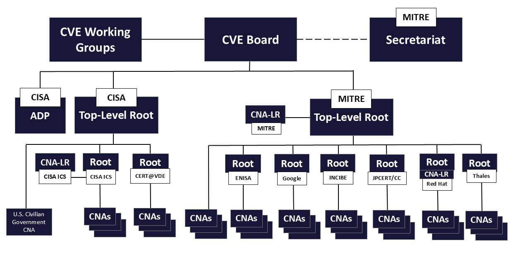

## Introduction

Modern digital systems are not bounded artifacts. They are interconnected, continuously evolving, and deeply embedded in economic, industrial, and social processes. Their behavior emerges from the interaction of multiple layers of software, hardware, and communication rather than from isolated design decisions.

From this structure, a direct consequence follows. Imperfections are not exceptional events but structural properties. Vulnerabilities are therefore not rare defects to be eliminated once discovered, but persistent conditions that must be continuously identified, interpreted, and managed over time.

This persistence creates a coordination problem at global scale. A vulnerability discovered in one context must be understood in another, a flaw identified by a researcher must become actionable for a vendor, and a technical condition must be translated into operational decisions by organizations that depend on the affected systems. Without a shared reference frame, this process fragments: different actors describe the same issue differently, responses become inconsistent, and risk is systematically misestimated.

To avoid this fragmentation, vulnerabilities must be transformed into shared objects. They must be named, described, and made referable in a consistent way across tools, organizations, and jurisdictions. This is the function of the **Common Vulnerabilities and Exposures (CVE) Program**, which provides a global naming and referencing mechanism for publicly disclosed vulnerabilities.

Once vulnerabilities are transformed into globally recognized objects, a second layer emerges. The system that assigns names and coordinates disclosure becomes itself a critical infrastructure, because it determines what is visible, how information propagates, and how quickly coordinated action can take place. Governance is therefore not a secondary concern but a structural component of the system.

Historically, this governance has been relatively centralized. Recent developments indicate a transition toward a more distributed model, in which multiple authorities participate in maintaining the global coordination framework. The emergence of the **European Union Agency for Cybersecurity (ENISA)** as a Root CNA is a concrete instance of this shift, introducing a new governance center within the system.

This article analyzes that transformation from first principles. It starts from the minimal properties of digital systems, derives the necessity of vulnerability coordination, formalizes the role of identifiers and governance, and then examines how changes in governance structure propagate into geopolitical and economic consequences.

The objective is not to describe the CVE system operationally, but to understand its structural role. From this perspective, vulnerability governance is not merely a technical process but a control layer over how risk is defined, communicated, and acted upon. The transition from a centralized to a federated model therefore reflects a deeper transformation: the redistribution of control over a foundational element of the digital ecosystem.

The argument developed here is that this transition is not only desirable but necessary, and that it must extend beyond the CVE ecosystem to other coordination layers if the European Union is to achieve sustainable growth and systemic stability.

## What is a vulnerability ecosystem

Any digital system is composed of software, hardware, and communication layers interacting with each other and with an external environment. Such systems exhibit three fundamental properties: they are finite in design but operate in an effectively unbounded environment, they are created by humans and therefore contain errors, and they evolve over time, continuously introducing new states and behaviors.

From these properties, a direct conclusion follows. Vulnerabilities are not accidental anomalies but structural consequences of how these systems are constructed and operated. They arise whenever unintended behavior becomes reachable under specific conditions and leads to the violation of a desired property such as confidentiality, integrity, availability, or safety.

A **vulnerability** is therefore not merely a bug. It is a _condition in which the system enters an undesirable state under certain inputs or environmental interactions_. This definition does not depend on any standard or institution. It derives directly from system theory and from the observable behavior of complex engineered systems.

Once multiple systems, actors, and processes are involved, vulnerabilities no longer exist in isolation. They form an ecosystem. This ecosystem includes discoverers, vendors, operators, tools, regulators, and coordination bodies, all interacting around the identification, interpretation, and remediation of vulnerabilities.

The defining characteristic of a vulnerability ecosystem is interdependence. A vulnerability identified by one actor must be understood and acted upon by others. The behavior of the system as a whole depends not only on the existence of vulnerabilities, but on how effectively information about them is shared, interpreted, and acted upon across the network of participants.

## The coordination problem

Once vulnerabilities are recognized as structural and systemic, a second problem emerges: coordination. A vulnerability rarely concerns a single actor. At a minimum, it involves a discoverer who identifies the issue, a producer who is responsible for the affected system, and a population of users exposed to the risk.

Without coordination, the system fails in predictable ways. Disclosure may occur too early, increasing the risk of exploitation before a fix is available. Disclosure may occur too late, leaving systems exposed to latent and unmitigated risk. Information may fragment, with different actors describing the same issue differently, making it difficult to assess scope and impact.

To prevent these failure modes, the **ecosystem** requires a shared mechanism that ensures three properties:

1. **Uniqueness**: each vulnerability must be distinguishable from all others.

2. **Referential stability**: once identified, a vulnerability must retain the same reference over time.

3. **Shared semantics**: different actors must be able to refer to the same vulnerability and understand it in a consistent way.

These requirements lead to a fundamental abstraction. A **vulnerability must be transformed into an addressable object**. It must be possible to point to it, refer to it, and reason about it across systems, organizations, and tools without ambiguity.

### The necessity of identifiers

In any distributed system, objects that must be shared require **identifiers**. This is a basic property of information systems. Without identifiers, there is no reliable way to refer to an object across contexts.

Formally, we can consider the set of vulnerabilities as a set of elements that must be mapped to a set of identifiers. The mapping must ensure that each vulnerability corresponds to exactly one identifier, and that no two distinct vulnerabilities share the same identifier. This guarantees that references remain unambiguous.

This mapping enables essential properties of the system: deduplication of information, traceability of issues over time, and composability across databases and tools. Without it, the system collapses into ambiguity, as different actors cannot reliably determine whether they are referring to the same underlying issue.

### The CVE system as a minimal solution

The **Common Vulnerabilities and Exposures (CVE) Program**[^reclaiming-namespace-eu-digital-sovereignty-cve-ecosystem-CVEO] implements this abstraction by providing a **global namespace for vulnerability identifiers**. It assigns standardized identifiers of the form CVE-YYYY-NNNN and maintains a process for their allocation and publication.

The role of CVE is not to store all information about vulnerabilities, but to provide a shared reference point. It allows different tools, organizations, and processes to refer to the same vulnerability using a common identifier.

From a structural perspective, CVE is not a database but a **naming system**. It performs a function analogous to DNS for domain names or primary keys in relational systems. By assigning stable identifiers, it reduces ambiguity and enables coordination across the ecosystem.

[^reclaiming-namespace-eu-digital-sovereignty-cve-ecosystem-CVEO]: See: [CVE Program overview](https://www.cve.org/about/overview)

The CVE namespace is maintained through a **federated organizational structure**. Strategic direction is provided by the CVE Board, while operational support and program infrastructure are handled by the Secretariat. Identifier assignment is delegated through a hierarchy of Top Level Roots, Roots, and CVE Numbering Authorities, each operating within defined scopes and escalation rules. In this sense, the CVE system is structurally a governed distributed naming regime, even though its outputs are also published through common program infrastructure[^reclaiming-namespace-eu-digital-sovereignty-cve-ecosystem-CVEP].

[^reclaiming-namespace-eu-digital-sovereignty-cve-ecosystem-CVEP]: See: [CVE Program Organization and Structure](https://www.cve.org/programorganization/Structure)

```{mermaid}
%%| label: fig-cve-process
%%| fig-cap: "Simplified CVE lifecycle from vulnerability discovery to coordinated disclosure and ecosystem propagation. The diagram shows how a vulnerability becomes a globally addressable object through assignment, coordination, and publication."
%%| fig-alt: "Sequence diagram showing a researcher reporting a vulnerability to a CNA or vendor, the CNA validating and assigning a CVE identifier, coordination with the vendor to prepare a fix, and final publication of the CVE which is then propagated to the broader ecosystem including CERTs, tools, and users."
%%| fig-align: "center"
%%{init: {"theme": "neo", "look": "handDrawn"}}%%
sequenceDiagram
    participant R as Researcher / Discoverer
    participant V as Vendor
    participant CNA as CNA (CVE Numbering Authority)
    participant CVE as CVE System
    participant E as Ecosystem (CERTs, Tools, Users)

    R->>V: Report vulnerability
    R->>CNA: (Optional) Report vulnerability

    V->>CNA: Request CVE ID
    CNA->>CNA: Triage and validation

    CNA->>CVE: Reserve CVE ID
    CVE-->>CNA: CVE-YYYY-NNNN

    CNA->>V: Coordinate disclosure
    V->>V: Prepare fix / mitigation

    CNA->>CVE: Publish CVE entry
    CVE-->>E: Disseminate vulnerability information

    E->>E: Enrich (scoring, alerts, advisories)
```

### Why governance is unavoidable

Once a global naming system exists, it must satisfy strict constraints. Identifiers must be unique, consistently assigned, and globally accepted. These constraints cannot be enforced without governance.

Governance provides the mechanisms that prevent identifier collisions, validate assignments, and define the rules under which the system operates. This is not an optional layer. It is a logical requirement of any system that aims to maintain a consistent global namespace.

In the CVE system, governance is implemented through a **hierarchy of authorities**. **CVE Numbering Authorities (CNAs)** are responsible for assigning identifiers within defined scopes, while **Root CNAs** coordinate these activities, enforce rules, and maintain overall consistency.

Historically, this governance structure has been centered on **MITRE**[^reclaiming-namespace-eu-digital-sovereignty-cve-ecosystem-MITREHP], which operates the **top-level coordination role** within the system and ensures that the global namespace remains coherent[^reclaiming-namespace-eu-digital-sovereignty-cve-ecosystem-MITRECVE].

The structure of the program is more articulated than a simple hierarchy and reflects the need to combine centralized coordination with distributed operational scalability.

At the highest level sits the **CVE Board**, which provides strategic governance and community oversight for the ecosystem. The Board includes representatives from industry, public institutions, security organizations, and research communities, and contributes to the evolution of policies, operational practices, and long-term direction of the program.

Supporting the Board are the **CVE Working Groups**, which focus on specific operational and strategic topics within the ecosystem. These groups contribute technical expertise, discuss process evolution, and address emerging challenges in vulnerability coordination and disclosure practices.

Operational coordination is then divided across multiple top-level governance entities.

The **MITRE Top-Level Root** historically represents the primary coordination authority of the CVE ecosystem. It supervises Root CNAs, maintains consistency of the namespace, coordinates assignment practices, and acts as a central stabilization point for the overall system.

The **MITRE Secretariat** provides administrative and organizational support to the program, enabling continuity of governance, coordination activities, communication, and operational management.

Alongside MITRE, the structure also includes the **CISA Top-Level Root**, operated within the U.S. governmental context. This branch supports coordination across U.S. civilian government environments and contributes to the scaling of vulnerability coordination activities inside federal ecosystems.

The structure further includes the **Authorized Data Publisher (ADP)** role, also associated in the figure with CISA. ADPs enrich CVE records with additional information while preserving the integrity of the original assignment process. This enables the ecosystem to scale informational value without fragmenting the namespace itself.

Another critical role is the **CNA of Last Resort (CNA-LR)**. These entities ensure that vulnerabilities can still receive identifiers even when no ordinary CNA has direct scope over the affected technology or organization. In practice, they prevent unassigned vulnerabilities from falling outside the coordination framework.

Below these layers operate the various **Root CNAs**, including organizations such as:

- **ENISA**, representing the emerging European governance node within the ecosystem;
- **Google**, coordinating vulnerability identification across its technological domains and ecosystems;
- **INCIBE**, representing the Spanish national cybersecurity ecosystem;
- **JPCERT/CC**, operating within the Japanese coordination environment;
- **Red Hat**, coordinating vulnerabilities related to its enterprise open-source ecosystem;
- **Thales**, representing a major industrial and defense technology actor.

Each Root CNA supervises additional CNAs operating within defined scopes. This allows operational responsibility to be distributed while preserving global consistency through shared governance mechanisms.

The resulting architecture resembles a federated coordination model:

- governance is distributed across multiple operational centers,
- but coherence is maintained through shared rules, coordination layers, and namespace supervision.

This balance is fundamental. Excessive centralization would create scalability limitations and geopolitical dependency, while excessive decentralization would risk fragmentation, duplication, and semantic divergence across the vulnerability ecosystem.

{fig-align="center"}

The relevance of this structure extends beyond operational efficiency. Once a global vulnerability namespace becomes foundational to cybersecurity operations, the organizations participating in its governance acquire influence over how vulnerabilities are identified, interpreted, prioritized, and operationalized across the digital economy.

[^reclaiming-namespace-eu-digital-sovereignty-cve-ecosystem-MITREHP]: See: [MITRE Corporation](https://www.mitre.org/)

[^reclaiming-namespace-eu-digital-sovereignty-cve-ecosystem-MITRECVE]: See: [MITRE Top-Level Root CVE Program Role](https://www.cve.org/PartnerInformation/ListofPartners/partner/mitre)

## Transition to the European context

The governance structure described so far has historically been centered on a single primary coordination authority, associated with MITRE. While the system has always involved multiple CNAs, the top-level coordination, rule definition, and conflict resolution mechanisms have been effectively anchored in one institutional context.

This arrangement ensured coherence, but it also _introduced a structural dependency_. A globally critical coordination mechanism depended on a single jurisdiction, a single funding structure, and a single institutional environment. Even if governance remained neutral in intent, the dependency itself was real and observable.

Recent developments indicate a shift away from this configuration. The **European Union Agency for Cybersecurity (ENISA)**[^reclaiming-namespace-eu-digital-sovereignty-cve-ecosystem-CVEENISA] has been established as a Root CNA within the CVE Program, with **scope covering EU member states, EU institutions, and associated coordination networks**. This introduces an additional top-level governance center operating under a different legal, regulatory, and institutional framework.

[^reclaiming-namespace-eu-digital-sovereignty-cve-ecosystem-CVEENISA]: See: [ENISA Root CNA CVE Program Role](https://www.cve.org/PartnerInformation/ListofPartners/partner/ENISA)

The significance of this change is not administrative. It alters the structure of the system: instead of a single coordination apex with subordinate authorities, the system now includes multiple top-level coordination centers. Each root operates within a shared global framework but is no longer subordinate to a single central node. Governance becomes distributed across distinct but interconnected authorities.

This shift is visible not only at the level of formal announcements, but also in the structure of participating organizations. Entities such as **DIVD**[^reclaiming-namespace-eu-digital-sovereignty-cve-ecosystem-CVEDIVD] appear within the ENISA-rooted hierarchy, indicating that parts of the ecosystem are already being reorganized around this new governance center.

[^reclaiming-namespace-eu-digital-sovereignty-cve-ecosystem-CVEDIVD]: See: [DIVD hompeage](https://www.divd.nl/) and [DIVD under ENISA Root](https://www.cve.org/PartnerInformation/ListofPartners/partner/DIVD)

### What changes at the system level

In the previous model, governance followed a predominantly hierarchical structure. A single top-level authority defined rules, ensured consistency, and resolved ambiguities. CNAs operated within this framework, and conflicts or edge cases ultimately converged toward a single reference point.

This structure favored simplicity and uniformity. Decision-making was centralized, coordination overhead was relatively low, and semantic consistency was easier to maintain. The system behaved as a coherent whole because its governance logic had a single source.

However, this same structure concentrated risk. When a globally critical system depends on a single authority, any constraint affecting that authority propagates throughout the ecosystem. Financial limitations, policy changes, or geopolitical factors can impact the entire coordination mechanism.

The emerging model replaces this concentration with distribution. **Multiple Root CNAs, including MITRE and ENISA, now share responsibility for coordinating the system**. Each root governs a defined scope but must operate in alignment with the others to preserve global consistency.

This transforms the system from a hierarchy into a federation. In a federated model, authority is distributed across multiple coordination centers. This increases resilience, because the system no longer depends on a single institutional node. Different regions can maintain operational continuity even if one part of the system is constrained.

At the same time, the shift introduces new requirements. Consistency must now be actively maintained across roots rather than implicitly enforced by a single authority. Divergence becomes possible, as different governance centers operate under different constraints and priorities. Coordination must extend not only vertically, between roots and their CNAs, but also horizontally, between the roots themselves.

The result is a structural trade-off. Centralization simplifies governance but concentrates risk. Federation distributes risk but increases coordination complexity. The CVE ecosystem is now transitioning between these two regimes.

This transformation is not only technical. It has direct implications for how control is distributed across the digital economy and therefore for the concept of digital sovereignty itself.

### Implications: digital sovereignty

Digital sovereignty is often framed in political or rhetorical terms. In this context, it can be defined more precisely as the ability to control critical coordination mechanisms that determine how a system is observed, interpreted, and governed.

A coordination mechanism is critical when other processes depend on it to function correctly. In cybersecurity, the CVE system is one such mechanism. It does not directly detect attacks or remediate systems, but it defines the reference frame within which vulnerabilities are identified, communicated, and prioritized.

This role produces three structural effects:

1. It **structures knowledge**. When a vulnerability is assigned a CVE identifier, it becomes part of a shared global vocabulary. If it is not identified within this framework, it remains local, fragmented, or effectively invisible to coordinated processes. Naming determines visibility.

2. It **synchronizes action**. Vulnerability management processes, patch cycles, and incident response workflows are often organized around CVE identifiers. Vendors publish advisories referencing CVEs, tools correlate events using them, and organizations track exposure through them. The identifier becomes a coordination point across independent actors.

3. It **influences risk perception**. Regulators, auditors, insurers, and decision-makers rely on standardized vulnerability information to assess exposure. A vulnerability that is formally identified and propagated through the CVE system enters institutional processes, affecting compliance, reporting, and prioritization.

From these properties, a direct conclusion follows. Control over the naming and disclosure framework translates into influence over how risk is perceived, prioritized, and managed across the ecosystem.

#### Geopolitical implications

At the geopolitical level, the CVE system functions as part of the global digital infrastructure. Its governance structure determines which actors participate in defining and maintaining the shared reference frame for vulnerabilities.

When governance is concentrated within a single jurisdiction, structural asymmetry emerges. The governing authority operates under one legal system, is influenced by one funding model, and is exposed to one set of strategic priorities. Even in the absence of explicit bias, this creates dependency.

The introduction of ENISA as a Root CNA modifies this structure. **The European Union gains a governance center operating within its own legal and institutional environment**. This enables the EU to participate directly in maintaining the coordination layer rather than relying entirely on an external authority.

The system consequently shifts from a unipolar to a multipolar configuration. No single jurisdiction fully controls the coordination mechanism, and influence is distributed across multiple governance centers.

This produces two main effects. Dependency is reduced, as the system no longer relies on a single institutional context. At the same time, negotiation dynamics change, because governance becomes a shared process in which multiple actors contribute to defining rules and evolution.

#### Economic implications

The economic implications follow from the integration of CVE identifiers into operational systems. Modern cybersecurity practices are embedded in supply chains, compliance processes, vulnerability management platforms, and insurance models. All of these depend on standardized identifiers to function effectively.

Control over part of this coordination layer allows alignment between vulnerability governance and regional economic structures. In the European context, this enables closer integration with regulatory frameworks such as NIS2, influencing how vulnerabilities are reported, prioritized, and remediated.

This alignment affects market behavior. Vendors must adapt to the expectations of the governance structures within which they operate, influencing response times, disclosure practices, and transparency requirements. These changes propagate into costs, liabilities, and competitive dynamics.

The distribution of governance also reduces systemic risk. Economic systems depend on stable digital infrastructure, and failures in vulnerability coordination can lead to widespread disruption. By avoiding reliance on a single authority, the probability of systemic failure is reduced.

Finally, the presence of a regional Root CNA supports the development of local capabilities. Expertise, coordination mechanisms, and institutional processes are developed within the region, reducing dependence on external actors and increasing long-term economic resilience.

#### Structural limitation: sovereignty within interdependence

Despite these advantages, digital sovereignty in this domain has clear limits. Vulnerabilities arise in systems that are globally developed, globally deployed, and globally interconnected. Supply chains cross jurisdictions, and systems depend on components originating from multiple regions.

As a result, vulnerability coordination cannot be fully localized. Even with ENISA as a Root CNA, the EU must remain interoperable with the broader CVE ecosystem. Identifiers must remain globally unique, and disclosure practices must remain compatible across governance centers.

This leads to a precise characterization. Digital sovereignty in cybersecurity is not independence, but controlled participation in a shared system. The EU gains the ability to operate within its own governance framework while remaining structurally interdependent with other actors.

## Operational mechanics: how a CVE is created

Up to this point, the analysis has been structural. To understand how the system behaves in practice, it is necessary to examine the operational process through which a vulnerability becomes a CVE.

Given a vulnerability, the system must assign it a unique identifier and make it available to the ecosystem. This is not a purely algorithmic transformation. It is a socio-technical process that combines validation, coordination, and publication.

The process can be described as a sequence of constrained steps:

1. A vulnerability is first discovered by a researcher, a vendor, or an operator. This discovery is then reported to a relevant authority, typically a CNA or directly to the vendor responsible for the affected system. The receiving entity performs triage, assessing whether the issue constitutes a valid vulnerability, whether it is distinct from known issues, and whether it falls within its scope of responsibility.

2. If these conditions are satisfied, an identifier is assigned. This identifier reserves a position in the global namespace and establishes a stable reference for the vulnerability. At this stage, the identifier may exist before full public disclosure, enabling coordination to proceed without immediate exposure.

3. Coordination then takes place between the CNA, affected vendors, and potentially other stakeholders such as integrators or national CERTs. The objective is to align disclosure timing, ensure that remediation actions are prepared, and avoid premature exposure that could increase risk.

4. Once coordination conditions are met, the vulnerability is published. The CVE entry includes a description, affected products or systems, and references to additional information such as advisories or technical analyses. After publication, other systems enrich the information with additional metadata, such as severity scores or exploit references.

Each step in this process addresses a specific constraint. Without triage, the system would accumulate noise and duplicate entries. Without coordination, disclosure could increase exposure rather than reduce it. Without publication, the vulnerability would not become part of the shared knowledge base.

### The role of a CNA in detail

A **CNA (CVE Numbering Authority)** operates as a distributed executor of the global naming function. Each CNA is responsible for assigning identifiers within a defined scope, which may be based on a vendor, a sector, or a geographic domain.

This distribution allows the system to scale. Instead of a single authority handling all assignments, multiple CNAs operate in parallel, each managing a portion of the overall space. However, this parallelism introduces the need for consistency, as each CNA contributes to a shared global namespace.

A CNA therefore performs two roles simultaneously. It assigns identifiers locally, within its scope, and it maintains alignment with the global system to ensure that identifiers remain unique and meaningful. In this sense, a CNA is not merely an administrative entity, but a consistency node within a distributed system.

### Root CNA responsibilities

Above the CNAs, Root CNAs provide coordination and governance at a higher level. Their role is to ensure that the distributed assignment process remains coherent.

This includes maintaining the integrity of the namespace, defining and updating policies for assignment and disclosure, validating CNAs as legitimate participants, and resolving conflicts that arise between different authorities. Root CNAs also guide the evolution of the system as new requirements emerge.

Functionally, this role is analogous to a coordination layer in distributed systems. It does not perform all operations directly, but it ensures that the system as a whole behaves consistently.

## Federation: multiple Root CNAs

The introduction of multiple Root CNAs extends this distributed model to the highest level of governance. Instead of a single coordination center, multiple roots now participate in maintaining the system.

This introduces two critical requirements:

1. **Global uniqueness.** Regardless of how many authorities assign identifiers, each vulnerability must still correspond to a single, unique identifier. This requires coordination between roots to prevent collisions and ensure that allocation mechanisms remain compatible.

2. **Semantic consistency.** Different roots must apply compatible criteria when defining and describing vulnerabilities. Even if identifiers remain unique, divergence in interpretation would reduce the usefulness of the system.

This creates a fundamental tension between autonomy and consistency. Each root operates within its own context, but must remain aligned with others to preserve the global function of the system.

### Latency and propagation

Once a CVE is assigned, information propagates through multiple layers of the ecosystem. Vendor advisories, national CERTs, vulnerability scanners, SIEM systems, and regulatory processes all consume and redistribute the information.

This propagation introduces delay between the moment a vulnerability is identified and the moment it is widely known and acted upon. Reducing this delay is critical for effective risk management.

A federated governance model may improve responsiveness within specific regions, but it also introduces additional coordination steps that can affect global propagation. The balance between local responsiveness and global synchronization becomes a key factor in system performance.

### Impact on vendors

Vendors operate within this system by interacting with CNAs and aligning their internal processes with the CVE framework. They must map internal vulnerabilities to CVE identifiers, coordinate disclosure timelines, and integrate CVE references into their advisories and support processes.

With multiple Root CNAs, vendors may operate across different governance contexts. Products distributed globally may require coordination across multiple roots, increasing complexity but also allowing better alignment with regional requirements.

This introduces additional overhead, but it also provides flexibility in how vendors engage with different regulatory and operational environments.

### Implications for OT and industrial systems

In operational technology environments, the constraints differ from traditional IT systems. Patching cycles are longer, availability requirements are stricter, and systems often remain in operation for extended periods.

In this context, early awareness of vulnerabilities is critical, but remediation may not be immediate. Coordinated disclosure must account for operational constraints and the potential impact on physical processes.

A federated CVE system can improve regional relevance and alignment with sector-specific requirements, particularly for critical infrastructure. At the same time, it introduces the risk of fragmentation if coordination is not maintained.

### Inter-root coordination as a distributed system problem

At the highest level, the system can be understood as a distributed coordination problem. Multiple Root CNAs maintain partial views of the vulnerability space and must ensure that their actions remain consistent with one another.

This requires agreement on identifiers, ordering of assignments, and mechanisms for resolving conflicts. Unlike tightly coupled distributed systems, global coordination in this context is likely to operate under relaxed consistency conditions, where alignment is achieved over time rather than instantaneously.

### Failure modes introduced by federation

The introduction of multiple authorities creates new failure modes that must be considered.

Divergence can occur when different roots assign or interpret vulnerabilities differently. Duplication may arise if coordination fails and multiple identifiers are assigned to the same issue. Delays can increase as coordination overhead grows. Policy drift may emerge as different governance centers evolve independently.

These risks are not incidental. They are inherent to any distributed governance model and must be actively managed to preserve system coherence.

## Why the system still evolves in this direction

The transition from a centralized to a federated governance model introduces complexity and new failure modes. Despite this, the system continues to evolve in this direction. This evolution can be explained by structural forces rather than by isolated decisions.

Centralization simplifies coordination but creates dependency. When a globally critical mechanism depends on a single authority, any constraint affecting that authority propagates across the entire system. This introduces systemic risk, particularly in a geopolitical environment where institutional conditions may change over time.

Actors do not adopt federation because it is simpler, but because the cost of centralized dependency exceeds the cost of coordination. When a single governance center becomes a potential point of geopolitical or institutional constraint, distributing control becomes a rational response to preserve system continuity.

At the same time, the system cannot fragment without cost. The value of the CVE framework lies in its ability to provide a shared reference across tools, organizations, and jurisdictions. Losing this shared reference would significantly increase operational complexity and reduce the effectiveness of vulnerability management.

The system therefore evolves under a dual constraint. It must reduce dependency while preserving interoperability. Federation emerges as the only viable configuration that satisfies both conditions, even though it introduces coordination overhead.

## Long term scenarios: fragmentation vs convergence

The future evolution of the system can be understood in terms of two possible equilibrium states. These are not speculative scenarios, but outcomes derived from the interaction between coordination costs and the benefits of maintaining a unified system.

### Scenario A: fragmentation

Fragmentation occurs when the cost of coordination between governance centers exceeds the benefits of maintaining a shared framework. In this case, authorities prioritize local optimization over global alignment.

Policies begin to diverge, as different roots adopt their own criteria for identifying, describing, and disclosing vulnerabilities. Even small differences accumulate over time, reducing semantic consistency across the system.

The namespace may remain formally unified, but its practical use becomes uneven. Identifiers are still unique, but their interpretation varies. Coordination delays may lead to overlapping or duplicated entries, and inconsistencies emerge in how vulnerabilities are represented.

Regional ecosystems develop around different governance centers. Organizations align with the frameworks closest to their regulatory and operational environment, creating clusters that are internally coherent but externally misaligned.

As a result, interoperability degrades. Tools, processes, and reporting mechanisms must compensate for differences between regions, introducing translation layers and increasing complexity. The CVE system continues to exist, but its effectiveness as a global coordination mechanism is reduced.

At that point, the system no longer provides a single coordination layer, but multiple competing ones, increasing systemic risk rather than reducing it.

### Scenario B: convergence

Convergence occurs when the benefits of maintaining a shared system outweigh the cost of coordination. In this case, multiple governance centers operate within a tightly aligned framework.

The global namespace remains consistent. Identifiers are unique, and their meaning is preserved across the system regardless of where they are assigned. Policies are harmonized, even if implemented within different institutional contexts.

Coordination mechanisms are formalized. Processes for conflict resolution, scope definition, and synchronization are explicitly defined and maintained. This prevents divergence and ensures that the system behaves as a coherent whole.

Governance becomes distributed but compatible. Multiple authorities contribute to maintaining the system, but none introduce inconsistencies that would compromise its function.

In this scenario, federation increases resilience while preserving interoperability.

### Which scenario is more likely

The system evolves under the influence of three structural forces:

1. **Global dependency**. Modern cybersecurity operations rely heavily on shared identifiers and integrated tooling, creating strong incentives to maintain a unified system.

2. **Geopolitical pressure**. Regions seek to reduce dependency on external governance and increase control over critical infrastructure, pushing toward distributed authority.

3. **Switching cost**. Replacing or duplicating the CVE system at global scale would be extremely costly and disruptive, discouraging fragmentation.

These forces act in tension. The most stable outcome is a constrained form of convergence, in which governance is distributed but interoperability is preserved because the cost of fragmentation is too high.

## Implications for EU digital sovereignty

Within this framework, digital sovereignty can be defined more precisely as the ability to participate in global coordination mechanisms while retaining sufficient autonomy to shape one’s own technological, economic, and regulatory trajectory.

This distinction is essential. Digital sovereignty is not the rejection of interdependence. It is the ability to avoid unilateral dependency within an interdependent system.

The CVE ecosystem makes this visible. Vulnerability identification and disclosure are not isolated technical activities. They are coordination processes that influence how risk is perceived, how quickly it is acted upon, and how responsibilities are distributed across actors. Control over this layer therefore translates into influence over the operational behavior of the entire digital economy.

The introduction of ENISA as a Root CNA must be understood in this context. It does not create a parallel system. It introduces a new governance center within the existing system, allowing the European Union to actively participate in defining how vulnerabilities are identified, coordinated, and propagated.

This has immediate structural effects:

1. It reduces **asymmetric dependency**. When coordination is anchored in a single jurisdiction, all other actors operate within a framework they do not control. By establishing its own governance node, the EU gains the ability to ensure continuity of operations under its own legal and institutional conditions.

2. It aligns **technical coordination with regulatory intent**. European frameworks such as NIS2 impose obligations on vulnerability management, incident reporting, and risk governance. A regional Root CNA enables tighter coupling between these regulatory requirements and the processes that generate and disseminate vulnerability information.

3. It creates the conditions for **endogenous capability**. Governance is not only about rules, but about expertise, processes, and institutional learning. Operating a Root CNA fosters a local ecosystem of researchers, coordinators, vendors, and tools that evolve within the regional context rather than being entirely shaped by external systems.

These elements have direct economic implications. Innovation in digital systems emerges from shared standards, shared components, and shared knowledge, which inherently require cooperation across organizational and geopolitical boundaries. Modern digital systems are built on globally shared components, standards, and knowledge. No region can innovate in isolation. However, economic growth requires the ability to determine one’s own trajectory within that cooperative environment.

If critical coordination layers are entirely external, local actors operate within constraints they do not define. This affects:

- how quickly vulnerabilities are disclosed and addressed,
- how risk is prioritized across sectors,
- how regulatory frameworks translate into operational practice.

In this sense, autonomy is not opposed to cooperation. It is a precondition for participating in cooperation without structural disadvantage.

The introduction of distributed governance in the CVE system reflects a broader transformation of the geopolitical landscape. Digital infrastructure is no longer neutral. It is increasingly recognized as a strategic asset. Control over coordination mechanisms becomes a lever for economic stability, technological development, and political agency.

At the same time, this autonomy operates within clear structural limits. Digital systems are globally interconnected. Software supply chains span multiple jurisdictions. Vulnerabilities propagate across borders independently of governance structures. Effective coordination therefore requires maintaining interoperability with other governance centers.

This leads to a precise formulation:

> Digital sovereignty in cybersecurity is not independence, but the capacity to determine one’s own position within a shared system.

The **EU gains the ability to influence and operate critical coordination mechanisms**, but it must do so in a way that preserves global coherence. The objective is not separation, but balanced participation.

### Risks of EU-led governance

The introduction of a regional governance center introduces new risks that must be managed explicitly.

Regulatory alignment may introduce additional process overhead, potentially slowing down coordination if not carefully designed. Administrative complexity increases as governance becomes distributed. Divergence from other governance centers may reduce interoperability if alignment mechanisms are not maintained. There is also a structural risk of overestimating the degree of control achieved, given the inherently global nature of digital systems.

These risks are not incidental. They are inherent to any distributed governance model and must be addressed through deliberate coordination mechanisms.

### Strategic advantages

If these risks are managed effectively, the strategic advantages are substantial.

Dependency on a single external authority is reduced, increasing systemic resilience. Vulnerability coordination can be aligned with regional regulatory and economic priorities, improving coherence between policy and practice. Local expertise and institutional capacity are strengthened, enabling the development of a self-sustaining ecosystem. Finally, the EU gains a direct role in shaping the evolution of global cybersecurity governance, rather than adapting to it.

In this configuration, sovereignty and cooperation are not opposing forces. They become complementary: cooperation enables innovation, while sovereignty ensures that the benefits of that innovation can be directed according to regional priorities.

### Sectoral implications: from abstract governance to real systems

The impact of vulnerability governance becomes clearer when mapped onto concrete sectors. In each case, the CVE system is not an isolated technical layer, but a coordination mechanism that directly influences operational continuity, risk management, and investment decisions.

#### Energy and critical infrastructure

In energy systems, including generation plants, transmission networks, and storage systems such as BESS, vulnerabilities are not purely informational. They can propagate into physical consequences.

Operational environments are characterized by:

- long asset lifecycles,
- strict availability requirements,
- constrained maintenance windows,
- strong coupling between IT and OT systems.

In this context, early and reliable vulnerability identification is critical. Delays or inconsistencies in disclosure can affect maintenance planning, safety procedures, and regulatory compliance.

A governance model that includes a regional coordination center allows vulnerability management to be aligned with:

- local regulatory frameworks,
- grid operator requirements,
- sector-specific risk models.

This does not eliminate global dependencies, but it enables a more coherent integration between vulnerability intelligence and operational decision-making within the regional context.

#### Manufacturing and industrial systems

Manufacturing systems combine IT systems with production equipment, often across complex supply chains. Vulnerabilities in this environment affect not only data integrity, but production continuity and quality.

Coordination challenges include:

- heterogeneous systems with different update cycles,
- dependencies on external vendors and components,
- integration between ERP, MES, and shop-floor systems.

A distributed governance model allows vulnerability coordination to better reflect the structure of industrial ecosystems. Regional coordination can support:

- sector-specific prioritization of vulnerabilities,
- alignment with production constraints,
- integration with industrial standards and practices.

This reduces the gap between abstract vulnerability information and actionable decisions on the shop floor.

#### Finance and digital services

In financial systems, vulnerabilities translate directly into systemic risk. Availability, integrity, and confidentiality are all critical, and regulatory oversight is extensive.

Financial institutions rely on:

- standardized vulnerability information for risk assessment,
- coordinated disclosure for incident response,
- integration with compliance and reporting frameworks.

A regional governance node allows tighter coupling between vulnerability coordination and regulatory frameworks, improving consistency between:

- technical risk identification,
- regulatory reporting,
- supervisory expectations.

This reduces ambiguity and improves the predictability of risk management processes.

#### Software ecosystems and digital platforms

In software-driven environments, vulnerabilities propagate through dependency chains. A vulnerability in a widely used component can affect thousands of downstream systems.

Coordination in this context depends on:

- rapid identification,
- consistent referencing,
- efficient propagation of information.

A federated governance model can improve responsiveness within specific ecosystems while maintaining global interoperability. It also supports the development of regional capabilities in:

- vulnerability research,
- coordinated disclosure,
- tool integration.

This contributes to a more balanced distribution of expertise and influence across the global software ecosystem.

### Economic synthesis

Across sectors, a common pattern emerges: vulnerability governance is not an isolated technical function  but it is embedded in the operational and economic structure of each industry. It influences how risk is assessed, how decisions are made, and how resources are allocated.

The introduction of regional governance capabilities does not replace global coordination. It changes the distribution of control within that coordination.

From an economic perspective, this has three cumulative effects:

1. It reduces exposure to external shocks affecting coordination mechanisms.  
2. It improves alignment between regulatory frameworks and operational processes.  
3. It enables the development of local capabilities that contribute to long-term competitiveness.

These effects support a broader conclusion: 

> Economic growth in a digital environment depends on both cooperation and autonomy. Cooperation enables access to shared knowledge, standards, and innovation. Autonomy ensures that participation in this system does not translate into structural dependency.

Digital sovereignty, in this sense, is not a constraint on growth. It is a condition for sustainable participation in a global digital economy.

## Architectural synthesis: the digital control stack

The previous sections can be unified through an architectural perspective. Digital systems are not governed by a single mechanism, but by a stack of coordination layers. Each layer defines how a specific aspect of the system is identified, trusted, or operated. Together, these layers form a control structure that determines how the overall system behaves.

From a first-principles viewpoint, this stack can be decomposed into a small set of fundamental functions:

- **naming**: what objects exist and how they are referenced,
- **trust**: which entities and communications are considered valid,
- **identity**: who or what is interacting with the system,
- **distribution**: how software and updates propagate,
- **execution**: where computation and data processing occur.

The CVE system occupies the naming layer for vulnerabilities. It defines how weaknesses in systems are identified and referenced. However, it interacts with other layers that are equally critical.

Trust infrastructures determine whether vulnerability information can be securely exchanged. Identity systems control access to remediation processes and sensitive data. Software distribution systems propagate fixes and updates. Infrastructure platforms determine where systems run and under which legal and operational constraints.

These layers are not independent. They form a dependency network. If one layer is externally governed, it constrains the behavior of the layers above it. For example, control over software distribution affects how quickly vulnerabilities can be remediated. Control over identity systems affects who can access remediation mechanisms. Control over infrastructure affects where data and processing can occur.

Digital sovereignty therefore cannot be achieved at a single layer. It must be considered across the stack. The role of the CVE system becomes clearer in this context. It is one of the entry points through which risk is defined and propagated across all other layers. A vulnerability identified and named at this level triggers actions in trust systems, identity systems, software distribution mechanisms, and operational processes.

This makes it a leverage point within the broader architecture. The following diagram represents the control stack as a set of interacting layers. Each layer corresponds to a coordination mechanism discussed in this article and in the appendix.

```{mermaid}
%%| label: fig-digital-control-stack
%%| fig-cap: "Digital control stack showing coordination layers that govern naming, trust, identity, software distribution, and infrastructure. The CVE system operates at the vulnerability naming layer and propagates effects across the entire stack."
%%| fig-alt: "Layered diagram showing vulnerability naming through CVE at the top, followed by trust infrastructure, identity systems, software supply chain and distribution, and underlying cloud and infrastructure platforms. Arrows indicate dependencies between layers, illustrating how control at lower layers constrains higher-level behavior."
%%| fig-align: "center"
%%{init: {"theme": "neo", "look": "handDrawn"}}%%

flowchart TD

    subgraph L1["Vulnerability Naming"]
        CVE["CVE System"]
    end

    subgraph L2["Trust Infrastructure"]
        PKI["PKI / Certificates"]
    end

    subgraph L3["Identity and Access"]
        ID["Identity Providers / eID"]
    end

    subgraph L4["Software Supply Chain"]
        SCM["Repositories / Package Managers"]
    end

    subgraph L5["Infrastructure"]
        CLOUD["Cloud / Compute / Network"]
    end

    CVE --> PKI
    CVE --> ID
    CVE --> SCM

    PKI --> ID
    ID --> SCM
    SCM --> CLOUD
```

From this perspective, the question of digital sovereignty becomes an architectural question: who controls the layers that constrain system behavior, and under which governance conditions.

## Concluding statement

The transition from a centralized to a federated CVE governance model is not an isolated technical evolution. It is an early manifestation of a broader reconfiguration of control over the coordination layers that underpin the digital economy.

The introduction of ENISA as a Root CNA represents a necessary step in this direction. It reduces systemic dependency, strengthens regional capability, and allows the European Union to participate directly in shaping a critical coordination mechanism. However, it remains only a partial step within a wider transformation that is still incomplete.

The underlying condition is foundational. In a global system where coordination mechanisms determine how risk is identified, interpreted, and acted upon, the absence of control translates into dependency. Dependency, in turn, constrains the ability to align technological evolution with economic priorities and regulatory frameworks.

For a frequently fragmented and internally divergent European Union, this has direct consequences. Stability cannot be achieved solely through regulation, and growth cannot rely solely on participation in externally governed systems. Both require the ability to influence and operate the foundational layers that structure digital interaction.

This does not imply isolation. Innovation depends on cooperation, and global interoperability remains a necessary invariant. The CVE system, like other coordination layers, must remain globally coherent to preserve its function. However, coherence does not require centralization, and cooperation does not require asymmetry.

The strategic objective is therefore balanced participation: a configuration in which the European Union contributes to and depends on shared systems, but is not structurally subordinated within them.

The evolution of the CVE ecosystem demonstrates that such a configuration is possible. It also makes clear that it must be extended across other coordination layers if it is to have systemic impact.

Digital sovereignty, in this sense, is not a static condition but a trajectory. It is the progressive reduction of unilateral dependency across critical coordination mechanisms, achieved without breaking the interoperability on which the digital economy depends.

The step taken with ENISA is directionally correct. The challenge is to recognize it for what it is: not a conclusion, but the beginning of a broader architectural transformation required to ensure long-term stability, competitiveness, and autonomy within an increasingly fragmented global landscape.

Failing to extend this trajectory risks leaving Europe structurally dependent within systems it does not govern, limiting its capacity to translate technological participation into economic strength and long-term stability.

## Appendix: concentration of governance in US-anchored digital coordination layers

The argument developed in this article rests on the premise that digital sovereignty depends on control over critical coordination mechanisms. To assess whether this premise applies beyond the CVE ecosystem, it is necessary to examine the current distribution of control across key digital layers.

Empirical evidence shows that several of these layers remain structurally influenced or dominated by institutions, companies, or governance frameworks rooted in the United States. This does not imply unilateral control in all cases, but it does indicate asymmetries that are relevant from a sovereignty perspective.

In practice, this requires distinguishing between **participation in a system** and **influence over its coordination mechanisms**. The former enables operation, the latter determines how the system evolves and how risks are distributed.

### Naming and addressing: DNS and global identifiers

The global naming and addressing system of the Internet is coordinated by **ICANN**[^reclaiming-namespace-eu-digital-sovereignty-cve-ecosystem-ICANNHP], a nonprofit organization headquartered in the United States. ICANN manages core elements of the Internet namespace, including domain names and IP address allocation, ensuring the operation of a globally unified addressing system.

[^reclaiming-namespace-eu-digital-sovereignty-cve-ecosystem-ICANNHP]: See: [ICANN homepage](https://www.icann.org/)

This function is foundational: without a globally consistent naming and addressing system, higher-level digital services cannot interoperate reliably. Control or influence at this layer therefore propagates upward across the entire digital stack.

Historically, oversight of these functions was linked to the U.S. Department of Commerce, which contributed to long-standing debates about concentration of influence in Internet governance. While formal oversight has evolved toward a multistakeholder model, the historical anchoring of these functions continues to shape institutional dynamics and perceived neutrality.

Implication: 

> Although governance is formally multistakeholder, the institutional anchoring of key mechanisms in a single jurisdiction has been a recurring source of concern in international policy discussions.

### Cloud infrastructure: concentration of computational control

Cloud computing represents the execution layer of the digital economy. Empirical data consistently shows strong concentration:

- Three US-based providers (Amazon, Microsoft, Google) control roughly *60–70% of the European cloud market*.
- In some analyses, their share reaches *around 70–72%*, with European providers remaining significantly smaller[^reclaiming-namespace-eu-digital-sovereignty-cve-ecosystem-CloudEU].

[^reclaiming-namespace-eu-digital-sovereignty-cve-ecosystem-CloudEU]: See: European Parliament (2025). **European software and cyber dependencies (At a glance) (PE 780.413)**. _European Parliamentary Research Service_. [Link](https://www.europarl.europa.eu/RegData/etudes/ATAG/2025/780413/ECTI_ATA%282025%29780413_EN.pdf). See also: Gineikytė-Kanclerė, V., Eggert, M., & Skiotytė, G. (2025). **European software and cyber dependencies (PE 778.576)**. _European Parliament, Policy Department for Transformation, Innovation and Health_. [Link](https://www.europarl.europa.eu/RegData/etudes/STUD/2025/778576/ECTI_STU%282025%29778576_EN.pdf)

Unlike naming systems, cloud infrastructure is not only a coordination layer but also an execution layer. This increases the impact of concentration, as control over infrastructure directly affects operational continuity.

This concentration has structural implications:

- cloud infrastructure underpins banking, healthcare, public services, and industrial systems,
- dependency on a small number of providers introduces systemic and geopolitical risk[^reclaiming-namespace-eu-digital-sovereignty-cve-ecosystem-CloudRisk].

[^reclaiming-namespace-eu-digital-sovereignty-cve-ecosystem-CloudRisk]: See: [European Commission, market investigations on cloud computing services under the DMA](https://digital-markets-act.ec.europa.eu/commission-launches-market-investigations-cloud-computing-services-under-digital-markets-act-2025-11-18_en)

Implication: 

> Control over execution and data processing layers is heavily externalized for the EU, limiting its ability to independently guarantee continuity and policy alignment.

This dependency is not only technical but strategic: the ability to process data, deploy services, and scale systems is mediated by external providers, constraining the range of autonomous policy and economic decisions.

### Legal jurisdiction and extraterritorial effects

US-based cloud and platform providers are subject to US law, including instruments such as the CLOUD Act, which allows US authorities to request access to data held by US companies, even when stored abroad[^reclaiming-namespace-eu-digital-sovereignty-cve-ecosystem-LegakRisk].

This creates a structural asymmetry:

- data physically located in Europe may still be subject to non-European legal frameworks,
- regulatory guarantees within the EU may be constrained by external legal obligations.

[^reclaiming-namespace-eu-digital-sovereignty-cve-ecosystem-LegakRisk]: See: [U.S. DOJ, CLOUD Act Resources](https://www.justice.gov/criminal/cloud-act-resources). See: [Text of the CLOUD Act](https://www.justice.gov/d9/pages/attachments/2019/04/09/cloud_act.pdf). See also: [U.S. DOJ CLOUD Act white paper](https://www.justice.gov/d9/press-releases/attachments/2019/04/10/department_of_justice_cloud_act_white_paper_2019_04_10_final_0.pdf)

Implication: 

> Sovereignty is not determined solely by infrastructure location, but by the jurisdiction governing the entities operating that infrastructure.

### Software ecosystems and platform concentration

Modern software ecosystems are coordinated through platforms and repositories that are largely operated by US-based entities. These platforms determine:

- distribution of software components,
- visibility and prioritization of projects,
- integration into development workflows.

These platforms act as coordination hubs rather than mere hosting environments. They shape how software is discovered, integrated, and maintained across ecosystems.

While this layer is less formally governed than DNS or CVE, research shows a broader pattern: digital ecosystems tend toward concentration, with a small number of actors capturing disproportionate influence due to network effects and economies of scale.

Implication: 

> Even without formal governance structures, control over coordination platforms creates de facto influence over software supply chains.

This influence is structural rather than formal: it emerges from centrality in workflows rather than from explicit governance mandates.

### Standardization and governance asymmetry

Internet governance is formally multistakeholder and distributed across organizations such as IETF, ICANN, and others. However, participation is uneven, and influence is often correlated with:

- technical capability,
- economic scale,
- institutional presence.

In practice, this means that actors with greater technical and economic resources are more capable of shaping standards, even within formally open processes.

The result is not centralized control, but **asymmetric influence** within global governance processes.

Implication: 

> Sovereignty is not binary. It depends on the ability to influence outcomes within shared governance systems, not only on formal membership.

For regions with comparatively lower participation intensity, this results in reactive adaptation rather than proactive influence.

### Synthesis: structural asymmetry rather than absolute control

The evidence does not support a simplistic claim that digital infrastructure is “controlled” by a single country. A more accurate interpretation is that key coordination layers remain globally shared, while their institutional anchoring and economic concentration are uneven.

A similar pattern appears in the CVE ecosystem. Global coordination is required for the system to function, yet influence over that coordination is not evenly distributed across participants.

The result is a condition of **structural asymmetry**:

- some actors define or shape coordination mechanisms,
- others primarily operate within frameworks they do not control.

Such asymmetry is consequential because coordination layers determine how systems behave. When these layers are externally anchored, improvements at the local level cannot fully offset constraints imposed from outside the system.

### Final observation

The central conclusion remains bounded by evidence:

> Digital sovereignty is not achieved by replicating global systems in isolation, but by reducing structural asymmetries in the governance of critical coordination layers.

The CVE system illustrates one such layer, but it is not unique. The broader challenge is systemic: achieving digital sovereignty requires progressively reducing structural asymmetries across all critical coordination mechanisms, while preserving the interoperability on which the global digital economy depends.