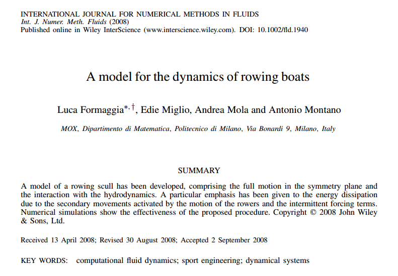

## Why a racing shell is not a simple boat

A racing shell appears mechanically elementary: an elongated hull, one or more athletes, and a set of oars. That visual simplicity is deceptive. From the modeller’s perspective, the boat is a rigid-body–fluid system driven by forces that are neither steady nor entirely external. The athletes accelerate a substantial fraction of the system’s mass relative to the hull; the blades enter and leave the water; the wetted surface changes as the boat heaves and pitches; and each stroke generates free-surface waves that remove energy from the mechanical system.

The research problem is therefore not simply to estimate drag at a prescribed speed. It is to determine the motion of the athlete–oar–hull assembly while the forces acting on that assembly depend on the motion being calculated.

The model developed in *A model for the dynamics of rowing boats* represented the complete motion of a scull in its longitudinal symmetry plane. The three retained rigid-body degrees of freedom were horizontal translation, vertical translation, and pitch. Particular attention was given to the smaller oscillatory movements superimposed on the mean forward progression and to the energy radiated through the water by those movements.[^the-mathematics-behind-a-racing-shell-original-paper]

{#fig-the-mathematics-behind-a-racing-shell-original-article-page fig-align="center" width="85%"}

Let $\mathbf X$ denote a spatial point, $t$ time, and $\mathbf V(\mathbf X,t)$ its absolute velocity. The basic kinematic decomposition is

$$
\mathbf V(\mathbf X,t)
=
\overline{\mathbf V}(\mathbf X,t)
+
\mathbf u(\mathbf X,t),
$$ {#eq-the-mathematics-behind-a-racing-shell-velocity-decomposition}

where $\overline{\mathbf V}$ is the slowly varying mean motion and $\mathbf u$ is the stroke-induced **secondary motion**. The secondary component contains the within-stroke surge fluctuation, heave, and pitch. It is approximated as periodic with the rowing cadence.

Equation @eq-the-mathematics-behind-a-racing-shell-velocity-decomposition is a scale-separation assumption, not an identity supplied by nature. Its usefulness depends on whether the mean and oscillatory components can be modelled at different levels of fidelity without losing the mechanisms that materially affect performance.

The hull configuration is represented by

$$
\mathbf q(t)
=
\begin{bmatrix}
G_X^h(t)\\
G_Z^h(t)\\
\theta(t)
\end{bmatrix},
$$ {#eq-the-mathematics-behind-a-racing-shell-generalized-coordinates}

where $G_X^h$ and $G_Z^h$ are the horizontal and vertical coordinates of the hull centre of mass and $\theta$ is the pitch angle. The superscript $h$ distinguishes the hull centre from the centre of mass of the complete hull–crew system. That distinction is essential because the latter moves relative to the boat as the athletes slide and rotate their bodies.

At the highest level, the model has the form

$$
\mathsf M
\left(
\mathbf q,\boldsymbol\xi,t
\right)
\ddot{\mathbf q}
+
\mathbf c
\left(
\mathbf q,\dot{\mathbf q},
\boldsymbol\xi,\dot{\boldsymbol\xi},
\ddot{\boldsymbol\xi},t
\right)
=
\mathbf f_{\mathrm{oar}}(t)
+
\mathbf f_{\mathrm{hyd}}
\left(
\mathbf q,\dot{\mathbf q},t
\right)
+
\mathbf f_g,
$$ {#eq-the-mathematics-behind-a-racing-shell-compact-model}

where $\boldsymbol\xi(t)$ collects the prescribed internal kinematics of the rowers, $\mathsf M$ is the effective inertia matrix, $\mathbf c$ contains inertial and geometric coupling terms, $\mathbf f_{\mathrm{oar}}$ is the generalized forcing transmitted through the oarlocks, $\mathbf f_{\mathrm{hyd}}$ is the hydrodynamic reaction, and $\mathbf f_g$ is gravity.

This compact equation conceals the real research effort. Every term must be derived, reconstructed from measurements, approximated from another physical model, or computed numerically.

The theoretical difficulty is to close @eq-the-mathematics-behind-a-racing-shell-compact-model without violating mechanics. Forces measured at the oarlocks must be related to reactions at the athletes’ hands, seats, and foot stretchers. Body segments move in a rotating and accelerating frame fixed to the hull, so their accelerations contain translational, tangential, centripetal, and Coriolis terms. Hydrodynamic forces depend on the instantaneous immersion, while wave radiation introduces frequency-dependent inertia and dissipation.

The engineering difficulty is complementary. A derivation alone does not produce a useful simulator. The hull geometry must be reconstructed and discretized; motion-capture trajectories must be converted into smooth functions that can be differentiated twice; force profiles must be synchronized with the drive and recovery phases; stationary flow calculations must be reduced to reusable resistance coefficients; and the assembled equations must remain stable under repeated time integration.

A fully resolved unsteady Reynolds-averaged Navier–Stokes computation could represent more flow physics, but its cost would make large design or crew studies impractical. The objective was therefore not simply maximum fidelity. It was a controlled reduction that remained physically interpretable and fast enough for preliminary design. The original study reports computations taking minutes rather than the several hours required by the more complete approaches considered by the authors.[^the-mathematics-behind-a-racing-shell-original-paper]

The subsequent citation record shows that this formulation entered the scientific literature. On 1 August 2026, the publisher’s page displayed 38 citing works. The number is database- and date-dependent, so it should be understood as evidence of uptake, not a universal or immutable measure of impact.[^the-mathematics-behind-a-racing-shell-citation-record]

The stronger basis for calling the work serious research is structural. It transformed a familiar sporting gesture into an auditable hierarchy of conservation laws, kinematic inputs, hydrodynamic approximations, numerical operators, and falsifiable outputs. The remainder of this article reconstructs that hierarchy.

## Coupled mechanics of hull, rowers, and oars

The mechanical problem contains three interacting subsystems:

1. a rigid hull with known mass and pitch inertia;
2. rowers represented by moving anatomical masses;
3. oars represented as constrained mechanical levers.

The main modelling challenge is that the forces at the hands, seats, foot stretchers, and oarlocks are largely internal to the combined system. They must not be counted twice, and their action–reaction signs must remain consistent when the subsystem equations are combined.

### Kinematics in the hull-fixed frame

Let $\mathbf G^h(t)$ be the inertial position of the hull centre of mass. A point whose coordinates in the hull frame are $\mathbf x$ has inertial position

$$
\mathbf X
=
\mathbf G^h
+
\mathbf Q(\theta)\mathbf x,
$$

with

$$
\mathbf Q(\theta)
=
\begin{bmatrix}
\cos\theta & 0 & \sin\theta\\
0 & 1 & 0\\
-\sin\theta & 0 & \cos\theta
\end{bmatrix}.
$$ {#eq-the-mathematics-behind-a-racing-shell-rotation}

The matrix $\mathbf Q$ maps hull-fixed components into the inertial frame. Define the planar skew operator $\mathbf J$ by

$$
\mathbf J\mathbf a
=
\mathbf e_Y\times\mathbf a,
$$

where $\mathbf e_Y$ is perpendicular to the longitudinal symmetry plane. For $\mathbf a=(a_x,0,a_z)^\mathsf T$,

$$
\mathbf J\mathbf a
=
(a_z,0,-a_x)^\mathsf T,
\qquad
\mathbf J^2\mathbf a=-\mathbf a.
$$

Suppose $\mathbf x_{ij}(t)$ is the hull-frame position of body segment $i$ of rower $j$. Its inertial position is

$$
\mathbf X_{ij}(t)
=
\mathbf G^h(t)
+
\mathbf Q(\theta(t))\mathbf x_{ij}(t).
$$ {#eq-the-mathematics-behind-a-racing-shell-segment-position}

Differentiating twice gives

$$
\ddot{\mathbf X}_{ij}
=
\ddot{\mathbf G}^h
+
\mathbf Q
\left[
\ddot{\mathbf x}_{ij}
+
2\dot\theta\,\mathbf J\dot{\mathbf x}_{ij}
+
\ddot\theta\,\mathbf J\mathbf x_{ij}
-
\dot\theta^{\,2}\mathbf x_{ij}
\right].
$$ {#eq-the-mathematics-behind-a-racing-shell-segment-acceleration}

The terms inside the brackets are, respectively, relative acceleration, Coriolis acceleration, tangential acceleration, and centripetal acceleration. Omitting them would amount to treating the hull-fixed frame as inertial, which is inconsistent when heave and pitch are explicitly resolved.

The original implementation divided each athlete into twelve anatomical masses. Motion-capture data were converted into analytic periodic trajectories for the relevant segment centres, providing $\mathbf x_{ij}$, $\dot{\mathbf x}_{ij}$, and $\ddot{\mathbf x}_{ij}$ throughout the stroke.[^the-mathematics-behind-a-racing-shell-original-paper]

This conversion is an engineering necessity. Numerical differentiation of noisy marker positions would amplify measurement error, especially in the accelerations that enter @eq-the-mathematics-behind-a-racing-shell-segment-acceleration.

### The oar as a constrained force transformer

Let $\mathbf F_{oj}$ be the force transmitted to the hull at the oarlock associated with rower $j$, and let $\mathbf F_{hj}$ be the force applied at the rower’s hands. In the original reduction, the oar is rigid, massless, and in instantaneous static equilibrium.

Let $L$ be the blade-to-hand lever distance and $r_h$ the inboard distance between the oarlock and the hands. Moment balance gives

$$
\mathbf F_{hj}
=
-
\frac{L-r_h}{L}\mathbf F_{oj}.
$$ {#eq-the-mathematics-behind-a-racing-shell-oar-lever}

The negative sign denotes opposing reactions. This is not a complete blade–water model: it omits shaft elasticity, oar inertia, blade slip, ventilation, and unsteady vortex dynamics. Its purpose is narrower. It provides a mechanically consistent force path between the water, oar, athlete, and hull.

When the rower, seat, and foot-stretcher balances are combined with the hull balance, the internal support reactions cancel. The resulting translational equation can be written

$$
M
\left(
\ddot{\mathbf G}^h-\mathbf g
\right)
=
\frac{r_h}{L}
\sum_{j=1}^{n}\mathbf F_{oj}
-
\sum_{j=1}^{n}
\sum_{i=1}^{p}
m_{ij}
\left(
\ddot{\mathbf X}_{ij}-\mathbf g
\right)
+
\mathbf F_w,
$$ {#eq-the-mathematics-behind-a-racing-shell-reduced-translation}

where $M$ is the hull mass, $m_{ij}$ is a body-segment mass, $p$ is the number of segments per rower, $n$ is the crew size, $\mathbf g$ is gravity, and $\mathbf F_w$ is the force exerted by the water.

The factor $r_h/L$ is not an empirical propulsive efficiency. It arises from elimination of the internal force path. Part of the oarlock reaction is returned through the hands and the athlete’s contact with the hull; only the mechanically consistent resultant remains in the combined equation.

### A time-dependent mechanical mass matrix

The coupling is most transparent through the kinetic energy. Define

$$
M_r
=
\sum_{j=1}^{n}
\sum_{i=1}^{p}m_{ij},
\qquad
M_t=M+M_r,
$$

$$
\mathbf c(t)
=
\sum_{j=1}^{n}
\sum_{i=1}^{p}
m_{ij}\mathbf x_{ij}(t),
\qquad
J_r(t)
=
\sum_{j=1}^{n}
\sum_{i=1}^{p}
m_{ij}
\left\lVert
\mathbf x_{ij}(t)
\right\rVert^2.
$$

Here $M_r$ is total rower mass, $M_t$ total hull–crew mass, $\mathbf c$ the first mass moment of the athletes relative to the hull centre, and $J_r$ their instantaneous second mass moment.

Let

$$
\mathbf a(\theta,t)
=
\mathbf Q(\theta)\mathbf J\mathbf c(t).
$$

The inertia matrix associated with the generalized accelerations $(\ddot G_X^h,\ddot G_Z^h,\ddot\theta)$ is

$$
\mathsf M_{\mathrm{mech}}(\theta,t)
=
\begin{bmatrix}
M_t & 0 & a_X\\
0 & M_t & a_Z\\
a_X & a_Z & I_{YY}+J_r
\end{bmatrix},
$$ {#eq-the-mathematics-behind-a-racing-shell-mechanical-mass-matrix}

where $I_{YY}$ is the hull pitch moment of inertia.

The off-diagonal terms mean that translation and pitch are inertially coupled. An angular acceleration can produce a translational reaction because the athletes’ collective centre of mass does not generally coincide with the hull centre. Conversely, a hull acceleration produces a pitch moment when the moving crew mass is offset.

The symmetry of @eq-the-mathematics-behind-a-racing-shell-mechanical-mass-matrix is a consequence of the kinetic energy. It is also a useful diagnostic: a nonsymmetric inertia matrix would indicate inconsistent coordinates or an omitted reaction term.

The matrix is positive definite. Its translational block is positive because $M_t>0$. Its Schur complement is

$$
S
=
I_{YY}
+
J_r
-
\frac{\lVert\mathbf c\rVert^2}{M_t}.
$$

The Cauchy–Schwarz inequality gives

$$
\lVert\mathbf c\rVert^2
\leq
M_rJ_r.
$$

Therefore,

$$
S
\geq
I_{YY}
+
J_r
\left(
1-\frac{M_r}{M_t}
\right)
=
I_{YY}
+
\frac{M}{M_t}J_r
>
0.
$$ {#eq-the-mathematics-behind-a-racing-shell-mass-positivity}

Thus, before fluid added mass is introduced, the instantaneous acceleration problem possesses a physically admissible kinetic-energy metric.

After the known rower trajectories and their derivatives are moved to the right-hand side, the mechanical system has the form

$$
\mathsf M_{\mathrm{mech}}(\theta,t)
\ddot{\mathbf q}
=
\mathbf f_{\mathrm{oar}}(t)
+
\mathbf f_{\mathrm{kin}}
\left(
\theta,\dot\theta,
\boldsymbol\xi,\dot{\boldsymbol\xi},
\ddot{\boldsymbol\xi}
\right)
+
\mathbf f_g
+
\mathbf f_w,
$$ {#eq-the-mathematics-behind-a-racing-shell-mechanical-system}

where $\mathbf f_{\mathrm{kin}}$ contains the inertial forcing generated by prescribed crew motion.

This equation explains a familiar but easily misunderstood observation: the shell accelerates during recovery even though the blades are out of the water. The athletes are moving internal mass, and conservation of momentum requires an opposite response by the hull.

If external forces are temporarily ignored, the total linear momentum is

$$
\mathbf P
=
M_t\dot{\mathbf G}^h
+
\mathbf Q
\left(
\dot{\mathbf c}
+
\dot\theta\,\mathbf J\mathbf c
\right).
$$

Constant $\mathbf P$ implies

$$
\dot{\mathbf G}^h
=
\frac{1}{M_t}
\left[
\mathbf P
-
\mathbf Q
\left(
\dot{\mathbf c}
+
\dot\theta\,\mathbf J\mathbf c
\right)
\right].
$$ {#eq-the-mathematics-behind-a-racing-shell-internal-momentum}

Equation @eq-the-mathematics-behind-a-racing-shell-internal-momentum isolates the inertial contribution of rowing technique. Different recovery motions can change the within-stroke hull velocity even when mean oarlock force and cadence remain unchanged.

The mechanical model is therefore already nonlinear and explicitly time-dependent before the water is introduced. The rowers are not a fixed payload, and the oars are not a prescribed thrust vector. The crew changes the instantaneous inertia, produces inertial forcing in a non-inertial frame, and transmits blade forces through a constrained linkage.

## Free-surface waves, added mass, and radiation damping

The water performs three mechanically distinct functions. It supports the boat hydrostatically, resists the mean forward motion, and reacts dynamically to periodic surge, heave, and pitch. The third contribution cannot be represented faithfully by a single drag coefficient.

The hydrodynamic generalized force is decomposed as

$$
\mathbf f_w
=
\mathbf f_{\mathrm{mean}}
+
\mathbf f_{\mathrm{rad}},
$$ {#eq-the-mathematics-behind-a-racing-shell-hydrodynamic-split}

where $\mathbf f_{\mathrm{mean}}$ contains hydrostatics and mean resistance, while $\mathbf f_{\mathrm{rad}}$ represents the response to secondary motion.

### Why radiation is not ordinary drag

When a hull oscillates, part of the fluid reaction is in phase with acceleration. The body behaves as if its mass or moment of inertia had increased because surrounding water must also be accelerated. This is **added mass**.

Another part is in phase opposition to velocity. It represents mechanical energy transported away by outgoing waves. This is **radiation damping**.

For a constant symmetric added-mass matrix $\mathbf M_a$ and generalized secondary velocity $\mathbf v$,

$$
\mathbf f_a
=
-\mathbf M_a\dot{\mathbf v}.
$$

Over a periodic cycle of duration $T$,

$$
\int_0^T
\mathbf f_a^\mathsf T\mathbf v\,dt
=
-\frac{1}{2}
\left[
\mathbf v^\mathsf T
\mathbf M_a
\mathbf v
\right]_0^T
=
0.
$$

Added mass stores and returns kinetic energy. By contrast, for

$$
\mathbf f_d
=
-\mathbf S_r\mathbf v,
$$

the work is

$$
\int_0^T
\mathbf f_d^\mathsf T\mathbf v\,dt
=
-
\int_0^T
\mathbf v^\mathsf T
\mathbf S_r
\mathbf v\,dt
\leq0
$$ {#eq-the-mathematics-behind-a-racing-shell-damping-work}

when the radiation-damping matrix $\mathbf S_r$ is positive semidefinite. The inequality expresses passivity: an unforced radiation problem cannot create net mechanical energy.

### The linear radiation problem

Let $L_s$ be the shell length, $\lambda$ a characteristic wavelength of the secondary wave field, and $A$ its amplitude. The reduction assumes approximately

$$
\lambda\gtrsim L_s,
\qquad
A\ll L_s.
$$ {#eq-the-mathematics-behind-a-racing-shell-wave-scales}

The waves are long enough to interact with the full hull but small enough for the free-surface conditions to be linearized about the undisturbed level.

The secondary flow is assumed incompressible and irrotational. If $\Phi(\mathbf X,t)$ is its velocity potential,

$$
\mathbf u_f=\nabla\Phi,
\qquad
\Delta\Phi=0
\quad\text{in the fluid domain}.
$$

Let

$$
\mathbf v(t)
=
\begin{bmatrix}
\dot G_X^s(t)\\
\dot G_Z^s(t)\\
\dot\theta^s(t)
\end{bmatrix}
$$

be the generalized velocity of the secondary surge, heave, and pitch motion. At a hull point $\mathbf r=(x,0,z)^\mathsf T$ with unit normal $\mathbf n=(n_X,0,n_Z)^\mathsf T$, define the generalized normal

$$
\mathbf N
=
\begin{bmatrix}
n_X\\
n_Z\\
z n_X-x n_Z
\end{bmatrix}.
$$ {#eq-the-mathematics-behind-a-racing-shell-generalized-normal}

The normal hull velocity is

$$
\mathbf u_h\cdot\mathbf n
=
\mathbf N^\mathsf T\mathbf v.
$$

The same vector $\mathbf N$ also converts pressure into the generalized force consisting of horizontal force, vertical force, and pitch moment.

For one harmonic of angular frequency $\omega$,

$$
v_s(t)
=
\operatorname{Re}
\left\{
\alpha_s e^{-i\omega t}
\right\},
\qquad
\Phi(\mathbf X,t)
=
\operatorname{Re}
\left\{
\sum_{s=1}^{3}
\alpha_s
\phi_s(\mathbf X;\omega)
e^{-i\omega t}
\right\},
$$

where $\alpha_s$ is a complex velocity amplitude and $\phi_s$ is the radiation potential generated by unit velocity in mode $s$.

Let $\Gamma_b^0$ be the mean wetted hull, $\Gamma_0$ the undisturbed free surface, and $\Gamma_H$ an impermeable bottom at depth $H$. Each potential satisfies

$$
\begin{aligned}
\Delta\phi_s &=0
&&\text{in }\Omega,\\
\frac{\partial\phi_s}{\partial Z} &=0
&&\text{on }\Gamma_H,\\
\frac{\partial\phi_s}{\partial Z}
-\frac{\omega^2}{g}\phi_s &=0
&&\text{on }\Gamma_0,\\
\frac{\partial\phi_s}{\partial n} &=N_s
&&\text{on }\Gamma_b^0.
\end{aligned}
$$ {#eq-the-mathematics-behind-a-racing-shell-radiation-problem}

The free-surface condition combines the linearized kinematic and Bernoulli conditions. The exterior problem also requires an outgoing-wave condition,

$$
r^{1/2}
\left(
\frac{\partial\phi_s}{\partial r}
-
i\kappa\phi_s
\right)
\longrightarrow0
\qquad
\text{as }r\longrightarrow\infty,
$$ {#eq-the-mathematics-behind-a-racing-shell-radiation-condition}

where $r$ is horizontal radial distance and $\kappa$ is the gravity-wave number. For finite depth,

$$
\omega^2
=
g\kappa\tanh(\kappa H).
$$

The radiation condition distinguishes waves travelling away from the boat from waves arriving from infinity. It is therefore not a peripheral numerical detail. It determines the physically relevant solution and the direction of energy transport.

On a truncated computational domain, the exact exterior operator may be approximated by a first-order condition such as

$$
\frac{\partial\phi_s}{\partial n}
=
i\kappa\phi_s
$$

on a sufficiently distant artificial boundary.

### Extracting the hydrodynamic matrices

The linearized dynamic pressure is

$$
p_d
=
-\rho
\frac{\partial\Phi}{\partial t},
$$

where $\rho$ is water density. The corresponding generalized force is

$$
\mathbf f_{\mathrm{rad}}
=
-\rho
\int_{\Gamma_b^0}
\frac{\partial\Phi}{\partial t}
\mathbf N\,d\Gamma.
$$

For force component $t$ generated by radiation mode $s$, define

$$
M_{a,ts}(\omega)
=
\rho
\int_{\Gamma_b^0}
\operatorname{Re}
\left[
\phi_s(\mathbf X;\omega)
\right]
N_t\,d\Gamma,
$$

$$
S_{r,ts}(\omega)
=
\rho\omega
\int_{\Gamma_b^0}
\operatorname{Im}
\left[
\phi_s(\mathbf X;\omega)
\right]
N_t\,d\Gamma.
$$ {#eq-the-mathematics-behind-a-racing-shell-hydrodynamic-matrices}

The resulting force is

$$
\mathbf f_{\mathrm{rad}}(t)
=
-\mathbf M_a(\omega)\dot{\mathbf v}(t)
-
\mathbf S_r(\omega)\mathbf v(t).
$$ {#eq-the-mathematics-behind-a-racing-shell-radiation-force}

For a complex velocity amplitude $\widehat{\mathbf v}$,

$$
\widehat{\mathbf f}_{\mathrm{rad}}
=
-
\left[
\mathbf S_r(\omega)
-
i\omega\mathbf M_a(\omega)
\right]
\widehat{\mathbf v}.
$$

The matrix

$$
\mathbf Z_h(\omega)
=
\mathbf S_r(\omega)
-
i\omega\mathbf M_a(\omega)
$$ {#eq-the-mathematics-behind-a-racing-shell-hydrodynamic-impedance}

is the hydrodynamic impedance. Its real part is dissipative; its imaginary part is reactive.

For real time-domain velocities, the radiated energy over $[t_0,t_1]$ is

$$
E_{\mathrm{rad}}
=
\int_{t_0}^{t_1}
\mathbf v^\mathsf T(t)
\mathbf S_r
\mathbf v(t)\,dt.
$$ {#eq-the-mathematics-behind-a-racing-shell-real-radiated-energy}

For a single complex harmonic amplitude, the corresponding mean power is

$$
\overline P_{\mathrm{rad}}
=
\frac{1}{2}
\widehat{\mathbf v}^{\,*}
\mathbf S_r(\omega)
\widehat{\mathbf v},
$$ {#eq-the-mathematics-behind-a-racing-shell-complex-radiated-power}

where $*$ denotes conjugate transpose. The factor $1/2$ belongs to the complex-amplitude convention; it does not appear when instantaneous real velocities are integrated directly.

Reciprocity implies

$$
\mathbf M_a^\mathsf T=\mathbf M_a,
\qquad
\mathbf S_r^\mathsf T=\mathbf S_r.
$$

Passivity gives

$$
\mathbf S_r\succeq0.
$$

The original article described the computed matrices as positive definite. The more general result is positive semidefiniteness; strict positivity additionally requires that no nonzero combination of the retained modes be non-radiating.

Added mass augments rather than replaces the mechanical inertia. The effective acceleration matrix is

$$
\mathsf M_{\mathrm{eff}}
=
\mathsf M_{\mathrm{mech}}
+
\mathbf M_a.
$$ {#eq-the-mathematics-behind-a-racing-shell-effective-mass}

This distinction is fundamental. The crew changes the physical mass distribution; the fluid adds reactive inertia around that already time-dependent mechanical system.

### Frequency dependence and hydrodynamic memory

The radiation problem contains $\omega$ explicitly in both the free-surface and far-field conditions. Consequently, $\mathbf M_a$ and $\mathbf S_r$ depend on frequency as well as geometry. They may be computed offline for a selected cadence, but a substantial cadence change generally requires recomputation or interpolation over a frequency grid.

A periodic stroke contains harmonics,

$$
\mathbf v(t)
=
\sum_{m=-\infty}^{\infty}
\widehat{\mathbf v}_m
e^{-im\omega_0t},
$$

where $\omega_0=2\pi/T$ is the fundamental frequency. Linear radiation theory acts separately on each harmonic:

$$
\widehat{\mathbf f}_{\mathrm{rad},m}
=
-
\left[
\mathbf S_r(m\omega_0)
-
im\omega_0\mathbf M_a(m\omega_0)
\right]
\widehat{\mathbf v}_m.
$$ {#eq-the-mathematics-behind-a-racing-shell-multiharmonic-force}

The original implementation retained the fundamental mode because it was found to account for most of the secondary-motion dissipation in the studied cases.[^the-mathematics-behind-a-racing-shell-original-paper] This is a spectral truncation, not a claim that the stroke itself is perfectly sinusoidal.

For arbitrary motion, the frequency-dependent force can be represented in the time domain as

$$
\mathbf f_{\mathrm{rad}}(t)
=
-\mathbf M_\infty\ddot{\mathbf q}^{\,s}(t)
-
\int_0^t
\mathbf K(t-\tau)
\dot{\mathbf q}^{\,s}(\tau)\,d\tau,
$$ {#eq-the-mathematics-behind-a-racing-shell-radiation-memory}

where $\mathbf M_\infty$ is the infinite-frequency added mass and $\mathbf K$ is a retardation kernel. The convolution expresses hydrodynamic memory: waves generated earlier continue to influence the present pressure field.

The reduction from an unbounded free-surface problem to two $3\times3$ matrices is therefore substantial. It is also controlled. The assumptions, boundary conditions, signs, dimensions, symmetry, passivity, and frequency range can all be inspected independently.

## From mathematical model to engineering software

A mathematical model becomes an engineering tool only when every symbolic quantity has been connected to geometry, measured or reconstructed data, numerical algorithms, and reproducible computational procedures.

The software architecture uses an **offline–online decomposition**. Expensive geometry- and frequency-dependent fluid calculations are performed offline. The repeated online calculation advances only a small nonlinear dynamical system.

```{mermaid}
%%| label: fig-the-mathematics-behind-a-racing-shell-computational-pipeline
%%| fig-cap: "Offline–online decomposition of the rowing-boat simulator. Expensive geometric and hydrodynamic calculations are compressed into reusable operators before repeated time-domain simulations."
%%| fig-alt: "Colored flow diagram with an offline branch containing hull geometry, motion-capture records, stationary RANS calculations, and boundary-element radiation problems. These produce geometric quadrature data, analytic rower trajectories, resistance coefficients, and added-mass and damping matrices. The online branch combines them with crew and rowing parameters, assembles a nonlinear six-state system, integrates it in time, and returns hull motion, speed, and energy histories. A semantic legend explains the meaning of each node color."
%%| fig-align: center
%%{init: {"theme": "neo", "look": "handDrawn", "layout": "elk"}}%%
flowchart TD
    subgraph OFF[Offline preparation]
        A[Hull geometry<br/>surface + fittings] --> B[Geometric preprocessing<br/>normals + areas + projections]
        C[Motion-capture records<br/>anthropometric model] --> D[Analytic periodic trajectories<br/>position + velocity + acceleration]
        A --> E[Stationary RANS calculations<br/>selected speeds + attitudes]
        E --> F[Resistance coefficients<br/>calibrated database]
        A --> G[Boundary-element radiation solves<br/>surge + heave + pitch]
        G --> H[Hydrodynamic matrices<br/>added mass + damping]
    end

    subgraph ON[Online simulation]
        I[Scenario parameters<br/>crew + cadence + force + position]
        B --> J[Current immersion<br/>hydrostatic quadrature]
        D --> K[Mechanical inertia<br/>kinematic forcing]
        F --> L[Mean resistance]
        H --> M[Radiation reaction]
        I --> J
        I --> K
        I --> L
        I --> M
        J --> N[Assemble nonlinear<br/>six-state system]
        K --> N
        L --> N
        M --> N
        N --> O[Adaptive Runge–Kutta<br/>time integration]
        O --> P[Surge + heave + pitch<br/>speed + energy histories]
    end

    subgraph LEG[Legend]
        L1[Geometry or measured inputs]
        L2[Offline reduced operators]
        L3[Online scenario inputs]
        L4[Online physical evaluations]
        L5[System assembly and solver]
        L6[Simulation outputs]
    end

    classDef geom fill:#dbeafe,stroke:#1d4ed8,color:#111827,stroke-width:1.5px;
    classDef offlineop fill:#ede9fe,stroke:#7c3aed,color:#111827,stroke-width:1.5px;
    classDef scenario fill:#fef3c7,stroke:#d97706,color:#111827,stroke-width:1.5px;
    classDef onlineeval fill:#dcfce7,stroke:#16a34a,color:#111827,stroke-width:1.5px;
    classDef solver fill:#fde2e4,stroke:#e11d48,color:#111827,stroke-width:1.5px;
    classDef output fill:#e0f2fe,stroke:#0891b2,color:#111827,stroke-width:1.5px;
    classDef legendbox fill:#f3f4f6,stroke:#6b7280,color:#111827,stroke-width:1px;

    class A,C geom;
    class B,D,F,H offlineop;
    class I scenario;
    class E,G,J,K,L,M onlineeval;
    class N,O solver;
    class P output;

    class L1 geom;
    class L2 offlineop;
    class L3 scenario;
    class L4 onlineeval;
    class L5 solver;
    class L6 output;

    style OFF fill:#f8fafc,stroke:#94a3b8,stroke-width:1.5px;
    style ON fill:#f8fafc,stroke:#94a3b8,stroke-width:1.5px;
    style LEG fill:#f9fafb,stroke:#9ca3af,stroke-width:1.5px;
```

@fig-the-mathematics-behind-a-racing-shell-computational-pipeline shows why the method is not a monolithic CFD simulation. Different mechanisms are assigned different computational fidelities and update rates.

### Dynamic immersion and hydrostatic pressure

Let $\Gamma_h^0$ be the hull surface in body coordinates. For a point $\mathbf x=(x,y,z)^\mathsf T$, its inertial vertical coordinate is

$$
Z(\mathbf x,t)
=
G_Z^h(t)
-
x\sin\theta(t)
+
z\cos\theta(t).
$$

If the undisturbed water level is $h_0$, define the local immersion depth

$$
d
\left(
\mathbf x;
G_Z^h,\theta
\right)
=
\max
\left[
0,\,
h_0-G_Z^h+x\sin\theta-z\cos\theta
\right].
$$ {#eq-the-mathematics-behind-a-racing-shell-immersion-depth}

The positive part ensures that dry points contribute no pressure. If $\mathbf n(\mathbf x)$ is the outward hull normal in body coordinates, the hydrostatic force is

$$
\mathbf S_h(t)
=
-\rho g
\int_{\Gamma_h^0}
d
\left(
\mathbf x;
G_Z^h(t),\theta(t)
\right)
\mathbf Q(\theta(t))
\mathbf n(\mathbf x)
\,d\Gamma.
$$ {#eq-the-mathematics-behind-a-racing-shell-hydrostatic-force}

An analogous moment integral provides the restoring pitch moment. These calculations must remain in the online loop because heave and pitch continually change the submerged part of the hull.

For a triangular surface mesh with triangle areas $A_k$, normals $\mathbf n_k$, and vertices $\mathbf x_{k,i}$, a nodal quadrature is

$$
\mathbf S_h(t)
\approx
-\frac{\rho g}{3}
\sum_{k=1}^{N_\triangle}
A_k
\mathbf Q(\theta)\mathbf n_k
\sum_{i=1}^{3}
d
\left(
\mathbf x_{k,i};
G_Z^h,\theta
\right).
$$ {#eq-the-mathematics-behind-a-racing-shell-hydrostatic-quadrature}

When a complete planar triangle is submerged, the untruncated pressure depth is affine and the vertex rule is exact. When the waterline cuts an element, the positive-part operation makes the integrand piecewise affine and introduces a localized geometric error. Mesh resolution near the waterline is therefore important even though the hydrostatic equation itself is elementary.

Geometric preprocessing must establish consistent units, watertight connectivity, outward normals, nondegenerate elements, and sufficient resolution in regions of high curvature. A defect in the surface representation propagates into buoyancy, trim moments, wetted area, projected areas, and resistance.

### Mean resistance

The mean longitudinal resistance is decomposed into shape, viscous, and wave-making components:

$$
R
=
R_{\mathrm{shape}}
+
R_{\mathrm{vis}}
+
R_{\mathrm{wave}}.
$$

A reduced representation is

$$
R
=
\frac{\rho V_X^2}{2}
\left[
C_{dX}A_X
+
C_f(\mathrm{Re})A_w
+
C_{dw}A_Z
\right],
$$ {#eq-the-mathematics-behind-a-racing-shell-resistance}

where $V_X$ is forward speed, $A_X$ is the wetted-surface projection normal to the longitudinal axis, $A_Z$ is the horizontal projection, $A_w$ is wetted area, and $C_{dX}$, $C_f$, and $C_{dw}$ are shape, friction, and mean wave-resistance coefficients.

The Reynolds number is

$$
\mathrm{Re}
=
\frac{V_XL_s}{\nu_w},
$$

where $\nu_w$ is the kinematic viscosity of water. The friction coefficient uses the correlation-line form

$$
C_f(\mathrm{Re})
=
\frac{0.075}
{\left[
\log_{10}(\mathrm{Re})-2
\right]^2}.
$$

The coefficients were obtained from standard formulae and selected stationary RANS calculations performed on the actual hull geometry.[^the-mathematics-behind-a-racing-shell-original-paper] Those calculations do not disappear from the reduced model: their assumptions and numerical errors are compressed into the calibrated coefficients.

A reproducible calibration may be written abstractly as

$$
\boldsymbol\beta_D^\star
=
\operatorname*{arg\,min}_{\boldsymbol\beta_D}
\sum_{\ell=1}^{N_R}
w_\ell
\left[
R_{\mathrm{red}}
\left(
V_\ell,\zeta_\ell,\theta_\ell;
\boldsymbol\beta_D
\right)
-
R_{\mathrm{RANS},\ell}
\right]^2,
$$ {#eq-the-mathematics-behind-a-racing-shell-resistance-calibration}

where $\zeta_\ell$ is sinkage, $\theta_\ell$ is trim, $w_\ell$ is a weighting factor, and $\boldsymbol\beta_D$ contains the reduced-law parameters.

Equation @eq-the-mathematics-behind-a-racing-shell-resistance-calibration is a transparent formulation of the implied fitting task, not a claim that this exact objective was documented in the original implementation. The publication does not report enough detail about the RANS meshes, turbulence closure, convergence tolerances, or fitting algorithm to reproduce that part of the pipeline exactly.

### Boundary elements for the radiation problem

Only the potential on the boundaries is needed to construct the added-mass and damping matrices. The radiation problem was therefore solved with a boundary element method using the free-space Green function and curved quadrilateral elements with eight nodes.[^the-mathematics-behind-a-racing-shell-original-paper]

For the three-dimensional Laplace operator,

$$
G(\mathbf P,\mathbf Q)
=
\frac{1}
{4\pi
\lVert
\mathbf P-\mathbf Q
\rVert}
$$

is the fundamental solution. A boundary-integral equation has the form

$$
c(\mathbf P)\phi_s(\mathbf P)
+
\int_\Gamma
\phi_s(\mathbf Q)
\frac{\partial G(\mathbf P,\mathbf Q)}
{\partial n_{\mathbf Q}}
\,d\Gamma_{\mathbf Q}
=
\int_\Gamma
G(\mathbf P,\mathbf Q)
\frac{\partial\phi_s}
{\partial n_{\mathbf Q}}
\,d\Gamma_{\mathbf Q}.
$$ {#eq-the-mathematics-behind-a-racing-shell-boundary-integral}

After interpolation and collocation,

$$
\mathbf H\boldsymbol\phi_s
=
\mathbf G_b\boldsymbol q_s,
$$

where $\boldsymbol\phi_s$ contains nodal potentials and $\boldsymbol q_s$ nodal normal derivatives. The free-surface, hull, bottom, and artificial-boundary conditions can be assembled as

$$
\boldsymbol q_s
=
\mathbf R_\omega\boldsymbol\phi_s
+
\boldsymbol b_s,
$$

leading to

$$
\left(
\mathbf H-\mathbf G_b\mathbf R_\omega
\right)
\boldsymbol\phi_s
=
\mathbf G_b\boldsymbol b_s.
$$ {#eq-the-mathematics-behind-a-racing-shell-discrete-radiation}

At fixed geometry and frequency, the left-hand matrix is the same for surge, heave, and pitch; only the right-hand side changes. Its factorization can therefore be reused for all three modes.

A conventional dense boundary element implementation requires approximately $O(N_B^2)$ storage and assembly for $N_B$ unknowns, while a direct dense factorization requires $O(N_B^3)$ arithmetic. These are generic complexity estimates rather than measured timings for the original code. They explain why radiation coefficients are calculated offline and reduced to $3\times3$ matrices before the repeated simulations begin.

### The six-state online problem

Define

$$
\mathbf y(t)
=
\begin{bmatrix}
\dot G_X^h&
\dot G_Z^h&
\dot\theta&
G_X^h&
G_Z^h&
\theta
\end{bmatrix}^{\mathsf T}.
$$ {#eq-the-mathematics-behind-a-racing-shell-state-vector}

Without radiation corrections, the first-order system is

$$
\mathbf A(t,\mathbf y)
\dot{\mathbf y}
=
\mathbf B(t,\mathbf y).
$$

Extend the added-mass and damping matrices to six dimensions:

$$
\widetilde{\mathbf M}_a
=
\begin{bmatrix}
\mathbf M_a&\mathbf0\\
\mathbf0&\mathbf0
\end{bmatrix},
\qquad
\widetilde{\mathbf S}_r
=
\begin{bmatrix}
\mathbf S_r&\mathbf0\\
\mathbf0&\mathbf0
\end{bmatrix}.
$$

The complete online problem becomes

$$
\left[
\mathbf A(t,\mathbf y)
+
\widetilde{\mathbf M}_a
\right]
\dot{\mathbf y}
=
\mathbf B(t,\mathbf y)
-
\widetilde{\mathbf S}_r\mathbf y.
$$ {#eq-the-mathematics-behind-a-racing-shell-complete-state-system}

Only the velocity block is modified because added mass and damping act on generalized accelerations and velocities, not directly on positions.

At each function evaluation requested by the ODE solver, the program must:

* evaluate the rower segment trajectories and derivatives at the current stroke phase;
* construct the instantaneous mass moments;
* determine immersion and integrate hydrostatic forces and moments;
* evaluate mean resistance;
* add radiation damping and added mass;
* solve the small linear system in @eq-the-mathematics-behind-a-racing-shell-complete-state-system.

The original program used an explicit adaptive Runge–Kutta method from the GNU Scientific Library.[^the-mathematics-behind-a-racing-shell-original-paper] The matrix in @eq-the-mathematics-behind-a-racing-shell-complete-state-system should be solved rather than explicitly inverted, both for efficiency and numerical stability.

Adaptive stepping is valuable because the forcing varies strongly across the drive and recovery phases. It does not eliminate the need for smooth input functions. Discontinuous or insufficiently differentiable force profiles can cause repeated step rejection or inaccurate integration near the catch and finish.

### Verification before experimental validation

Several checks can be made without comparing the simulator to a physical boat.

At static equilibrium,

$$
S_{h,Z}
=
M_tg,
\qquad
M_h=0,
$$

where $S_{h,Z}$ is vertical hydrostatic force and $M_h$ the hydrostatic pitch moment. Failure indicates a problem with mass data, normal orientation, water level, coordinate transformations, or quadrature.

Hydrodynamic reciprocity can be monitored using

$$
\varepsilon_M
=
\frac{
\left\lVert
\mathbf M_a-\mathbf M_a^\mathsf T
\right\rVert_F
}{
\left\lVert
\mathbf M_a
\right\rVert_F
},
\qquad
\varepsilon_S
=
\frac{
\left\lVert
\mathbf S_r-\mathbf S_r^\mathsf T
\right\rVert_F
}{
\left\lVert
\mathbf S_r
\right\rVert_F
},
$$ {#eq-the-mathematics-behind-a-racing-shell-reciprocity-residuals}

where $\lVert\cdot\rVert_F$ is the Frobenius norm. These residuals should decrease under refinement.

Passivity requires that the minimum eigenvalue of the symmetric damping part,

$$
\lambda_{\min}
\left[
\frac{
\mathbf S_r+\mathbf S_r^\mathsf T
}{2}
\right],
$$

not be materially negative. Large negative values would indicate an error in signs, normals, boundary treatment, or integration.

The online radiated energy in @eq-the-mathematics-behind-a-racing-shell-real-radiated-energy must remain nonnegative. The calculation should also be repeated with refined surface meshes, smaller ODE tolerances, frozen rower motion, zero oarlock force, and zero damping. These controlled limits test implementation consistency; they do not by themselves validate the physical model.

The model’s speed follows directly from this architecture. If $N_s$ crew or design configurations are studied, a full approach has the approximate cost

$$
C_{\mathrm{full}}
\approx
N_s
C_{\mathrm{unsteady\ CFD}},
$$

while the reduced workflow has

$$
C_{\mathrm{reduced}}
\approx
C_{\mathrm{stationary\ CFD}}
+
C_{\mathrm{radiation}}
+
N_sC_{\mathrm{ODE}}.
$$

When $C_{\mathrm{ODE}}$ is much smaller than the fluid calculations, the preprocessing cost is amortized across the study. This is what makes systematic comparisons of crew mass, placement, force, and cadence possible.

## Scientific influence, validation limits, and open problems

A direct continuation generalized the mechanics from symmetry-plane motion to all six rigid-body degrees of freedom and introduced a control law to represent the balancing actions of the crew.[^the-mathematics-behind-a-racing-shell-three-dimensional-extension] This extension was nontrivial because a narrow shell is unstable in roll and does not possess a useful passive restoring mechanism in yaw.

Serveto, Barré, Kobus, and Mariot cited the paper while developing an independent multibody model in ADAMS and LifeMOD. Their representation used nineteen body segments and eighteen joints and reported agreement between calculated boat velocity and on-water measurements in the tested setting.[^the-mathematics-behind-a-racing-shell-serveto-multibody] This is evidence of methodological relevance from a different modelling tradition, not merely continuation by the original authors.

The reduced dynamics were subsequently used with non-intrusive polynomial chaos methods to investigate sensitivity to rower force, mass, and cadence.[^the-mathematics-behind-a-racing-shell-sensitivity-analysis] This use is particularly revealing: the model’s low online cost enabled uncertainty and parameter studies that would have been difficult with a full unsteady flow solver.

Karmanov and Chernousko cited the work while constructing a deliberately simpler rowing model with periodic oar motion and quadratic resistance.[^the-mathematics-behind-a-racing-shell-simple-model] Wychowanski and collaborators likewise cited it in a one-dimensional analysis of single-sculling technique.[^the-mathematics-behind-a-racing-shell-one-dimensional-model] These publications place the model at the detailed end of a spectrum ranging from analytically tractable longitudinal descriptions to coupled rigid-body and free-surface simulation.

The article also appears in later rowing-physiology research on pacing strategy.[^the-mathematics-behind-a-racing-shell-physiology-context] That is weaker evidence of direct methodological influence, but it shows that the work entered an interdisciplinary literature beyond computational fluid dynamics.

| Citation role             | Representative later use                                   | What it establishes                                                           |
| ------------------------- | ---------------------------------------------------------- | ----------------------------------------------------------------------------- |
| Direct extension          | Six-degree-of-freedom dynamics with active balance control | The mechanical architecture could support a broader rigid-body formulation    |
| Independent comparison    | ADAMS/LifeMOD boat–oars–rower model                        | Another research group treated the paper as relevant prior art                |
| Sensitivity analysis      | Polynomial-chaos study of force, mass, and cadence         | The reduced runtime enabled systematic parameter exploration                  |
| Deliberate simplification | Elementary and one-dimensional rowing models               | Later authors used the work to delimit what their simpler assumptions omitted |
| Contextual citation       | Experimental work on pacing physiology                     | The publication circulated beyond its original modelling community            |

: Selected forms of scholarly uptake of the rowing-boat model. {#tbl-the-mathematics-behind-a-racing-shell-citation-roles}

@tbl-the-mathematics-behind-a-racing-shell-citation-roles demonstrates why citation context is more informative than citation quantity. It does not establish predictive accuracy. That requires experimental validation.

### What the original numerical evidence supports

The article compared a simulated horizontal-velocity history with measurements from a single scull at 20 strokes per minute. The calculated signal reproduced the main qualitative oscillation, but discrepancies appeared near the beginning of each stroke. Crucial inputs—including athlete characteristics, oarlock force, and exact boat configuration—were not available and had to be reconstructed from plausible values.[^the-mathematics-behind-a-racing-shell-original-paper]

This supports qualitative agreement under uncertain inputs. It does not constitute a controlled quantitative validation.

Given synchronized measured velocities $V_k$ and predictions $\widehat V_k$, one useful normalized error is

$$
\varepsilon_2
=
\left[
\frac{
\sum_{k=1}^{N}
\left(
\widehat V_k-V_k
\right)^2
}{
\sum_{k=1}^{N}
\left(
V_k-\overline V
\right)^2
}
\right]^{1/2},
$$ {#eq-the-mathematics-behind-a-racing-shell-validation-error}

where $\overline V$ is the measured mean and the denominator is assumed nonzero.

A separate mean-speed bias is

$$
b_{\overline V}
=
\frac{
\overline{\widehat V}
-
\overline V
}{
\overline V
}.
$$

Phase error may be estimated by the lag that maximizes cross-correlation:

$$
\Delta t_\phi
=
\operatorname*{arg\,max}_{\tau}
\int
\left[
\widehat V(t+\tau)
-
\overline{\widehat V}
\right]
\left[
V(t)-\overline V
\right]
dt.
$$

These metrics distinguish mean progression, oscillation amplitude, and stroke timing. A model can predict the correct average speed while producing the wrong within-stroke phase, or reproduce a visually plausible waveform while retaining a systematic speed bias.

The original calculations estimated that secondary-motion dissipation could reach approximately ten per cent of total modelled dissipation in the investigated configurations.[^the-mathematics-behind-a-racing-shell-original-paper] If

$$
E_{\mathrm{tot}}
=
E_{\mathrm{mean}}
+
E_{\mathrm{sec}},
$$

then the reported quantity is

$$
\eta_{\mathrm{sec}}
=
\frac{
E_{\mathrm{sec}}
}{
E_{\mathrm{tot}}
}
\lesssim0.10
$$

for those simulations. It is not a universal ten-per-cent law. The value depends on geometry, cadence, crew motion, and the frequency-dependent damping matrix.

Two additional examples demonstrated engineering use rather than validation. Under equal peak oarlock force of $1200\,\mathrm{N}$ and equal cadence of $39.5$ strokes per minute, the simulated $106\,\mathrm{kg}$ rower produced greater sinkage, stronger heave, and lower speed than the $80\,\mathrm{kg}$ rower. In a quad-scull positioning study, moving the crew $0.10\,\mathrm{m}$ aft was predicted to produce advantages of approximately two and four metres relative to the other tested arrangements over a $2000\,\mathrm{m}$ race.[^the-mathematics-behind-a-racing-shell-original-paper]

These results are internally consistent with the model. Greater mass increases displacement and wetted area; longitudinal placement changes trim and hydrodynamic loading. They remain simulation findings until controlled measurements confirm the predicted magnitudes.

### Verification, calibration, and validation are different tasks

A residual between measurement and simulation contains several error sources. Let $\boldsymbol\mu$ collect measured operating inputs, $\boldsymbol\vartheta$ uncertain model parameters, $\mathcal S_h$ the numerical solver at discretization scale $h$, and $\mathcal H$ the observation operator that maps the simulated state to what an instrument measures:

$$
\widehat{\mathbf d}
=
\mathcal H
\left[
\mathcal S_h
\left(
\boldsymbol\mu,
\boldsymbol\vartheta
\right)
\right].
$$

For data $\mathbf d$, define

$$
\mathbf e
=
\mathbf d-\widehat{\mathbf d}.
$$

To first order,

$$
\mathbf e
\approx
\mathbf e_{\mathrm{meas}}
+
\mathbf e_{\mathrm{input}}
+
\mathbf e_{\mathrm{num}}
+
\mathbf e_{\mathrm{model}},
$$ {#eq-the-mathematics-behind-a-racing-shell-error-decomposition}

where the terms represent measurement error, uncertain inputs, numerical error, and model-form discrepancy.

The measured-versus-computed velocity comparison could not separate these contributions because several important inputs were reconstructed. A mismatch near the catch might arise from the force profile, athlete kinematics, idealized blade model, mean resistance, radiation approximation, or measurement uncertainty.

Numerical error should be assessed first. If $Q_h$, $Q_{h/r}$, and $Q_{h/r^2}$ are values of an output on three successively refined discretizations, an observed order is

$$
p_{\mathrm{obs}}
=
\frac{
\ln
\left|
\dfrac{
Q_h-Q_{h/r}
}{
Q_{h/r}-Q_{h/r^2}
}
\right|
}{
\ln r
}.
$$ {#eq-the-mathematics-behind-a-racing-shell-convergence-order}

This test can be applied independently to hydrostatic forces, hydrodynamic coefficients, mean speed, pitch amplitude, and radiated energy. A smooth-looking trajectory is not evidence of convergence.

Calibration estimates uncertain parameters from designated observations. Validation tests predictions against data that were not used for calibration. Extrapolation asks whether the result remains reliable for different boats, crews, cadences, or water conditions.

A Bayesian calibration would make parameter uncertainty and identifiability explicit:

$$
p
\left(
\boldsymbol\vartheta
\mid
\mathbf d
\right)
\propto
p
\left(
\mathbf d
\mid
\boldsymbol\vartheta
\right)
p
\left(
\boldsymbol\vartheta
\right).
$$ {#eq-the-mathematics-behind-a-racing-shell-bayesian-calibration}

A broad or strongly correlated posterior would indicate that the available measurements cannot uniquely determine the model parameters, even when one fitted trajectory appears convincing.

On-water biomechanical studies are intrinsically difficult because environmental conditions and full-system measurements are harder to control than in ergometer experiments.[^the-mathematics-behind-a-racing-shell-on-water-review] A decisive validation dataset would synchronize six-degree-of-freedom hull motion, oarlock forces and moments, blade angles and immersion, athlete segment kinematics, seat and foot-stretcher reactions, rigging, hull geometry, water depth, wind, and current.

### The limits are part of the scientific result

The original model is restricted to surge, heave, and pitch. This is defensible for balanced sculling when the main interest lies in the symmetry plane. It cannot predict roll instability, yaw control, asymmetric blade action, or sweep-rowing dynamics. The later six-degree-of-freedom extension demonstrates that the mechanical structure can be generalized, but additional states require a model of active crew control.[^the-mathematics-behind-a-racing-shell-three-dimensional-extension]

The radiation model assumes small-amplitude linear waves around a fixed mean wetted geometry. It omits nonlinear free-surface deformation, repeated wetting and drying in the radiation calculation, breaking waves, viscous secondary-flow losses, and nonlinear interaction between mean speed and oscillatory radiation.

The fundamental-frequency approximation neglects the distinct hydrodynamic impedance experienced by higher stroke harmonics. A multi-frequency implementation or the memory formulation in @eq-the-mathematics-behind-a-racing-shell-radiation-memory would be more appropriate when the force and motion histories contain substantial high-frequency content.

The oar is a rigid massless lever. Shaft deflection, blade slip, ventilation, vortex shedding, and three-dimensional blade trajectories are not resolved. Later blade-focused studies have shown that these effects can themselves constitute substantial fluid-mechanical problems.

The athlete follows prescribed kinematics and force histories. The model predicts what the boat does in response to an imposed stroke; it does not predict how the athlete adapts technique to altered rigging, fatigue, instability, or hydrodynamic feedback. The human is represented principally as a moving mass and forcing subsystem, not as a closed-loop neuromuscular controller.

Mean resistance is partly calibrated from stationary calculations and empirical formulae. Changing hull geometry or moving far outside the calibrated range of speed, sinkage, trim, and Reynolds number is extrapolation. A reduced model cannot acquire validity outside its training envelope merely because the ODE solver continues to return numbers.

### Open extensions

A practical multi-frequency radiation model could approximate the memory kernel by auxiliary states:

$$
\dot{\mathbf z}_f
=
\mathbf A_f\mathbf z_f
+
\mathbf B_f\mathbf v,
$$

$$
\mathbf f_{\mathrm{rad}}
=
-\mathbf M_\infty\dot{\mathbf v}
-
\mathbf C_f\mathbf z_f.
$$ {#eq-the-mathematics-behind-a-racing-shell-radiation-state-space}

The matrices would be fitted so that the resulting state-space impedance matches $\mathbf Z_h(\omega)$ over the relevant cadence and harmonic range. This retains an ODE formulation while representing hydrodynamic memory.

A more complete blade closure would have the form

$$
\mathbf F_b
=
\mathcal B
\left(
\mathbf U_{\mathrm{rel}},
\dot{\mathbf U}_{\mathrm{rel}},
\alpha_b,
\dot\alpha_b,
\mathcal W
\right),
$$ {#eq-the-mathematics-behind-a-racing-shell-blade-operator}

where $\mathbf U_{\mathrm{rel}}$ is blade velocity relative to the local water, $\alpha_b$ is blade orientation, and $\mathcal W$ represents the disturbed wake. The central engineering challenge would be to preserve sufficient fidelity without making every design evaluation as expensive as a full unsteady CFD calculation.

The reduced solver is also suitable for robust rather than purely deterministic design. Let $\boldsymbol\chi$ contain hull, rigging, crew-position, and stroke variables, while $\boldsymbol\zeta$ represents uncertain athlete and environmental inputs. A robust objective could be

$$
\min_{\boldsymbol\chi\in\mathcal C}
\left\{
\mathbb E
\left[
J(\boldsymbol\chi,\boldsymbol\zeta)
\right]
+
\gamma_R
\sqrt{
\operatorname{Var}
\left[
J(\boldsymbol\chi,\boldsymbol\zeta)
\right]
}
\right\},
$$ {#eq-the-mathematics-behind-a-racing-shell-robust-objective}

where $\mathcal C$ is the feasible design set and $\gamma_R$ penalizes sensitivity to uncertainty.

A possible performance functional is

$$
J
=
T_{2000}
+
w_EE_{\mathrm{sec}}
+
w_\theta
\int_0^{T_{2000}}
\theta^2(t)\,dt
+
w_a
\int_0^{T_{2000}}
\left\lVert
\ddot{\mathbf q}(t)
\right\rVert^2dt,
$$

where $T_{2000}$ is predicted race time and the nonnegative weights balance speed, energy loss, pitch, and acceleration.

The final assessment should therefore be measured. The work established a coherent and computationally efficient framework for studying the coupled dynamics of racing shells, athletes, oars, and free-surface radiation. It provided enough structure to support design comparisons, three-dimensional extensions, independent multibody studies, and uncertainty analysis.

It did not establish a universally validated digital twin of rowing. Its scientific value lies elsewhere: in making the assumptions explicit, deriving their consequences, reducing the coupled problem to computable operators, providing internal mathematical checks, producing falsifiable predictions, and exposing where further experiments and higher-fidelity models are required. That is the substance of serious research.

[^the-mathematics-behind-a-racing-shell-original-paper]: Formaggia, L., Miglio, E., Mola, A., & Montano, A. (2009). **A model for the dynamics of rowing boats**. *International Journal for Numerical Methods in Fluids, 61*(2), 119–143. [DOI](https://doi.org/10.1002/fld.1940) 

[^the-mathematics-behind-a-racing-shell-citation-record]: John Wiley & Sons. (2026). **A model for the dynamics of rowing boats: Article record and citing literature**. *Wiley Online Library*. Publisher-displayed count observed on 1 August 2026. [DOI](https://doi.org/10.1002/fld.1940)

[^the-mathematics-behind-a-racing-shell-three-dimensional-extension]: Formaggia, L., Mola, A., Parolini, N., & Pischiutta, M. (2010). **A three-dimensional model for the dynamics and hydrodynamics of rowing boats**. *Proceedings of the Institution of Mechanical Engineers, Part P: Journal of Sports Engineering and Technology, 224*(1), 51–61. [DOI](https://doi.org/10.1243/17543371JSET46)

[^the-mathematics-behind-a-racing-shell-serveto-multibody]: Serveto, S., Barré, S., Kobus, J.-M., & Mariot, J.-P. (2010). **A three-dimensional model of the boat–oars–rower system using ADAMS and LifeMOD commercial software**. *Proceedings of the Institution of Mechanical Engineers, Part P: Journal of Sports Engineering and Technology, 224*(1), 75–88. [DOI](https://doi.org/10.1243/17543371JSET42) 

[^the-mathematics-behind-a-racing-shell-sensitivity-analysis]: Mola, A., Ghommem, M., & Hajj, M. R. (2011). **Multi-physics modelling and sensitivity analysis of Olympic rowing boat dynamics**. *Sports Engineering, 14*, 85–94. [DOI](https://doi.org/10.1007/s12283-011-0075-2) 

[^the-mathematics-behind-a-racing-shell-simple-model]: Karmanov, S., & Chernousko, F. L. (2015). **Simple modelling of the rowing process**. *IFAC-PapersOnLine, 48*(1), 829–833. [DOI](https://doi.org/10.1016/j.ifacol.2015.05.038) 

[^the-mathematics-behind-a-racing-shell-one-dimensional-model]: Wychowanski, M., Sługocki, G., Orzechowski, G., Staniak, Z., & Radomski, D. (2018). **Results of single sculling technique analysis using 1D mathematical model**. *IFAC-PapersOnLine, 51*(2), 879–883. [DOI](https://doi.org/10.1016/j.ifacol.2018.04.025) 

[^the-mathematics-behind-a-racing-shell-physiology-context]: Boillet, A., Haas, B., Samozino, P., Morel, B., Bowen, M., Cohen, C., & Messonnier, L. A. (2022). **Is the most commonly used strategy for the first 1,500 m of a 2,000 m rowing ergometer race the most appropriate?** *Frontiers in Physiology, 13*, 827875. [DOI](https://doi.org/10.3389/fphys.2022.827875) 

[^the-mathematics-behind-a-racing-shell-on-water-review]: Mpimis, T., et al. (2024). **On-water rowing biomechanical assessment: A systematic scoping review**. *Sports Medicine - Open, 10*, 101. [DOI](https://doi.org/10.1186/s40798-024-00760-2) 