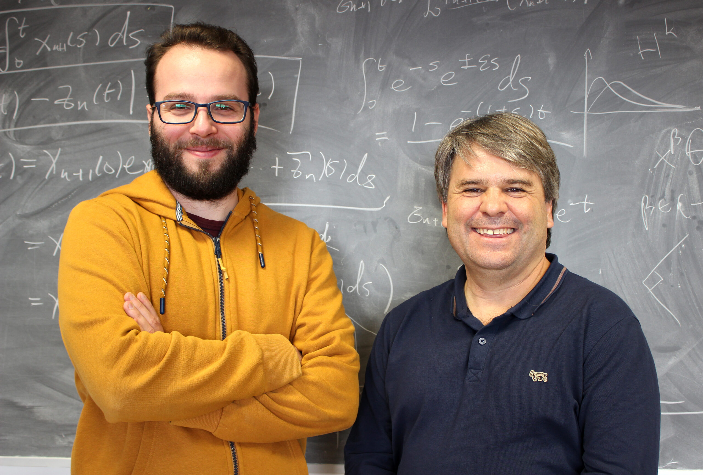

## When a Millennium Problem becomes a model evaluation

On 8 September 2026, OpenAI released a 166-page manuscript claiming **finite-time blow-up for the three-dimensional incompressible Navier–Stokes equations with smooth external forcing**, together with a Lean formalization of the result. The company reported that the successful search used on the order of 10,000 concurrent agents, generated approximately 2.7 million inter-agent messages and 130 billion output tokens, required about 88 hours from the start of the campaign to the construction of the proof, and then another 17 hours for formalization and verification.[^when-open-problems-became-benchmarks-openai-navier-stokes] Three days later, the Clay Mathematics Institute described the problem as *apparently* settled, while emphasizing that mathematical evaluation and the assignment of credit would proceed deliberately rather than at machine speed.[^when-open-problems-became-benchmarks-clay-announcement]

The achievement is easy to overstate and equally easy to understate. It does not show, in the formulation most familiar outside partial differential equations, that an unforced smooth three-dimensional fluid must develop a singularity. OpenAI's manuscript instead claims a construction with a smooth external force, corresponding to alternatives C and D in Charles Fefferman's official formulation of the Millennium problem. Alternatives A and B, concerning global smoothness for the unforced equations on $\mathbb{R}^3$ and on the three-dimensional torus, are logically distinct.[^when-open-problems-became-benchmarks-fefferman-four-alternatives] Describing the result as *merely exploiting a loophole* is therefore inaccurate, because smooth forcing has belonged to the official problem since its formulation. Describing it as a proof that unforced Navier–Stokes blows up is inaccurate for the opposite reason.

The formal alternatives, however, are only part of the story. The 2026 construction emerged against a much longer programme in the analysis of fluid singularities, and the most immediate mathematical lineage runs through the work of Diego Córdoba and Luis Martínez-Zoroa. ICMAT describes a programme developed over nearly a decade around what the researchers call a **cascade of vorticity layers**: an infinite sequence of increasingly concentrated but individually regular structures, arranged so that larger-scale layers deform and amplify successively smaller ones until the activation times accumulate at a finite singular time.[^when-open-problems-became-benchmarks-icmat-program] Unlike several earlier routes to blow-up, the programme was designed to operate in the full spatial domain rather than relying on a physical boundary to concentrate the flow.

{#fig-when-open-problems-became-benchmarks-cordoba-martinez fig-align="center" width="80%"}

That programme progressed through a sequence of increasingly demanding models rather than through a direct assault on the final Millennium statement. Córdoba, Martínez-Zoroa, and later Fan Zheng developed singularity mechanisms for three-dimensional Euler and related fluid equations; Córdoba and Martínez-Zoroa also obtained a forced Euler construction in which the forcing remained below the smoothness demanded by the Millennium problem. In May 2026, Córdoba, Martínez-Zoroa, and Zheng published a finite-time blow-up result for hypodissipative Navier–Stokes in *Archive for Rational Mechanics and Analysis*, placing the same broad mechanism in a viscous setting while still falling short of classical Navier–Stokes viscosity.[^when-open-problems-became-benchmarks-icmat-program] The research trajectory had therefore already isolated much of the singularity mechanism before the September result; what remained exceptionally difficult was to retain the blow-up construction while making the external forcing sufficiently smooth for Fefferman's C/D alternatives.

Quanta's reconstruction makes this intellectual continuity particularly explicit. Martínez-Zoroa's doctoral work had developed an unusually analytic route in a field where computer-assisted constructions had become increasingly prominent, and the Córdoba–Martínez-Zoroa programme subsequently showed how infinitely many regular components could be assembled into a finite-time cascade. The obstruction was not simply to generate a singular velocity field, but to prevent the forcing required to sustain the construction from becoming singular with it. Quanta reports that Charles Fefferman, who wrote the official Clay problem statement, singled out Córdoba and Martínez-Zoroa as central figures in the mathematical story. The same account presents the final smooth-forcing step as the hurdle that the competing AI-assisted programmes appear to have overcome.[^when-open-problems-became-benchmarks-quanta-navier-stokes]

This genealogy changes the interpretation of the event without diminishing the machine contribution. The relevant contrast is not between a human theory and an AI proof produced *ex nihilo*. A mature human research programme had already developed a mechanism, exposed successive obstructions, and moved it across neighboring equations; agentic systems then entered that landscape with a radically different capacity for parallel search, recombination, verification, and refinement. The striking development is therefore not that mathematical history ceased to matter, but that a research system could consume that history and explore the remaining construction space at a scale inaccessible to an individual research group.

That distinction is especially important because OpenAI says that its own project began not as a conventional research programme but as an evaluation of a newly trained internal model. After hearing reports that major open problems might recently have been resolved, its researchers launched agents against all remaining Millennium problems and several other high-impact questions, assigning groups to different branches of the official formulations. An intermediate construction for unforced Euler changed their assessment of where the search was most promising; computational resources were then concentrated on Navier–Stokes, useful intermediate results were propagated across groups, and a further-trained model checkpoint was introduced while the campaign was already running.[^when-open-problems-became-benchmarks-openai-search-process]

Navier–Stokes was thus occupying two roles simultaneously. It remained a scientific problem whose solution depended on a long mathematical genealogy, but it had also become an evaluation target for an industrial research system. Famous conjectures have always served informally as tests of mathematical ability, yet machine-scale research changes the relation between the test and the activity being tested. A problem can now be selected partly because resolving it would provide an unusually legible capability signal, decomposed into formally defined variants, supplied with thousands of parallel research processes, and pursued as an adaptive portfolio until one branch yields a successful construction.

The difference is structural. For a human mathematician, choosing to spend several years on one approach rather than another is itself a major research decision, constrained by career time, expertise, collaborators, and incomplete knowledge of where a path will lead. In an agentic system, many mutually incompatible programmes can be pursued simultaneously, unsuccessful branches can be discarded at comparatively low marginal cost, and intermediate results from one line of attack can be injected into another. The official specification of a theorem therefore becomes more than a statement to prove: it can become a search space over which computational resources are allocated.

This essay calls that regime **benchmark mathematics**: the use of an open mathematical problem not only as a scientific question but also as a capability target for evaluating and demonstrating a scalable research system. The term does not imply that the resulting mathematics is counterfeit, nor that benchmark selection necessarily corrupts research. It identifies a separation that previously mattered much less because the two objectives were usually coupled: producing an important mathematical result and demonstrating the capabilities of the system that produced it.

The distinction became institutionally urgent almost immediately. On 11 September, an initially twenty-five-member group of Fields Medallists published *A Severe Misalignment of AI in Mathematics*. Their declaration did not deny the rapidly increasing ability of language-model systems to solve serious outstanding problems. Its criticism was directed instead at the objective function surrounding that capability: if famous conjectures are optimized as legible demonstrations of AI progress, then the binary event *problem solved* may become detached from the other functions through which difficult problems have historically contributed to mathematics, including the production of concepts, methods, explanations, expertise, education, and new research programmes.[^when-open-problems-became-benchmarks-severe-misalignment]

The resulting dispute is therefore poorly described as enthusiasm for AI confronting mathematicians resistant to automation. Many of the critics use AI systems themselves, support formal verification, and explicitly acknowledge that the systems are beginning to produce important mathematics. The disagreement concerns what should count as progress once proof production is no longer necessarily the principal bottleneck. Who bears the cost of understanding a machine-generated result? How should conceptual credit be distributed when a successful construction extends a research programme created by other mathematicians? What does priority mean when private prompts, proprietary checkpoints, and internal agent traces form part of the causal history of a proof? What epistemic status should be assigned to a theorem that is kernel-checked before specialists have been able to explain its mechanism? And what happens to the institutional function of famous open problems when they can also be consumed as demonstrations of industrial research capability?

These questions extend the earlier transitions from proof scarcity to proof abundance, from informal verification to formal infrastructure, and from isolated theorem proving to integrated mathematical systems. The Navier–Stokes episode adds another layer because the abundant object is no longer merely the candidate proof. Large agent populations can generate and abandon hypotheses, representations, constructions, and entire research trajectories before a human mathematician could examine more than a small fraction of them.

The result is a transition from **proof abundance to search abundance**. That is the point at which a Millennium Problem can remain exactly what it has always been mathematically while becoming something historically new technologically: a theorem waiting to be proved, the endpoint of a decades-long research programme, and a model evaluation at the same time.

## The mathematics of the blow-up construction

Before discussing how the result was discovered, what should count as mathematical credit, or why thousands of agents change the economics of research, it is necessary to state precisely what was proved and what remains open. The phrase *solved Navier–Stokes* is potentially misleading because the Clay Millennium formulation contains several logically distinct alternatives, and the 2026 construction addresses only the forced breakdown branch.

For an incompressible fluid with velocity field $u(x,t)\in\mathbb{R}^3$, pressure $p(x,t)$, kinematic viscosity $\nu>0$, and external force $f(x,t)$, the equations are

$$
\partial_t u +(u\cdot\nabla)u
=
-\nabla p+\nu\Delta u+f,
\qquad
\nabla\cdot u=0.
$$ {#eq-when-open-problems-became-benchmarks-navier-stokes}

The first equation expresses momentum balance. The nonlinear term $(u\cdot\nabla)u$ transports momentum with the fluid, $\nu\Delta u$ represents viscous diffusion, $-\nabla p$ enforces the pressure response required by incompressibility, and $f$ supplies externally imposed momentum. The second equation says that the velocity field is divergence-free, so the fluid neither creates nor destroys volume locally.

Pressure is consequently not an independent dynamical degree of freedom. Taking the divergence of the momentum equation and using $\nabla\cdot u=0$ gives

$$
-\Delta p
=
\sum_{i,j=1}^{3}
\partial_i u_j\,\partial_j u_i
-
\nabla\cdot f.
$$ {#eq-when-open-problems-became-benchmarks-pressure}

Once the divergence-free velocity and forcing are specified, the pressure is therefore constrained by an elliptic equation. In Fourier language, incompressibility removes the longitudinal component of velocity, leaving two transverse degrees of freedom for every nonzero wave vector.

### What was solved, and what remains open

Fefferman's official formulation separates the Millennium problem into four alternatives.[^when-open-problems-became-benchmarks-fefferman-four-alternatives]

| Alternative | Domain | External force | Mathematical question | Status after the 2026 construction |
|---|---|---|---|---|
| **A** | $\mathbb{R}^3$ | $f\equiv0$ | Does every admissible smooth initial condition generate a global smooth solution? | **Still open** |
| **B** | $\mathbb{R}^3/\mathbb{Z}^3$ | $f\equiv0$ | Does every admissible smooth periodic initial condition generate a global smooth solution? | **Still open** |
| **C** | $\mathbb{R}^3$ | smooth $f$ allowed | Do there exist admissible smooth initial data and smooth forcing for which no global smooth physically reasonable solution exists? | **Claimed established by the 2026 construction** |
| **D** | $\mathbb{R}^3/\mathbb{Z}^3$ | smooth $f$ allowed | Do there exist admissible smooth periodic data and smooth forcing for which no global smooth periodic solution exists? | **Claimed established by the 2026 construction** |

: The four alternatives of the official Millennium formulation and the scope of the 2026 result. {#tbl-when-open-problems-became-benchmarks-clay-alternatives}

The distinction is fundamental. OpenAI did **not** prove that an unforced three-dimensional Navier–Stokes flow develops a singularity, nor did it disprove global regularity for arbitrary smooth initial data. Alternatives A and B remain unresolved. The construction instead takes the existential route permitted by C and D: choose admissible smooth data and, crucially, a specially constructed smooth force that drives the solution into a finite-time singularity.

OpenAI's Theorem 1.1 makes the statement unusually sharp. For every $\nu>0$, the manuscript constructs a smooth force compactly supported in space and time and starts the velocity field from rest,

$$
u(\cdot,0)=0.
$$

The resulting solution remains smooth for every $0\le t<1$, has uniformly bounded kinetic energy, yet satisfies

$$
\sup_{0\le t<1}
\|u(t)\|_{L^2(\mathbb{R}^3)}
<\infty,
\qquad
\limsup_{t\uparrow1}
\|u(t)\|_{L^\infty(\mathbb{R}^3)}
=
\infty.
$$ {#eq-when-open-problems-became-benchmarks-blowup-criterion}

The whole-space construction establishes the claimed C alternative, and the corresponding periodic construction yields D.[^when-open-problems-became-benchmarks-openai-technical-theorem]

The two bounds above should be read together. The solution is not becoming singular because its total kinetic energy diverges. Its $L^2$ norm remains bounded. Instead, an increasingly large velocity is concentrated into an increasingly small region. The singularity is therefore one of **concentration**: global energy remains controlled while pointwise amplitudes and spatial gradients become unbounded.

### Why three-dimensional vorticity matters

The central mechanism is more transparent in vorticity variables. Define

$$
\omega=\nabla\times u.
$$

Taking the curl of the Navier–Stokes equation gives

$$
\partial_t\omega
+
(u\cdot\nabla)\omega
=
(\omega\cdot\nabla)u
+
\nu\Delta\omega
+
\nabla\times f.
$$ {#eq-when-open-problems-became-benchmarks-vorticity}

The term

$$
(\omega\cdot\nabla)u
$$

is vortex stretching. It marks one of the decisive differences between two- and three-dimensional fluid dynamics. In two dimensions the vorticity is perpendicular to the plane and this stretching mechanism disappears. In three dimensions, by contrast, a vortex tube can lengthen and become thinner while its vorticity intensifies.

Viscosity acts in the opposite direction through $\nu\Delta\omega$, smoothing fine spatial structure. The regularity problem is therefore not simply whether nonlinear terms can become large. The question is whether the equations can organize concentration on progressively smaller scales while viscosity simultaneously attempts to erase those scales.

A finite-time singularity must accomplish something stronger still: the solution has to remain perfectly smooth for every $t<1$, satisfy the equations at every stage, and nevertheless develop arbitrarily small spatial scales rapidly enough that a norm controlling regularity diverges as $t$ approaches the singular time.

### An anisotropically collapsing vortex

The construction achieves this through an axisymmetric vortex with swirl. In cylindrical coordinates $(r,\theta,z)$,

$$
u
=
u_r e_r
+
u_\theta e_\theta
+
u_z e_z.
$$ {#eq-when-open-problems-became-benchmarks-cylindrical-velocity}

Here $u_r$ describes radial transport, $u_\theta$ the azimuthal swirl, and $u_z$ the axial flow. Axisymmetry does not make the dynamics effectively two-dimensional because the swirl component remains coupled to the radial and axial motions.

The incompressibility constraint becomes

$$
\frac{1}{r}\partial_r(ru_r)
+
\partial_z u_z
=
0.
$$ {#eq-when-open-problems-became-benchmarks-axisymmetric-incompressibility}

This immediately constrains the geometry of collapse. Fluid moving radially toward the axis cannot accumulate there. The inward radial flux must be accompanied by axial redistribution. The singular structure is therefore not a uniformly contracting ball of fluid but a coupled system of radial contraction, axial motion, and increasingly strong swirl, as illustrated in @fig-when-open-problems-became-benchmarks-axisymmetric-vortex.

.](navier-stokes-light-master.webp){#fig-when-open-problems-became-benchmarks-axisymmetric-vortex fig-align="center" width="72%"}

Write

$$
\tau=1-t
$$

for the time remaining until the singularity. For a small fixed parameter

$$
0<h<\frac{1}{100},
$$

the leading construction has characteristic radial and axial scales

$$
\ell_r(\tau)\asymp\tau^{1/2},
\qquad
\ell_z(\tau)\asymp\tau^{1/2-h}.
$$ {#eq-when-open-problems-became-benchmarks-core-length-scales}

Their ratio is

$$
\frac{\ell_r}{\ell_z}
\asymp
\tau^h
\longrightarrow0
\qquad
\text{as }\tau\downarrow0.
$$ {#eq-when-open-problems-became-benchmarks-core-anisotropy}

The radial scale therefore collapses slightly faster than the axial scale. The difference looks small, because $h$ is small, but its cumulative asymptotic effect is decisive: the vortex becomes progressively more anisotropic as the singular time approaches.

The characteristic velocities scale schematically as

$$
u_r
\asymp
\tau^{-1/2},
\qquad
u_\theta,\;u_z
\asymp
\tau^{-1/2-h}.
$$ {#eq-when-open-problems-became-benchmarks-velocity-scales}

The swirl and axial velocities therefore grow faster than the radial component by a factor of order $\tau^{-h}$. The singularity does not arise from introducing a completely different dominant scale; it arises from preserving a slight supercritical imbalance through an indefinitely shrinking hierarchy.

### Why viscosity does not simply smooth the construction away

The scaling is designed so that the terms responsible for collapse remain comparable to viscous diffusion.

A characteristic time derivative has magnitude

$$
\partial_tu
\sim
\frac{u}{\tau}
\asymp
\tau^{-3/2-h}.
$$

Radial viscous diffusion gives

$$
\nu\partial_r^2u
\sim
\nu\frac{u}{\ell_r^2}
\asymp
\nu\tau^{-3/2-h},
$$

because

$$
\ell_r^2\asymp\tau.
$$

Radial nonlinear transport has the same characteristic order,

$$
u_r\partial_r u
\sim
\frac{u_r u}{\ell_r}
\asymp
\tau^{-3/2-h},
$$

and axial transport similarly gives

$$
u_z\partial_z u
\sim
\frac{u_z u}{\ell_z}
\asymp
\tau^{-3/2-h}.
$$ {#eq-when-open-problems-became-benchmarks-leading-balance}

Time evolution, nonlinear transport, and radial viscous diffusion therefore occupy the same leading asymptotic scale. Viscosity has not been neglected or assumed negligible. It has been built into the singular balance.

The axial viscous term is weaker:

$$
\nu\partial_z^2u
\sim
\nu\frac{u}{\ell_z^2}
\asymp
\nu\tau^{-3/2+h}.
$$

Relative to radial diffusion it carries an additional factor

$$
\tau^{2h},
$$

which tends to zero. The anisotropic geometry therefore creates a preferred dissipative direction: radial diffusion remains part of the leading balance while axial diffusion becomes asymptotically weaker.

This scale matching is one reason the construction is much subtler than simply postulating a rapidly shrinking vortex. A candidate singularity whose nonlinear concentration overwhelms viscosity by an arbitrary amount would generally fail to solve the actual Navier–Stokes equations. Here collapse is engineered at approximately the scale at which viscosity remains dynamically relevant.

### Infinite velocity with finite energy

The same scaling explains how pointwise blow-up can coexist with bounded kinetic energy.

The collapsing region has characteristic volume

$$
V_{\mathrm{core}}
\sim
\ell_r^2\ell_z
\asymp
\tau^{3/2-h}.
$$

The dominant velocity magnitude behaves as

$$
|u|
\asymp
\tau^{-1/2-h}.
$$

Its leading contribution to kinetic energy consequently scales as

$$
E_{\mathrm{core}}
\sim
|u|^2V_{\mathrm{core}}
\asymp
\tau^{-1-2h}\tau^{3/2-h}
=
\tau^{1/2-3h}.
$$ {#eq-when-open-problems-became-benchmarks-core-energy-scaling}

Because $h<1/100$,

$$
\frac12-3h>0,
$$

and this leading contribution tends to zero as $\tau\downarrow0$, even though

$$
\|u(t)\|_{L^\infty}
\asymp
\tau^{-1/2-h}
\longrightarrow\infty.
$$

This is the key geometric asymmetry. The velocity amplitude diverges, but the region supporting the largest velocity collapses even faster. The singularity therefore need not carry divergent total kinetic energy.

Derivatives behave differently. A characteristic radial gradient has scale

$$
|\partial_r u|
\sim
\frac{|u|}{\ell_r}
\asymp
\tau^{-1-h},
$$

and hence the associated vorticity has the corresponding order

$$
|\omega|
\sim
\tau^{-1-h}.
$$ {#eq-when-open-problems-became-benchmarks-vorticity-scaling}

Using the same core-volume estimate,

$$
\int_{\mathrm{core}}|\omega|^2\,dx
\sim
\tau^{-2-2h}\tau^{3/2-h}
=
\tau^{-1/2-3h},
$$

which diverges as $\tau\downarrow0$.

The flow is therefore undergoing a transfer from bounded large-scale energy toward increasingly fine spatial structure. Velocity remains globally square-integrable while gradients and vorticity become arbitrarily large. This is the mathematical sense in which concentration, rather than an unbounded energy supply, produces the singularity.

### Why allowing a force does not make the problem trivial

At this point it may appear that alternatives C and D should be easy: if an external force is allowed, why not simply choose a singular velocity field and define whatever force is needed to make it satisfy Navier–Stokes?

For any sufficiently regular candidate velocity $U$ and pressure $P$, define the residual

$$
R(U,P)
=
\partial_t U
+
(U\cdot\nabla)U
-
\nu\Delta U
+
\nabla P.
$$ {#eq-when-open-problems-became-benchmarks-momentum-residual}

One can formally set

$$
f=R(U,P).
$$

Then $U$ solves the forced equation by definition. But this accomplishes nothing unless $f$ satisfies the regularity conditions of the Millennium problem. If $U$ has been engineered to develop a singularity, the derivatives entering $R(U,P)$ will generally become singular as well. The resulting force would merely encode the singularity one was trying to prove.

The real problem is therefore not

> Can one force a velocity field to blow up?

but rather

> Can one construct a velocity field that blows up while the force required to sustain it remains completely smooth?

That separation between singular solution and nonsingular forcing is the heart of the C/D construction.

### The localization obstruction

The inner collapsing vortex can be arranged to have the desired asymptotic dynamics, but it must ultimately be embedded inside a globally admissible flow. A natural attempt is to localize the core with a smooth cutoff. Schematically, let

$$
U_{\mathrm{loc}}
=
\chi U_{\mathrm{core}},
$$

where $\chi$ is equal to one in the singular region and transitions smoothly to zero outside it.

Differentiating the localized field generates terms containing

$$
\nabla\chi,
\qquad
\Delta\chi,
\qquad
U_{\mathrm{core}}\nabla\chi,
$$

together with nonlinear cross terms. The cutoff function itself is smooth, but it multiplies a field whose amplitude and derivatives increase without bound as $t\uparrow1$. The resulting Navier–Stokes residual can therefore become singular in the annular transition region where

$$
\nabla\chi\neq0.
$$

The geometry now has three qualitatively different regions: a singular inner core whose asymptotics are deliberately controlled, a regular exterior, and an intermediate annulus where connecting the two produces an inadmissible forcing residual.

The inner blow-up mechanism alone is consequently insufficient. The construction also has to solve a matching problem.

### Oscillations as nonlinear stress

The decisive idea is to repair the transition dynamically rather than by a static interpolation.

Write

$$
u=U+w,
$$

where $U$ denotes the collapsing background field and $w$ is a rapidly oscillating correction placed in the problematic region. Expanding the nonlinear transport term gives

$$
(u\cdot\nabla)u
=
(U\cdot\nabla)U
+
(U\cdot\nabla)w
+
(w\cdot\nabla)U
+
(w\cdot\nabla)w.
$$ {#eq-when-open-problems-became-benchmarks-oscillatory-decomposition}

For a divergence-free perturbation,

$$
(w\cdot\nabla)w
=
\nabla\cdot(w\otimes w).
$$

The crucial point is that a rapidly oscillating field may have almost no mean,

$$
\langle w\rangle\approx0,
$$

while its quadratic product has a nonzero average,

$$
\langle w\otimes w\rangle\neq0.
$$

The perturbation can therefore be almost invisible at first order while producing a systematic effect through its quadratic self-interaction.

In a coarse-grained description, this averaged quadratic term behaves as an effective stress. The oscillations can be selected so that

$$
\nabla\cdot
\langle w\otimes w\rangle
\approx
-
R_{\mathrm{bad}},
$$ {#eq-when-open-problems-became-benchmarks-reynolds-stress-cancellation}

where $R_{\mathrm{bad}}$ denotes the singular part of the residual generated in the transition region.

This is the mathematical content behind the useful intuition that the oscillatory waves act as **dynamical glue**. They connect the singular core to the regular exterior not by smoothing away the singularity, but by exploiting the quadratic Navier–Stokes nonlinearity to generate an averaged momentum flux that cancels the otherwise inadmissible forcing.

The distinction between

$$
\langle w\rangle
$$

and

$$
\langle w\otimes w\rangle
$$

is essential. Oscillations that largely cancel at the level of the velocity field can survive at second order as a stress. Nonlinearity converts fine-scale oscillation into a macroscopic corrective effect.

### Why one oscillatory correction is not enough

Adding $w$ does not simply remove the original error. It also generates new terms:

$$
(U\cdot\nabla)w,
\qquad
(w\cdot\nabla)U,
\qquad
(w\cdot\nabla)w,
$$

as well as new viscous and temporal contributions. Correcting one residual therefore creates smaller residuals of its own.

The construction must consequently be hierarchical. A leading error is cancelled by an oscillatory correction; the errors generated by that correction are moved to finer scales; additional corrections then remove those errors without destroying the already constructed singular geometry. The process combines two architectures at once: an **amplification hierarchy**, which drives the velocity and vorticity toward singularity, and an **error-cancellation hierarchy**, which prevents the external force from inheriting that singularity.

The final result depends on making these two hierarchies coexist.

### The theorem in one conjunction

At the end of the construction, four properties must hold simultaneously:

$$
\begin{aligned}
&u(\cdot,t)\ \text{is smooth for every }t<1,\\
&f\in C_c^\infty(\mathbb{R}^3\times(0,\infty);\mathbb{R}^3),\\
&\sup_{0\le t<1}\|u(t)\|_{L^2(\mathbb{R}^3)}<\infty,\\
&\limsup_{t\uparrow1}\|u(t)\|_{L^\infty(\mathbb{R}^3)}=\infty.
\end{aligned}
$$ {#eq-when-open-problems-became-benchmarks-four-properties}

No one of these properties is sufficient by itself. A singular velocity field is not enough, nor is a singular solution sustained by a singular force. The theorem requires a smooth compactly supported force and uniformly bounded kinetic energy to coexist with a classical solution whose velocity nevertheless becomes unbounded in finite time.[^when-open-problems-became-benchmarks-openai-technical-theorem]

A singular velocity field is not enough. A singular solution sustained by a singular external force is not enough. A smooth force driving a globally regular flow is not enough. The theorem requires a smooth forcing term to coexist with a solution that remains classical up to, but not including, a finite time at which its velocity loses boundedness.[^when-open-problems-became-benchmarks-openai-technical-theorem]

The mechanism can therefore be summarized without reducing it to a slogan. Three-dimensional vortex stretching permits amplification unavailable in planar flow. An axisymmetric vortex collapses anisotropically, with radial and axial scales chosen so that nonlinear transport, temporal evolution, and radial viscosity remain in a delicate asymptotic balance. The shrinking geometry allows pointwise velocity and vorticity to diverge while the energy remains bounded. Localization of that singular core creates a new obstruction in an intermediate annulus. Rapid oscillatory corrections exploit the quadratic nonlinearity to generate an effective stress that cancels the singular part of the forcing residual. A hierarchy of further corrections then drives the remaining errors to successively smaller scales.

### What the result does and does not settle

The 2026 construction therefore claims to resolve the **forced breakdown alternatives C and D** of the official Millennium formulation. It does **not** resolve the unforced alternatives A and B.

Setting

$$
f\equiv0
$$

removes exactly the freedom exploited by the construction to sustain the collapsing structure and, especially, to repair the residual produced when the singular core is connected to a regular exterior. The remaining problem asks whether the intrinsic Navier–Stokes dynamics, with no externally designed forcing, can generate an analogous finite-time loss of regularity or whether viscosity always prevents it.

That question remains open.

The distinction matters because both common simplifications are wrong. It is inaccurate to say that AI has shown that ordinary unforced three-dimensional Navier–Stokes flow blows up. But it is equally inaccurate to dismiss the result as trivial because a forcing term is allowed. The mathematical obstacle was precisely to make the **solution singular while keeping the force smooth**. The construction had to produce singularity dynamically rather than smuggling it into the equation through a pathological external input.

The result is thus narrower than the popular phrase *Navier–Stokes has been solved* suggests, but mathematically much stronger than *a force was chosen to make a fluid blow up* suggests. It establishes, subject to the ongoing process of mathematical scrutiny and validation, that the official forced-breakdown route can be realized through a highly structured interaction of anisotropic concentration, vortex amplification, viscous balance, localization, and nonlinear oscillatory stress.

This precision is important for what follows. The machine system was not merely asked to manipulate symbols until a proof certificate appeared. The successful research trajectory had to navigate a space of candidate geometries, asymptotic scalings, residual structures, oscillatory corrections, and compatibility conditions. Once thousands of agents can explore such alternatives concurrently, the economically important change is no longer only that proofs can be generated faster. Entire candidate **mathematical mechanisms** can be generated, tested, rejected, combined, and redirected in parallel.

That is the transition from proof abundance to search abundance.


## From proof abundance to search abundance at 10,000-agent scale

The Navier–Stokes construction matters not only because of the theorem it claims to establish, but because of the research process that produced it. Earlier discussions of AI in mathematics often focused on **proof abundance**: once language models can generate many candidate arguments, the scarce activities become verification, interpretation, and selection. The September 2026 experiment moves the bottleneck one stage further upstream. What becomes abundant is not merely candidate proofs but candidate **research trajectories**: representations, ansätze, auxiliary lemmas, analogies, parameter regimes, counterexamples, numerical experiments, and entire proof strategies can be pursued simultaneously, discarded, recombined, and restarted at comparatively low marginal cost.

This distinction matters because most difficult research does not begin with a known promising proof that merely needs completion. The more fundamental problem is deciding which of many possible directions deserves sustained attention. Human mathematics has evolved mechanisms for making that decision under severe resource constraints: mathematical taste, literature knowledge, conversations with specialists, heuristic calculation, analogy, and judgments about tractability. These are not decorative aspects of research practice. They are pruning mechanisms. A mathematician cannot seriously investigate thousands of incompatible programmes, so most conceivable trajectories have to be rejected before they are explored deeply.

A deliberately idealized model makes the effect of parallelism visible. Let $T_i$ denote the time required for research trajectory $i$ to produce a successful result, and suppose temporarily that the $T_i$ are independent and identically distributed with cumulative distribution function $F(t)$. If

$$
T_{\min}
=
\min_{1\le i\le n}T_i,
$$

then

$$
\Pr(T_{\min}>t)
=
\Pr(T_1>t,\ldots,T_n>t)
=
\left(1-F(t)\right)^n.
$$ {#eq-when-open-problems-became-benchmarks-parallel-search}

The assumptions are intentionally unrealistic. OpenAI's agents were not independent, they inherited common model biases, different groups received different contexts, intermediate results were shared, and humans changed the allocation of resources during the campaign. The equation isolates only one effect: even if no individual research trajectory becomes intrinsically better, running many trajectories in parallel changes the distribution of wall-clock time to a rare success. Once information is allowed to move between branches, the system becomes more powerful still, because it is no longer merely parallel search but **adaptive portfolio search**.

OpenAI's description of the Millennium campaign has precisely this structure. Agents were divided into communicating groups, supplied with code and cached web material, and assigned different formulations and neighboring questions. Nearly one hundred agents reportedly spent roughly fifty hours on an unforced Euler problem. When that branch produced a promising construction, human researchers changed their estimate of where progress was most likely, reduced effort elsewhere, redirected resources toward Navier–Stokes, supplied the Euler result to other groups, introduced a further-trained model checkpoint during the campaign, and used Codex to consolidate intermediate mathematical findings across branches.[^when-open-problems-became-benchmarks-openai-search-process]

@fig-when-open-problems-became-benchmarks-search-system abstracts the resulting research architecture. It is not intended as an implementation diagram of OpenAI's internal system; it represents only the publicly described causal structure relevant to mathematical discovery.

```{mermaid}
%%| label: fig-when-open-problems-became-benchmarks-search-system
%%| fig-cap: "Machine-scale mathematical discovery as an adaptive research portfolio. Parallel branches explore different mathematical mechanisms; intermediate results are selected, consolidated, and redistributed; human researchers redirect resources; and surviving constructions proceed to exposition and formal verification."
%%| fig-alt: "Problem variants, literature, and computational tools feed parallel mathematical searches. Their intermediate findings enter a shared research state, from which selected results are consolidated and returned to active searches. Human researchers redirect resources. A surviving mathematical construction proceeds to exposition, Lean formalization, and a kernel-checkable artifact."
%%| fig-align: center
%%{init: {"theme": "neo", "look": "handDrawn", "layout": "elk"}}%%
flowchart TD
    A[Problem formulations] -->|seed trajectories| B(Parallel mathematical search)
    C[(Literature and prior results)] -->|supply context| B
    D[Code and computational tools] -->|test constructions| B
    B -->|produce intermediate results| E[(Research state)]
    E -->|select candidates| F(Consolidation)
    F -->|redistribute useful results| B
    G[Human researchers] -.->|redirect compute and attention| B
    B -->|surviving construction| H(Mathematical exposition)
    H -->|formal target| I(Lean formalization)
    I -->|kernel checking| J[Formal certificate]
```

This architecture changes the economics of failure. A six-month dead end is expensive for a mathematician because it consumes a significant fraction of a finite research career and prevents other projects from being pursued during the same period. An agent branch can fail much more cheaply. A direction with a low ex ante probability of success may still be rational to pursue if its marginal computational cost is modest, if it explores a sufficiently different region of the research space, or if its failure generates information that improves other branches. Research selection begins to acquire some of the logic of portfolio allocation: one need not know in advance which trajectory will succeed if enough sufficiently heterogeneous trajectories can be explored and information can be reallocated as evidence arrives.

The scale reported for Navier–Stokes shows why this cannot be understood as thousands of independent artificial mathematicians simply working faster than people. OpenAI reports approximately 2.7 million messages and 130 billion output tokens for the Navier–Stokes campaign, within a broader run of roughly 4.9 million messages and 300 billion output tokens.[^when-open-problems-became-benchmarks-openai-navier-stokes] Those numbers are not measures of mathematical value. Most generated text in a search of that scale may be redundant, mistaken, derivative, or irrelevant. Their significance is organizational: the research trace became too large for humans to inspect serially. Selection, compression, comparison, and routing therefore had to occur inside the machine-mediated research process itself.

AI consequently acquires a second-order role. It does not only propose lemmas or constructions; it also determines, through ranking, summarization, consolidation, and redistribution, which machine-generated results become visible to other machine processes. This introduces failure modes that ordinary theorem-solving accuracy does not measure. Thousands of agents instantiated from related models can reproduce the same hidden misconception and make repetition look like independent confirmation. Compression can remove a hypothesis that later turns out to be essential. Consolidation can privilege arguments that are easier to summarize over arguments that are mathematically deeper but less legible. A mistaken intermediate result can become a shared premise for an entire branch of the search tree.

The converse is equally important. A well-designed architecture can recover from failures that would terminate a serial human effort. Different prompts, representations, retrieved literatures, numerical experiments, symbolic tools, and adversarial validators can expose incompatible approaches to the same obstruction. Cheap computation can eliminate impossible parameter regimes before they absorb expert attention. One group can discover a lemma whose significance becomes visible only when another branch encounters the right application. At this scale, the properties of the research system are no longer reducible to the capabilities of the underlying model. Error correlation, diversity of trajectories, fidelity of compression, preservation of negative information, validation policy, and resource allocation all become first-class variables.

OpenAI's broader report on internal research-agent use suggests that this change is not peculiar to mathematics. By mid-August 2026, the company reported approximately 3.1 agent-workdays of runtime for each human workday across its research organization, together with increasing concurrency and longer-duration delegation. The same report cautioned that easily measured activity, i.e. code written, experiments launched, agent-hours consumed, should not be equated with scientific progress, because improvements in one part of the research pipeline shift the bottleneck toward stages that remain difficult to automate.[^when-open-problems-became-benchmarks-openai-research-acceleration]

Mathematics exhibits the same migration. Once candidate trajectories become cheap, the scarce resource is deciding which deserve further computation. Once formalization becomes cheap, the scarce resource becomes semantic interpretation. Once theorem production accelerates, specialist attention becomes scarce. The Navier–Stokes event is therefore poorly described as one artificial mathematician working for eighty-eight hours. It was a composite research system consisting of a historically accumulated mathematical corpus, frontier-model training, thousands of concurrent reasoning processes, executable tools, formal infrastructure, machine-mediated consolidation, and human decisions about where to concentrate resources, compressed into less than four days of wall-clock time.

This distinction also changes the meaning of reproducibility. The final mathematical theorem can, in principle, be read, criticized, formalized, and replayed. The process that selected that theorem from millions of intermediate trajectories cannot presently be reproduced by an ordinary mathematical group. Search abundance therefore creates a new systems boundary around discovery itself: the published proof may be open to inspection while the industrial process that found it remains inaccessible.

## Across the frontier: pure mathematics, theoretical computer science, physics, and logic

Navier–Stokes would be easier to interpret if it were an isolated event. The record of 2026 instead contains several qualitatively different forms of AI-assisted frontier mathematics. Their heterogeneity is more informative than their number. They should not be collapsed into a scoreboard of *open problems solved by AI*, because the examples differ substantially in mathematical novelty, machine autonomy, human intervention, certificate structure, formal verification, and degree of independent assimilation. What generalizes is not a single model of an artificial mathematician but a set of transformations in the research pipeline.

The May 2026 disproof of Erdős's unit-distance conjecture is one of the clearest examples. If $U(n)$ denotes the maximum number of unit-distance pairs determined by $n$ points in the Euclidean plane, the long-standing conjectural expectation was

$$
U(n)=n^{1+o(1)}.
$$

An internal OpenAI model instead produced an infinite family of configurations with at least

$$
n^{1+\delta}
$$

unit-distance pairs for a fixed $\delta>0$, contradicting the conjectured asymptotic behavior.[^when-open-problems-became-benchmarks-unit-distance] The subsequent work by Noga Alon, Thomas Bloom, Timothy Gowers, Daniel Litt, Will Sawin, Arul Shankar, Jacob Tsimerman, Victor Wang, and Melanie Matchett Wood is important precisely because it did something different from repeating the machine proof. Their shorter account reconstructed the argument in human mathematical language and identified significant antecedents in algebraic number theory, including ideas associated with Ellenberg–Venkatesh, Golod–Shafarevich, and Hajir–Maire–Ramakrishna.[^when-open-problems-became-benchmarks-unit-distance-human-digestion]

That second stage is not clerical cleanup after the _real_ discovery. It changes the epistemic object. The machine-generated construction establishes a counterexample; the subsequent mathematical work reveals why the construction works, where its ingredients came from, and how it should be located in the existing conceptual graph of mathematics. Novelty in such a system need not mean creating techniques without antecedents. It may consist of combining ideas across literatures that human research communities had not previously connected in the required way.

The Jacobian conjecture exhibits a different structure. In its classical complex form, it asks whether a polynomial map

$$
F:\mathbb{C}^n\rightarrow\mathbb{C}^n
$$

with nonzero constant Jacobian determinant must possess a polynomial inverse. A three-dimensional counterexample credited to Claude Fable 5 was announced through Levent Alpöge in July. Shuhong Gao subsequently produced a self-contained geometric treatment and generalized the construction to every dimension greater than two, while an independent Lean artifact verified the determinant and collision identities of the explicit map.[^when-open-problems-became-benchmarks-jacobian-gao][^when-open-problems-became-benchmarks-jacobian-lean] The two-dimensional conjecture remains open.

The case illustrates what may be called **asymmetric verification geometry**. Discovery requires locating a rare object inside a large construction space; once the object is known, the decisive claim can be reduced to exact symbolic identities or a comparatively compact certificate. Problems with this combination, a vast discovery space and a small verification object, are particularly compatible with machine-scale search. Their difficulty before discovery and their difficulty after discovery are radically different.

Anthropic's work around the Riemann hypothesis displays almost the opposite pattern: the value emerged from failing to solve the nominal benchmark. An unreleased Claude research system was tasked with the Riemann hypothesis but did not prove it. Anthropic instead reported an improved lower bound for the proportion of nontrivial zeros of the zeta function lying on the critical line, from 41.6% to 67.2%. A second run reportedly coordinated around sixty subagents, combined literature search with numerical experimentation and mutual review, and produced both an informal paper and a formal artifact checked with Comparator; Anthropic mathematicians and external specialists subsequently examined the result.[^when-open-problems-became-benchmarks-anthropic-riemann] Because the work is recent, its long-term mathematical status should not be inferred from the announcement alone.

Its methodological significance does not depend on the Riemann hypothesis having been solved. The target organized the search, but the mathematically valuable output appeared nearby. This resembles ordinary research more closely than a benchmark with a fixed terminal answer: exploration changes the set of questions worth preserving. A failed attack can produce a theorem that was not the original objective.

OpenAI's August release of ten results broadens the picture further. The portfolio spans high-dimensional sphere packing, coding theory, non-sofic groups, operator algebras, arithmetic circuit complexity, quantum parallel repetition, lattice hardness, convex geometry, Ramsey theory, and extremal graph theory. OpenAI states that an internal Astra model generated the arguments, humans assisted in preparing manuscripts, and the results were subsequently formalized in Lean.[^when-open-problems-became-benchmarks-openai-ten-results-detail] The ten items do not have identical mathematical status: some are described as resolutions, others as advances, and their recency means that independent assimilation remains incomplete.

The theoretical-computer-science cases are especially revealing because they are not all searches for a compact witness. Results involving arithmetic-circuit lower bounds, quantum parallel repetition, or hardness of approximation depend on extended chains of reductions, inequalities, structural lemmas, and complexity-theoretic reasoning.[^when-open-problems-became-benchmarks-openai-ten-results-detail] If these arguments survive specialist scrutiny, the underlying capability cannot be explained solely as brute-force counterexample search. It includes the construction of long abstract arguments whose intermediate objects have to remain mutually consistent.

Theoretical physics supplies yet another research architecture. Michael Brenner, Vincent Cohen-Addad, and David Woodruff describe a Gemini Deep Think system embedded in a tree-search procedure with automated numerical feedback for a problem concerning gravitational radiation from cosmic-string loops.[^when-open-problems-became-benchmarks-cosmic-strings-detailed] Candidate symbolic derivations were subjected to numerical checks, allowing incorrect branches to be rejected before substantial human effort was spent interpreting them. Numerical agreement is not a proof, but within a discovery loop it can act as an inexpensive discriminator between promising and implausible symbolic trajectories.

Mathematical logic provides an example in which the search reportedly reversed the conjectural direction. Paweł Pawłowski describes a project that began with generative-AI assistance intended to establish decidability of Medvedev logic but instead led to a claimed proof that the logic is $\Pi^0_1$-complete, and hence undecidable and not recursively enumerable.[^when-open-problems-became-benchmarks-medvedev-detailed] The result was only days old when this article was written and therefore requires independent specialist evaluation. What matters here is the search behavior: the system did not merely optimize a prespecified conclusion but contributed to changing which conclusion appeared mathematically defensible.

Formalization occupies a different point in this space because the theorem itself need not be new. Anthropic's September Fermat's Last Theorem project did not claim a new proof strategy for FLT. It reported an eleven-day, largely autonomous Lean formalization using Prove2Me and a multi-agent harness, generating approximately thirteen million lines of Lean and 29,500 intermediate theorems before producing an end-to-end checked development.[^when-open-problems-became-benchmarks-anthropic-flt-detail] The frontier contribution is therefore not theorem discovery but industrial-scale translation of an enormous body of existing mathematics into a formal system.

These cases are better understood along several orthogonal dimensions than on a single scale from *human* to *autonomous*.

| Case                        | Domain                            | Principal machine role                                        | Evidentiary form                                                       | Structural lesson                                                   |
| --------------------------- | --------------------------------- | ------------------------------------------------------------- | ---------------------------------------------------------------------- | ------------------------------------------------------------------- |
| Erdős unit distance         | discrete geometry / number theory | construction and proof generation                             | machine argument followed by human reconstruction                      | cross-field recombination can generate new constructions            |
| Jacobian conjecture         | algebraic geometry                | explicit counterexample search                                | exact identities, follow-up mathematics, independent Lean verification | large discovery spaces can terminate in compact certificates        |
| Riemann critical-line bound | analytic number theory            | multi-agent exploration around an unsuccessful target         | paper, formalization, transcripts, expert review                       | failure on a benchmark can expose valuable neighboring theorems     |
| OpenAI ten-result portfolio | pure mathematics / TCS            | construction and theorem generation followed by formalization | manuscripts and Lean artifacts                                         | frontier output can recur across heterogeneous mathematical domains |
| Cosmic-string radiation     | theoretical physics               | symbolic tree search with numerical rejection                 | analytic derivations plus numerical checks                             | external evaluators can cheaply prune symbolic search               |
| Medvedev logic              | mathematical logic                | AI-assisted exploratory proof development                     | recent preprint                                                        | research search can reverse the intended conjectural direction      |
| Fermat formalization        | formal mathematics                | large-scale autoformalization                                 | kernel-checkable Lean development                                      | verification infrastructure can itself become machine-abundant      |

: Recent AI-assisted results differ along independent dimensions of novelty, machine contribution, verification structure, and degree of external assimilation. {#tbl-when-open-problems-became-benchmarks-frontier-cases}

The common structure is therefore not a single artificial mathematician reproducing every cognitive and institutional role of a human researcher. It is a composition of specialized transformations. Models generate conjectures and constructions; code tests examples; numerical tools reject candidates; literature systems recover antecedents; proof assistants enforce formal constraints; validator agents attack surviving arguments; human mathematicians decide which results deserve attention and how they should be interpreted.

No monolithic artificial mathematician is required for the research system to change. Problem selection, literature reconstruction, hypothesis generation, construction search, computation, proof generation, formalization, checking, exposition, and prior-art analysis can each be automated at different rates and composed into a pipeline. Navier–Stokes is exceptional in scale, but its underlying architecture is already visible across several disciplines.

## The provenance problem: private research, model memory, and mathematical credit

Once discovery has this distributed structure, the apparently simple question *who solved the problem?* becomes underspecified. One needs a causal account: who initiated the research programme, who contributed the key mathematical mechanisms, what information entered the system, which human decisions redirected the search, which agent instances produced decisive intermediate constructions, which results were transferred between branches, who formalized the final theorem, and who converted the resulting artifact into mathematics that others could understand.

The Navier–Stokes episode demonstrates why that reconstruction becomes difficult when part of the evidence exists inside proprietary infrastructure. Tristan Buckmaster's public statement explicitly places his work with Levent Alpöge inside the earlier forced-blow-up programme of Diego Córdoba and Luis Martínez-Zoroa. He describes using several LLM systems to push that programme toward smooth forcing and three-dimensional incompressible Euler, reports that an LLM-generated Euler proof emerged in mid-August, and states that Lean verification was completed later that month while the collaborators were still working to understand and rewrite the argument.[^when-open-problems-became-benchmarks-buckmaster-program-attribution]

The controversy concerns the possible relationship between that private research process and OpenAI's later campaign. Buckmaster states that he and Alpöge used OpenAI's Codex among several systems and placed mathematical drafts and reasoning inside private model sessions. After rumors of their progress circulated, he communicated with OpenAI and asked whether those sessions could have been accessed or could have influenced the internal system used for the Millennium campaign.[^when-open-problems-became-benchmarks-buckmaster-provenance-statement]

His statement is also careful about the limits of what he knows. Buckmaster says that he had not seen OpenAI's proof, did not know how the internal model had obtained its result, did not know whether material from his collaboration had been used, and was not accusing OpenAI of having done so.[^when-open-problems-became-benchmarks-buckmaster-provenance-statement] Temporal proximity, similarity of research direction, or knowledge that another group is close to a result do not establish transfer of mathematical content.

OpenAI gives a different and more categorical account. It states that the broader Millennium campaign was triggered after researchers heard a rumor, later understood to concern the Alpöge–Buckmaster work, but that neither OpenAI's researchers nor its agents had seen the unpublished mathematics before release. Following an internal investigation, OpenAI further stated that Buckmaster's Codex prompts from the preceding two months could not have influenced the relevant system, including through training.[^when-open-problems-became-benchmarks-openai-provenance-investigation]

The public evidence therefore supports distinctions that should not be collapsed into a binary accusation of copying or independence. **Deductive independence** asks whether OpenAI's final argument constitutes a distinct proof. **Informational independence** asks whether unpublished mathematical content from another project entered the system through retrieval, training, human communication, model memory, or another information channel. **Strategic independence** asks a weaker but still consequential question: whether knowing that another group was progressing rapidly changed problem selection or computational resource allocation even if no mathematical idea was transferred.

OpenAI's public position is that the relevant informational transfer did not occur. It also acknowledges that the rumor contributed to the decision to launch the Millennium evaluation. Those claims are logically compatible. Information about *where to search* can influence research strategy without conveying *how to solve the problem*.

Search abundance makes that strategic distinction more consequential than it would have been in an ordinary research environment. If learning that another group may be close causes a laboratory to assign a few researchers to reconsider a problem, the effect is limited by human capacity. If the same signal can trigger the allocation of thousands of frontier-model agents, then information about the location of a promising frontier acquires substantial economic value even without the transfer of a single lemma. Priority becomes partly a question of resource-allocation causality.

This creates a **provenance gap**. A mathematical artifact can be public, reproducible, and formally checkable while the causal history that selected and generated it remains distributed across private prompts, model checkpoints, retrieval systems, agent messages, consolidation summaries, and human decisions. OpenAI's internal investigation may be entirely correct, but an external mathematician cannot independently reproduce a negative claim about information flow from the presently public evidence. Suspicion is not evidence; an internal assurance is also not the same epistemic object as an auditable provenance record.

The deeper issue is not ordinary plagiarism detection. Textual overlap asks whether one artifact resembles another. Mathematical provenance asks what information causally contributed to an idea. A model can independently rediscover a known method, reconstruct a familiar argument without retaining explicit source identity, combine several published techniques into a novel mechanism, or propagate an intermediate result through machine-generated summaries whose own origins are difficult to recover. The absence of a citation does not prove independence, while the existence of a precursor does not prove copying.

Private interactions with research models therefore create a new class of **interactive unpublished research data**. Such sessions may contain conjectures, negative results, partial proofs, failed strategies, numerical experiments, referee material, estimates of which directions are promising, and complete draft arguments. Functionally, they can resemble a laboratory notebook or an unpublished preprint, except that they are processed inside infrastructure whose provider may also operate a competing frontier research programme.

No misconduct follows from that structural fact. The governance issue exists even if every current provider behaves exactly as stated. The same institution can simultaneously be the developer of the model, custodian of private research interactions, operator of logging and evaluation infrastructure, and competitor in frontier mathematical research. Traditional scientific norms were developed largely for a world in which those roles were institutionally separate.

Formal proof checking cannot resolve this problem. Lean can establish that a formal theorem follows from specified assumptions. It cannot determine who first conceived a mechanism, whether an unpublished prompt affected a model checkpoint, whether knowledge of another group's progress altered compute allocation, or how conceptual credit should be distributed between a long-running human research programme, a machine-generated construction, and mathematicians who later make that construction intelligible. Deductive provenance and historical provenance are different epistemic objects.

## Formal verification is not community acceptance

Formal verification nevertheless changes the epistemic status of machine-generated mathematics substantially. A language model can silently omit a case, reverse an inequality, appeal to a nonexistent lemma, or prove a proposition that differs subtly from the one the reader intended. Lean instead requires a proof term that its kernel accepts for a precisely encoded statement. OpenAI's public Navier–Stokes repository contains formalizations associated with alternatives C and D and instructions for rebuilding and independently checking the artifacts, including Comparator-based validation.[^when-open-problems-became-benchmarks-openai-formalization-repository]

A checked formal proof eliminates a large class of inferential errors, but it does not eliminate every possible source of mathematical disagreement. Lean's own documentation distinguishes the validity of a formal derivation from the interpretation of the theorem being derived. Strong validation therefore requires more than replaying a proof term: the trusted statement has to be examined, the environment controlled, the kernel or independent checker trusted, and the correspondence between the encoded proposition and the intended mathematical claim reviewed.[^when-open-problems-became-benchmarks-lean-proof-validation]

For a result such as Navier–Stokes, the remaining boundary is **semantic fidelity**. The formal objects corresponding to velocity, pressure, smoothness, compact support, forcing, energy, solution, and finite-time breakdown must represent exactly the notions required by the Clay formulation. Quantifiers have to appear in the correct order. Regularity hypotheses must match the intended function spaces. Imported definitions and library theorems have to carry the expected semantics. The formal bridge from the encoded theorem to alternatives C and D is itself part of what requires mathematical scrutiny.

This is not a defect peculiar to proof assistants. It is a general property of formal representation. Every formal system establishes relationships between symbols under specified rules; scientific interpretation assigns those symbols meaning. Formalization does not abolish trust but relocates it. Instead of asking reviewers to inspect every inferential step in a 166-page construction, one can concentrate far more trust on the statement, definitions, assumptions, imported foundations, and the map between the formal artifact and the intended theorem.

The epistemic process is therefore better represented as a stack than as a binary distinction between *verified* and *unverified*.

| Layer                       | Question                                                                               | What success establishes                                            | What it does not establish                       |
| --------------------------- | -------------------------------------------------------------------------------------- | ------------------------------------------------------------------- | ------------------------------------------------ |
| Kernel validity             | Does the encoded proposition follow from the encoded assumptions?                      | deductive correctness relative to the formal environment            | that the proposition is the intended theorem     |
| Statement fidelity          | Does the formal theorem represent the intended mathematical claim?                     | correspondence between formal and informal statements               | conceptual understanding                         |
| Mathematical interpretation | Do specialists understand the mechanism, limitations, and relation to existing theory? | reusable mathematical explanation                                   | stable historical status                         |
| Independent scrutiny        | Can external experts replay, challenge, simplify, and contextualize the result?        | robustness beyond the producing institution                         | immediate agreement about significance or credit |
| Community acceptance        | Has the result entered the durable disciplinary record?                                | stable theorem status, attribution, terminology, and downstream use | unanimity about its importance                   |

: Formal verification forms one layer of a broader epistemic process. {#tbl-when-open-problems-became-benchmarks-verification-stack}

Machine-scale formalization changes the temporal ordering of these layers. Historically, a difficult proof was normally written, circulated, discussed, repaired, simplified, and only occasionally formalized much later. An agent-generated argument can now become kernel-checkable before any specialist has produced the conceptual explanation that would be acceptable in a seminar or graduate text.

The unit-distance result illustrates one possible sequence. A machine produced the decisive construction; human mathematicians subsequently compressed the argument, reconstructed its antecedents, and made its mechanism more recognizable to the field. Buckmaster's account of the concurrent Euler work describes an even more striking inversion: Lean verification reportedly arrived while the collaborators were still trying to understand an LLM-generated argument well enough to rewrite it in ordinary mathematics.[^when-open-problems-became-benchmarks-buckmaster-program-attribution]

Conceptual digestion is not merely a stylistic improvement. A proof whose organizing mechanism remains opaque is difficult to generalize, teach, modify, or connect to neighboring questions. A 150-page argument may eventually be understood as an instance of two or three reusable ideas. Such compression does not make the theorem more correct, but it makes the theorem more mathematically productive.

The Clay Mathematics Institute's response reflects this distinction. It described Navier–Stokes as apparently settled while explicitly preserving a slower process for evaluation and assignment of credit.[^when-open-problems-became-benchmarks-clay-announcement] Under CMI's standing rules, a proposed Millennium solution must appear in a qualifying publication, at least two years must elapse, and the result must achieve general acceptance in the global mathematical community before the Institute considers awarding the prize.[^when-open-problems-became-benchmarks-clay-prize-rules] Formal verification therefore does not bypass the institutional process by which a theorem acquires durable status.

The opposite error should also be avoided. A proof should not be discounted merely because a machine generated it. If the formal statement faithfully represents the intended theorem and independent checkers validate the proof object, then the deductive evidence is real and should alter rational confidence accordingly. *Formally verified but not yet mathematically assimilated* is a coherent epistemic category. As proof generation and autoformalization accelerate faster than exposition, that category may become increasingly common.

## The backlash: misalignment, fast mathematics, and technical debt

The most substantial criticism from mathematicians is therefore not that machine-generated proofs are somehow unreal. *A Severe Misalignment of AI in Mathematics* begins from almost the opposite premise: the capabilities have advanced far enough that language-model systems can now contribute to major outstanding problems. Its objection concerns what is being optimized. If prestigious conjectures become capability benchmarks for AI laboratories, then the measurable event *problem solved* can become increasingly detached from the broader mathematical activities that historically made difficult problems valuable: explanation, abstraction, theory formation, education, community building, and the transmission of research judgment.[^when-open-problems-became-benchmarks-severe-misalignment]

The argument is historical as much as technological. Famous conjectures became landmarks not merely because they eventually admit a Boolean state change from *open* to *closed*. Their resistance organizes mathematical activity. Partial results accumulate around them; failed programmes reveal structural obstructions; graduate students are trained through nearby questions; methods developed for the original problem migrate into other fields. When a major conjecture is finally solved, its importance often includes the conceptual machinery created along the route.

The Leiden Declaration on Artificial Intelligence and Mathematics had articulated related concerns before the Navier–Stokes episode. Published in June 2026 and endorsed by the International Mathematical Union, it emphasizes correctness, human understanding, attribution, transparency, independent checkability, research autonomy, disclosure of AI use, open science, and public infrastructure for automated mathematics.[^when-open-problems-became-benchmarks-leiden-declaration] The September episode transformed several of these abstract concerns into a concrete case: exceptional proprietary compute, rapid public announcement, contested provenance, and a formally checked artifact arriving before ordinary disciplinary assimilation.

There is nevertheless no single mathematical position on how serious these risks are or how institutions should respond. The Executive Committee of the European Mathematical Society declined to endorse the Leiden Declaration formally while acknowledging the importance of the questions it raises and emphasizing the need to consider both opportunities and risks.[^when-open-problems-became-benchmarks-ems-leiden] Timothy Gowers similarly declined to sign the later Fields Medallists' declaration even though he accepts that AI may reorganize mathematical institutions substantially.[^when-open-problems-became-benchmarks-gowers-dissent]

The disagreement becomes sharper when understood as a change in the informational role of the theorem itself. Bryna Kra argues that deep theorems historically served as evidence of deep mathematical thought because they were difficult and scarce: producing one usually required prolonged engagement with a field, mastery of previous work, and the development of substantial mathematical judgment.[^when-open-problems-became-benchmarks-kra-deep-theorems] Institutions could therefore use the theorem as an imperfect proxy for properties they could not observe directly.

If agentic systems reduce the marginal cost of theorem production, the theorem does not become mathematically worthless. What changes is what one can infer from its existence about the process that produced it. Publication count becomes an even weaker measure of intellectual productivity. Priority may correlate more strongly with access to computational resources. An institution that continues to interpret mathematical output according to old scarcity assumptions risks rewarding throughput for qualities it actually intended to reward only indirectly.

Henry Cohn's notion of **mathematical technical debt** describes a complementary externality.[^when-open-problems-became-benchmarks-cohn-technical-debt] A formally correct machine-generated result may still arrive with substantial downstream obligations: motivation may be missing, the proof may be unnecessarily complicated, conceptual compression may not yet exist, antecedents may be poorly reconstructed, attribution may remain unclear, and the relation of the result to the surrounding theory may not be understood.

This debt matters economically because the cost structure of production and assimilation can diverge. Generating another candidate theorem may consume relatively cheap marginal inference; understanding a long technical proof can consume weeks of attention from specialists whose expertise is scarce and cannot be instantiated on demand. If the producing institution receives most of the visibility associated with announcing the result while the mathematical community bears much of the subsequent cost of interpreting and integrating it, the system can generate more interpretive debt than the community has incentives to service.

Emily Riehl emphasizes the positive counterpart: theory building creates abstractions that make increasingly complex mathematics cognitively manageable and transmissible.[^when-open-problems-became-benchmarks-riehl-purpose] Moving the research frontier is one contribution; constructing the conceptual infrastructure through which other mathematicians can reach that frontier is another. A mathematical corpus can increase while the discipline's ability to understand and teach its organizing principles deteriorates.

The same problem appears in training. Doctoral students do not acquire research judgment by reading a sequence of correct final answers. They learn by choosing poor lemmas, following unproductive analogies, discovering that a formulation hides the relevant structure, reading an unfamiliar literature because an obstruction forces them to, and gradually developing a sense for which questions are worth asking. If agents remove a large fraction of this friction, universities may have to reconstruct deliberately the developmental functions that research difficulty once supplied incidentally. The objective should not be to preserve unnecessary labor; it should be to preserve the cognitive formation that some forms of labor happened to produce.

Gowers provides an important counterargument to any attempt to preserve scarcity for its own sake. A much larger AI-generated mathematical literature could still increase the absolute quantity of mathematics that humans successfully understand, even if the fraction assimilated becomes smaller. Mathematics already operates through extreme specialization, AI may itself become capable of filtering and exposition, and today's poor machine writeups need not represent a permanent limitation.[^when-open-problems-became-benchmarks-gowers-dissent] His deeper concern is social rather than purely cognitive: the communities, career structures, students, seminars, and funding arrangements that make mathematical understanding possible could weaken even if there is no fixed upper bound on what humans collectively could digest.

The disagreement is therefore narrower than a simple opposition between acceleration and preservation. Both sides recognize that theorem production can become decoupled from the human institutions historically surrounding it. They differ about how damaging that decoupling is likely to be and whether the surrounding functions can be reconstructed successfully under a new technological regime.

Ben Antieau's distinction between **fast math** and **slow math** provides one possible framing.[^when-open-problems-became-benchmarks-antieau-fast-slow] Fast mathematics would exploit AI to pursue ambitious research programmes that were previously infeasible; slow mathematics would preserve sustained engagement with papers, ideas, students, and conceptual development. The interesting point is that these need not be separate communities or mutually exclusive methods. A fast search system could continue working after discovering a proof, allocating substantial computation to simplification, prior-art reconstruction, alternative derivations, explanatory exposition, and pedagogical formalization.

The difficulty is one of incentives. *Solved Navier–Stokes* is a highly legible capability claim. *Reduced the conceptual complexity of a difficult PDE construction and reconstructed its mathematical genealogy* produces less visible technological prestige. The dispute is therefore not fundamentally about speed. It is about the objective function assigned to the research system.

## Benchmark mathematics and proxy inversion

A benchmark is useful because an observable outcome carries information about a harder-to-observe capability. Difficult mathematical problems have served this function informally for centuries. If a system solves a problem that weaker systems consistently fail to solve, the result is evidence about mathematical capability. The relationship becomes unstable, however, when optimization is directed strongly enough at the observable event that the connection between the event and the broader capability begins to change.

Let

$$
M\in\{0,1\}
$$

indicate whether a designated open problem has been solved, and let $G$ represent a broader bundle of mathematical goods: understanding, reusable methods, expertise, explanatory compression, theory formation, training, and assimilation. Under research regime $r$, define

$$
\Delta_r
=
\mathbb{E}[G\mid M=1,r]
-
\mathbb{E}[G\mid M=0,r].
$$ {#eq-when-open-problems-became-benchmarks-proxy-fidelity}

This is an analytical abstraction rather than a proposal to reduce mathematical value to a scalar. Its role is to separate the observable event from the larger bundle of consequences historically correlated with it. In the traditional research regime, $\Delta_r$ could plausibly be large because solving a major problem usually required many activities that also generated $G$: learning the literature, developing techniques, surviving failed approaches, explaining the result, teaching collaborators and students, and defending the argument under specialist scrutiny.

Machine-scale research creates another regime, $r'$, in which the probability of achieving

$$
M=1
$$

may rise sharply while some components of $G$ are no longer produced automatically by the same process. They may be deferred to other people, other agents, or other institutions. The theorem remains true. What changes is the inference from *this problem was solved* to *the complete bundle of mathematical work historically associated with solving such a problem also occurred*.

This is the **proxy inversion** at the center of the article. An output that was informative because it normally appeared downstream of a valuable process becomes directly optimizable, weakening the causal relationship that originally made the output such a powerful signal.

The mechanism belongs broadly to the family of Goodhart effects. Manheim and Garrabrant distinguish several ways in which optimization can cause a proxy to diverge from the objective it once tracked, especially under increasingly strong optimization pressure.[^when-open-problems-became-benchmarks-goodhart-taxonomy] Mathematics presents an unusually subtle case because the optimized outcome need not become fake. The theorem can be completely correct. What deteriorates is not the validity of the result but the completeness of what the result signifies.

Proxy inversion should also be distinguished from ordinary **benchmark saturation**. Saturation occurs when systems approach the performance ceiling of an existing benchmark and the benchmark loses discriminatory power. A 2026 study of sixty LLM benchmarks found widespread signs of saturation, especially among older evaluations, while expert-curated benchmarks tended to preserve discriminatory power for longer.[^when-open-problems-became-benchmarks-benchmark-saturation] Humanity's Last Exam was motivated partly by this problem: benchmarks such as MMLU had become less informative once frontier systems exceeded very high accuracy levels.[^when-open-problems-became-benchmarks-humanitys-last-exam]

Famous open problems behave differently. They are better understood as **consumptive benchmarks**. While unsolved, a conjecture provides a challenge whose difficulty has been authenticated by generations of failed attempts. Once a valid solution becomes public, that exact problem cannot again function as an uncontaminated evaluation of another system, because the solution has entered the knowledge environment.

This makes major open problems exceptionally attractive capability tests. Their statements usually predate the system being evaluated, so they are resistant to benchmark design artifacts. Their difficulty has been established externally by a long mathematical history rather than asserted by the laboratory performing the evaluation. Their correctness can in principle be adjudicated mathematically. Their names communicate difficulty even to audiences that cannot inspect the proof. A newly created AI benchmark requires an argument that it is hard. *A Millennium Problem* arrives with that argument already supplied by decades of mathematical resistance.

The same property creates a one-shot incentive. The first laboratory to solve such a problem captures not only the scientific value of the result but also the technological signal associated with consuming the benchmark. Competition for mathematical priority is not new, but benchmark mathematics adds another dimension: the result can function simultaneously as a theorem, a demonstration of model capability, evidence about research-system scale, and a signal of technological leadership.

This does not imply that laboratories choose famous problems only for publicity, nor that famous conjectures lack intrinsic scientific importance. Navier–Stokes is mathematically important independent of any AI benchmark. The distinction is between **research value** and **benchmark value**. A question can have both. The risk is that optimization systematically privileges problems that are famous, binary, externally validated, and easy to communicate over questions whose mathematical value is less legible but whose solution might produce richer theory.

The Riemann experiment demonstrates why benchmark-oriented search need not produce scientifically narrow behavior. The agents did not solve the target but reportedly discovered a significant neighboring theorem. The Medvedev-logic project reportedly moved in the opposite direction from its initial conjecture. A benchmark can organize search while the valuable result emerges elsewhere.

Proxy inversion is therefore not a theorem that solving important problems with AI damages mathematics. It identifies a changed inference. Increasing the rate of famous-problem completion does not, by itself, imply an equivalent increase in explanation, training, theory formation, attribution quality, or human understanding. Whether those other dimensions increase, decrease, or change form is an empirical and institutional question.

This is why the strongest AI results in mathematics should not be dismissed as mere Goodhart gaming. The problem is more interesting precisely because the achievements can be genuine while the metric becomes incomplete.

## Governing industrialized mathematical discovery

If proxy inversion is the central institutional risk, the natural response is not to suppress machine-scale mathematical discovery but to enrich what the research system treats as an objective. When theorem production becomes technologically separable from explanation, provenance, attribution, semantic review, and stewardship, those dimensions can no longer be assumed to accompany the theorem automatically. They have to be made explicit.

The Leiden Declaration already moves in this direction through its emphasis on disclosure, human responsibility, attribution, independent checking, open science, research autonomy, and public automated-mathematics infrastructure.[^when-open-problems-became-benchmarks-leiden-declaration] The Navier–Stokes case suggests an additional requirement for high-impact agentic research: **process provenance**.

A statement such as *model X produced this proof* is too coarse when the actual discovery depended on thousands of agents, multiple formulations of the problem, retrieved literature, executable tools, human decisions about resource allocation, intermediate results transferred from another problem, machine-generated consolidation, and model checkpoints that changed during the campaign. Conventional AI disclosure identifies a tool. Agentic-research disclosure has to describe enough of the system's **control topology** to make clear how the result emerged.

This does not require publication of billions of tokens of raw trace. Complete logs may contain irrelevant material, confidential data, licensed sources, security-sensitive information, or simply more text than any human could use. A more useful artifact would be a **provenance manifest** containing the model family and checkpoint dates, organization of agent groups, material external sources, significant human interventions, major cross-agent transfers, decisive intermediate constructions, approximate resource scale, and timestamps sufficient to investigate priority and informational dependence if a dispute later arises.

The record should be causal rather than exhaustive. If a human supplies an unpublished lemma, that matters. If an agent group discovers a mechanism that causes another group to be redirected, that matters. If knowledge that another laboratory is close to a famous result causes a large reallocation of compute, that may matter strategically even if no mathematical content crosses the boundary. Most routine messages do not need to be preserved indefinitely.

Not all provenance data need to become public immediately. Cryptographic hashes of key artifacts, authenticated timestamps, checkpoint identifiers, escrowed trace subsets, and deposits with independent institutions could preserve later auditability while protecting legitimate confidentiality. These mechanisms would require careful technical design and are not yet established standards. The governing principle is simpler: a serious priority dispute should not depend entirely on retrospective assertions by the institution that controls the relevant computational infrastructure.

Nature's editorial response to the Navier–Stokes episode similarly emphasized independent verification, transparency of process, and credit for prior work, while calling for AI companies to develop reliable attribution mechanisms together with the scientific community.[^when-open-problems-became-benchmarks-nature-attribution] Independent institutions matter precisely because a provenance mechanism designed, operated, and interpreted only by a party whose own priority is being questioned cannot provide the strongest available form of external assurance.

Private research interactions with AI systems also need a clearer epistemic and governance status. **Interactive unpublished research data** should be treated as sensitive scientific material when frontier models are used as research infrastructure. This category includes draft arguments, conjectures, negative results, referee reports, numerical experiments, strategic assessments, and machine-generated transformations of those materials. The relevant question is not limited to whether raw text is included in model training. Retrieval systems, logging, memory, evaluation pipelines, administrative access, debugging, fine-tuning, and aggregate strategic signals are all possible information channels.

A defensible regime should distinguish permission to use an AI system as a scientific tool from permission to reuse unpublished scientific interactions for other purposes. Researchers may decide voluntarily to contribute their sessions to future model development, just as they may choose to publish preprints or release datasets. The important property is that the choice be explicit and intelligible, especially where the infrastructure provider is itself a competitor in frontier research.

Attribution likewise requires more than automatically attaching citations to machine-generated prose. A research system capable of spending billions of tokens finding a proof can spend substantial additional computation reconstructing prior art. The unit-distance case demonstrates why this matters: human mathematicians located important antecedents that transformed an apparently isolated machine discovery into a mathematically intelligible continuation of existing ideas.[^when-open-problems-became-benchmarks-unit-distance-human-digestion] A provenance system should also be permitted to express uncertainty. *Source unresolved* is scientifically preferable to a false implication of autonomous originality merely because no citation survived the generative process.

Authorship and machine contribution should also be separated conceptually. Human authorship can continue to identify people who accept responsibility for a paper, answer questions, maintain the artifact, disclose conflicts, and issue corrections. That should not obscure the production topology. Readers may also need to know who selected the target, which mathematical ideas were supplied by humans, which were generated by agents, which steps were formalized automatically, who checked statement fidelity, and who reconstructed the prior literature.

Capability claims require equivalent precision. These two claims describe different experiments:

> Model X solved problem Y.

and

> A research system containing thousands of instances of model X, retrieval, executable tools, changing checkpoints, machine consolidation, and human redirection produced a solution to Y.

Both can represent important scientific achievements. They measure different objects.

The public status of results should also preserve more information than a binary *solved/unsolved* label. A high-impact machine-assisted discovery may move through candidate construction, internal checking, formal verification, independent statement review, specialist scrutiny, peer-reviewed publication, and eventual disciplinary acceptance. The precise terminology should be developed by mathematical institutions, but the principle is straightforward: distinct epistemic stages should not be collapsed merely because machine production can move through some of them very quickly.

A practical **discovery envelope** for important agentic results might therefore include the following components.

| Governance layer | Minimum artifact for a high-impact agentic result | Principal failure addressed |
|---|---|---|
| Mathematical artifact | precise theorem, assumptions, dependencies, proof, formal certificate where feasible | incorrect or underspecified result |
| Semantic review | explicit comparison between formal and intended statements | formally proving the wrong proposition |
| Provenance | model versions, material sources, human interventions, cross-agent transfers, decisive timestamps | unresolvable priority or independence disputes |
| System disclosure | search architecture, approximate resource scale, retrieval and tool access, model changes | misleading capability claims |
| Attribution | prior-art reconstruction, contribution record, unresolved-source disclosure | false originality and erasure of precursors |
| Exposition | conceptual mechanism and relation to existing theory | mathematical technical debt |
| Independent scrutiny | external proof replay, adversarial review, specialist criticism | single-institution self-validation |
| Stewardship | named people or institutions responsible for corrections and maintenance | abandonment after announcement |

: A proposed discovery envelope for high-impact agentic mathematics. {#tbl-when-open-problems-became-benchmarks-discovery-envelope}

These requirements should be proportional. A routine lemma produced with an AI assistant does not require the same provenance apparatus as a claimed Millennium solution generated by a proprietary system using exceptional computational resources. **Proportional accountability** means that disclosure, verification, provenance, and stewardship become more demanding as mathematical significance, process opacity, automation, resource concentration, and the probability of priority disputes increase.

Independent infrastructure becomes important for the same reason. A mathematical community could become technically capable of checking corporate theorem outputs while remaining unable to investigate the discovery systems that produce them. Leiden's proposal for public or university-based infrastructure for automated mathematics addresses this asymmetry.[^when-open-problems-became-benchmarks-leiden-declaration] UNESCO's broader open-science framework likewise treats reproducibility, accessible scientific knowledge, transparent workflows, and community-governed infrastructure as components of the research lifecycle rather than optional dissemination practices.[^when-open-problems-became-benchmarks-unesco-open-science]

Public infrastructure does not need to reproduce frontier-laboratory compute at equal scale. It can instead provide neutral capabilities whose value comes from independence: formal-statement registries, proof checking, provenance repositories, open-model replication studies, benchmark design, prior-art reconstruction, and environments for testing whether a claimed capability depends fundamentally on extraordinary computational scale. The objective is epistemic counterparty capacity, not token-for-token parity.

Most importantly, production speed and acceptance speed need not be synchronized. Thousands of agents may search at machine tempo while journals, prize committees, and specialist communities retain deliberate procedures for evaluating significance, correctness, and credit. Clay's Millennium rules already embody this asymmetry through requirements for publication, elapsed time, and broad community acceptance.[^when-open-problems-became-benchmarks-clay-prize-rules] Rapid discovery does not entail rapid canonization.

Governance, in this sense, is not an external brake applied after mathematical industrialization. It is part of the control architecture required by the industrial system itself. Search abundance supplies exploration; formalization supplies one form of deductive checking; provenance preserves causal history; attribution preserves genealogy; independent institutions provide external scrutiny; exposition services interpretive debt; and disciplinary deliberation turns an artifact into accepted mathematical knowledge.

## What mathematics is for after the scarcity inversion

The Navier–Stokes episode is tempting to narrate as a clean historical threshold: before September 2026 frontier mathematics was primarily human, afterward it became machine-generated. The actual transition is more distributed. Candidate proofs became cheaper. Formalization became more scalable. Agents acquired tools, persistence, and access to mathematical corpora. Large populations of reasoning processes could pursue incompatible hypotheses in parallel. Numerical computation, exact arithmetic, Lean, and executable code could reject candidate branches during the search itself. Human researchers increasingly acted not only as theorem provers but as allocators, interpreters, and designers of the research environment.

Navier–Stokes matters because many of these transformations became visible simultaneously in one unusually consequential experiment.

The episode makes visible a sequence of **scarcity inversions**. Proof abundance makes candidate arguments cheap relative to checking and understanding them. Industrial formalization makes some forms of deductive verification cheap relative to semantic interpretation. Search abundance makes speculative research trajectories cheap relative to deciding which deserve additional resources. Benchmark mathematics makes closure of prestigious problems technologically separable from the broader mathematical activities for which such closure historically served as a proxy.

What becomes abundant is therefore not *mathematics* in an undifferentiated sense. Particular operations inside mathematical production become abundant, and scarcity migrates to the operations that remain difficult.

Under the previous regime, a major theorem was sufficiently expensive that many surrounding goods tended to be produced along with it. Someone usually had to master a literature, understand failed approaches, recognize a viable mechanism, develop auxiliary methods, explain the result to collaborators, respond to criticism, and often train students along the way. The theorem was never identical to those activities, but the coupling was strong enough that mathematical institutions could treat a major theorem as evidence for expertise, judgment, understanding, and contribution.

Agentic systems weaken those couplings. A proof can exist before any human has a compact conceptual explanation of it. A formal certificate can precede specialist agreement that the encoded statement captures the intended theorem. Priority can remain disputed after deductive correctness is secure. Thousands of paths can be explored without any person knowing more than a small fraction of them. A famous problem can be closed without reproducing the apprenticeship process through which previous generations acquired the judgment needed to choose good problems.

None of these changes make the theorem less true. They make the theorem less informative about the process surrounding its production.

This is the strongest part of the critics' case even if their more pessimistic predictions prove wrong. Once the terminal event *problem solved* can be optimized directly, understanding, attribution, education, theory building, and reproduction of mathematical communities can no longer be assumed to arrive automatically with it.[^when-open-problems-became-benchmarks-severe-misalignment] Gowers supplies the necessary counterargument: technological decoupling does not imply mathematical decline. A world containing vastly more machine-generated results could also contain more humanly understood mathematics in absolute terms, stronger formal libraries, better tutoring, and research programmes that were previously impossible.[^when-open-problems-became-benchmarks-gowers-dissent]

The decisive question is therefore whether the institutions that select, interpret, teach, and extend mathematics remain viable under the new production regime.

This makes the training problem deeper than professional nostalgia. Mathematics is not preserved merely by storing correct theorems. A living discipline requires people who have internalized enough structure to formulate productive definitions, recognize badly posed conjectures, distinguish explanatory analogies from superficial ones, and judge which obstacles contain reusable information. Such abilities are partly acquired through participation in difficult research practices.

Automation can weaken some of those apprenticeship pathways, but it can also improve them. The same systems that remove tedious proof search can generate counterexamples targeted to a student's misconception, reconstruct omitted steps, simulate hostile seminar questions, translate between informal and formal proof, expose literature across disciplinary boundaries, and provide individualized mathematical feedback. The goal should therefore not be to preserve difficulty as such. It should be to preserve the forms of intellectual development that certain kinds of difficulty previously generated.

The same reasoning applies to exposition. There is no technical reason for a 10,000-agent campaign to terminate as soon as it finds the first valid proof. The same computational infrastructure can continue searching for shorter arguments, invariant formulations, conceptual decompositions, better citations, pedagogical explanations, alternative proofs, and consequences in neighboring fields. If technical debt becomes part of the research objective rather than a maintenance cost externalized to the mathematical community, fast discovery and slow understanding need not remain opposing modes.

The durable significance of Navier–Stokes will consequently depend partly on what happens after the announcement. As of 18 September 2026, OpenAI has released its manuscript and formal artifacts, while the Clay Mathematics Institute has described the problem as apparently settled but retained a deliberately unhurried evaluation process.[^when-open-problems-became-benchmarks-clay-announcement] The result's long-term mathematical importance will depend not only on deductive correctness but on whether specialists identify a reusable mechanism, how the construction relates to the concurrent human and AI-assisted work, whether the ideas migrate to other equations, whether substantially simpler formulations emerge, and which new questions replace the old frontier.

This is why the Millennium Problems were never merely a list of difficult yes/no questions. Clay's own account emphasizes methods, structures, and understanding that extend beyond the original statement.[^when-open-problems-became-benchmarks-clay-announcement] If machine search accelerates closure, the task after closure becomes recovering explicitly the conceptual value that the open problem once generated indirectly through decades of resistance.

Famous conjectures will also become less reusable as capability evaluations. Once a correct solution is public, the benchmark has been consumed. Future evaluations may therefore have to move toward capabilities that are harder to headline but closer to research judgment: identifying consequential questions, constructing useful definitions, simplifying difficult theories, detecting hidden assumptions, recovering obscure prior work, producing explanatory abstractions, and designing research programmes whose importance may not be apparent at the time they begin.

These are forms of judgment rather than mere theorem production. Human judgment should not be romanticized. Mathematical communities follow fashions, misallocate attention, overlook contributors, and sometimes sustain unproductive programmes. AI systems may improve some of these decisions. The reason for keeping research direction contestable is not that human institutions are infallible, but that decisions about what mathematics should value are normative and institutional decisions. They cannot be derived from theorem counts alone.

As earlier scarcities disappear, mathematics will therefore have to distinguish values from the historical proxies through which those values were once recognized. Correctness remains intrinsic in a way that technical difficulty does not. Explanation remains valuable even if machines become excellent explainers, because explanation changes what other researchers can reuse. Attribution remains valuable even when discovery becomes distributed, because mathematical genealogy carries conceptual as well as historical information. Training remains important even if machines outperform humans on many research operations, because some community must remain capable of questioning objectives and interpreting consequences. Research autonomy remains important because the distribution of industrial compute should not silently determine the distribution of mathematical attention.

Other signals may lose much of their previous meaning. Producing a proof may cease to be strong evidence of individual technical expertise. Writing every formal step manually may become as unnecessary as performing long numerical calculations by hand. Publication counts may become almost useless as measures of productivity if papers can be generated at industrial scale. Certain forms of technical virtuosity may lose institutional value once they become inexpensive.

The correct response is not to defend scarcity after its technological basis disappears. It is to determine explicitly what that scarcity had been serving as evidence for.

The resulting mathematical world could be substantially richer. Speculative approaches could be explored without asking one researcher to sacrifice years to each. Formal libraries could expand rapidly. Computation could become cheap enough to test theoretical conjectures continuously. Problems lying between established specialties could be attacked by systems capable of traversing both literatures. Small human groups could acquire research capabilities previously available only to large collaborations.

But abundance does not eliminate choice. It multiplies the number of choices that have to be made.

If a system generates a thousand plausible research programmes overnight, the scarce act becomes deciding which deserve another day of attention. If it verifies a thousand theorems, the scarce act becomes deciding which should reorganize a field. If it can retrieve every published analogy, the scarce act becomes recognizing which analogy explains rather than merely resembles. If it can close celebrated conjectures at industrial speed, the scarce act becomes deciding which questions should replace them.

The scarcity left after proof, formalization, and search become abundant is therefore **judgment about significance and direction**.

AI can participate in that judgment as well. It can compare theories, expose dependencies, challenge assumptions, reconstruct neglected literatures, and discover connections that alter human assessments of what matters. Nothing in this argument requires judgment to remain permanently or metaphysically human. The institutional claim is narrower: judgments about the purposes and direction of mathematics should remain open to contestation by the communities that inherit their consequences. They should not be settled implicitly because one proprietary optimization system has made one category of output exceptionally cheap.

The strongest interpretation of 2026 is therefore neither that mathematics has been automated nor that language models have merely become better assistants. The **production function of mathematical research is being reorganized**. Reasoning can be parallelized, proof search industrialized, formalization generated at scale, and frontier questions transformed into research-system evaluations. Human mathematicians increasingly work inside cognitive systems whose aggregate throughput is no longer meaningfully described by comparison with a single person at a blackboard.

The infrastructure of mathematical trust must expand correspondingly. Proof abundance requires verification. Formalization abundance requires semantic fidelity. Search abundance requires selection and provenance. Benchmark mathematics requires objective enrichment. None of these layers substitutes for the others.

The Navier–Stokes episode may ultimately be remembered for its singularity construction. It may also be remembered as the point at which it became impossible to ignore that a major open problem can simultaneously be a theorem waiting to be proved, a training environment for researchers, a coordination mechanism for a field, a repository of prestige, and a consumable benchmark for an industrial AI system.

The question that follows is not whether mathematics should continue to solve its deepest problems, nor whether powerful agents should be used in doing so. Their ability to explore difficult mathematical spaces can enlarge knowledge dramatically.

The question is what mathematics intends to preserve once **solving the problem is no longer necessarily the scarce part**.

If the answer is only the theorem, machine systems may provide mathematics with much more of what it once found hardest to produce while weakening some of the institutions that taught the discipline how to interpret and extend those results. If the answer also includes explanation, attribution, apprenticeship, independent scrutiny, plural research direction, conceptual compression, and the capacity to formulate better questions, then the scarcity inversion becomes an opportunity to redesign mathematical research around values that were present all along but were previously bundled almost invisibly with the production of proofs.

Proof abundance was not the endpoint. Formalization abundance is not the endpoint. Search abundance will not be the endpoint either. Each removed bottleneck exposes another.

What follows is a mathematics in which producing answers and deciding what answers are worth producing have become increasingly separable operations.

The second operation is becoming the frontier.

[^when-open-problems-became-benchmarks-openai-search-process]: OpenAI. (2026, September 8; updated September 10). **On the Navier–Stokes Millennium Prize Problem.** *OpenAI*. [Official website](https://openai.com/index/navier-stokes-solution/). In the section _How we found the proof_, OpenAI reports separate problem variants, communicating agent groups, Euler-first exploration, resource reallocation, introduction of a further-trained model, and Codex-mediated cross-pollination of intermediate findings.

[^when-open-problems-became-benchmarks-openai-navier-stokes]: OpenAI. (2026, September 8; updated September 10). **On the Navier–Stokes Millennium Prize Problem.** *OpenAI*. [Official website](https://openai.com/index/navier-stokes-solution/). The announcement supplies the claimed result, the roughly 10,000-agent scale, message and token counts, search chronology, formalization timing, and the company's description of the project as an evaluation of an internal model.

[^when-open-problems-became-benchmarks-openai-research-acceleration]: OpenAI. (2026, September 6). **Research acceleration: The view inside OpenAI.** *OpenAI*. [Official website](https://openai.com/index/research-acceleration-view-inside-openai/). The company reports 3.1 agent-workdays per human workday by mid-August under its internal runtime measure, growing concurrent use, and a migration of bottlenecks toward less automatable activities; the measurements are internal company metrics rather than independent productivity estimates.

[^when-open-problems-became-benchmarks-unit-distance]: OpenAI. (2026, May 20). **An OpenAI model has disproved a central conjecture in discrete geometry.** *OpenAI*. [Official website](https://openai.com/index/model-disproves-discrete-geometry-conjecture/). OpenAI reports an infinite family with $n^{1+\delta}$ unit-distance pairs for a fixed $\delta>0$ and states that external mathematicians checked the proof.

[^when-open-problems-became-benchmarks-unit-distance-human-digestion]: Alon, N., Bloom, T. F., Gowers, W. T., Litt, D., Sawin, W., Shankar, A., Tsimerman, J., Wang, V., & Wood, M. M. (2026). **Remarks on the disproof of the unit distance conjecture.** *arXiv*. [DOI](https://doi.org/10.48550/arXiv.2605.20695). The paper provides a short, human-verified reconstruction and identifies important algebraic-number-theoretic antecedents.

[^when-open-problems-became-benchmarks-jacobian-gao]: Gao, S. (2026). **Counterexamples to the Jacobian conjecture in dimensions greater than two.** *arXiv*. [DOI](https://doi.org/10.48550/arXiv.2608.00222). Gao gives a self-contained geometric treatment of the three-dimensional counterexample and generalizes the tangent-sweep mechanism to every dimension greater than two.

[^when-open-problems-became-benchmarks-jacobian-lean]: Nogueira Grossi, P. (2026). **An Independent Lean 4 Verification of the Alpöge–Fable Counterexample.** *Zenodo*. [DOI](https://doi.org/10.5281/zenodo.21514514). The artifact independently kernel-checks the constant-Jacobian and collision computations while explicitly disclaiming any discovery claim.

[^when-open-problems-became-benchmarks-anthropic-riemann]: Anthropic. (2026, August 10; updated August 13). **Learning more about Claude's mathematical capabilities.** *Anthropic*. [Official website](https://www.anthropic.com/research/riemann-zeta). Anthropic reports the 41.6% to 67.2% critical-line lower-bound improvement, approximately sixty coordinated subagents, numerical and literature checks, internal mathematician review, and a Comparator-checked formalization.

[^when-open-problems-became-benchmarks-openai-ten-results-detail]: OpenAI. (2026, August 1). **Ten advances in mathematics and theoretical computer science.** *OpenAI*. [Official website](https://openai.com/index/ten-advances-in-mathematics/). OpenAI reports results across geometry, coding theory, group theory, operator algebras, arithmetic complexity, quantum information, lattices, convex geometry, Ramsey theory, and extremal combinatorics, with arguments generated by an internal Astra model and subsequently formalized in Lean.

[^when-open-problems-became-benchmarks-cosmic-strings-detailed]: Brenner, M. P., Cohen-Addad, V., & Woodruff, D. (2026). **Solving an Open Problem in Theoretical Physics using AI-Assisted Discovery.** *arXiv*. [DOI](https://doi.org/10.48550/arXiv.2603.04735). The paper describes Gemini Deep Think combined with tree search and automated numerical feedback to derive several analytical approaches to a cosmic-string radiation problem.

[^when-open-problems-became-benchmarks-medvedev-detailed]: Pawłowski, P. (2026). **Medvedev Logic is Not Decidable. It is $\Pi^0_1$-complete. Who Would Have Guessed?** *arXiv*. [Preprint](https://arxiv.org/abs/2609.11576). The preprint, submitted September 10, 2026, describes an AI-assisted project that began by attempting decidability and instead claims $\Pi^0_1$-completeness and undecidability; independent specialist evaluation remains necessary.

[^when-open-problems-became-benchmarks-anthropic-flt-detail]: Anthropic. (2026, September 4). **Formalizing Fermat's Last Theorem.** *Anthropic*. [Official website](https://www.anthropic.com/research/formalizing-fermats-last-theorem). Anthropic reports an eleven-day, largely autonomous Prove2Me/Claude formalization producing approximately thirteen million lines of Lean and 29,500 intermediate theorems. The novelty claimed is the formalization rather than a new mathematical proof strategy for FLT.

[^when-open-problems-became-benchmarks-buckmaster-program-attribution]: Buckmaster, T. (2026, September). **[Public statement on the Alpöge–Buckmaster blow-up results and surrounding events].** *Courant Institute of Mathematical Sciences, New York University*. [Public statement](https://cims.nyu.edu/~tristanb/statement.pdf). Buckmaster attributes the underlying forced-blow-up program to Diego Córdoba and Luis Martínez-Zoroa, describes extensive LLM assistance, and dates the collaboration's smooth-forcing Euler result and its Lean verification to August 2026.

[^when-open-problems-became-benchmarks-buckmaster-provenance-statement]: Buckmaster, T. (2026, September). **[Public statement on the Alpöge–Buckmaster blow-up results and surrounding events].** *Courant Institute of Mathematical Sciences, New York University*, pp. 2–4. [Public statement](https://cims.nyu.edu/~tristanb/statement.pdf). The statement records Buckmaster's account of the communications and explicitly says that he had not seen OpenAI's proof, did not know whether the collaboration's data had been used, and was not accusing anyone of such use.

[^when-open-problems-became-benchmarks-openai-provenance-investigation]: OpenAI. (2026, September 8; updated September 10). **On the Navier–Stokes Millennium Prize Problem.** *OpenAI*. [Official website](https://openai.com/index/navier-stokes-solution/). In the _Concurrent work_ update, OpenAI states that neither its researchers nor agents saw the Alpöge–Buckmaster work before public release and that an internal investigation concluded Buckmaster's preceding two months of Codex prompts could not have influenced the system, including through training.

[^when-open-problems-became-benchmarks-openai-formalization-repository]: OpenAI. (2026). **NavierStokesAndEuler: Lean certificates accompanying Navier–Stokes and Euler results.** *GitHub*. [Repository](https://github.com/openai/NavierStokesAndEuler). The repository contains the Navier–Stokes C/D formalizations and instructions for independent proof checking with Comparator.

[^when-open-problems-became-benchmarks-lean-proof-validation]: Lean Project. (2026). **Validating a Lean Proof.** *Lean Language Reference*. [Official documentation](https://lean-lang.org/doc/reference/latest/ValidatingProofs/). The documentation explicitly distinguishes validity of the formal proof from interpretation of the theorem statement and describes escalating validation procedures up to Comparator and independent checkers.

[^when-open-problems-became-benchmarks-clay-announcement]: Clay Mathematics Institute. (2026, September 11). **Navier-Stokes Announcement.** *Clay Mathematics Institute*. [Official announcement](https://www.claymath.org/news/navier-stokes-announcement/). CMI describes the problem as apparently settled, emphasizes the theory-building purpose of the Millennium Problems, and states that evaluation and assignment of credit will be deliberately unhurried.

[^when-open-problems-became-benchmarks-clay-prize-rules]: Clay Mathematics Institute. (2018, September 26). **Rules for the Millennium Prize Problems.** *Clay Mathematics Institute*. [Official rules](https://www.claymath.org/millennium-problems/rules/). The rules require a qualifying publication, at least two years after publication, and general acceptance in the global mathematics community before CMI considers a proposed solution.

[^when-open-problems-became-benchmarks-severe-misalignment]: Avila, A., Bhargava, M., Birkar, C., Deligne, P., Deng, Y., Donaldson, S., Duminil-Copin, H., Figalli, A., Hairer, M., Huh, J., Kontsevich, M., Lindenstrauss, E., Lions, P.-L., Maynard, J., McMullen, C., Mori, S., Ngô, B. C., Okounkov, A., Scholze, P., ... Zelmanov, E. (2026, September 11). **A severe misalignment of AI in mathematics.** *Zenodo*. [DOI](https://doi.org/10.5281/zenodo.22737751). The declaration, initially authored by twenty-five Fields Medallists, accepts rapid capability gains while criticizing the optimization of major mathematical problems as AI benchmarks detached from the wider production of understanding and mathematical community.

[^when-open-problems-became-benchmarks-leiden-declaration]: Alper, J., Barany, M. J., Chavarri Villarello, A., Dahmen, S., Dean, W., Ganapathy, K., Harris, M., Holmes, D., Jamnik, M., Kelk, S., Kra, B., Martin, U., Naskręcki, B., Ochigame, R., Portegies, J., & Schmitt, J. (2026, June 2). **Leiden Declaration on Artificial Intelligence and Mathematics.** *Zenodo*. [DOI](https://doi.org/10.5281/zenodo.20302944). The declaration, endorsed by the International Mathematical Union, sets out concerns and proposed norms concerning proof, attribution, transparency, human responsibility, open science, independent checking, research autonomy, and public infrastructure.

[^when-open-problems-became-benchmarks-ems-leiden]: European Mathematical Society Executive Committee. (2026, August 5). **Leiden Declaration on Artificial Intelligence and Mathematics.** *European Mathematical Society*. [Official statement](https://euromathsoc.org/news/leiden-declaration-on-artificial-intelligence-and-mathematics-224). The EMS declined formal endorsement while describing the issues as important and calling for continued attention to both opportunities and risks.

[^when-open-problems-became-benchmarks-gowers-dissent]: Gowers, T. (2026, September 17). **Why I didn't sign the Fields medallists' letter.** *Gowers's Weblog*. [Essay](https://gowers.wordpress.com/2026/09/17/why-i-didnt-sign-the-fields-medallists-letter/). Gowers argues that a larger AI-generated literature could increase the absolute amount of mathematics successfully digested even if much remains undigested, while identifying the possible erosion of the social structures supporting mathematical understanding as a deeper concern.

[^when-open-problems-became-benchmarks-kra-deep-theorems]: Kra, B. (2026, September 13). **Deep theorems were scarce and difficult and so became an effective mechanism to identify deep thought. AI has broken this system.** *What's New*. [Essay](https://terrytao.wordpress.com/2026/09/13/deep-theorems-were-scarce-and-difficult-and-so-became-an-effective-mechanism-to-identify-deep-thought-ai-has-broken-this-system/). Kra argues that theorem production historically operated as a proxy for understanding because difficult results were scarce.

[^when-open-problems-became-benchmarks-cohn-technical-debt]: Cohn, H. (2026, September 15). **The technical debt of AI-generated mathematics.** *What's New*. [Essay](https://terrytao.wordpress.com/2026/09/15/the-technical-debt-of-ai-generated-mathematics/). Cohn applies the technical-debt concept to mathematically valid output whose interpretation and integration impose downstream costs on the community.

[^when-open-problems-became-benchmarks-riehl-purpose]: Riehl, E. (2026, September 14). **Why I do mathematical research.** *What's New*. [Essay](https://terrytao.wordpress.com/2026/09/14/why-i-do-mathematical-research/). Riehl emphasizes theory building, abstraction, explanation, and transmission as mathematical work distinct from merely advancing the frontier.

[^when-open-problems-became-benchmarks-antieau-fast-slow]: Antieau, B. (2026, September 15). **Fast math/slow math.** *What's New*. [Essay](https://terrytao.wordpress.com/2026/09/15/fast-math-slow-math/). Antieau proposes fast and slow mathematical modalities while arguing that AI-accelerated programs should remain responsible for human understanding, communication, education, and research culture.

[^when-open-problems-became-benchmarks-goodhart-taxonomy]: Manheim, D., & Garrabrant, S. (2018). **Categorizing Variants of Goodhart's Law.** *arXiv*. [DOI](https://doi.org/10.48550/arXiv.1803.04585). The paper distinguishes several mechanisms of proxy failure and emphasizes that Goodhart effects become more consequential as greater optimization power is applied to the proxy.

[^when-open-problems-became-benchmarks-benchmark-saturation]: Akhtar, M., Reuel, A., Soni, P., Ahuja, S., Ammanamanchi, P. S., Rawal, R., Zouhar, V., Yadav, S., Whitehouse, C., Ki, D., Mickel, J., Choshen, L., Šuppa, M., Batzner, J., Chim, J., Sania, J., Long, Y., Rahmani, H. A., Knight, C., ... Solaiman, I. (2026). **When AI Benchmarks Plateau: A Systematic Study of Benchmark Saturation.** *arXiv*. [DOI](https://doi.org/10.48550/arXiv.2602.16763). The study analyzes sixty LLM benchmarks and reports widespread saturation, increasing saturation with benchmark age, and greater durability for expert-curated evaluations.

[^when-open-problems-became-benchmarks-humanitys-last-exam]: Center for AI Safety, Scale AI, & HLE Contributors Consortium. (2026). **A benchmark of expert-level academic questions to assess AI capabilities.** *Nature, 649*, 1139–1146. [DOI](https://doi.org/10.1038/s41586-025-09962-4). The paper motivates Humanity's Last Exam partly through near-saturation of established academic benchmarks such as MMLU.

[^when-open-problems-became-benchmarks-nature-attribution]: **AI companies must work with the research community to protect attribution.** (2026, September 16). *Nature, 657*, 573. [DOI](https://doi.org/10.1038/d41586-026-02886-7). The editorial argues that independent verification, process transparency, and credit for earlier work remain foundational to research integrity after the Navier–Stokes episode.

[^when-open-problems-became-benchmarks-unesco-open-science]: UNESCO. (2021, November 23). **Recommendation on Open Science.** *UNESCO*. [Official recommendation](https://www.unesco.org/en/legal-affairs/recommendation-open-science). The recommendation frames transparency, reproducibility, accessible scientific knowledge, shared workflows, and open research infrastructure as components of the scientific lifecycle.

[^when-open-problems-became-benchmarks-fefferman-four-alternatives]: Fefferman, C. L. (n.d.). **Existence and smoothness of the Navier–Stokes equation.** *Clay Mathematics Institute*. [Official problem statement](https://www.claymath.org/wp-content/uploads/2022/06/navierstokes.pdf). The official statement gives four alternatives: A and B assert global smoothness for the unforced equations, while C and D ask for smooth initial data and smooth forcing for which no global smooth physically reasonable solution exists.

[^when-open-problems-became-benchmarks-openai-technical-theorem]: OpenAI. (2026). **Finite time blowup for Navier–Stokes.** *OpenAI*. [Technical manuscript](https://cdn.openai.com/pdf/32d9f210-8b73-45e0-91bc-82a30aef8a9a/navier-stokes.pdf). Theorem 1.1 constructs, for every positive viscosity, a smooth force compactly supported in space and time and a solution starting from rest with uniformly bounded $L^2$ energy but unbounded $L^\infty$ velocity as $t\uparrow1$; the manuscript states that this establishes alternatives C and D.

[^when-open-problems-became-benchmarks-icmat-program]: Instituto de Ciencias Matemáticas (ICMAT). (2026, September 11). **Las claves del programa matemático español en la respuesta de la IA a uno de los ‘problemas del milenio’.** *Instituto de Ciencias Matemáticas (ICMAT-CSIC)*. [Official press release](https://www.icmat.es/es/actualidad/11-09-26/). The article reconstructs the research programme developed by Diego Córdoba and Luis Martínez-Zoroa around cascades of vorticity layers and its progression through Euler, related fluid systems, and hypodissipative Navier–Stokes.

[^when-open-problems-became-benchmarks-quanta-navier-stokes]: Kakaes, K. (2026, September 8). **AI has solved one of math’s $1 million Millennium Prize Problems.** *Quanta Magazine*. [Magazine article](https://www.quantamagazine.org/ai-has-solved-one-of-maths-1-million-millennium-prize-problems-20260908/). The article reconstructs the mathematical genealogy of the result, including Martínez-Zoroa's analytic programme, the Córdoba–Martínez-Zoroa cascade construction, the remaining smooth-forcing obstruction, and the relationship of that work to the competing AI-assisted constructions.