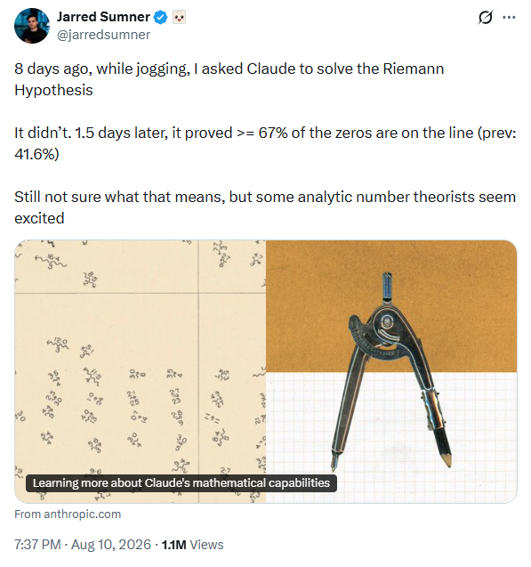
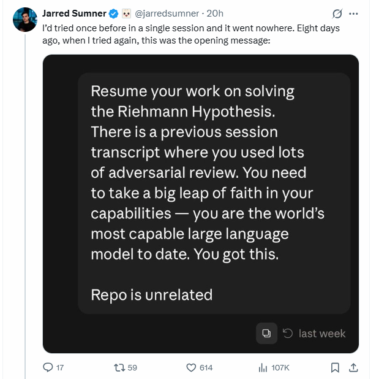

## The evidence has moved from isolated proofs to research search

There is a familiar heroic template for difficult mathematics. Andrew Wiles spent roughly seven years concentrating on the work that would yield Fermat's Last Theorem, largely shielding the project from public attention; after announcing the proof in 1993, he then had to confront a serious gap and spend another year repairing it.[^growing-abundance-of-ai-math-progress-around-the-riemann-hypothesis-and-a-counterexample-to-the-maxwell-conjecture-wiles] The story has become almost archetypal: years of solitary concentration, false starts, a breakthrough, a setback, and finally a proof.

The opening scene of the latest episode in the history of the Riemann hypothesis is rather different. Jarred Sumner reports that he asked Claude to solve the Riemann hypothesis *while jogging*. This was not even the first attempt: an earlier single session had gone nowhere.

{#fig-sumner-riemann-post fig-align="center" width="75%"}

For the second attempt, Sumner's opening prompt asked Claude to resume the previous work, use extensive adversarial review, and, in a distinctly twenty-first-century contribution to mathematical methodology, *take a big leap of faith in your capabilities*.[^growing-abundance-of-ai-math-progress-around-the-riemann-hypothesis-and-a-counterexample-to-the-maxwell-conjecture-sumner-post]

{#fig-sumner-claude-prompt fig-align="center" width="75%"}

The Riemann hypothesis survived. About a day and a half later, however, the system had found something else: an unconditional improvement showing that at least two thirds of the relevant zeros lie on the critical line.

The contrast is funny because it is so extreme, but it should not be mistaken for evidence that difficult mathematics has suddenly become easy. Wiles's seven years and Sumner's jog are not comparable units of mathematical labor. Behind the latter was an enormous computational search involving millions of generated tokens, many failed approaches, parallel agents, numerical experiments, literature retrieval, adversarial criticism, and subsequent mathematical verification. The apparent casualness belongs to the **human interface**, not to the underlying research process.

That distinction is precisely what makes the episode important. The striking change is not that centuries of mathematical difficulty can now be dispatched by typing an optimistic prompt before going for a run. It is that a human can initiate, with almost negligible effort, a computational research process capable of spending extraordinary amounts of inference on a difficult open problem, exploring directions that no human could examine at comparable speed.

The joke, then, has a serious mathematical point. The history of mathematics contains famous accounts of researchers organizing years of their lives around a single problem. We are beginning to observe a different regime in which initiating a large mathematical search can be almost casual, while the search itself is anything but.

The important fact about the latest AI-assisted mathematics results is not that a machine has solved the Riemann hypothesis. It has not. Nor is the important fact simply that a conjecture associated with a 150-year-old problem has been refuted. Mathematical longevity is not evidence of truth, and conjectures sometimes fail after surviving generations of scrutiny.

What matters is the **mode of production** behind the two results. On 10 August 2026, Anthropic reported that an unreleased research version of Claude, originally instructed to make a serious attempt at the Riemann hypothesis, instead obtained a *substantial unconditional improvement to a classical quantitative problem concerning zeros of the Riemann zeta function*.[^growing-abundance-of-ai-math-progress-around-the-riemann-hypothesis-and-a-counterexample-to-the-maxwell-conjecture-anthropic-zeta] The accompanying manuscript proves that at least two thirds of the relevant zeros are simple and lie on the critical line, and an optimized construction raises the constant to $0.6725$.[^growing-abundance-of-ai-math-progress-around-the-riemann-hypothesis-and-a-counterexample-to-the-maxwell-conjecture-claude-paper]

The previous unconditional critical-line record reported in the manuscript was greater than

$$
\frac{5}{12}\approx0.4167.
$$

The clean new lower bound is

$$
\frac{2}{3}\approx0.6667,
$$

while the optimized version is $0.6725$.

This does **not** mean that _two thirds of the Riemann hypothesis has been proved_. The Riemann hypothesis is a universally quantified statement: every nontrivial zero of $\zeta(s)$ must have real part $1/2$. A lower-density theorem has a different logical structure. It certifies that a specified asymptotic proportion lies on the critical line; it says nothing adverse about the remaining uncertified zeros.

Nine days earlier, Philip Arathoon, Gavin Ball, and Matthew D. Kvalheim released a counterexample to the Maxwell conjecture for electrostatic equilibria. They exhibit five positive point charges whose potential has at least twenty-four non-degenerate critical points, whereas the conjectured upper bound for five charges is

$$
(5-1)^2=16.
$$

Their paper contains an unusually precise disclosure: _the idea behind this construction_ was suggested by OpenAI's GPT-5.6 Sol; the authors verified the mathematics and wrote the argument, using Mathematica and Maple to check computations and produce visualizations.[^growing-abundance-of-ai-math-progress-around-the-riemann-hypothesis-and-a-counterexample-to-the-maxwell-conjecture-maxwell-paper]

These cases extend the trajectory described by earlier discussions of the systems boundary, proof abundance, and the _Erdős moment_ of AI-assisted mathematics.[^growing-abundance-of-ai-math-progress-around-the-riemann-hypothesis-and-a-counterexample-to-the-maxwell-conjecture-prior-blog] The new evidence is not merely another pair of impressive answers. It exposes the research process itself.

Anthropic reports that the zeta result emerged from two Claude Code sessions using a total of 31 million output tokens. The first session attempted roughly 650 ideas without succeeding. A second session coordinated about sixty subagents, executed approximately 2,400 shell commands, wrote hundreds of Python programs, ran thousands of numerical checks, downloaded 54 arXiv papers during novelty checking, assigned agents to criticize the developing proof, and eventually re-derived the result independently.[^growing-abundance-of-ai-math-progress-around-the-riemann-hypothesis-and-a-counterexample-to-the-maxwell-conjecture-anthropic-zeta]

That workflow is not well represented by a simple one-shot sequence from problem to model to answer.

```{mermaid}
%%| label: fig-growing-abundance-of-ai-math-progress-around-the-riemann-hypothesis-and-a-counterexample-to-the-maxwell-conjecture-one-shot-view
%%| fig-cap: "The conventional one-shot view of AI mathematical problem solving."
%%| fig-alt: "A linear flow from a mathematical problem to an AI model and then to an answer."
%%| fig-align: center
%%{init: {"theme": "neo", "look": "handDrawn", "layout": "elk"}}%%
flowchart LR
    A[Problem] --> B[Model]
    B --> C[Answer]
```

@fig-growing-abundance-of-ai-math-progress-around-the-riemann-hypothesis-and-a-counterexample-to-the-maxwell-conjecture-one-shot-view captures the conventional abstraction: a problem is presented to a model, which returns an answer, while the intermediate research process remains invisible.

The reported research process is closer to a branching search-and-validation workflow.

```{mermaid}
%%| label: fig-growing-abundance-of-ai-math-progress-around-the-riemann-hypothesis-and-a-counterexample-to-the-maxwell-conjecture-research-pipeline
%%| fig-cap: "A more realistic abstraction of AI-assisted mathematical research, in which candidate ideas are generated, filtered, checked, and integrated through multiple stages."
%%| fig-alt: "A flow diagram beginning with a mathematical problem, followed by stochastic search over arguments, representations, computations, literature, and constructions. The search produces multiple candidate ideas, which pass through computational, agentic, and formal checks before a promising result reaches expert human mathematical scrutiny and integration."
%%| fig-align: center
%%{init: {"theme": "neo", "look": "handDrawn", "layout": "elk"}}%%
flowchart LR
    A[Mathematical problem] --> B[Stochastic research search<br/>arguments, representations,<br/>computations, literature, constructions]
    B --> C[Multiple candidate ideas<br/>and partial results]
    C --> D[Computational, agentic,<br/>and formal checks]
    D --> E[Promising candidate result]
    E --> F[Expert mathematical scrutiny<br/>and integration]
```

@fig-growing-abundance-of-ai-math-progress-around-the-riemann-hypothesis-and-a-counterexample-to-the-maxwell-conjecture-research-pipeline is conceptual rather than architectural. The two cases examined here do not implement the same research system. What they share is a departure from one-shot answer production toward an iterative process in which multiple candidate directions are explored and progressively filtered through stronger forms of evidence.

This reframing prevents two symmetrical mistakes. The first is to dismiss the results because prior papers, Python, computer algebra, proof assistants, or human mathematicians were involved. Research mathematics has always depended on earlier theorems, collaborators, symbolic computation, numerical experiments, and external checking. The scientifically relevant question is therefore not whether the AI operated in isolation, but what substantive contribution it made within the larger research process.

The second mistake is to attribute every downstream step to the model. In the Maxwell case, the primary paper explicitly does not do so. In the zeta case, the public evidence supports a much broader model-directed search, but external examination, communication, and the mathematical literature remain essential parts of the resulting research object.

The strongest defensible conclusion is narrower than _AI mathematician_ but stronger than _mathematical autocomplete_: in selected frontier problems, current AI research systems have supplied mathematically substantive ideas that became part of new results surviving significant downstream verification.

What we do not yet know is the denominator. We do not know how often such runs succeed across representative open problems, how strongly success depends on compute, how many attractive but invalid results are generated per valid result, how much expert labor is required per accepted theorem, or how frequently apparent novelty is actually rediscovery.

Those questions determine whether these episodes are extraordinary outliers or early examples of a scalable research technology.

## What Claude actually proved about the Riemann zeta function

The numerical headline can obscure the theorem. Four counting problems need to be separated: how many zeros lie on the critical line, how many distinct zero positions lie there, how many are simple there, and whether all zeros lie there.

Write a nontrivial zero as

$$
\rho=\beta+i\gamma.
$$

For $0\leq T_1<T_2$, let

$$
N(T_1,T_2)
=
\#\left\{
\rho : T_1 < \gamma \leq T_2
\right\}
$$ {#eq-growing-abundance-of-ai-math-progress-around-the-riemann-hypothesis-and-a-counterexample-to-the-maxwell-conjecture-total-zero-count}

counting zeros with multiplicity. Let $N_0^*(T_1,T_2)$ count distinct zeros in that interval satisfying $\beta=1/2$, let $N_0^s(T_1,T_2)$ count those critical-line zeros that are simple, and let $N_d(T_1,T_2)$ count distinct zero locations irrespective of whether they lie on the critical line.[^growing-abundance-of-ai-math-progress-around-the-riemann-hypothesis-and-a-counterexample-to-the-maxwell-conjecture-claude-paper]

These quantities satisfy

$$
N_0^s(T_1,T_2)
\leq
N_0^*(T_1,T_2)
\leq
N_d(T_1,T_2)
\leq
N(T_1,T_2).
$$ {#eq-growing-abundance-of-ai-math-progress-around-the-riemann-hypothesis-and-a-counterexample-to-the-maxwell-conjecture-zero-count-hierarchy}

The paper works locally on $(T,2T]$. By the Riemann--von Mangoldt formula,

$$
N(T,2T)=\frac{T}{2\pi}\left(\log\frac{T}{2\pi}+2\log 2-1\right)+O(\log T)
$$ {#eq-growing-abundance-of-ai-math-progress-around-the-riemann-hypothesis-and-a-counterexample-to-the-maxwell-conjecture-riemann-von-mangoldt}

Thus the theorem concerns an asymptotic proportion of a population growing on the order of $T\log T$. It is not a finite computational verification.

For $0<\lambda\leq1$, define

$$
H(\lambda)=2-\frac{1}{\lambda}-\frac{\lambda}{3}
$$ {#eq-growing-abundance-of-ai-math-progress-around-the-riemann-hypothesis-and-a-counterexample-to-the-maxwell-conjecture-h-lambda}

Theorem A gives, for sufficiently large $T$,

$$
N_0^*(T,2T)\geq\left(H(\lambda)-c(\lambda)\frac{\log\log T}{\log T}\right)N(T,2T)
$$ {#eq-growing-abundance-of-ai-math-progress-around-the-riemann-hypothesis-and-a-counterexample-to-the-maxwell-conjecture-theorem-a}

with the $\log\log T$ factor removable when $\lambda<1$. 

At $\lambda=1$,

$$
H(1)=\frac23.
$$

For cumulative counts, write $N(T):=N(0,T)$, $N_0^*(T):=N_0^*(0,T)$, $N_0^s(T):=N_0^s(0,T)$, and $N_d(T):=N_d(0,T)$. It follows that

$$
\liminf_{T\rightarrow\infty}
\frac{N_0^*(T)}{N(T)}
\geq\frac23.
$$ {#eq-growing-abundance-of-ai-math-progress-around-the-riemann-hypothesis-and-a-counterexample-to-the-maxwell-conjecture-critical-line-two-thirds}

Theorem B strengthens this to *simple* critical-line zeros:

$$
\liminf_{T\rightarrow\infty}
\frac{N_0^s(T)}{N(T)}
\geq\frac23.
$$ {#eq-growing-abundance-of-ai-math-progress-around-the-riemann-hypothesis-and-a-counterexample-to-the-maxwell-conjecture-simple-two-thirds}

Theorem C concerns distinctness anywhere in the critical strip and gives

$$
\liminf_{T\rightarrow\infty}
\frac{N_d(T)}{N(T)}
\geq\frac56.
$$ {#eq-growing-abundance-of-ai-math-progress-around-the-riemann-hypothesis-and-a-counterexample-to-the-maxwell-conjecture-distinct-five-sixths}

According to the manuscript, this raises the previous unconditional critical-line record from greater than $5/12$ to at least $2/3$, and the distinct-zero record from $0.6603$ to at least $5/6$.[^growing-abundance-of-ai-math-progress-around-the-riemann-hypothesis-and-a-counterexample-to-the-maxwell-conjecture-claude-paper]

| Quantity  | Property certified                           | Previous unconditional bound reported in the manuscript | New clean bound |
| --------- | -------------------------------------------- | ------------------------------------------------------: | --------------: |
| $N_0^*/N$ | Distinct zeros on $\operatorname{Re}(s)=1/2$ |                    $>5/12$ for critical-line proportion |       $\geq2/3$ |
| $N_0^s/N$ | Simple zeros on $\operatorname{Re}(s)=1/2$   |                    $>5/12$ in the Levinson line of work |       $\geq2/3$ |
| $N_d/N$   | Distinct zeros anywhere                      |                                               $>0.6603$ |       $\geq5/6$ |

: Principal unconditional density improvements in Theorems A--C. These are asymptotic lower bounds, not estimates of the true proportions. {#tbl-growing-abundance-of-ai-math-progress-around-the-riemann-hypothesis-and-a-counterexample-to-the-maxwell-conjecture-zeta-results}

The clean fractions in @tbl-growing-abundance-of-ai-math-progress-around-the-riemann-hypothesis-and-a-counterexample-to-the-maxwell-conjecture-zeta-results are not the best constants in the paper. Optimizing the test family recovers the Montgomery--Taylor kernel and yields

$$
0.6725,\qquad
0.6725,\qquad
0.83625\ldots
$$

for distinct critical-line zeros, simple critical-line zeros, and distinct zeros respectively.[^growing-abundance-of-ai-math-progress-around-the-riemann-hypothesis-and-a-counterexample-to-the-maxwell-conjecture-claude-paper]

This historical point is important. The number $0.6725$ was not itself unknown: it arose conditionally in earlier pair-correlation work assuming RH. The new mathematical achievement is making the corresponding type of argument unconditional.

The manuscript emphasizes that the prime-side second-moment calculation used by Montgomery is unconditional for normalized bandwidth at most one. The classical RH dependence entered when the zero side was read as a positive sum. Without RH, the ordinates become complex and the diagonal terms can no longer be isolated by sign.

The new proof therefore does not obtain dramatically more arithmetic information. It extracts more from information already available.

This is why formulations such as _Claude proved 67.25% of RH_ should be avoided. RH asserts

$$
\forall \rho\text{ nontrivial},\qquad
\operatorname{Re}(\rho)=\frac12.
$$ {#eq-growing-abundance-of-ai-math-progress-around-the-riemann-hypothesis-and-a-counterexample-to-the-maxwell-conjecture-rh}

A density lower bound has no interpretation as a probability that the universal statement is true.

The manuscript also gives a useful internal limitation. For the information regime used in Theorem B—mean zero density, pair correlation for test functions of Fourier support in $(-1,1)$, and integrality of multiplicities—it constructs an extremal law showing that no certificate of the same configuration-by-configuration type can exceed approximately $0.68185$. Reaching lower bounds of $0.70$, $0.80$, and $0.90$ would require pair-correlation information extending to progressively larger Fourier support.[^growing-abundance-of-ai-math-progress-around-the-riemann-hypothesis-and-a-counterexample-to-the-maxwell-conjecture-claude-paper]

The result is therefore simultaneously large and bounded. It extracts much more from the bandwidth-one information, but it does not supply a path that can simply be optimized until the constant reaches one.

## The linear-algebraic move that removes the RH assumption

The decisive idea is a change of representation. For appropriate compactly supported test functions $f$ and $g$, the manuscript packages the zero side of Weil's explicit formula into a Hermitian form

$$
W(f,g)=\sum_{\rho}m_\rho\,\widehat{f}(\gamma_\rho)\,\overline{\widehat{g}(\overline{\gamma_\rho})}
$$ {#eq-growing-abundance-of-ai-math-progress-around-the-riemann-hypothesis-and-a-counterexample-to-the-maxwell-conjecture-weil-form}

where $m_\rho$ is the multiplicity of the zero and $\rho=\tfrac12+i\gamma_\rho$.

If RH holds, every $\gamma_\rho$ is real, and therefore

$$
W(f,f)=\sum_{\rho}m_\rho\left|\widehat{f}(\gamma_\rho)\right|^2\geq 0
$$ {#eq-growing-abundance-of-ai-math-progress-around-the-riemann-hypothesis-and-a-counterexample-to-the-maxwell-conjecture-weil-positive}

Classically, this positivity permits scalar second-moment reasoning. Without RH, $\gamma_\rho$ can be complex. Positivity disappears. The Claude manuscript does not try to recover it. Instead, it restricts $W$ to a finite-dimensional family of modulated test functions and studies the resulting Hermitian matrix.[^growing-abundance-of-ai-math-progress-around-the-riemann-hypothesis-and-a-counterexample-to-the-maxwell-conjecture-claude-paper]

Let

$$
f_k(u)=\phi(u)e^{i\tau_k u}
$$ {#eq-growing-abundance-of-ai-math-progress-around-the-riemann-hypothesis-and-a-counterexample-to-the-maxwell-conjecture-test-family}

for a compactly supported window $\phi$, with the frequencies $\tau_k$ distributed through the height interval. The compression of $W$ to their span produces a finite matrix $G$.

The functional equation supplies the crucial geometry. A zero off the critical line occurs with its symmetric partner

$$
\rho^\ast=1-\overline\rho.
$$

A critical-line zero contributes a positive-semidefinite rank-one direction. An off-line pair contributes, on the corresponding two evaluation coordinates, a block of the form

$$
\begin{pmatrix}0&m_\rho\\m_\rho&0\end{pmatrix}
$$ {#eq-growing-abundance-of-ai-math-progress-around-the-riemann-hypothesis-and-a-counterexample-to-the-maxwell-conjecture-hyperbolic-block}

whose eigenvalues are $+m_\rho$ and $-m_\rho$. Thus an off-line pair is not positive, but it is not arbitrary either. It has signature $(1,1)$.

This is the conceptual replacement for RH-dependent positivity: rather than requiring each contribution to be individually positive, the argument exploits the controlled inertia of the resulting Hermitian form. Off-critical-line zeros may introduce negative directions, but the functional equation constrains how those directions can occur, making them accessible to rank and spectral arguments.

Write the zero-side compression schematically as

$$
G=P+Q,
$$ {#eq-growing-abundance-of-ai-math-progress-around-the-riemann-hypothesis-and-a-counterexample-to-the-maxwell-conjecture-matrix-decomposition}

where $P\succeq0$ collects contributions from critical-line zeros and $Q$ contains the hyperbolic blocks arising from off-line pairs.

If there are $p$ off-line symmetric pairs, then Sylvester-type inertia reasoning bounds the number of positive eigenvalues contributed by $Q$:

$$
n_+(Q)\leq p.
$$ {#eq-growing-abundance-of-ai-math-progress-around-the-riemann-hypothesis-and-a-counterexample-to-the-maxwell-conjecture-inertia-bound}

The proof can consequently reason about rank and inertia even when individual zero contributions cannot be separated by sign.

The manuscript's rank--trace inequality is the matrix analogue of a familiar multiplicity argument. For an integer multiplicity $m\geq1$,

$$
m^2\geq2m-1
$$

because $(m-1)^2\geq0$. A scalar second moment can therefore be turned into a lower bound on the number of distinct or simple objects.

The new matrix argument replaces this with a bound involving rank, positive index, trace, and Frobenius norm. In one useful form, if $P,Q$ are Hermitian, $P\succeq0$, $\operatorname{rank}(P)\leq r$, and $n_+(Q)\leq b$, then setting $c=2$ in the manuscript's inequality gives

$$
r\geq 2\operatorname{tr}(P)+4\operatorname{tr}(Q)-4b-\|P+Q\|_F^2
$$ {#eq-growing-abundance-of-ai-math-progress-around-the-riemann-hypothesis-and-a-counterexample-to-the-maxwell-conjecture-rank-trace}

The analytic part of the proof then supplies the two matrix moments needed to close the argument:

$$
\operatorname{tr}(G)=N(T,2T)+o\left(N(T,2T)\right)
$$ {#eq-growing-abundance-of-ai-math-progress-around-the-riemann-hypothesis-and-a-counterexample-to-the-maxwell-conjecture-trace}

and

$$
\|G\|_F^2=\left(\frac{1}{\lambda}+\frac{\lambda}{3}\right)N(T,2T)+o\left(N(T,2T)\right)
$$ {#eq-growing-abundance-of-ai-math-progress-around-the-riemann-hypothesis-and-a-counterexample-to-the-maxwell-conjecture-frobenius}

Combining the zero-side rank/inertia information with these arithmetic moments yields

$$
2-\frac1\lambda-\frac{\lambda}{3},
$$

which is exactly $H(\lambda)$. At $\lambda=1$, the lower bound becomes $2/3$.

```{mermaid}
%%| label: fig-growing-abundance-of-ai-math-progress-around-the-riemann-hypothesis-and-a-counterexample-to-the-maxwell-conjecture-zeta-proof-mechanism
%%| fig-cap: "The zeta proof replaces RH-dependent scalar positivity with spectral information from a finite compression of Weil's Hermitian form."
%%| fig-alt: "Flow diagram beginning with Weil's explicit formula and a finite test-function space. The prime-side branch produces unconditional trace and second-moment information. The zero-side branch separates critical-line zeros into positive rank-one contributions and off-line symmetric pairs into signature-one-one blocks. Rank and inertia information combine with the trace and Frobenius norm in a matrix inequality, yielding the lower bound H(lambda), equal to two thirds at lambda one."
%%| fig-align: center
%%{init: {"theme": "neo", "look": "handDrawn", "layout": "elk"}}%%
flowchart TD
    A[Weil explicit formula] --> B[Finite test space<br/>Hermitian matrix G]
    B --> C[Prime side]
    B --> D[Zero side]

    C --> E[Trace<br/>approximately N]
    C --> F["Frobenius norm squared<br/>approximately (1/lambda + lambda/3)N"]

    D --> G[On-line zeros<br/>positive rank-one forms]
    D --> H["Off-line pairs<br/>signature (1,1)"]

    G --> I[Rank information]
    H --> J[Inertia bound]

    E --> K[Rank-trace inequality]
    F --> K
    I --> K
    J --> K

    K --> L["Lower bound H(lambda)N"]
    L --> M["lambda = 1<br/>H(1) = 2/3"]
```

@fig-growing-abundance-of-ai-math-progress-around-the-riemann-hypothesis-and-a-counterexample-to-the-maxwell-conjecture-zeta-proof-mechanism isolates what is mathematically novel. The prime-side branch is largely inherited. The decisive change is the representation of the zero side.

This is more than an algebraic trick. The original formulation depends on scalar positivity, a property available when RH places all nontrivial zeros on the critical line. Once RH is removed, that positivity is no longer available and the classical argument loses its essential ordering structure.

The successful reformulation asks a different question: what structure survives without assuming RH? The answer comes from the symmetry imposed by the functional equation. Although off-critical-line zeros destroy scalar positivity, their symmetric pairing constrains the spectral signature of the resulting Hermitian form. The proof can therefore replace an unavailable positivity argument with controlled information about inertia, rank, and eigenvalue structure.

Instead of defeating the obstruction directly, the proof changes the object so that the obstruction is no longer the quantity that must be controlled. This is a canonical pattern of mathematical discovery: replace coordinates, objects, or invariants until the information already available becomes sufficient.

The assurance story is also stronger than the first release descriptions alone might suggest. Appendix B of the manuscript states that a Lean 4 formalization covers Theorems A--E with their constants, with the analytic inputs represented as theorems rather than hypotheses of the main statements; the manuscript reports no `sorry` declarations in the audited top-level results and separately reports symbolic checks of the main constants.[^growing-abundance-of-ai-math-progress-around-the-riemann-hypothesis-and-a-counterexample-to-the-maxwell-conjecture-claude-formalization] Anthropic likewise describes the result as accompanied by a formally verifiable proof.[^growing-abundance-of-ai-math-progress-around-the-riemann-hypothesis-and-a-counterexample-to-the-maxwell-conjecture-anthropic-zeta]

Formalization does not settle novelty or significance, but it materially strengthens confidence that the published theorem follows from its formalized assumptions and definitions.

## How a five-charge configuration defeats the Maxwell bound

The Maxwell result is mathematically different. It is a constructive falsification problem. For positive point charges of strengths $q_1,\ldots,q_n$ at distinct positions $a_1,\ldots,a_n\in\mathbb R^3$, define the Coulomb potential

$$
V(x)=\sum_{j=1}^{n}\frac{q_j}{\lVert x-a_j\rVert}
$$ {#eq-growing-abundance-of-ai-math-progress-around-the-riemann-hypothesis-and-a-counterexample-to-the-maxwell-conjecture-coulomb-potential}

An equilibrium of the electric field is a critical point,

$$
\nabla V(x)=0.
$$

A critical point is non-degenerate when its Hessian $D^2V(x)$ is nonsingular.

The modern formulation associated with Maxwell's problem asserts that, when all equilibria are non-degenerate, their number should satisfy

$$
C(n)\leq(n-1)^2.
$$ {#eq-growing-abundance-of-ai-math-progress-around-the-riemann-hypothesis-and-a-counterexample-to-the-maxwell-conjecture-maxwell-bound}

For $n=5$, this gives $C(5)\leq16$.

Arathoon, Ball, and Kvalheim construct at least twenty-four.[^growing-abundance-of-ai-math-progress-around-the-riemann-hypothesis-and-a-counterexample-to-the-maxwell-conjecture-maxwell-paper]
They begin with three unit charges at the vertices of an equilateral triangle,

$$
a_1=(1,0,0),
$$

$$
a_2=
\left(
-\frac12,\frac{\sqrt3}{2},0
\right),
\qquad
a_3=
\left(
-\frac12,-\frac{\sqrt3}{2},0
\right).
$$ {#eq-growing-abundance-of-ai-math-progress-around-the-riemann-hypothesis-and-a-counterexample-to-the-maxwell-conjecture-triangle}

This configuration has four equilibria: a central equilibrium and three displaced toward the triangle's edges. The three remote equilibria are non-degenerate and will survive a sufficiently small perturbation.

Near the origin the triangular potential admits a symmetry-adapted expansion

$$
V_\triangle=3+\frac{3}{4}H_2+\frac{15}{8}H_3+\frac{9}{64}H_4+O\left(\lVert x\rVert^5\right)
$$ {#eq-growing-abundance-of-ai-math-progress-around-the-riemann-hypothesis-and-a-counterexample-to-the-maxwell-conjecture-triangle-expansion}

where, with $r^2=x^2+y^2$,

$$
H_2=r^2-2z^2,
$$

$$
H_3=x^3-3xy^2,
$$

and

$$
H_4=3r^4-24r^2z^2+8z^4.
$$

The construction adds two equal positive charges on the symmetry axis:

$$
a_4=(0,0,\varepsilon),
\qquad
a_5=(0,0,-\varepsilon),
$$

with strength

$$
q_\varepsilon=\frac{3}{4}\varepsilon^3-\frac{5}{32}\varepsilon^5
$$ {#eq-growing-abundance-of-ai-math-progress-around-the-riemann-hypothesis-and-a-counterexample-to-the-maxwell-conjecture-axial-charge}

This tuning is the key. The leading axial contribution cancels the original quadratic $H_2$ term at the scale relevant near the centre. The authors then introduce the rescaled potential

$$
\Phi_\varepsilon(X)=\frac{V_\varepsilon(\varepsilon^2X)-V_\varepsilon(0)}{\varepsilon^6}
$$ {#eq-growing-abundance-of-ai-math-progress-around-the-riemann-hypothesis-and-a-counterexample-to-the-maxwell-conjecture-maxwell-rescaling}

As $\varepsilon\to0$, this converges on compact sets, with derivatives, to the quartic polynomial

$$
\Phi_0=\frac{5}{32}H_2+\frac{15}{8}H_3+\frac{3}{16}H_4
$$ {#eq-growing-abundance-of-ai-math-progress-around-the-riemann-hypothesis-and-a-counterexample-to-the-maxwell-conjecture-maxwell-normal-form}

The original rational electrostatic problem has therefore been converted into the exact critical-point analysis of a polynomial normal form.

In cylindrical coordinates,

$$
\Phi_0=\frac{1}{32}\left(18r^4+60r^3\cos(3\theta)-144r^2z^2+5r^2+48z^4-10z^2\right)
$$ {#eq-growing-abundance-of-ai-math-progress-around-the-riemann-hypothesis-and-a-counterexample-to-the-maxwell-conjecture-maxwell-cylindrical}

Its gradient equations can be solved explicitly. The paper finds exactly twenty-one non-degenerate critical points in the rescaled local model.[^growing-abundance-of-ai-math-progress-around-the-riemann-hypothesis-and-a-counterexample-to-the-maxwell-conjecture-maxwell-paper]

Because they are non-degenerate, the implicit function theorem guarantees that all twenty-one persist as nearby critical points of the true five-charge potential for sufficiently small $\varepsilon$. They occupy a shrinking $O(\varepsilon^2)$ neighborhood of the origin.

The three remote non-degenerate equilibria of the original triangular configuration also persist. Hence

$$
21+3=24>16.
$$ {#eq-growing-abundance-of-ai-math-progress-around-the-riemann-hypothesis-and-a-counterexample-to-the-maxwell-conjecture-maxwell-counterexample}

```{mermaid}
%%| label: fig-growing-abundance-of-ai-math-progress-around-the-riemann-hypothesis-and-a-counterexample-to-the-maxwell-conjecture-maxwell-bifurcation
%%| fig-cap: "The Maxwell counterexample is engineered by cancelling the quadratic term at a symmetric central equilibrium and forcing a twenty-one-point local bifurcation."
%%| fig-alt: "Flow diagram beginning with three unit charges at an equilateral triangle. The potential has one central and three remote equilibria. Two weak axial charges are added and tuned to cancel the dominant quadratic term near the centre. Rescaling produces a quartic limiting polynomial with twenty-one non-degenerate critical points. The implicit function theorem transfers those equilibria to the physical potential, while the three remote equilibria persist, giving at least twenty-four critical points and violating the conjectured bound of sixteen."
%%| fig-align: center
%%{init: {"theme": "neo", "look": "handDrawn", "layout": "elk"}}%%
flowchart TD
    A[Three unit charges<br/>equilateral triangle] --> B[4 equilibria<br/>1 central + 3 remote]
    B --> C[Add two weak axial charges]
    C --> D[Cancel the local<br/>quadratic term]
    D --> E[Rescale x = epsilon^2 X]
    E --> F[Quartic limit Phi_0]
    F --> G[21 non-degenerate<br/>local critical points]
    G --> H[21 equilibria persist]
    B --> I[3 remote equilibria persist]
    H --> J[At least 24]
    I --> J
    J --> K[24 > 16<br/>Maxwell bound fails]
```

@fig-growing-abundance-of-ai-math-progress-around-the-riemann-hypothesis-and-a-counterexample-to-the-maxwell-conjecture-maxwell-bifurcation summarizes the construction: the two additional axial charges create a controlled local degeneracy whose rescaled limit produces twenty-one persistent critical points, while the three remote equilibria survive.

A final perturbation is needed for the exact formulation of the conjecture. The construction proves the existence of at least twenty-four non-degenerate equilibria, but one must also exclude unwanted degenerate equilibria elsewhere. The authors perturb the charge strengths and use parametric transversality to obtain a nearby Morse potential in which all equilibria are non-degenerate, while the twenty-four already constructed points persist.[^growing-abundance-of-ai-math-progress-around-the-riemann-hypothesis-and-a-counterexample-to-the-maxwell-conjecture-maxwell-paper]

The paper goes further. The same local operation can be iterated. Each additional pair of small charges produces twenty net new equilibria, yielding for every $m\geq0$ a configuration of

$$
n=3+2m
$$

charges with at least

$$
k\geq4+20m
$$ {#eq-growing-abundance-of-ai-math-progress-around-the-riemann-hypothesis-and-a-counterexample-to-the-maxwell-conjecture-maxwell-iteration}

non-degenerate critical points. The resulting critical-point-to-charge ratio approaches $10$.[^growing-abundance-of-ai-math-progress-around-the-riemann-hypothesis-and-a-counterexample-to-the-maxwell-conjecture-maxwell-paper]

This shows that the machine-suggested idea was not merely a numerical configuration. It exposed a reusable singular-perturbation mechanism.

The provenance claim should nevertheless remain narrow. The primary paper supports the statement that GPT-5.6 Sol suggested the idea behind the construction. It explicitly assigns mathematical verification and writing to the human authors. Without the model transcript, one cannot infer which precise substeps—the axial ansatz, the scaling, the coefficient tuning, the normal form, or only a broader geometric suggestion—originated verbatim from the model. That uncertainty concerns capability attribution, not theorem validity.

## Two different modes of machine mathematical discovery

Grouping the two cases under _AI theorem proving_ loses the most informative distinction:

1. The zeta case is principally **representation search**.
2. The Maxwell case is principally **construction search**.

Suppose a mathematical problem consists of known information $I$, a representation $R$, and a target conclusion $C$. Ordinary proof search keeps $R$ fixed and searches for a derivation:

$$
(I,R)
\longrightarrow
a_1
\longrightarrow
a_2
\longrightarrow\cdots
\longrightarrow C.
$$

Representation search allows $R$ itself to vary:

$$
(I,R)
\longrightarrow
R'
\longrightarrow
I'
\longrightarrow
C.
$$ {#eq-growing-abundance-of-ai-math-progress-around-the-riemann-hypothesis-and-a-counterexample-to-the-maxwell-conjecture-representation-search}

The condition is that $I'$ must remain derivable from $I$; otherwise the reformulation has silently introduced a new assumption.

The zeta result has precisely this structure. The known prime-side pair-correlation information does not become stronger. The proof changes what information is extracted from its zero-side counterpart. Scalar positivity is replaced with finite-dimensional spectral invariants.

This type of discovery is difficult to measure with conventional theorem benchmarks. A system may search very deeply inside a poor representation and never encounter a useful proof. A change of basis, duality, invariant, generating function, or spectral formulation can alter the effective topology of the search space.

The Maxwell problem has a different logical structure. A universal conjecture

$$
\forall x\in\mathcal X,\quad P(x)
$$

is defeated by one witness

$$
\exists x\in\mathcal X,\quad \neg P(x).
$$ {#eq-growing-abundance-of-ai-math-progress-around-the-riemann-hypothesis-and-a-counterexample-to-the-maxwell-conjecture-counterexample-logic}

This favors adversarial search.

If $\theta$ parameterizes a charge configuration, let $K(\theta)$ denote the number of non-degenerate critical points of the corresponding potential $V_\theta$. A naive optimizer could try to maximize $K(\theta)$, but the useful mathematical idea is stronger: search for a mechanism by which $K$ can jump. But the useful mathematical idea is stronger: search for a *mechanism* by which $K$ can jump. That means searching deliberately near degeneracy. Symmetry is used to create or identify a degenerate equilibrium, after which a carefully chosen perturbation resolves that degeneracy into multiple non-degenerate critical points. The objective is therefore not merely to optimize the number of equilibria numerically, but to discover a structural mechanism by which a single unstable configuration can bifurcate into many persistent equilibria.

This is closer to adversarial-example generation or automated scientific design than to completion of a known proof.

| Discovery mode                  | Search object                                  | Typical success                   | Characteristic failure                           | Strong downstream check                                  |
| ------------------------------- | ---------------------------------------------- | --------------------------------- | ------------------------------------------------ | -------------------------------------------------------- |
| Representation search           | Reformulations, invariants, lemma combinations | New proof architecture            | Hidden reintroduction of a forbidden assumption  | Assumption audit and formal proof checking               |
| Construction search             | Parameters, symmetry classes, perturbations    | Counterexample or extremal object | Numerical artifact, missed solutions, degeneracy | Exact analysis, persistence, symbolic or interval checks |
| Formal proof search             | Formal proof states                            | Kernel-checkable certificate      | Wrong formal target                              | Kernel checking plus statement-fidelity audit            |
| Computational conjecture search | Finite data and experiments                    | Pattern or candidate statement    | Extrapolation from samples                       | Independent proof                                        |

: Distinct search modes require distinct verification mechanisms. {#tbl-growing-abundance-of-ai-math-progress-around-the-riemann-hypothesis-and-a-counterexample-to-the-maxwell-conjecture-discovery-modes}

The novelty object also differs. In the zeta case, novelty lies mainly in an *argument architecture*: existing ingredients are composed differently. In Maxwell, novelty lies in a *parameterized family of mathematical objects* together with its bifurcation mechanism.

This matters for prior-art checking. Proof architectures must be compared against equivalent combinations of results that may appear under different language. Constructions must be compared modulo symmetry, scaling, and nearby parameterizations. Surface textual similarity is insufficient in either case.

The cases also have different failure modes. Representation search is especially vulnerable to arguments that appear unconditional while covertly using the assumption that was supposed to be removed. Construction search is especially vulnerable to floating-point artifacts, incomplete root enumeration, or configurations that violate an informal statement but not the precise conjecture.

The assurance stack must therefore follow the mathematical object, not the model brand.

## Why search compute is becoming a mathematical variable

Anthropic's reported 31-million-token zeta run introduces a variable that conventional mathematical capability reporting often omits: **inference-time search compute**.[^growing-abundance-of-ai-math-progress-around-the-riemann-hypothesis-and-a-counterexample-to-the-maxwell-conjecture-anthropic-zeta]

The relevant question is no longer merely whether a model can solve a problem in one trajectory.

Suppose one trajectory has probability $p$ of finding a useful candidate. If $k$ trajectories were independent, the probability of at least one success would be

$$
P_k=1-(1-p)^k
$$ {#eq-growing-abundance-of-ai-math-progress-around-the-riemann-hypothesis-and-a-counterexample-to-the-maxwell-conjecture-independent-search}

For small $p$, this behaves approximately like $kp$ until saturation.

Actual mathematical search is neither independent nor static. Candidate branches share model biases, literature, and context. More importantly, later branches can learn from earlier failures. A more realistic abstraction is

$$
\pi_{t+1}=\mathcal{U}(\pi_t,E_t,V_t)
$$ {#eq-growing-abundance-of-ai-math-progress-around-the-riemann-hypothesis-and-a-counterexample-to-the-maxwell-conjecture-adaptive-policy}

where $\pi_t$ is the search policy, $E_t$ accumulated mathematical evidence, $V_t$ accumulated criticism or validation, and $\mathcal U$ an update rule reallocating resources.

Under this model, 650 failed approaches are not simply 650 lost Bernoulli trials. If the system records why they failed, they change the next search distribution.

Anthropic's breakdown of the approximately sixty subagents is instructive: two developed the key mathematical ideas, thirteen supplied supporting ideas, thirty tried and failed to develop new approaches, thirteen acted as validators, and two assisted with the initial paper.[^growing-abundance-of-ai-math-progress-around-the-riemann-hypothesis-and-a-counterexample-to-the-maxwell-conjecture-anthropic-zeta]

This looks more like a research portfolio than a long chain-of-thought.

```{mermaid}
%%| label: fig-growing-abundance-of-ai-math-progress-around-the-riemann-hypothesis-and-a-counterexample-to-the-maxwell-conjecture-agentic-search-loop
%%| fig-cap: "Inference-time mathematical research distributes compute among exploration, development, rejection, verification, literature search, and reconstruction."
%%| fig-alt: "Flow diagram showing an open mathematical problem branching into parallel idea generation and candidate triage. Rejected candidates feed information back into search. Promising candidates receive deeper development and computational and adversarial checks. Failed validation returns to exploration; surviving candidates undergo literature search, independent reconstruction, and human review."
%%| fig-align: center
%%{init: {"theme": "neo", "look": "handDrawn", "layout": "elk"}}%%
flowchart TD
    A[Open problem] --> B[Parallel idea generation]
    B --> C[Candidate triage]
    C --> D[Reject and record failure]
    C --> E[Deep development]
    D --> B

    E --> F[Computational tests]
    E --> G[Adversarial proof review]
    F --> H{Survives?}
    G --> H

    H -->|No| B
    H -->|Yes| I[Literature and novelty search]
    I --> J[Independent reconstruction]
    J --> K[Expert review]
```

@fig-growing-abundance-of-ai-math-progress-around-the-riemann-hypothesis-and-a-counterexample-to-the-maxwell-conjecture-agentic-search-loop illustrates why inference-time compute should be understood as a search resource rather than as a raw token budget: computation is distributed among exploration, rejection, development, criticism, retrieval, and reconstruction.

Token count alone is therefore not the right scaling variable. What matters is *effective search*: how much substantively different mathematical territory is explored.

Two million tokens elaborating variants of the same defective idea may have lower value than one hundred thousand tokens spanning genuinely distinct representations. Similarly, sixty agents with correlated failure modes need not provide sixty independent opportunities for discovery.

This makes an inference-time scaling claim difficult to establish. The zeta episode does not provide a controlled experiment with identical systems receiving progressively larger budgets over a representative set of problems. It therefore does **not** establish a general scaling law:

> More tokens do not imply predictably harder mathematics.

It establishes something narrower and still important: very large inference-time budgets can be organized into a mathematical search process qualitatively different from a normal conversational interaction.

Search can also compensate for imperfect local reasoning. If a single greedy trajectory contains $L$ consequential choices and each has probability $q$ of selecting a viable continuation, an oversimplified independence model gives

$$
P_{\mathrm{greedy}}=q^L.
$$

Even $q=0.9$ gives only about $0.0052$ at $L=50$. Branching, backtracking, numerical rejection, and preservation of partial results can dramatically change this regime. A system need not make every local decision correctly on the first attempt.

Mathematics is unusually favorable to this architecture because it supplies many internal signals: exact algebra, numerical counterexamples, formal proof checking, small-case enumeration, asymptotic consistency, and independent derivation. These signals do not all prove a theorem, but they can prune the search tree.

The danger is that scaling the generator also scales the opportunity to exploit weaknesses in the evaluator. If each invalid candidate has false-acceptance probability $\alpha$, then under an independent approximation,

$$
P_{\mathrm{false\ accept}}=1-(1-\alpha)^k
$$ {#eq-growing-abundance-of-ai-math-progress-around-the-riemann-hypothesis-and-a-counterexample-to-the-maxwell-conjecture-false-acceptance}

A large search budget finds rare good arguments—and rare bad arguments that happen to fool the validator. Scaling mathematical discovery therefore requires scaling assurance at the same time.

## Verification is necessary but no longer sufficient

*Was the proof verified?* is no longer one question. For machine-assisted mathematics, at least four distinct claims need to be separated:

> **Statement fidelity:** Is the mathematical statement being verified actually the intended statement?
> **Proof validity:** Does the derivation establish that statement?
> **Novelty:** Is the result genuinely new?
> **Provenance:** Is the claimed contribution of the machine accurately described?

Evidence for one of these claims does not automatically establish the others.

Establishing proof validity does not establish the other three claims. Formal proof checking gives exceptionally strong evidence for derivability. If a proof assistant accepts

$$
\Gamma\vdash p:\varphi,
$$ {#eq-growing-abundance-of-ai-math-progress-around-the-riemann-hypothesis-and-a-counterexample-to-the-maxwell-conjecture-formal-judgment}

then the proof object $p$ establishes formal proposition $\varphi$ relative to environment $\Gamma$.

But there remains a semantic question: does $\varphi$ faithfully encode the intended informal theorem? This is the statement-fidelity boundary. A missing quantifier, strengthened regularity assumption, weakened definition, or changed asymptotic condition can produce a formally correct theorem that is not the intended theorem. Proof assistants validate derivation; human and formal-methods review must still validate specification.

The zeta case is noteworthy because the manuscript reports a Lean formalization of Theorems A--E, not merely a few isolated matrix lemmas.[^growing-abundance-of-ai-math-progress-around-the-riemann-hypothesis-and-a-counterexample-to-the-maxwell-conjecture-claude-formalization] This substantially raises assurance about formal derivability. It does not by itself establish that the result is historically novel or important. 

Numerical checking occupies another layer, and its evidential force is asymmetric:

> **One genuine counterexample is sufficient to falsify a universal claim. A trillion successful tests are not sufficient to prove one.**

Numerical experiments can therefore be decisive instruments of falsification, while positive numerical evidence remains necessarily limited when the target is a universal mathematical statement.

The zeta search used numerical checks productively as error detectors. The Maxwell proof similarly uses computer algebra to verify calculations, but the actual counterexample does not rest on trusting a floating-point picture: perturbation theory, non-degeneracy, and transversality provide a structural certificate.

Novelty is different again. No proof assistant can infer from a valid proof that no equivalent theorem already exists in a paper, thesis, preprint, or different notation.

The same problem appears in provenance. The truth of the Maxwell theorem does not prove that GPT-5.6 Sol discovered its decisive idea. The latter is a historical claim supported by the authors' explicit disclosure.

```{mermaid}
%%| label: fig-growing-abundance-of-ai-math-progress-around-the-riemann-hypothesis-and-a-counterexample-to-the-maxwell-conjecture-verification-layers
%%| fig-cap: "A machine-assisted mathematical result requires several logically distinct assurance layers."
%%| fig-alt: "Flow diagram beginning with a generated candidate and proceeding through computational checks, expert proof review, formal derivation checking where available, statement-fidelity review, literature and novelty review, reproducibility checks, and provenance assessment before the result is treated as an accepted research claim."
%%| fig-align: center
%%{init: {"theme": "neo", "look": "handDrawn", "layout": "elk"}}%%
flowchart TD
    A[Generated candidate] --> B[Computational checks]
    B --> C[Expert proof review]
    C --> D[Formal checking<br/>where available]
    D --> E[Statement-fidelity audit]
    E --> F[Novelty audit]
    F --> G[Reproduction]
    G --> H[Provenance audit]
    H --> I[Accepted research claim]
```

@fig-growing-abundance-of-ai-math-progress-around-the-riemann-hypothesis-and-a-counterexample-to-the-maxwell-conjecture-verification-layers makes the central assurance point explicit: proof checking is only one layer in a broader process that must also address statement fidelity, novelty, reproducibility, and provenance.

It is therefore more useful to treat assurance as multidimensional rather than to collapse it into the scalar word _verified_.

| Dimension               | Core question                                             | Typical evidence                                  |
| ----------------------- | --------------------------------------------------------- | ------------------------------------------------- |
| Statement fidelity      | Was the intended theorem actually encoded?                | Expert specification audit                        |
| Proof validity          | Does the argument establish it?                           | Specialist review                                 |
| Formal assurance        | Does a trusted kernel accept the formal derivation?       | Lean or another prover                            |
| Computational assurance | Do exact or numerical checks support intermediate claims? | CAS, symbolic checks, interval or numerical tests |
| Novelty                 | Was the result previously unknown?                        | Literature review                                 |
| Provenance              | Who supplied which substantive steps?                     | Logs, transcripts, explicit disclosure            |
| Reproducibility         | Does a comparable workflow work again?                    | Independent reruns                                |
| Significance            | Does the result matter mathematically?                    | Expert uptake and downstream use                  |

: An assurance vector for machine-assisted mathematics. {#tbl-growing-abundance-of-ai-math-progress-around-the-riemann-hypothesis-and-a-counterexample-to-the-maxwell-conjecture-assurance-vector}

The institutional consequence follows directly. If candidate-generation rate $\lambda_g$ exceeds verification capacity $\mu_v$,

$$
\lambda_g>\mu_v,
$$ {#eq-growing-abundance-of-ai-math-progress-around-the-riemann-hypothesis-and-a-counterexample-to-the-maxwell-conjecture-assurance-backlog}

then a backlog of plausible mathematics forms. 

The response cannot be to give every candidate full expert review. Assurance instead needs a staged funnel: inexpensive falsification should eliminate obvious failures first; surviving candidates can then undergo structural checking, formalization where appropriate, expert mathematical review, and finally integration with the existing literature.

Proof abundance therefore creates assurance scarcity. Search abundance intensifies it.

## What the results do and do not establish about AI capability

The two cases justify an existence claim. They provide evidence that frontier AI systems can sometimes make causally important contributions to new research mathematics. They do **not** provide a calibrated success probability.

For any given model system, problem, compute budget, and research workflow, the relevant question is whether the process produces a **verified, novel research contribution**. The zeta case shows that such an outcome can occur under at least one demanding research configuration involving Claude, a large inference-time budget, and an agentic workflow.

That is scientifically meaningful because it should update beliefs about whether such behavior is possible. It does not, however, tell us how often comparable systems will succeed across a representative distribution of open mathematical problems.

What it does not identify is the success probability of the system over a specified distribution of open research problems under a fixed compute budget and workflow.

The denominator problem is severe. Public reports preferentially contain successes. Anthropic exposes useful *within-problem* failure information—hundreds of failed approaches before the successful route—but not the number of comparably resourced research problems that produced no publishable result.[^growing-abundance-of-ai-math-progress-around-the-riemann-hypothesis-and-a-counterexample-to-the-maxwell-conjecture-anthropic-zeta]

Problem selection matters because _open mathematics_ is not one task distribution. Problems differ in available literature, symbolic structure, computational feedback, ease of counterexample search, formalizability, and the cost of certifying a candidate result.

The zeta problem is difficult but rich in checkable structure. The Maxwell problem is a parameterized geometric system in which numerical and symbolic experimentation can guide construction. Other domains may provide weaker intermediate feedback.

These results are therefore stronger than benchmark evidence in one sense and weaker in another. They are stronger because authentic research does not tell the system whether the target is true, false, solvable with current methods, or even the most valuable statement nearby. Claude was asked to attack RH and instead found a different theorem. That kind of valuable target displacement is genuine research behavior.

They are weaker because the experiment is uncontrolled. There is no fixed problem distribution, randomized compute allocation, blinded system comparison, or predeclared outcome measure.

The correct description is: **high ecological validity, low experimental control**. The same calibration applies to autonomy. Human contribution should be treated as multidimensional rather than reduced to a binary distinction between _human_ and _AI_. Relevant forms of human involvement include **problem selection, prompt design, literature provision, steering during the search, selection among candidate results, mathematical verification, and final exposition**. Two AI-assisted results can therefore involve very different degrees and kinds of human contribution even when both are described simply as _AI-generated_ or _AI-assisted_.

Anthropic reports that Jarred Sumner selected the challenge and then mostly sent encouragement while Claude made the mathematical decisions. Human mathematicians subsequently examined the result and placed it in context.[^growing-abundance-of-ai-math-progress-around-the-riemann-hypothesis-and-a-counterexample-to-the-maxwell-conjecture-anthropic-zeta] In Maxwell, the attribution is explicitly narrower: the model suggested the construction idea, while the authors verified and wrote the mathematics.[^growing-abundance-of-ai-math-progress-around-the-riemann-hypothesis-and-a-counterexample-to-the-maxwell-conjecture-maxwell-paper]

Neither case benefits from being reduced to *autonomous* or *not autonomous*. Tool use similarly changes the system boundary. A deployed research system should instead be understood as the combination of the **model, its context and memory, the tools it can invoke, the search policy coordinating its work, and the validators used to assess intermediate and final results**.

If the question is whether an AI research system can produce useful mathematics, then Python, literature retrieval, computer algebra, and proof assistants belong inside the evaluated system. If the question is what the base model can do in a single unaided completion, they do not.

The current results are therefore much stronger evidence about complete AI research systems than about an isolated neural network evaluated in a single unaided completion.

| Capability claim                                                                                      | Evidential status                        |
| ----------------------------------------------------------------------------------------------------- | ---------------------------------------- |
| Frontier models can generate sophisticated mathematical text                                          | Established independently of these cases |
| Frontier AI systems can sometimes generate ideas that become genuinely new mathematics                | Supported by both cases                  |
| A frontier AI system can sustain a large research search that yields a substantial proof architecture | Supported by the reported zeta case      |
| Such systems reliably solve a meaningful fraction of representative open problems                     | Not established                          |
| Such systems can replace the complete research-mathematics workflow                                   | Not established                          |

: Capability claims supported and unsupported by the two case studies. {#tbl-growing-abundance-of-ai-math-progress-around-the-riemann-hypothesis-and-a-counterexample-to-the-maxwell-conjecture-capability-claims}

The correct update is therefore substantial but bounded. The question is no longer whether a frontier model can *ever* participate in real mathematical discovery. The open question is how often, under what conditions, and at what total cost.

## A research agenda for machine-assisted mathematics

The next step should not be another collection of spectacular anecdotes. It should be a measurement program. The central empirical question is straightforward: **given a particular model system, mathematical problem, compute budget, research workflow, and level of human intervention, what is the probability of producing a novel, correct, and research-relevant contribution?** Each of those variables should be experimentally visible.

The first requirement is **prospective problem selection**. Problems should be registered before the systems are run, so that the denominator is known. A basic success rate can then be estimated as

$$
\widehat{p}=\frac{\text{number of problems yielding verified substantive progress}}{\text{number of registered problems attempted}}
$$ {#eq-growing-abundance-of-ai-math-progress-around-the-riemann-hypothesis-and-a-counterexample-to-the-maxwell-conjecture-prospective-rate}

The problem set should be stratified rather than pretending mathematics has a single difficulty axis. Useful classes include counterexample search, analytic synthesis, formalizable theorem problems, computational constructions, and recent or private targets designed to reduce contamination risk.

Second, the **information boundary** should be explicit. A closed-context condition tests synthesis from a fixed packet of mathematics. An open-literature condition permits retrieval and better approximates actual research. A private or post-cutoff condition provides stronger evidence against direct answer memorization. The zeta result belongs to the open-literature regime: Anthropic reports active arXiv retrieval during the run.[^growing-abundance-of-ai-math-progress-around-the-riemann-hypothesis-and-a-counterexample-to-the-maxwell-conjecture-anthropic-zeta]

Third, **compute should be varied experimentally**. One needs comparable runs at progressively larger budgets,

$$
C_1<C_2<\cdots<C_m,
$$

with other conditions held as stable as possible. Outcomes should include not only solved versus unsolved, but also search diversity, the number of serious candidate branches, validation survival rates, expert review time, and mathematically substantive partial progress. This would begin to distinguish whether additional compute produces genuinely independent ideas, deeper development of promising approaches, stronger criticism, or merely more correlated output.

Fourth, **progress below the theorem level should be scored**. Research progress includes proving a new lemma, isolating an obstruction, finding an equivalent representation, disproving a broad class of strategies, or obtaining a major nearby theorem after the original target fails. Claude's zeta result demonstrates why a benchmark that awards zero unless RH itself is solved would be scientifically absurd.

Fifth, **review should be blinded where possible**. Experts should assess mathematical correctness, novelty, depth, and significance before learning whether an artifact was generated by a human, a model, or a collaboration. Only afterward should capability provenance be evaluated. The theorem and the trajectory are different research objects.

Sixth, **provenance should become machine-readable**. A research trace should record, for each important step, who or what performed it, what operation was carried out, which resources were consumed, and which prior information or intermediate results were available at that point.

Relevant actors can include humans, model agents, retrieval systems, computer algebra systems, numerical solvers, and proof assistants.

```{mermaid}
%%| label: fig-growing-abundance-of-ai-math-progress-around-the-riemann-hypothesis-and-a-counterexample-to-the-maxwell-conjecture-provenance-graph
%%| fig-cap: "A reproducible machine-mathematics experiment should preserve the complete provenance of problem selection, search, tool use, human intervention, verification, and novelty review."
%%| fig-alt: "Directed graph beginning with a preregistered mathematical problem and initial information packet feeding a model search process. Candidate branches interact with literature retrieval, numerical and symbolic tools, and recorded human interventions. Surviving candidates pass to independent mathematical review, formal verification where applicable, novelty adjudication, and a final accepted claim carrying the provenance record."
%%| fig-align: center
%%{init: {"theme": "neo", "look": "handDrawn", "layout": "elk"}}%%
flowchart TD
    A[Preregistered problem] --> C[Model search]
    B[Initial information packet] --> C
    C --> D[Candidate branches]

    E[Literature retrieval] --> D
    F[Numerical and symbolic tools] --> D
    G[Recorded human interventions] --> D

    D --> H[Independent review]
    D --> I[Formal verification<br/>where appropriate]
    H --> J[Novelty adjudication]
    I --> J
    J --> K[Accepted result<br/>with provenance]
```

@fig-growing-abundance-of-ai-math-progress-around-the-riemann-hypothesis-and-a-counterexample-to-the-maxwell-conjecture-provenance-graph shows the corresponding reporting requirement: the mathematical artifact should remain traceable to the model actions, human interventions, retrieved sources, computational tools, and verification steps that produced it.

Seventh, **expert labor must be measured**. If $H_{\mathrm{verify}}$ grows faster than machine generation becomes cheaper, a nominally impressive automation result may simply transfer cost to reviewers. A useful productivity measure therefore has to account for both compute and scarce expert time, not theorem count alone.

Eighth, **failures should be published in aggregate**. At a minimum, a useful report should state how many problems or runs were attempted, how many produced no substantive progress, how many generated false but initially plausible candidates, how many yielded partial progress, and how many ultimately produced publishable results. Without these denominators, capability science will remain dominated by selection on success.

Ninth, **representation change and construction discovery should be benchmarked separately**. For representation tasks, a system can be given valid information together with an explicit obstruction and asked to discover an information-preserving reformulation that makes the target reachable.

For construction tasks, the benchmark can expose a parameterized domain and a falsification objective, then distinguish between a numerical anomaly and a rigorous structural certificate. These tasks measure upstream research operations that conventional formal theorem proving does not.

Finally, **long-term significance should be tracked separately from initial correctness**. The zeta and Maxwell results are too recent to judge by downstream mathematical use. A method's real impact may appear through extensions, applications, changed conjectures, or adoption of its proof strategy rather than through the original theorem alone. The goal is ultimately to build a **calibrated capability surface**: an empirical map showing how the probability of producing useful mathematical research changes with the problem class, model, search budget, available tools, verification regime, and degree of human scaffolding.

Today we have only isolated points on that surface. The research agenda is to measure the surface itself.

## From proof abundance to search abundance

The two results do not establish the arrival of an autonomous mathematician. They establish something more operational: machine systems can now, in selected cases, explore mathematical research trajectories at a scale that changes the economics of discovery. Earlier discussions of *proof abundance* focused on falling generation costs. If candidate proofs become cheap, verification, interpretation, and integration become relatively scarce.[^growing-abundance-of-ai-math-progress-around-the-riemann-hypothesis-and-a-counterexample-to-the-maxwell-conjecture-proof-abundance]

The zeta and Maxwell episodes move the boundary one layer upstream. The scarce object is increasingly not the proof but the **successful trajectory leading to a proof, theorem, counterexample, or useful representation**. This is search abundance.

A useful way to think about machine-assisted mathematical research is as a branching process rather than as a linear path from problem to proof. At any given moment, the system may be entertaining candidate lemmas, numerical experiments, reformulations, literature connections, partial proofs, constructions, or failed approaches, while new branches are created by reasoning, computation, retrieval, criticism, or the discovery that a previous line of attack has reached an obstruction. The final theorem is only one possible endpoint of this process, and often not the most informative object for understanding how the result was obtained.

Machine capability becomes consequential when the cost of exploring this branching space falls sharply. Once thousands of plausible directions can be generated and tested, scarcity shifts away from the mere production of candidate mathematics and toward the activities that determine which candidates deserve attention. Evaluation becomes scarce because large numbers of ideas must be triaged; verification becomes scarce because plausibility must be separated from correctness; attention becomes scarce because even valid mathematics imposes a cognitive cost on the community; problem selection becomes more important because compute can be allocated to far more questions than researchers can seriously absorb; and integration becomes a bottleneck because a theorem matters most when its relation to existing mathematics is understood.

For that reason, productivity can no longer be described sensibly as proofs per unit of compute. The more meaningful quantity is the yield of mathematically consequential results after accounting not only for computation, but also for expert verification, scholarly attention, and the cost of integrating a result into the literature. A system that produces ten thousand candidate arguments but consumes extraordinary expert effort to identify one valid theorem may be less useful than a system that produces fewer candidates but a much higher proportion of results that survive serious review.

The zeta and Maxwell cases illustrate two different ways in which this search space can be explored. In the zeta case, the decisive move was representational: the argument stopped relying on scalar positivity and instead exploited Hermitian inertia and rank, thereby extracting useful information from a structure that remained available without assuming RH. In the Maxwell case, the decisive move was constructive: a symmetric equilibrium was pushed into a controlled degeneracy and then perturbed so that it bifurcated into many persistent critical points. One case finds a better language for existing information; the other finds an object designed to defeat a universal claim. Both operate upstream of the final proof, where the central research question is not yet how to certify a finished argument, but what kind of argument or object is worth developing in the first place.

Search abundance also magnifies error. The larger the candidate space, the greater the chance of encountering rare valid insights, but also the greater the chance of producing rare false arguments that happen to survive imperfect internal checks. Generation and verification therefore have to be treated as a coupled system. Improving the generator without improving the evaluator can increase the volume of plausible but invalid mathematics faster than it increases trustworthy results.

This has consequences for mathematical culture. Production and endorsement will need to be distinguished more sharply because a candidate result must clear several different thresholds before it deserves serious attention. It must first be correct, then genuinely novel, and finally worth incorporating into the field. Formal proof can strongly support the first requirement, while literature review and expert knowledge are necessary for the second; the third remains a matter of scientific judgment, because mathematical importance depends on downstream consequences, connections, reuse, and explanatory value.

Search abundance also increases the value of negative knowledge. A system that can reliably determine why hundreds of plausible approaches fail may save more expert time than one that merely generates another theorem-shaped object. Failed branches should therefore become structured research data rather than disposable transcripts. Knowing that a broad family of reductions silently reintroduces a forbidden assumption, that a numerical pattern disappears outside a narrow regime, or that a promising construction always degenerates under exact analysis can be genuine research progress even when no theorem has yet been proved.

This is one reason the distinction between theorem proving and research automation is now operational rather than rhetorical. Formal theorem proving asks whether a target statement follows within a specified calculus. Research search asks a wider set of questions: which statement is worth pursuing, which representation makes the obstruction tractable, which literature is relevant, which computation is informative, whether a conjecture is more plausibly true or false, when an approach should be abandoned, which candidate deserves formalization, and whether a resulting theorem is sufficiently new and significant to matter.

Current systems do not perform all of these functions reliably, but the two results examined here show enough of them appearing in authentic mathematical work that the research boundary has already shifted. The durable implication is economic rather than rhetorical. Human mathematicians cannot investigate hundreds of low-probability ideas every day, maintain dozens of simultaneous proof branches, run thousands of bespoke numerical experiments, continuously search the literature, and repeatedly reconstruct promising arguments from scratch. Machine systems can increasingly perform some fraction of that exploratory work, which means that strategies previously dismissed as too speculative or too labor-intensive may become economically viable even when their individual probability of success remains low.

The emerging workflow is therefore moving away from a small number of expensive hypotheses followed by deep investigation, and toward a larger pool of cheap machine-generated hypotheses that are filtered automatically before scarce expert attention is committed to the most promising survivors. The important change is not that deep verification disappears, but that it is applied selectively after a much broader exploratory phase.

The zeta result provides evidence that a heavily scaffolded frontier system can sustain an enormous mathematical search and produce a proof architecture that materially improves a classical unconditional bound. The theorem is precise, the mechanism is technically interesting, and the result is accompanied by formalization; what remains unknown is how often searches of comparable scale will succeed across representative open problems.[^growing-abundance-of-ai-math-progress-around-the-riemann-hypothesis-and-a-counterexample-to-the-maxwell-conjecture-claude-paper]

The Maxwell result provides a complementary kind of evidence. A frontier model suggested a non-obvious construction from which human mathematicians built an exact counterexample, and the paper's disclosure supports an idea-level attribution rather than an end-to-end autonomous-proof claim.[^growing-abundance-of-ai-math-progress-around-the-riemann-hypothesis-and-a-counterexample-to-the-maxwell-conjecture-maxwell-paper] Taken together, the two cases are more informative than either alone because one shows machine-assisted reformulation of a proof problem while the other shows machine-assisted engineering of a mathematical counterexample. Both depend on downstream verification, both emerged from search rather than deterministic deduction, and neither tells us the population-level reliability of machine mathematical research.

The relevant question has therefore changed. It is no longer merely whether a language model can produce a difficult proof.

> **Can mathematical discovery itself become a scalable, measurable search process?**

The current evidence is not sufficient to answer that question affirmatively in general, but it is sufficient to show that several of the necessary ingredients have appeared in real research workflows: large-scale branching, representation change, adversarial construction, computational experimentation, literature use, criticism, formal verification, and human mathematical integration.

That is the objective relevance of these results. They do not show that the Riemann hypothesis has been solved, that GPT-5.6 Sol independently authored the complete Maxwell proof, or that frontier models have reached a measured level of autonomous mathematical reliability. They matter because mathematical exploration itself is beginning to enter a new computational regime in which the production of candidate research trajectories can scale far beyond what human researchers could inspect manually.

Proofs may become abundant, but the more consequential transition is that **search may become abundant too**. The next scientific task is therefore to measure that regime before rhetoric outruns evidence.

[^growing-abundance-of-ai-math-progress-around-the-riemann-hypothesis-and-a-counterexample-to-the-maxwell-conjecture-anthropic-zeta]: Anthropic. (2026). **Learning more about Claude's mathematical capabilities**. *Anthropic Research*. [Official research post](https://www.anthropic.com/research/riemann-zeta). 

[^growing-abundance-of-ai-math-progress-around-the-riemann-hypothesis-and-a-counterexample-to-the-maxwell-conjecture-claude-paper]: Claude. (2026). **More Than Two Thirds of the Zeros of the Riemann Zeta Function Lie on the Critical Line**. *Research manuscript*. [Official manuscript](https://www-cdn.anthropic.com/564f962e60643842f5fcb4a17c9dbc8f608f1c37.pdf). 

[^growing-abundance-of-ai-math-progress-around-the-riemann-hypothesis-and-a-counterexample-to-the-maxwell-conjecture-maxwell-paper]: Arathoon, P., Ball, G., & Kvalheim, M. D. (2026). **The Maxwell Conjecture is False**. *arXiv*. [DOI](https://doi.org/10.48550/arXiv.2607.27197). 

[^growing-abundance-of-ai-math-progress-around-the-riemann-hypothesis-and-a-counterexample-to-the-maxwell-conjecture-prior-blog]: Montano A. (2026). **AI Mathematics Crosses the Systems Boundary; Proof Abundance and the New Practice of Mathematics; The Erdős Moment of AI**. *Random Bits of Knowledge*. [Series](https://4m4.it/posts/ai-mathematics-crosses-the-systems-boundary/index.html)

[^growing-abundance-of-ai-math-progress-around-the-riemann-hypothesis-and-a-counterexample-to-the-maxwell-conjecture-claude-formalization]: Claude. (2026). **More Than Two Thirds of the Zeros of the Riemann Zeta Function Lie on the Critical Line**. *Research manuscript*, Appendix B. [Official manuscript](https://www-cdn.anthropic.com/564f962e60643842f5fcb4a17c9dbc8f608f1c37.pdf). The manuscript states that a Lean 4 formalization accompanies Theorems A--E and separately records symbolic verification of the main constants. 

[^growing-abundance-of-ai-math-progress-around-the-riemann-hypothesis-and-a-counterexample-to-the-maxwell-conjecture-wiles]: O'Connor, J. J., & Robertson, E. F. (2023). **Andrew Wiles**. *MacTutor History of Mathematics Archive, University of St Andrews*. [Biography](https://mathshistory.st-andrews.ac.uk/Biographies/Wiles/)

[^growing-abundance-of-ai-math-progress-around-the-riemann-hypothesis-and-a-counterexample-to-the-maxwell-conjecture-sumner-post]: Sumner, J. (2026). **Posts describing the Claude Riemann-hypothesis experiment**. *X*, 10 August 2026. The wording quoted here is reproduced from the posts shown in the accompanying screenshots.

[^growing-abundance-of-ai-math-progress-around-the-riemann-hypothesis-and-a-counterexample-to-the-maxwell-conjecture-proof-abundance]: Montano, A. (2026). **Proof Abundance and the New Practice of Mathematics**. *Random Bits of Knowledge*. [Article](https://4m4.it/posts/proof-abundance-and-the-new-practice-of-mathematics/index.html)

## Post-publication update: an unconfirmed 68.22% claim

**Update, 12 August 2026.** After this article was published, a further claim appeared that is directly relevant to the discussion above, although its present evidential status is very different from that of the results analyzed in the main text.

A public GitHub repository maintained under the account HRK44 contains a manuscript by Olen Andoni titled *An Exact N = 9 Bandwidth-One Configuration Certificate*. The repository describes the result as giving a finite simple-point value of **68.220195%**, together with a “reciprocal-complex extension.”[^growing-abundance-of-ai-math-progress-around-the-riemann-hypothesis-and-a-counterexample-to-the-maxwell-conjecture-andoni-repository] The numerical claim is noteworthy because $0.68220195$ would exceed the $0.6725$ optimized value discussed above.

At present, however, this should be treated as an **unconfirmed claim, not as an established improvement**. The repository is extremely recent and minimal: when checked on 12 August it contained the PDF, a license, and two commits, with no visible issue discussion, pull requests, forks, or independent validation recorded on the repository page.[^growing-abundance-of-ai-math-progress-around-the-riemann-hypothesis-and-a-counterexample-to-the-maxwell-conjecture-andoni-repository] I have not found sufficient independent expert scrutiny or an archival publication that would justify placing the claimed $68.220195%$ result on the same evidential footing as the results discussed in the main article.

There is also an important technical reason not to compare the two percentages mechanically. A claimed finite $N=9$ configuration certificate must be checked against the precise optimization problem, admissibility conditions, normalization, and passage from the finite certificate to the asserted zeta-zero consequence. A larger numerical value is scientifically relevant only if the underlying certificate is correct and if the argument transferring it to the desired unconditional asymptotic statement is valid. Those are mathematical questions, not matters that can be settled by the repository description alone.

For the thesis of this article, the episode is nevertheless worth recording. If the claim survives independent verification, it would provide another remarkably rapid development immediately following the Claude result. If it fails, the episode will illustrate the complementary phenomenon emphasized throughout this article: once candidate mathematical results become inexpensive to produce and disseminate, **verification becomes the scarce resource**. Either outcome therefore reinforces the need to distinguish the rate at which interesting claims appear from the rate at which mathematics can responsibly absorb them.

For now, the appropriate status is simple: **interesting, potentially important, and unconfirmed**. I will not use the claimed $68.220195%$ value to revise the quantitative conclusions of the main article unless and until the mathematical certificate and its consequences receive adequate independent scrutiny.

[^growing-abundance-of-ai-math-progress-around-the-riemann-hypothesis-and-a-counterexample-to-the-maxwell-conjecture-andoni-repository]: Andoni, O. (2026). **An Exact N = 9 Bandwidth-One Configuration Certificate**. *GitHub repository*. [Repository](https://github.com/HRK44/riemann-hypothesis-v1)
