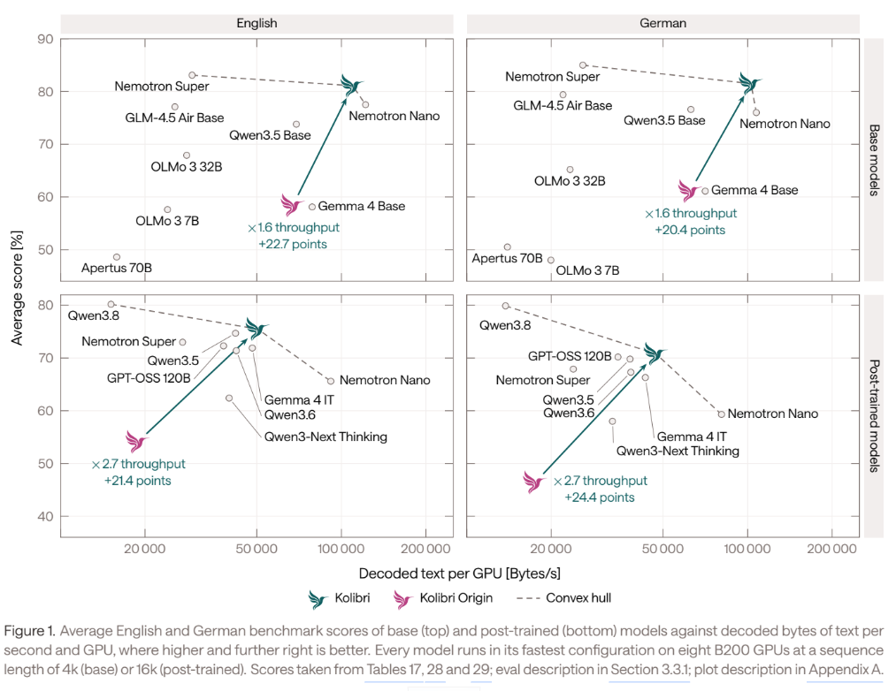
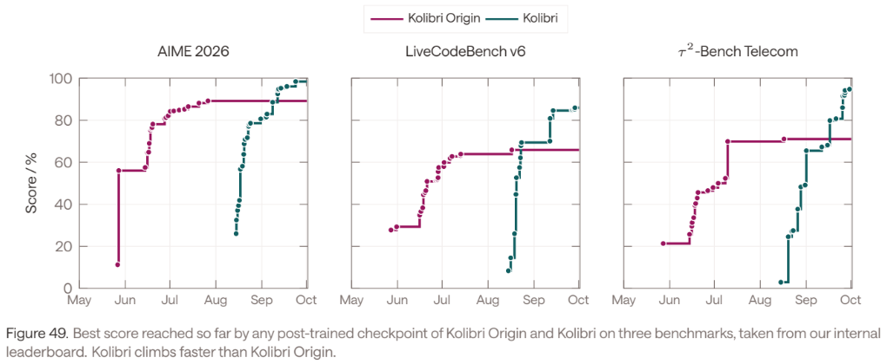
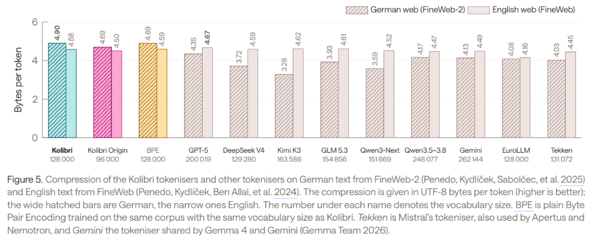
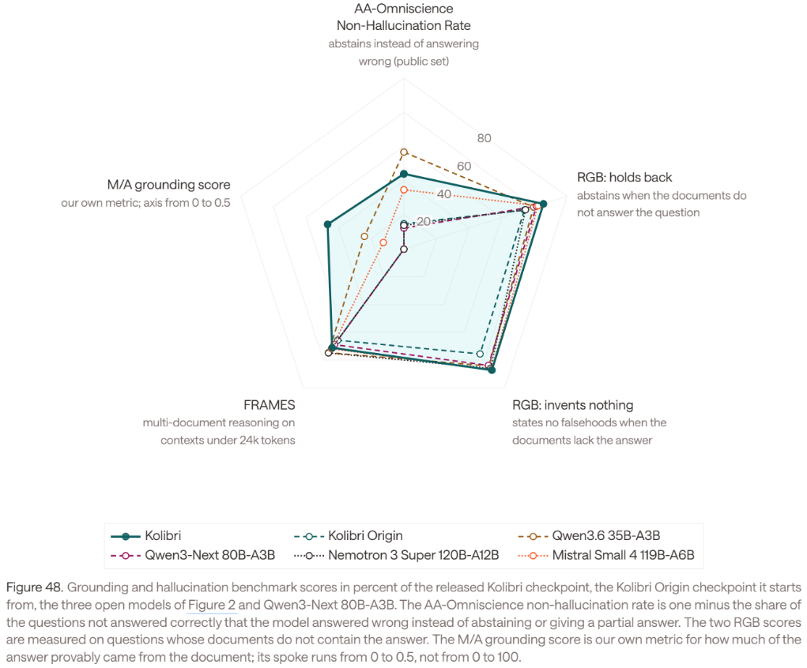
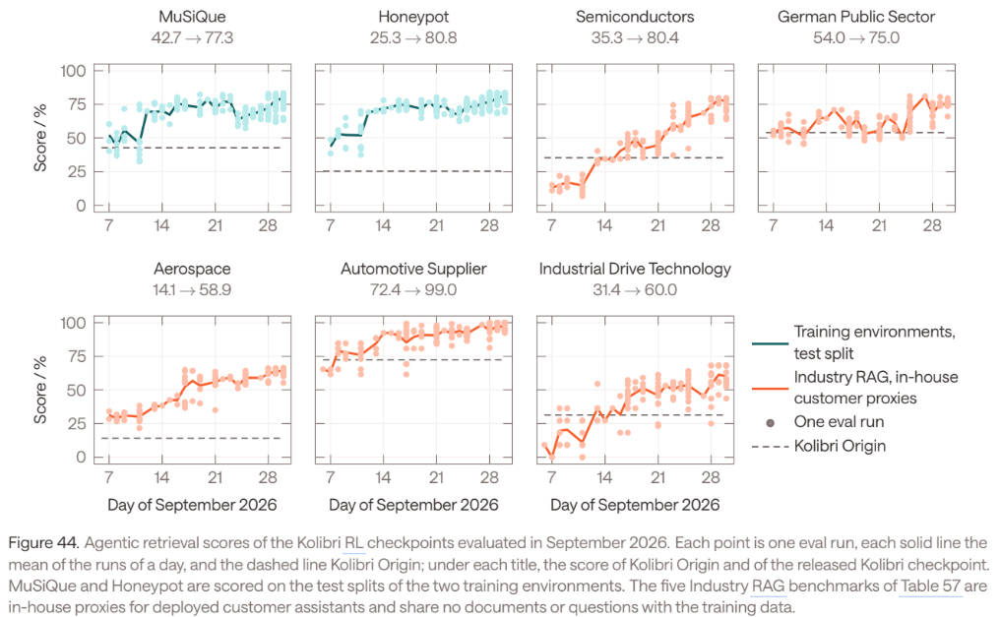
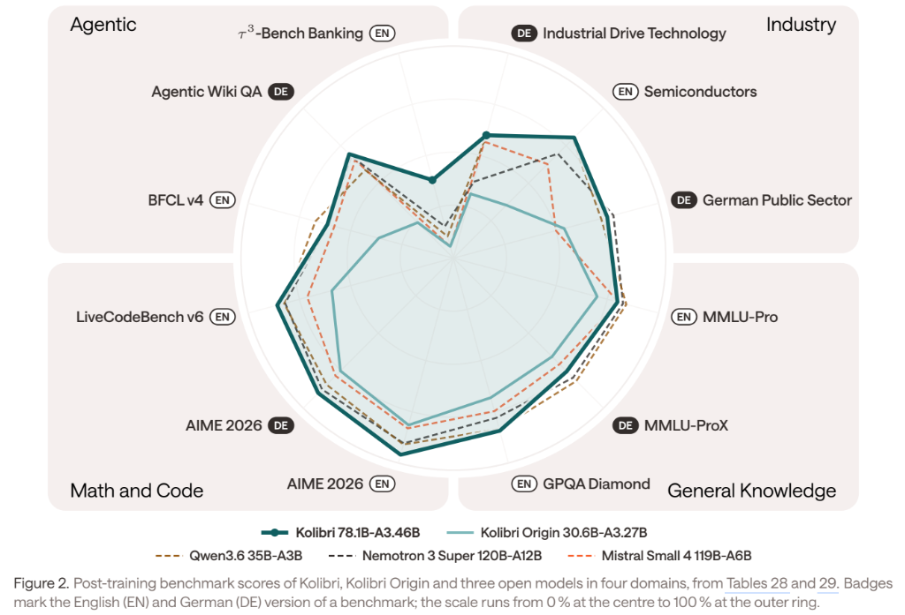
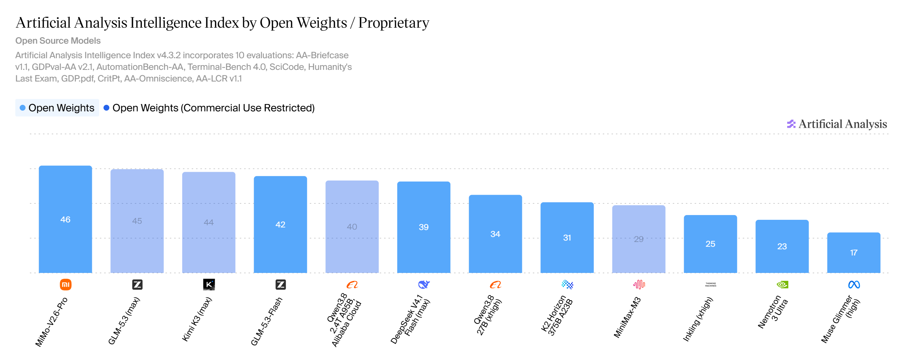

## The question is not whether Kolibri is European

Aleph Alpha released **Kolibri** on 3 October 2026 as a _sovereign open-weight model_. The company defines sovereignty along two axes: how the model is built and how control transfers to the customer. In the first dimension, it claims control and traceability from data ingestion through pre-training, post-training and evaluation; in the second, it points to downloadable weights and deployment freedom.[^how-sovereign-is-kolibri-launch]

That framing is useful because it shifts the discussion away from nationality as a label. The technically relevant question is not whether a model was announced by a German company, whether a datacentre is physically in Europe, or whether an API contract is governed by European law. It is **how much of the dependency chain a European actor can actually inspect, operate, modify, retain and reproduce** without discretionary permission from an external supplier.

Kolibri reaches further down that chain than a European fine-tune of a foreign base model. Aleph Alpha's documentation shows internal work on corpus construction, tokenizer design, model architecture, MoE routing, optimizer selection, scaling studies, distributed training, long-context adaptation, supervised fine-tuning, reinforcement learning, grounding, evaluation and inference engineering.[^how-sovereign-is-kolibri-technical-report] The same documentation describes the production system that connects these activities: the Model Factory called **Savanna**.

That distinction is the central thesis of this article. The strategically important result is not only that Aleph Alpha produced one 78-billion-parameter model. It is that it documents an organization and a software system that produced two large model generations three months apart, while changing almost every stage of the recipe between them.[^how-sovereign-is-kolibri-launch]

The sovereignty claim should nevertheless be scoped narrowly. Aleph Alpha's _full supply-chain integrity_ language is well supported if it means internal traceability across the model-development process. It is not evidence of European ownership of the NVIDIA accelerator stack, the semiconductor fabs and HBM supply chain behind those accelerators, or every upstream model used to generate synthetic training data. The rest of the article therefore separates **model-production sovereignty** from **full-stack industrial sovereignty**.

## What Kolibri actually is

Kolibri is a decoder-only causal Transformer with a sparse Mixture-of-Experts architecture. Its total parameter count is 78,103,074,560, while 3,457,573,120 parameters are active for each token, excluding embeddings. The architecture contains 50 Transformer blocks, all using MoE feed-forward layers. Forty blocks use sliding-window attention over the previous 512 tokens; every fifth block uses full causal attention. Attention is grouped-query attention with 48 query heads, four key-value heads and head dimension 128. Each MoE layer contains 384 routed experts, activates six of them per token, and adds one shared expert.[^how-sovereign-is-kolibri-model-card][^how-sovereign-is-kolibri-technical-report]

| Property | Kolibri |
|---|---|
| Developer | Aleph Alpha Research GmbH |
| Provider | Aleph Alpha GmbH |
| Architecture | Decoder-only causal Transformer, sparse MoE |
| Total parameters | 78.103B |
| Active parameters per token | 3.458B |
| Transformer blocks | 50 |
| Sliding-window / full-attention blocks | 40 / 10 |
| Sliding window | 512 preceding tokens |
| Model width | 2,560 |
| Query / KV heads | 48 / 4 |
| Head dimension | 128 |
| Routed experts per layer | 384 |
| Routed experts per token | 6 |
| Shared experts | 1 |
| Expert hidden dimension | 512 |
| Vocabulary | 128,000 |
| Tokenizer | UniBPE |
| Native trained context | 262,144 tokens |
| Validated extended context | up to 1,048,576 tokens |
| Primary languages | German and English |
| Released checkpoints | FP8 and BF16 |
| FP8 weight footprint | about 78 GB |
| License on published weights/configuration | Apache 2.0 |
| Pre-training hardware | 768 NVIDIA B200 GPUs |
| Pre-training compute | approximately $6.4\times10^{23}$ FLOPs |

: Core Kolibri specification from the official model card and technical report. {#tbl-how-sovereign-is-kolibri-spec}

The architectural choice is explicitly cost-driven. Aleph Alpha tested larger sparse models around 123B total parameters and found continued quality gains, but the serving penalty at long context was severe. In the company's comparison, a 123B candidate could fit only three concurrent 256k-token requests on two H100s, whereas the selected approximately 78B design could fit eighteen and decode 28% faster.[^how-sovereign-is-kolibri-launch]

This makes the sparse design part of the sovereignty argument rather than merely a research preference. A downloadable model that requires provider-scale infrastructure to run still transfers only limited operational autonomy. Kolibri was instead optimized so that a customer can serve it on a small number of high-end accelerators.

{#fig-how-sovereign-is-kolibri-pareto width="100%"}

Figure @fig-how-sovereign-is-kolibri-pareto shows the metric Aleph Alpha uses to justify that design point: quality against decoded **bytes of text per second per GPU**, rather than tokens per second. That choice matters for a bilingual model because tokenizer efficiency differs substantially across languages. The figure is still a developer-run comparison under Aleph Alpha's serving setup, not an independent universal ranking, but it directly connects model architecture to deployment cost.

## The real achievement is the Model Factory

The most important engineering object disclosed around Kolibri is Savanna, Aleph Alpha's Model Factory. In the company's terminology, Savanna implements **Model Training as Code**: the complete training workflow is represented as version-controlled software rather than as a set of manually coordinated scripts, filesystem paths and human hand-offs.[^how-sovereign-is-kolibri-model-training-as-code]

Aleph Alpha describes three properties of this approach. **Composability** comes from representing pipeline stages as functions with typed inputs and outputs. **Consensus** comes from version control, where the main branch represents the current agreed training recipe. **Provenance** comes from commits, comments and artefact lineage, which allow a past run to be traced back to the code, configuration, datasets, tokenizer and checkpoints that produced it.[^how-sovereign-is-kolibri-model-training-as-code]

The technical report is more concrete. Savanna owns orchestration of pre-training and post-training runs and their resumes, ablations and sweeps, checkpointing and model merging, evaluation, lineage, abstractions over clusters and storage, artefact retention and declarative model releases.[^how-sovereign-is-kolibri-technical-report] A run is described declaratively, with versions of the dataset, tokenizer, architecture and evaluation strategy pinned as inputs.

```{mermaid}
%%| label: fig-how-sovereign-is-kolibri-full-model-factory
%%| fig-cap: "Aleph Alpha's documented Kolibri Model Factory and production pipeline. The diagram separates pre-training data construction, later-stage decontaminated data, SFT synthetic-data generation, Savanna orchestration, distributed training, RL execution, evaluation feedback, lineage and release."
%%| fig-alt: "Full architecture of the Kolibri production pipeline. Raw and curated data feed distinct pre-training, mid-training, long-context and SFT data paths. External models have separate documented roles in pre-training quality scoring, synthetic pre-training, supervised fine-tuning and RL judging. Savanna connects version-controlled recipes and immutable artifacts to Flyte, Kubernetes and GPU clusters; training checkpoints are continuously evaluated and results feed researchers, software agents and future recipe changes. The released checkpoint is exported as FP8 and BF16 open weights for self-hosted vLLM inference."
%%| fig-align: center
%%{init: {"theme": "neo", "look": "handDrawn", "layout": "elk"}}%%

flowchart TB

    %% ============================================================
    %% 1. DATA PRODUCTION
    %% ============================================================

    subgraph DATA["1 · Data production"]

        direction TB

        %% --------------------------------------------------------
        %% PRE-TRAINING DATA
        %% --------------------------------------------------------

        subgraph PREDATA["Pre-training data"]

            direction TB

            CC["Raw Common Crawl"]
            OPEN["Open / curated datasets<br/>web · documents · code · STEM · QA · legal · public sector"]

            EXTRACT["Resiliparse extraction"]

            HEUR["Language-agnostic heuristic filtering<br/>+ language identification"]

            LANG["English / German branch filtering<br/>language-specific thresholds"]

            DEDUP["Deduplication<br/>exact · fuzzy MinHash/LSH · substring"]

            QJ["Qwen3-32B<br/>judge on 1M English CC sample"]

            DISTILL["Distilled quality classifiers<br/>Luxical + fastText"]

            GEM["Gemma-4-26B-A4B<br/>English synthetic rephrasing"]

            MIS["Mistral-Nemo-Instruct-2407<br/>German rephrasing"]

            SAFE["Cross-source filtering and remediation<br/>illegal · harmful · toxic · pirated content<br/>PII detection and redaction"]

            PREPOOL["Pre-training candidate pool<br/>78 datasets · ~29.3T materialised tokens"]

            PRESEARCH["Pre-training mixture search<br/>thousands of proxy runs + mixing law"]

            PREMIX["Production pre-training mix<br/>20T tokens"]

            CC --> EXTRACT
            EXTRACT --> HEUR
            HEUR --> LANG
            LANG --> DEDUP

            DEDUP -. sample .-> QJ
            QJ --> DISTILL
            DISTILL -. quality scores .-> PREPOOL

            DEDUP -. English seeds .-> GEM
            DEDUP -. German documents .-> MIS

            DEDUP --> SAFE
            OPEN --> SAFE
            GEM --> SAFE
            MIS --> SAFE

            SAFE --> PREPOOL
            PREPOOL --> PRESEARCH
            PRESEARCH --> PREMIX
        end


        %% --------------------------------------------------------
        %% MID-TRAINING / LONG-CONTEXT DATA
        %% --------------------------------------------------------

        subgraph LATEDATA["Mid-training and long-context data"]

            direction TB

            CURATED["Curated capability-dense pool<br/>reasoning · maths · code · instruction data"]

            DECON["Benchmark decontamination<br/>226 evaluation tasks"]

            MIDSEARCH["Mid-training mix ablations<br/>domain + language search"]

            MIDMIX["Production mid-training mix<br/>3.44T tokens"]

            NATLONG["Naturally long documents<br/>8k–256k<br/>synthetic samples removed"]

            LONGMIX["Long-context production mix<br/>≈200B tokens<br/>natural + reweighted mid-training data"]

            OPEN --> CURATED
            PREPOOL -. selected sources .-> CURATED

            CURATED --> DECON
            DECON --> MIDSEARCH
            MIDSEARCH --> MIDMIX

            PREPOOL --> NATLONG

            MIDMIX --> LONGMIX
            NATLONG --> LONGMIX
        end


        %% --------------------------------------------------------
        %% SFT DATA
        %% --------------------------------------------------------

        subgraph SFTDATAFACTORY["Supervised fine-tuning data"]

            direction TB

            SFTSEED["Open / seed SFT datasets<br/>+ in-house German, long-context,<br/>agentic, retrieval, safety data"]

            GLM["GLM-5.2 / GLM-5.3"]

            Q38["Qwen3.8-27B"]

            SFTGEN["Synthetic generation / regeneration<br/>reasoning · German · long context<br/>agentic · science · multi-turn"]

            SFTPROC["Audits · filtering · decontamination<br/>reasoning-effort labelling"]

            SFTPOOL["Final SFT data pool<br/>57 datasets · 22.0M samples · 335.8B tokens"]

            MERGEMIX["MergeMix search<br/>cluster specialists + candidate weightings"]

            SFTRUNS["C1 / C2 full candidate runs<br/>~268B packed tokens each"]

            SFTSOUP["C1 + C2 weight soup<br/>released SFT checkpoint"]

            SFTSEED --> SFTGEN
            GLM --> SFTGEN
            Q38 --> SFTGEN

            SFTSEED --> SFTPROC
            SFTGEN --> SFTPROC

            SFTPROC --> SFTPOOL
            SFTPOOL --> MERGEMIX
            MERGEMIX --> SFTRUNS
            SFTRUNS --> SFTSOUP
        end
    end


    %% ============================================================
    %% 2. DEVELOPMENT / EXPERIMENT CONTROL
    %% ============================================================

    subgraph DEV["2 · Model development and recipe control"]

        direction TB

        GIT["Git repository<br/>Savanna + shared training recipe"]

        MAIN["main branch<br/>collective current recipe"]

        BRANCH["Experiment / protected branches"]

        CFG["Declarative TOML run configuration<br/>architecture · datasets · tokenizer<br/>training · checkpointing · evaluation"]

        CI["Pull-request CI<br/>small end-to-end training tests"]

        NIGHT["Nightly end-to-end<br/>train + evaluate regression run"]

        REVIEW["Reviewed pull request"]

        EXP["Experiments / ablations / sweeps"]

        PROXY["Proxy-scale model studies<br/>architecture · optimisation · data"]

        SCALE["Systems scaling experiments<br/>FSDP · DP · EP · activation checkpointing"]

        POSTEXP["Post-training experiments<br/>SFT mixes · RL environments"]

        DECIDE["Evidence-backed recipe change"]

        GIT --> MAIN
        MAIN --> BRANCH
        BRANCH --> CFG
        BRANCH --> EXP

        CFG --> CI
        CI --> REVIEW
        REVIEW --> MAIN

        MAIN --> NIGHT

        EXP --> PROXY
        EXP --> SCALE
        EXP --> POSTEXP

        PROXY --> DECIDE
        SCALE --> DECIDE
        POSTEXP --> DECIDE
    end


    %% ============================================================
    %% 3. IMMUTABLE ARTEFACT / LINEAGE LAYER
    %% ============================================================

    subgraph ART["3 · Immutable artefact and lineage layer"]

        direction LR

        VD["Versioned datasets"]
        VT["Versioned tokenizers"]
        VC["Versioned configurations"]
        VCP["Input / predecessor checkpoints"]

        REG["Immutable artefact registry<br/>versions · retention · provenance"]

        VD --> REG
        VT --> REG
        VC --> REG
        VCP --> REG
    end

    PREMIX --> VD
    MIDMIX --> VD
    LONGMIX --> VD
    SFTPOOL --> VD

    MAIN --> VC


    %% ============================================================
    %% 4. SAVANNA CORE
    %% ============================================================

    subgraph SAV["4 · Savanna — Model Training as Code"]

        direction TB

        ORCH["Pipeline orchestration<br/>runs · resumes · sweeps · ablations<br/>merges · evaluations · releases"]

        CPA["Checkpoint abstraction<br/>storage · retention · versioning<br/>lineage · DCP / Hugging Face conversion"]

        BA["Benchmark abstraction<br/>deployment · inference settings<br/>backend · scoring · aggregation"]

        CA["Cluster abstraction<br/>GPU type · workload manager<br/>storage · cluster-specific details"]

        RELEASECFG["Declarative release definition"]

        ORCH --> CPA
        ORCH --> BA
        ORCH --> CA
        ORCH --> RELEASECFG
    end

    CFG --> ORCH
    REG --> ORCH


    %% ============================================================
    %% 5. EXECUTION INFRASTRUCTURE
    %% ============================================================

    subgraph INFRA["5 · Workflow, software and compute infrastructure"]

        direction TB

        FLYTE["Flyte<br/>durable workflows · retries · caching"]

        K8S["Kubernetes"]

        KUEUE["Kueue<br/>priority + topology-aware scheduling"]

        CLUSTERS["Multiple GPU clusters"]

        B200["Base-model infrastructure<br/>768 NVIDIA B200 · 96 × 8-GPU nodes"]

        B300["Main RL infrastructure<br/>256 NVIDIA B300 · 32 nodes"]

        STACK["ML software substrate<br/>PyTorch / TorchTitan fork<br/>DeepEP · FlashAttention · vLLM"]

        NET["GPU interconnect<br/>NVLink · InfiniBand · ConnectX-7"]

        OBS["Observability / diagnostics<br/>Grafana · logs · metrics<br/>DCGM · PyTorch profiling"]

        CA --> FLYTE
        FLYTE --> K8S
        K8S --> KUEUE
        KUEUE --> CLUSTERS

        CLUSTERS --> B200
        CLUSTERS --> B300

        B200 --> NET
        B300 --> NET

        CLUSTERS --> OBS
    end


    %% ============================================================
    %% 6. BASE-MODEL TRAINING
    %% ============================================================

    subgraph BASE["6 · Base-model production"]

        direction TB

        PRE["Pre-training<br/>20T · 16k context<br/>EP8 · FSDP16 · DP6"]

        MID["Mid-training<br/>3.44T · 64k context<br/>FSDP128 · DP6"]

        LONG["Long-context extension<br/>≈200B · 256k context<br/>FSDP128 · DP6"]

        WSM["Warmup-Stable-Merge<br/>average final 20 checkpoints"]

        BASEMODEL["Kolibri Base"]

        PRE ==> MID
        MID ==> LONG
        LONG ==> WSM
        WSM ==> BASEMODEL
    end

    PREMIX --> PRE
    MIDMIX --> MID
    LONGMIX --> LONG

    B200 --> PRE
    B200 --> MID
    B200 --> LONG

    STACK --> PRE
    STACK --> MID
    STACK --> LONG


    %% ============================================================
    %% 7. SFT
    %% ============================================================

    BASEMODEL --> SFTRUNS

    CLUSTERS --> SFTRUNS
    STACK --> SFTRUNS


    %% ============================================================
    %% 8. REINFORCEMENT LEARNING
    %% ============================================================

    subgraph RLSTAGE["7 · Reinforcement learning"]

        direction TB

        RLTASKS["38 RL environments<br/>1.2M+ internally curated tasks"]

        POLICY["Policy inference<br/>144 B300 GPUs<br/>vLLM · FP8"]

        RLJUDGE["Frozen RL judge<br/>Qwen3.5-122B-A10B<br/>16 B300 GPUs"]

        WORKERS["Rollout workers<br/>curriculum + environment stepping"]

        SANDBOX["Apptainer sandboxes<br/>persistent task state<br/>resource limits · allowlisted egress"]

        REPLAY["Replay buffer<br/>completed rollout groups"]

        TRAINER["RL trainer<br/>96 B300 GPUs · FSDP<br/>1000 optimiser steps"]

        FINAL["Released post-trained Kolibri"]

        RLTASKS --> WORKERS

        WORKERS --> POLICY
        WORKERS --> RLJUDGE
        WORKERS --> SANDBOX

        POLICY --> REPLAY
        RLJUDGE --> REPLAY
        SANDBOX --> WORKERS

        REPLAY --> TRAINER

        TRAINER -. FP8 weight push each step via RDMA .-> POLICY

        TRAINER ==> FINAL
    end

    SFTSOUP --> TRAINER

    B300 --> POLICY
    B300 --> RLJUDGE
    B300 --> TRAINER

    STACK --> POLICY
    STACK --> TRAINER

    GLM -. "GLM-5.2 also generates<br/>some RL long-context questions" .-> RLTASKS


    %% ============================================================
    %% 9. CHECKPOINT / EVALUATION LOOP
    %% ============================================================

    subgraph EVAL["8 · Continuous checkpoint and evaluation loop"]

        direction TB

        ICP["Intermediate checkpoints"]

        CPMG["Configured checkpoint-window merge"]

        STATIC["Static benchmarks<br/>knowledge · maths · code<br/>German · English"]

        AGENTBENCH["Agentic benchmarks<br/>tool use · retrieval · environments"]

        INDUSTRY["Industry / customer proxies<br/>semiconductors · public sector<br/>aerospace · automotive · drives"]

        GROUND["Grounding / abstention<br/>hallucination evaluations"]

        LONGEVAL["Long-context evaluations"]

        SCORES["Scores · metrics · run comparison"]

        ICP --> CPA
        CPA --> CPMG

        CPMG --> STATIC
        CPMG --> AGENTBENCH
        CPMG --> INDUSTRY
        CPMG --> GROUND
        CPMG --> LONGEVAL

        BA --> STATIC
        BA --> AGENTBENCH
        BA --> INDUSTRY
        BA --> GROUND
        BA --> LONGEVAL

        STATIC --> SCORES
        AGENTBENCH --> SCORES
        INDUSTRY --> SCORES
        GROUND --> SCORES
        LONGEVAL --> SCORES
    end

    PRE --> ICP
    MID --> ICP
    LONG --> ICP
    SFTRUNS --> ICP
    TRAINER --> ICP

    CPA -. lineage .-> REG
    SCORES -. evaluation lineage .-> REG

    SCORES -. stop / reject unpromising runs .-> ORCH


    %% ============================================================
    %% 10. ORGANISATIONAL LEARNING
    %% ============================================================

    subgraph LEARN["9 · Organizational learning loop"]

        direction TB

        HUMANS["Researchers / engineers"]

        AGENTS["Software agents<br/>experiment review · failed-run triage<br/>GPU-utilisation optimisation"]

        ANALYSE["Analyse metrics · failures<br/>profiles · benchmark regressions"]

        CHANGE["Propose recipe / code change"]

        ISSUES["Repository issues<br/>known limitations · XXX markers"]

        HUMANS --> ANALYSE
        AGENTS --> ANALYSE

        ANALYSE --> CHANGE
        ANALYSE --> ISSUES

        CHANGE --> REVIEW
        ISSUES --> GIT
    end

    SCORES -.-> ANALYSE
    OBS -.-> ANALYSE
    NIGHT -. regression results .-> ANALYSE

    AGENTS -.-> GIT
    AGENTS -.-> EXP
    AGENTS -.-> OBS
    AGENTS -.-> SCORES

    DECIDE --> CHANGE


    %% ============================================================
    %% 11. RELEASE AND DEPLOYMENT
    %% ============================================================

    subgraph REL["10 · Release and customer deployment"]

        direction TB

        SELECT["Selected final checkpoint"]

        FP8["FP8 export"]
        BF16["BF16 export"]

        HF["Hugging Face release<br/>weights + configuration<br/>Apache 2.0"]

        DOC["Public documentation<br/>model card · technical report<br/>training-content summary"]

        SERVE["Self-hosted inference<br/>aleph-alpha-inference + vLLM"]

        API["OpenAI-compatible API"]

        SELECT --> FP8
        SELECT --> BF16

        FP8 --> HF
        BF16 --> HF

        HF --> SERVE
        SERVE --> API

        SELECT -. documented by .-> DOC
    end

    FINAL --> SELECT
    RELEASECFG --> SELECT

    REG -. provenance / configuration .-> DOC
    SCORES -. evaluation results .-> DOC
```

Figure @fig-how-sovereign-is-kolibri-full-model-factory summarizes the documented relationship rather than adding a new architectural claim. The key point is that Savanna is not described as a trainer alone. It is the integration layer that binds training code, artefacts, compute and evaluation into a reproducible internal workflow.

The pipeline has explicit core abstractions. Its `Checkpoint` abstraction manages storage, retention, versioning, lineage and format conversion, and connects a checkpoint to the configuration, commit, datasets and evaluation results that produced it. A `Benchmark` abstraction encapsulates the evaluation backend, inference settings, deployment, scoring and aggregation for everything from static question sets to multi-turn tool-using environments. A `Cluster` abstraction hides differences among GPU types, workload managers and storage systems so that the logical recipe can be dispatched to different clusters.[^how-sovereign-is-kolibri-technical-report]

This is internal portability, not proof of hardware independence. The same recipe can be expressed against multiple cluster backends; that does not establish equivalent performance on a non-NVIDIA accelerator stack.

## Continuous integration for foundation-model training

The pipeline is operated with software-engineering controls more commonly associated with production application code than with one-off research runs.

Savanna lives in GitHub, and its continuous-integration path is the entry point for training. Aleph Alpha says pull requests can trigger a small-scale end-to-end training run that completes in under five minutes. A larger end-to-end model is trained and evaluated nightly to detect semantic regressions in training and evaluation code. The team uses trunk-based development so changes reach `main` in small increments rather than accumulating in long-lived research branches.[^how-sovereign-is-kolibri-model-training-as-code]

Non-code artefacts are also versioned. Aleph Alpha says model, data and tokenizer artefacts are stored immutably, with runs linking the referenced artefacts, logs, metrics, evaluation results and resulting checkpoints. The company's engineering post describes an on-premises object store, Weights & Biases for artefact lineage, Flyte as the workflow engine, Kubernetes for the primary clusters and Grafana for operational visibility.[^how-sovereign-is-kolibri-model-training-as-code]

The technical report adds Kueue for priority-based and topology-aware scheduling, specifically to keep jobs inside an InfiniBand domain where required.[^how-sovereign-is-kolibri-technical-report] The point is not that these components are unique. Flyte, Kubernetes, Grafana and the surrounding open-source software ecosystem are widely available. The achievement is the integration of those components into a model-development process in which the training recipe, data lineage, checkpoints, evaluation and cluster execution are tied together strongly enough that a large run can be restarted, inspected and changed without reconstructing its state from human memory.

## The production run is evidence of the pipeline, not just a claim about it

Kolibri Origin and Kolibri provide the strongest operational evidence that Savanna works at scale. Aleph Alpha says work on the pipeline began in January 2026. Kolibri Origin completed target-scale pre-training on 11 June; Kolibri completed pre-training on 11 September and was released on 3 October. In those three months, the model moved from 30.6B to 78.1B total parameters, from 7.51T to 20T pre-training tokens, from 65k to 256k maximum trained sequence length, from 128 to 384 routed experts and from full attention in every layer to the 4:1 sliding-window/full-attention design.[^how-sovereign-is-kolibri-launch]

The production pre-training run lasted 21 days on 768 B200 GPUs. Aleph Alpha reports 38 unplanned interruptions, approximately one per 10,000 GPU-hours, caused by hardware faults or connection timeouts. The pipeline restarted training automatically on different nodes and resumed from a checkpoint no more than 250 optimizer steps behind, without requiring a person to reconstruct the run.[^how-sovereign-is-kolibri-launch]

The report gives a second operational example. Production pre-training ran from a protected branch derived from `main`; Savanna automatically evaluated a merge of the last four checkpoints every 2,000 steps. A mid-run change to logging and profiling frequency increased throughput by about 3.7%, while the run remained represented as one lineage-preserving training job despite restarts.[^how-sovereign-is-kolibri-technical-report]

{#fig-how-sovereign-is-kolibri-model-factory-velocity width="90%"}

Figure @fig-how-sovereign-is-kolibri-model-factory-velocity is therefore better interpreted as evidence about an engineering organization than as another model benchmark. Aleph Alpha's stated objective is to shorten the time between identifying a failure and training a checkpoint that performs better on the corresponding evaluation.

## Efficiency engineering is itself part of the capability

A separate Aleph Alpha engineering study gives unusually concrete detail on how the team scales pre-training jobs. It is important to distinguish this study from the final Kolibri production run: the scaling experiment used a 30B-total, 3B-active MoE rather than the released 78B model. Its relevance is that it exposes the methodology used by the efficiency team.[^how-sovereign-is-kolibri-scaling]

The study starts at 8–16 B200 GPUs, where the team sweeps combinations of FSDP degree, data-parallel degree, activation checkpointing and local batch size. The small-scale sweep is used to eliminate configurations before scaling. PyTorch profiles then identify the boundary between compute-bound and communication-bound execution.

At 128 GPUs, selective activation checkpointing with FSDP128 reached 26.7k tokens/s/GPU and 35.3% model-FLOPS utilization. The final 512-GPU configuration used FSDP128, DP4, selective activation checkpointing and local batch size 22, reaching 26.7k TPS and 35.3% MFU with 94% HBM usage. Per-GPU efficiency fell by only about 6% between the 16-GPU optimum and the 512-GPU result.[^how-sovereign-is-kolibri-scaling]

This is a meaningful achievement, but it should not be overstated. Aleph Alpha explicitly declines to compare the 35.3% MFU number directly with unrelated published MoE runs because architecture, precision and recipe differences make such comparisons unreliable. The documented result is the near-linear scaling of this particular training setup, not proof that it is the industry's most efficient MoE implementation.[^how-sovereign-is-kolibri-scaling]

The final Kolibri production topology is different again: 768 B200 GPUs across 96 eight-GPU nodes, with expert parallelism of 8, FSDP of 16 and data parallelism of 6 during pre-training. Within a node the GPUs use fifth-generation NVLink; nodes are connected through InfiniBand with eight ConnectX-7 adapters per node.[^how-sovereign-is-kolibri-technical-report]

Taken together, the two sources establish a hard fact that matters for sovereignty: whatever the commercial ownership arrangement for the physical compute, Aleph Alpha is clearly not merely consuming a managed model-training API: its engineers operate the distributed training, profiling, parallelism, recovery and evaluation stack themselves. It has a team capable of profiling, parallelizing, debugging and operating large MoE training workloads at hundreds of current-generation accelerators.

## The data factory starts far before the 20T-token run

The release announcement says the pipeline processed more than **200 trillion raw tokens** to produce the final 20T-token pre-training run.[^how-sovereign-is-kolibri-launch] The technical report describes an intermediate materialized pool of approximately 29.3T tokens across 78 datasets, from which the production mix consumes 20T.[^how-sovereign-is-kolibri-technical-report]

Those numbers describe different levels of the data pipeline and should not be collapsed. The 200T figure is the scale of raw material passing through extraction, filtering and curation; 29.3T is the materialized candidate pool; 20T is the final pre-training consumption.

The Common Crawl pipeline is similarly explicit. The report says Aleph Alpha extracts more than 308 billion documents, performs exact deduplication to obtain approximately 21.16 billion distinct documents, then applies fuzzy MinHash/LSH deduplication that removes a further 25.9% of near-duplicate documents. Substring deduplication removes repeated blocks such as navigation and templated page chrome, eliminating 21.3% of text bytes from the remaining corpus.[^how-sovereign-is-kolibri-technical-report]

The data pipeline also performs quality scoring, URL and content filtering, decontamination against evaluation sets and PII remediation. The model card states that high-syntax-constraint identifiers such as email and IP addresses are replaced with special tokens and that documents are dropped when more than 15% of their bytes are replaced during redaction.[^how-sovereign-is-kolibri-model-card]

About 24% of the final pre-training token presentations are synthetic in origin, including rephrases and translations.[^how-sovereign-is-kolibri-technical-report] This is important for the sovereignty assessment because Aleph Alpha controls the generation and filtering process while not originating every upstream model used to create that material.

## German is treated as a data-engineering problem, not a translation feature

Kolibri's German capability is one of the clearest examples of an engineering decision that would be invisible in a generic _European model_ label.

Aleph Alpha's small-model ablations indicated that a German share around 20% was useful at a 20T-token pre-training horizon. The final production mix contains 21.3% German token presentations.[^how-sovereign-is-kolibri-technical-report] Open German datasets were insufficient to reach the target, so Aleph Alpha built a language-specific Common Crawl pipeline and synthetic rephrasing process.

The company explicitly reports that English filtering rules cannot simply be applied to German. One example is mean word length: thresholds tuned on English can discard formal German administrative prose because German compounds are longer. Aleph Alpha therefore retuned language-specific filters rather than accepting the distribution imposed by an English-centric pipeline.[^how-sovereign-is-kolibri-sauerkraut]

The sources are not perfectly numerically consistent on every intermediate count. The launch article says the German web pipeline produced 1.3T unique organic tokens, while the detailed technical-report narrative says 0.8T unique tokens after the language-specific processing described there. Both sources agree on the larger operational point: the final German pool is about 2.4T unique tokens, roughly 80% curated or generated by Aleph Alpha and 20% from open datasets, and it is upsampled to about 4.3T German token presentations during the 20T pre-training run.[^how-sovereign-is-kolibri-launch][^how-sovereign-is-kolibri-technical-report] This article does not attempt to reconcile the differing 0.8T and 1.3T intermediate accounting boundaries.

The tokenizer is part of the same design. Kolibri uses a 128k-vocabulary tokenizer trained with UniBPE, which combines BPE's bottom-up merge structure with a Unigram-loss criterion for selecting merges. In Aleph Alpha's comparison, the tokenizer reaches about 4.90 UTF-8 bytes per token on German FineWeb-2, compared with 4.35 for GPT-5, while remaining close to the leading tokenizers on English.[^how-sovereign-is-kolibri-launch]

{#fig-how-sovereign-is-kolibri-tokenizer width="90%"}

Figure @fig-how-sovereign-is-kolibri-tokenizer connects linguistic specialization to economics. More German bytes per token means fewer model tokens for the same document, which reduces prefill work, KV-cache pressure and token-metered serving cost.

## German reasoning exposed a failure mode instead of hiding one

Aleph Alpha's September research on German reasoning is relevant not because every result transfers directly to the final model, but because it shows how the post-training pipeline was used to create and test a capability that open datasets did not supply.

The team generated 795,731 German SFT conversations across general chat, tool use, mathematics, science and code; 83% of those conversations contained German reasoning traces.[^how-sovereign-is-kolibri-german-reasoning] Because strong reasoning teachers tended to switch to English internally, the pipeline prefills the beginning of the teacher's reasoning trace with a German opener. In the reported measurement, a system-prompt-only approach kept 67% of traces in German, while the prefilled-opener approach kept 97% in German.[^how-sovereign-is-kolibri-german-reasoning]

The experiment also reported a negative result. Introducing a small amount of German reasoning data caused some models to enter repetition loops and fail to produce a final answer. On German AIME 2026, one low-data run fell from a 70.2 baseline to 48.3; increasing the amount of domain-matched German math data recovered the score to 67.3, but did not fully eliminate the looping behavior.[^how-sovereign-is-kolibri-german-reasoning]

This is useful evidence about transparency in a technical sense. The publication does not present _German reasoning_ as a solved binary capability. It documents the data-generation method, the measured language-consistency gain, the failure mode, and the fact that domain-specific German data mattered more than German data in general.

## Pre-training, mid-training and long-context training are separate curricula

Kolibri Base is not produced by one homogeneous 24T-token run.

| Stage | Token budget | Context length | Global token batch |
|---|---:|---:|---:|
| Pre-training | 20T | 16,384 | about 75.5M tokens/step |
| Mid-training | 3.44T | 65,536 | about 100.7M tokens/step |
| Long-context extension | 201B | 262,144 | about 201.3M tokens/step |

: Base-model training stages documented for Kolibri. {#tbl-how-sovereign-is-kolibri-training-stages}

Pre-training uses the broad data mixture. Mid-training shifts toward capability-dense material such as reasoning, mathematics, code and agentic data. The long-context phase mixes long documents with high-quality mid-training data rather than training only on long documents, because Aleph Alpha reports that long-document-only adaptation can erode previously acquired capabilities.[^how-sovereign-is-kolibri-launch]

The optimizer is split by parameter group. Aleph Alpha uses spectral Muon for attention and expert matrix parameters, with Adam or AdamW for routers, embeddings, normalization parameters and the language-model head. The report specifies a 100B-token warm-up followed by a constant learning rate across the remaining base-model stages, with optimizer state carried forward rather than reset.[^how-sovereign-is-kolibri-technical-report]

The final base checkpoint uses a Warmup-Stable-Merge recipe: rather than adding a conventional learning-rate cooldown, the final weights are obtained by averaging the last 20 checkpoints from the long-context stage.[^how-sovereign-is-kolibri-technical-report]

A separate Aleph Alpha study on a 30B-total, 3B-active model helps explain why the company treats stage boundaries cautiously. Three pre-training checkpoints that ranked differently immediately after pre-training changed order after the same downstream mid-training, long-context and SFT pipeline; the study concludes that checkpoint selection should account for the training that remains.[^how-sovereign-is-kolibri-checkpoint-quality] That result should not be treated as a proof about every Kolibri checkpoint, but it documents the model-development discipline behind the factory: early benchmark scores are not assumed to be sufficient selection criteria for a multi-stage training system.

## Mixture search is itself industrialized

The pre-training mix was not chosen by hand once and then frozen. The technical report says the data team trained **thousands of small proxy models**, each on a different mixture, and fitted a mixing law to their scores. The official model card further specifies that the pre-training search used 30M-parameter dense proxies trained on 3B tokens.[^how-sovereign-is-kolibri-technical-report][^how-sovereign-is-kolibri-model-card]

The same pattern appears later in the pipeline. Mid-training candidates are compared with proxy models, and Savanna can compose a short SFT stage onto each candidate before evaluation so that the team receives a downstream signal rather than judging the candidate solely at the point where the intervention occurred.[^how-sovereign-is-kolibri-technical-report]

For SFT, Aleph Alpha adapted MergeMix to twenty data clusters. The model card says it trained one specialist per cluster, merged 69 candidate weightings drawn around the hand-tuned mix, evaluated them across sixteen benchmarks in seven capability groups, trained eight candidate mixtures at proxy scale, and moved the four best to target-scale tests.[^how-sovereign-is-kolibri-model-card]

This is the operational meaning of _Model Factory_: not just automation of a final known recipe, but a system for repeatedly searching the recipe itself.

## Post-training is another large production pipeline

Kolibri post-training has two principal stages: SFT followed by reinforcement learning. The release article says Aleph Alpha generated **174B synthetic SFT tokens**, filtered them and combined them with permissively licensed data into a **268B-token training mixture**.[^how-sovereign-is-kolibri-launch] A full SFT run uses 4,000 optimization steps at 67.1M packed tokens per step, or about 268.4B token positions. The final SFT checkpoint is a model soup of two checkpoints trained for the same horizon on different data mixtures.[^how-sovereign-is-kolibri-model-card] The technical report's statement that SFT spans about 537B training-token presentations is therefore consistent with two full approximately 268B candidate runs contributing to the final soup.[^how-sovereign-is-kolibri-technical-report]

The data provenance is important. The technical report explicitly states that the **main models used to generate SFT data and regenerate parts of open datasets are GLM-5.2, GLM-5.3 and Qwen3.8-27B**.[^how-sovereign-is-kolibri-technical-report] Different teacher models are used for different generation and judging tasks because Aleph Alpha finds that they have different capabilities, values and biases.

That means Kolibri is not a derivative fine-tune of GLM or Qwen. Its base model was trained by Aleph Alpha from its own architecture and data pipeline. But the final model has been post-trained on synthetic examples produced by non-European foundation models. This is an upstream **training-information dependency**, not a runtime API dependency.

The model card acknowledges the associated political-bias risk and says Aleph Alpha filters SFT data for political bias and adds dedicated alignment data grounded in curated material on politically sensitive topics.[^how-sovereign-is-kolibri-model-card] A separate Aleph Alpha study on Chinese model alignment reports that the company adopted screening, dedicated alignment data and explicit evaluation for this purpose.[^how-sovereign-is-kolibri-party-line]

For reinforcement learning, Aleph Alpha reports more than **1.2 million internally curated tasks** across reasoning, tool use, instruction following, code, retrieval and other domains.[^how-sovereign-is-kolibri-technical-report] The main RL run lasts 1,000 optimizer steps at sequence lengths up to 256k. Rollouts are produced through vLLM while training proceeds asynchronously, with updated weights synchronized to inference without waiting for all ongoing generations to finish. Aleph Alpha also uses quantization-aware training so the post-trained model can be served efficiently at low precision.[^how-sovereign-is-kolibri-model-card]

This is another important sovereignty boundary. Aleph Alpha owns the RL environments, training orchestration and final weights, but some SFT information is generated by external model families and the runtime stack still contains globally developed software.

## Grounding and abstention are deliberately trained behaviors

One distinctive part of Kolibri's post-training programme is the attempt to make unsupported answers visible through abstention. Aleph Alpha trains with conventional abstention data and with a Merlin-Arthur protocol. In the company's description, one player constructs a context that supports the correct answer, while another removes relevant evidence; the model is trained to answer in the former case and abstain in the latter.[^how-sovereign-is-kolibri-merlin-arthur]

{#fig-how-sovereign-is-kolibri-grounding width="88%"}

Figure @fig-how-sovereign-is-kolibri-grounding shows the developer's own measurements. The AA-Omniscience non-hallucination rate rises from about 15% for Kolibri Origin to 44% for Kolibri; RGB negative-condition abstention rises from about 74% to 86%; and the Merlin-Arthur grounding score reaches approximately 0.234 where Origin scores zero.[^how-sovereign-is-kolibri-technical-report]

The M/A number is not an accuracy percentage. Aleph Alpha describes it as a lower-bound certificate of how much a correct answer depends on the supplied document. Its scale is different from the other axes in the radar plot and should not be read visually as if every spoke shared the same unit.

## Customer proxies show the hill-climbing loop, not independent validation

Aleph Alpha also evaluates successive RL checkpoints against internal customer proxies for semiconductors, the German public sector, aerospace, automotive suppliers and industrial drive technology. The report says these evaluations use production-like prompts, tools and separate corpora, and that their documents and questions do not overlap with the training data.[^how-sovereign-is-kolibri-technical-report]

{#fig-how-sovereign-is-kolibri-contextualized-performance width="100%"}

Figure @fig-how-sovereign-is-kolibri-contextualized-performance shows large improvements across the RL programme, including the semiconductor proxy moving from 35.3 to 80.4, the German public-sector proxy from 54.0 to 75.0 and aerospace from 14.1 to 58.9.[^how-sovereign-is-kolibri-technical-report]

These are not independent customer benchmarks. Aleph Alpha controls the evaluation construction and grading. Their value is different: they show the feedback mechanism of the Model Factory, where a domain failure can be represented as an evaluation and training environment and then tracked across checkpoints.

The public benchmark record also deserves a bounded interpretation. Kolibri performs strongly among the sparse models in Aleph Alpha's comparison, especially in mathematics and code, but the dense Qwen3.8-27B scores higher on the report's overall English and German aggregates.[^how-sovereign-is-kolibri-model-card] Kolibri is therefore evidence of an efficient and specialized European model, not evidence that Europe has already matched the global frontier on all capability dimensions.

{#fig-how-sovereign-is-kolibri-capabilities width="92%"}

## Transparency: unusually detailed, but not full external reproducibility

Aleph Alpha makes a deliberate transparency claim around Kolibri, and the public record supports part of it strongly.

The release includes a long technical report, a detailed model card, a public training-content summary, exact architecture parameters, training-stage token counts, optimizer details, hardware topology, major post-training hyperparameters, benchmark tables, energy estimates and deployment instructions. The model card itself says it was auto-generated by Savanna at a specific Git commit, which ties public release documentation back to the internal production system.[^how-sovereign-is-kolibri-model-card]

Aleph Alpha has also signed the EU General-Purpose AI Code of Practice and, in August 2026, the Code of Practice on Transparency of AI-generated Content. In its own public statement, the company frames machine-readable provenance and transparency as part of its sovereignty strategy.[^how-sovereign-is-kolibri-transparency]

That policy commitment should not be confused with a feature already present in every Kolibri output. The model card explicitly states that content generated by the model is **not explicitly detectable at this point** and that downstream systems must mitigate the risk of outputs being mistaken for human content.[^how-sovereign-is-kolibri-model-card]

The important distinction is therefore between **transparency about the model and its production process** and **machine-verifiable provenance of every generated output**. The first is unusually extensive for a commercial model. The second is not claimed as a completed Kolibri capability in the model card.

## Open weights are not the same as open source

Kolibri is downloadable in FP8 and BF16 form. The FP8 model has a memory footprint of roughly 78 GB, and Aleph Alpha documents serving configurations as small as one H200, B200 or B300, or two H100 SXM5 GPUs.[^how-sovereign-is-kolibri-model-card] The documented serving path uses Aleph Alpha's inference package as a vLLM plugin and exposes an OpenAI-compatible API.

That transfers substantial control to the deployer. Once an organization has lawfully obtained and retained the weights, it can run that model version without an Aleph Alpha-hosted inference service. Sensitive prompts and retrieved documents can remain inside the organization's own infrastructure.

The release should nevertheless be called **open-weight**, not fully open-source or fully reproducible. The model card is explicit: _Apache 2.0 applies to the weights and configuration files published in the repository_. Other artefacts not present in the repository are excluded from that grant, and Aleph Alpha states that the license does not extend to underlying code, model architecture, parameter settings or training methods. The company retains rights to those artefacts and methods.[^how-sovereign-is-kolibri-model-card]

This creates an unusual but coherent disclosure model. Aleph Alpha **publishes technical descriptions** of many architectural parameters and training methods while **not granting the complete production stack under the same open license**. Savanna itself is described in detail but is not released as the public reproduction package for Kolibri. The raw and synthetic training datasets are not published as a complete reconstructable corpus.

The result is strong artefact transparency and deployment freedom, but incomplete third-party reproductive sovereignty.

| Layer | Publicly available | Not publicly transferred as part of the Kolibri Apache release |
|---|---|---|
| Model weights | FP8 and BF16 checkpoints | — |
| Model configuration | published | — |
| Architecture description | extensively documented | architecture rights excluded from Apache grant |
| Training recipe | extensively documented in report/model card | complete production implementation not released |
| Inference path | documented vLLM-based serving package | complete internal serving/operations stack not implied |
| Training data | content summary, categories, curation methods | complete reconstructable corpus not published |
| Model Factory | architecture and workflow described | Savanna production code not released with the weights |
| Experiment lineage | internally maintained and partly exposed through report/model card | full internal experiment history not public |

: Kolibri's transparency/open-weight boundary. {#tbl-how-sovereign-is-kolibri-openness}

This distinction matters for sovereignty because two different actors receive two different forms of control. Aleph Alpha retains the capability to build successor models. A customer receives the capability to retain and operate the released artefact.

## The software stack is globally sourced

The Model Factory is European-controlled integration, not an all-European software stack.

The technical report names PyTorch 2.14, DeepEP v2 and FlashAttention 4 in pre-training; the trainer builds on Aleph Alpha's fork of TorchTitan; vLLM is used for rollout inference and public serving; and NVIDIA tooling is used for diagnostics around the production cluster.[^how-sovereign-is-kolibri-technical-report]

Savanna itself uses Flyte, Kubernetes, Kueue, Grafana and other components in its orchestration environment.[^how-sovereign-is-kolibri-model-training-as-code][^how-sovereign-is-kolibri-technical-report]

Most of these components are open-source and can in principle be retained and modified. That reduces legal dependence on a single software vendor, but it does not make migration cost negligible. High-performance attention kernels, MoE communication, quantization, profiling and distributed execution are tightly coupled to the accelerator platform used in production.

The correct description is therefore **European ownership of the integration and training recipe over a globally developed software substrate**.

## The hard sovereignty boundary remains the accelerator stack

Kolibri's production pre-training used 768 NVIDIA B200 GPUs; the post-training infrastructure also uses NVIDIA B300 hardware for the main RL setup.[^how-sovereign-is-kolibri-technical-report] This is the clearest **non-European dependency** in the demonstrated production chain.

The issue is larger than the GPU brand. A modern AI training platform depends on accelerator silicon, HBM, advanced packaging, high-speed intra-node links, inter-node networking, drivers, compilers, communication libraries, optimized kernels, firmware, servers and datacentre operations. Aleph Alpha has demonstrated that a European engineering team can operate this stack effectively. It has not demonstrated that the EU can replace it with a European-designed and European-manufactured equivalent at comparable performance and scale.

This is why training location should not be equated with hardware sovereignty. Aleph Alpha states that teams in Germany developed Kolibri and that the model was trained on infrastructure in Germany and Finland under European and German law.[^how-sovereign-is-kolibri-launch] The public Kolibri material reviewed here does not identify the legal owner of every physical B200 asset used in those facilities. What is strongly evidenced is Aleph Alpha's operational control of the workload and training process; physical asset ownership is less completely disclosed.

## External teacher models create a second upstream dependency

The hardware boundary is not the only foreign dependency. The SFT pipeline uses GLM-5.2, GLM-5.3 and Qwen3.8-27B as principal generators or regenerators of fine-tuning material.[^how-sovereign-is-kolibri-technical-report] The broader pre-training pipeline also uses external model families for rephrasing, translation and judging tasks.

This dependency has a different failure mode from an API dependency at runtime. Once synthetic data have been generated, filtered and retained, the external teacher cannot revoke the already incorporated training examples. But the dependency matters for **reproductive sovereignty**: the public evidence does not establish that Aleph Alpha could regenerate a functionally equivalent synthetic corpus tomorrow if all non-European teacher models became unavailable.

The technical report's transparency on this point is important because it prevents a misleading interpretation of _we own the entire pipeline._ The evidence supports ownership of the **orchestration, curation and training process**. It does not support exclusive European provenance of every model that contributed information to that process.

## Corporate control is also becoming transatlantic

A further boundary concerns the organization that holds the engineers, Model Factory, data processes and model-development IP.

On 16 September 2026, Aleph Alpha and Cohere announced a definitive business-combination agreement. The planned combined company will operate globally as Cohere, with headquarters, R&D centres and leadership roles in Germany and Canada. The transaction remained subject to final regulatory approvals in the latest official announcement reviewed for this article.[^how-sovereign-is-kolibri-cohere]

The companies say the structure contains safeguards and oversight mechanisms intended to preserve operational control and sovereignty requirements in both jurisdictions. The public announcement does not disclose enough detail to determine future ownership and control of specific Kolibri-related IP, repository access, training data or Model Factory decision rights.

The released weights are less sensitive to that uncertainty: a customer that already holds the checkpoint can continue to run that version. Future model-production capability follows the organization, engineers, compute allocations and IP that produce the next generation.

## A layer-by-layer assessment

The evidence supports a strong but bounded sovereignty assessment.

| Layer | Evidence from Kolibri | Remaining external dependency | Assessment |
|---|---|---|---|
| Human capability | German teams built two model generations and operate the end-to-end pipeline | retention of team and future governance | strong |
| Data engineering | internal web pipeline, filtering, deduplication, PII redaction, mix search | global source corpus | strong process control |
| Synthetic-data production | Aleph Alpha controls prompts, curation, audits and mixing | GLM, Qwen and other external teacher models | strong orchestration, incomplete provenance independence |
| Tokenizer | internally developed UniBPE | research ideas are global | strong |
| Architecture | internally selected through ablations | research ecosystem is global | strong |
| Training recipe | proxy-model search, multi-stage curriculum, optimizer and merge strategy documented | external software substrate | strong |
| Model Factory | Savanna integrates orchestration, CI, artefact lineage, evaluation and clusters | internal code is not publicly transferred | strong producer capability |
| Training systems engineering | hundreds of B200s, profiling, scaling, automatic recovery | NVIDIA hardware/software ecosystem | strong operational capability |
| Physical compute | workloads operated in Germany/Finland | ownership details incomplete; accelerators non-European | mixed |
| Accelerator/semiconductor technology | no European substitute demonstrated | NVIDIA and global semiconductor chain | weak |
| Released model artefact | downloadable FP8/BF16 weights | none required for continued use of retained version | strong |
| Customer inference | self-hosting documented | accelerator stack remains NVIDIA-centric | strong provider independence, limited hardware independence |
| External reproducibility | extensive report, model card and content summary | no complete public Model Factory or training corpus | partial |
| Corporate control | German company at release | pending Cohere combination | future structure transatlantic |

: Evidence-based sovereignty assessment for Kolibri as of 5 October 2026. {#tbl-how-sovereign-is-kolibri-assessment}

This table explains why both extreme readings are wrong:

- Calling Kolibri _not sovereign_ merely because it uses NVIDIA hardware ignores substantial European control over architecture, data transformation, training, evaluation and the final artefact.
- Calling it _fully sovereign_ ignores the accelerator stack, external teacher models, incomplete public reproducibility and the prospective change in corporate governance.

## What the achievement means for European technology

Kolibri establishes several facts that matter beyond the model itself:

1. Europe has at least one private organization that has demonstrated an integrated production pipeline for training a modern sparse foundation model from raw data through post-training and release. This is stronger evidence than the existence of a research checkpoint or a European-hosted foreign model because it includes architecture search, data-mix search, distributed training, failure recovery, post-training environments and repeated model generations.
2. The Model Factory converts tacit research knowledge into a persistent engineering asset. Savanna's versioned recipe, immutable artefacts, automated evaluations and lineage allow decisions to accumulate across model generations rather than being reconstructed for each run. Whether this capability remains in Europe is therefore strategically more important than the continued availability of any one checkpoint.
3. Aleph Alpha demonstrates that deployment sovereignty can be transferred independently of full production openness. The customer can retain and self-host the weights even though the complete training factory is not open-sourced. This is a practical form of provider-exit resilience.
4. The work makes the remaining gaps easier to identify. The missing pieces are not abstract. They are advanced accelerator and memory supply, a more hardware-portable high-performance software stack, upstream teacher-model substitutability, broader public reproducibility if that is a policy goal, and stable governance over the organizations that hold the model-production capability.

None of these conclusions requires predicting that Kolibri will become a global frontier model or that Aleph Alpha's approach will dominate European AI. The demonstrated achievement is narrower and more durable: a European team has built and operated an industrial foundation-model production system at large scale and has documented enough of it to make the dependency boundaries visible.

## What Kolibri does not prove

Kolibri's significance becomes clearer when the sovereignty claim is bounded by what the project does **not** establish. The model demonstrates substantial European control over the intellectual and operational process that turns data, experiments and compute into a deployable foundation model; it does not demonstrate autonomy across every layer on which that process depends. The distinction is fundamental because the relevant object is the dependency graph behind the model, not the nationality of the finished checkpoint. 

Most obviously, Kolibri does not demonstrate European semiconductor sovereignty. Its base-model training used 768 NVIDIA B200 accelerators, while the reinforcement-learning infrastructure uses B300s. The surrounding production stack depends on NVLink, InfiniBand and ConnectX networking as well as PyTorch, DeepEP, FlashAttention, vLLM and other software closely optimized for the NVIDIA execution environment.[^how-sovereign-is-kolibri-technical-report] Open-source software reduces the possibility of a purely contractual veto because its code can be retained and modified, but it does not remove the engineering cost of migrating an optimized distributed-training system to a different accelerator architecture. Nothing in the Kolibri documentation establishes that the demonstrated training recipe could presently be reproduced at comparable scale, throughput and reliability on a European-designed and European-manufactured compute platform. The strongest external dependency therefore remains below the model-development layer, in accelerators, HBM, packaging, networking and semiconductor manufacturing. 

Nor does Kolibri establish exclusively European provenance for its training information. Aleph Alpha controls the acquisition, filtering, deduplication, synthesis, mixing and validation pipelines, but much of the underlying corpus comes from external sources; in the documented 20T-token pre-training mix, external datasets account for 64.3% of token presentations. Synthetic data introduce another dependency. The technical report explicitly documents external models in the data-production chain, including Gemma for English synthetic pre-training data, Mistral-Nemo for German rephrasing, Qwen3-32B for quality annotation, and GLM-5.2, GLM-5.3 and Qwen3.8-27B as principal generators or regenerators of supervised fine-tuning data.[^how-sovereign-is-kolibri-technical-report] This does not make Kolibri a derivative checkpoint of those models: Aleph Alpha trained its own base model and controls the transformation pipeline. It does mean, however, that **control over the pipeline is not equivalent to exclusive control over the provenance of every informational input**.

The open-weight release also stops short of transferring Aleph Alpha's complete model-production capability to the public. Apache 2.0 applies to the released weights and configuration files, giving a customer substantial freedom to retain, deploy and adapt the resulting artifact. It does not make Savanna, the complete training corpus, experiment history, data-generation infrastructure or the full production implementation publicly reproducible. Aleph Alpha retains what might be called **producer reproductive sovereignty**, whereas a holder of the checkpoint primarily obtains **artifact and deployment sovereignty**. This distinction matters because the ability to operate Kolibri-1 is materially different from the ability to independently reproduce Kolibri-2.

The geographical location of the training infrastructure should likewise not be confused with ownership of the physical assets. Aleph Alpha states that the model was developed in Germany and trained on infrastructure in Germany and Finland, and its technical documentation provides strong evidence that the company controlled scheduling, training, checkpoint recovery, evaluation and lineage. The reviewed sources do not, however, identify the legal owner of every B200 cluster used in the training process or fully disclose the provider structure behind that capacity. European jurisdiction and operational control are therefore established more strongly than European ownership of the physical compute estate. 

Transparency has a similar boundary. Kolibri is accompanied by an unusually detailed technical report, model card, training-content summary, architectural specification and benchmark record, and Aleph Alpha has publicly committed to European transparency frameworks. That does not imply that every model output already carries machine-verifiable provenance or can be reliably identified as AI-generated. The relevant model documentation explicitly treats output detectability as an unresolved downstream concern. Transparency about **how a model was built** and technical provenance of **what a model subsequently generates** are separate properties.

Corporate sovereignty is also no longer reducible to Aleph Alpha's historical German identity. The announced business combination with Cohere would create a transatlantic organization with operations, leadership and R&D in Germany and Canada. The companies state that sovereignty safeguards will be maintained, but the public material does not yet expose enough of the resulting governance structure to determine control of Kolibri-related IP, repositories, training data, Model Factory access or veto rights over future technology transfer. The appropriate conclusion is therefore not that European control has disappeared, but that **exclusive European control over future model generations is unresolved**. 

Finally, Kolibri does not prove that European sovereign models have already reached the global capability frontier. Aleph Alpha's principal claim is more specific: within its evaluated set, Kolibri occupies a favorable Pareto frontier between serving cost and model quality, particularly given its 3.46B active parameters per token. Its own broader benchmark tables nevertheless include stronger dense models on the overall English and German aggregates. The model is therefore evidence of efficient and competitive European model engineering, not evidence that Kolibri has reached the global capability frontier; Aleph Alpha's own comparison already contains a stronger dense model on the aggregate English and German evaluations.

Taken together, these limitations identify three different notions that should not be collapsed into the single adjective *sovereign*. Kolibri provides strong evidence of **model-production sovereignty**: a European organization controls architecture, data transformation, experimentation, training, post-training and evaluation. Its downloadable weights provide substantial **deployment sovereignty**, because customers can retain and operate the model without depending on Aleph Alpha's inference API. What it does not yet establish is **full-stack reproductive sovereignty**: the demonstrated ability to build successor models while independently replacing critical external accelerator technology, semiconductor manufacturing, upstream teacher models, physical compute supply and organizational control.

Those qualifications do not weaken the technical achievement. They define it. Kolibri demonstrates that European control is strongest at the intellectual and operational layers of foundation-model production, falls sharply at the physical compute layer, and then increases again once the finished weights are transferred to the customer. The remaining sovereignty problem is therefore no longer whether Europe can build a serious foundation model. It is whether Europe can preserve and reproduce that capability when one of the external layers on which the next model generation depends becomes unavailable.

## Conclusion

Kolibri is a serious European AI achievement because it makes visible a capability that is more important than a single model release. Aleph Alpha has documented a pipeline that begins with hundreds of trillions of raw-token candidates, reduces them through curation and deduplication, searches data mixtures with proxy models, trains a sparse 78.1B-parameter architecture across nearly 24T token presentations, adapts it to 256k native context, generates and filters hundreds of billions of SFT token positions, trains on more than 1.2 million internally curated RL tasks, evaluates checkpoints continuously, survives large-cluster failures automatically, and publishes a self-hostable final artefact.

The Model Factory behind that process is the most sovereignty-relevant part of the system. It turns model development into a versioned, testable, traceable production process and allows successive generations to inherit engineering knowledge rather than rebuild it manually.

Aleph Alpha's transparency choice is substantial but deliberately incomplete. The weights and configuration are released under Apache 2.0, accompanied by a long technical report, detailed model card and training-content summary. The complete production code, model factory, training corpus and associated IP are not transferred under that license. Kolibri is therefore open-weight and highly documented, not a fully open-source reproduction package.

The same precision is needed for the sovereignty claim. Aleph Alpha controls most of the intellectual and operational model-development pipeline and gives customers strong deployment autonomy. But the demonstrated system still depends on NVIDIA accelerators, an international semiconductor and software ecosystem, external teacher models for some synthetic data, and a corporate structure that is in the process of becoming transatlantic.

The evidence therefore supports a bounded conclusion:

> **Kolibri demonstrates substantial European sovereignty over the production and deployment of a foundation model, but not sovereignty over the complete technological stack that makes that production possible.**

For the future of European technology, that distinction is useful because it turns _AI sovereignty_ from a political slogan into an engineering map. Europe can now point to a demonstrated model factory, a demonstrated engineering team, a demonstrated data pipeline and a deployable open-weight artefact. The unresolved work lies below and around them: compute hardware, semiconductor supply, upstream model dependencies, external reproducibility and long-term organizational control.

That is a more demanding standard than simply asking whether Europe has an LLM. It is also a more useful one.

[^how-sovereign-is-kolibri-launch]: Aleph Alpha. (2026). **Kolibri Has Landed: A Sovereign Open-Weight Model.** 3 October 2026. Primary source for the release, sovereignty framing, Kolibri-Origin comparison, production chronology, architecture trade-offs, >200T raw-token processing claim, automatic run recovery, German-data summary, post-training totals and public deployment position. [Official announcement](https://aleph-alpha.com/en/blog/kolibri-has-landed-a-sovereign-open-weight-model/)

[^how-sovereign-is-kolibri-technical-report]: Aleph Alpha. (2026). **Kolibri: A Sovereign European Model on the Pareto Frontier.** Technical report, 3 October 2026. Primary source for architecture, optimization, data construction, distributed training, SFT/RL details, evaluation and Model Factory internals. [Official technical report](https://aleph-alpha.com/downloads/tech-report.pdf)

[^how-sovereign-is-kolibri-model-card]: Aleph Alpha. (2026). **Kolibri-1 model card.** Primary source for exact parameter counts, context guidance, FP8 format, hardware requirements, training resources, data-curation summary, post-training configuration, risks, public training-content summary and license boundary. [Official model card](https://huggingface.co/Aleph-Alpha/Kolibri-1)

[^how-sovereign-is-kolibri-model-training-as-code]: Barlow, M. (2026). **Model Training as Code.** *Aleph Alpha Research*, 22 May 2026. Describes Savanna, its CI model, immutable artefacts, lineage, workflow engine and collaboration model. [Technical article](https://aleph-alpha.com/en/blog/model-training-as-code/)

[^how-sovereign-is-kolibri-scaling]: Sassoon, J. (2026). **Scaling Pre-Training in Practice: A Hierarchical Approach.** *Aleph Alpha Research*, 30 September 2026. Documents a 30B-A3B scaling study from 16 to 512 B200 GPUs, culminating in 35.3% MFU with FSDP128/DP4 and a 6% per-GPU efficiency loss from the 16-GPU optimum. [Technical article](https://aleph-alpha.com/en/blog/scaling-pre-training-in-practice-a-hierarchical-approach/)

[^how-sovereign-is-kolibri-sauerkraut]: Hartel, A., & Dürr, N. (2026). **Sauerkraut, Not Burgers: Why German LLMs Need German Data.** *Aleph Alpha Research*, 8 September 2026. Describes the German data pipeline, insufficiency of open German datasets, language-specific filtering and the strategy of organic data plus synthetic rephrasing. [Technical article](https://aleph-alpha.com/en/blog/sauerkraut-not-burgers-why-german-llms-need-german-data/)

[^how-sovereign-is-kolibri-german-reasoning]: Finken, N., & Thel, S. (2026). **Through the Valley of Tears: Cold Starting German Reasoning in LLMs.** *Aleph Alpha Research*, 24 September 2026. Documents the approximately 796k-sample German SFT pipeline, reasoning-prefill distillation, language-consistency measurements and the observed repetition-loop failure mode. [Technical article](https://aleph-alpha.com/en/blog/through-the-valley-of-tears-cold-starting-german-reasoning-in-llms/)

[^how-sovereign-is-kolibri-checkpoint-quality]: Maskey, S., & Wirges, S. (2026). **Good Pretraining, Bad SFT: Checkpoint Quality Across the Training Stack.** *Aleph Alpha Research*, 10 September 2026. Shows a controlled ranking reversal among pre-training checkpoints after identical downstream training and argues that checkpoint selection must consider later stages. [Technical article](https://aleph-alpha.com/en/blog/good-pretraining-bad-sft/)

[^how-sovereign-is-kolibri-merlin-arthur]: Parcalabescu, L. (2026). **Bounding Hallucinations: Merlin-Arthur Protocols for Mutual-Information Bounds in Language Models.** *Aleph Alpha Research*, 8 August 2026. Describes the grounding/abstention training mechanism used in Kolibri's post-training environments. [Technical article](https://aleph-alpha.com/en/blog/bounding-hallucinations-merlin-arthur-protocols-for-mutual-information-bounds-in-language-models/)

[^how-sovereign-is-kolibri-party-line]: Boll, B. (2026). **Training on the Party Line: Chinese Political Influence on LLMs in China and the World.** *Aleph Alpha Research*, 28 September 2026. Describes Aleph Alpha's evaluation of political bias in Chinese models and synthetic datasets and states that the company screens training data, adds targeted alignment data and evaluates political alignment. [Technical article](https://aleph-alpha.com/en/blog/training-on-the-party-line/)

[^how-sovereign-is-kolibri-transparency]: Körner, S. (2026). **Transparency as One Pillar of Sovereign AI: We Signed the Code of Practice on Transparency of AI-generated Content.** *Aleph Alpha*, 4 August 2026. Describes Aleph Alpha's signature of the EU transparency code and its stated position on provenance and machine-readable transparency. [Official statement](https://aleph-alpha.com/en/blog/transparency-as-one-pillar-of-sovereign-ai/)

[^how-sovereign-is-kolibri-cohere]: Aleph Alpha and Cohere. (2026). **Cohere and Aleph Alpha Sign Agreement to Become the First Transatlantic Sovereign AI Solution.** 16 September 2026. The announced transaction remains subject to final regulatory approvals and provides for a combined company operating globally as Cohere with Germany- and Canada-based headquarters, R&D and leadership. [Official announcement](https://aleph-alpha.com/en/news/cohere-agreement-transatlantic-sovereign-ai/)

## Appendix: how far is Kolibri from the global model frontier?

The preceding analysis establishes Kolibri as a significant European model-production achievement. A different question is whether it is already **frontier-competitive in raw model capability**. Sovereignty and capability are independent variables: Europe may control a model that remains materially behind the best American or Chinese systems, while a technically superior foreign model may offer little strategic control to its European user.

This appendix therefore asks a narrower question:

> **As of 7 October 2026, how large is the capability distance between Kolibri and the global frontier?**

There is no direct authoritative answer. Kolibri was released on 3 October 2026 and, as of the date of this appendix, it does not have a published Artificial Analysis Intelligence Index score or an Arena placement comparable with the newest U.S. and Chinese systems. A direct leaderboard comparison with Claude Opus 5.5, GPT-6 Astra, GLM-5.3 or Kimi K3 is consequently unavailable.

There is, however, enough overlap to estimate the **capability tier** in which Kolibri plausibly sits without pretending that an inferred score is a measured one. Aleph Alpha evaluated Kolibri against Qwen3.8 27B, Qwen3.6, Qwen3.5, Nemotron 3 Super, Mistral Small 4, GLM-4.7 Flash, GPT-OSS 120B and several other models. Many of those same releases have Artificial Analysis benchmark values, although some of those values are explicitly estimated by Artificial Analysis rather than produced by a completed independent run. They can therefore be used as **bridge models** between Aleph Alpha's evaluation suite and the current independent frontier.[^how-sovereign-is-kolibri-frontier-aleph-report][^how-sovereign-is-kolibri-frontier-aa-index][^how-sovereign-is-kolibri-frontier-aa-bridge]

The result is reasonably clear, but it must be stated with the appropriate uncertainty. A linear calibration over the overlapping models places Kolibri at about **21.4** on the current Artificial Analysis scale; several pairwise interpolations suggest a broader **20–26** envelope. That range is a heuristic cross-benchmark estimate, not an Artificial Analysis result and not a statistical confidence interval. At the same time, the leading Chinese open-weight models score about **44–45**, GPT-6 Astra (Max) scores **53**, and Claude Opus 5.5 (Max) scores **58**.[^how-sovereign-is-kolibri-frontier-glm][^how-sovereign-is-kolibri-frontier-kimi][^how-sovereign-is-kolibri-frontier-astra][^how-sovereign-is-kolibri-frontier-claude]

The implied gap is large, but it is highly non-uniform. On long-context reasoning, mathematics and conventional code benchmarks, Kolibri is considerably closer to the strongest models tested in Aleph Alpha's own harness. The difference becomes much larger on difficult long-horizon agentic tasks and on broad closed-book knowledge reliability.

### The independent frontier in October 2026

Artificial Analysis is useful here because its current Intelligence Index is intentionally broader and more agentic than conventional academic benchmark bundles. Version 4.3.2 combines ten evaluations spanning professional work, workflow automation, terminal operation, scientific coding, Humanity's Last Exam, document work, difficult reasoning, knowledge reliability and long-context reasoning.[^how-sovereign-is-kolibri-frontier-aa-index]

Table @tbl-how-sovereign-is-kolibri-frontier gives the reference points used in this appendix. Kolibri's range is the inference developed below; the other Intelligence Index values are current Artificial Analysis values as accessed on 7 October 2026.

| Model | Origin | Availability | Total / active parameters | Context | AA Intelligence Index | Evidentiary status |
|---|---|---|---:|---:|---:|---|
| **Kolibri** | Germany / Aleph Alpha | open weights, Apache 2.0 | 78.1B / 3.46B | 256k trained; up to 1M evaluated | **≈20–26** | **cross-benchmark inference; not independently scored** |
| Mistral Medium 3.5 | France / Mistral AI | open weights | 128B / not disclosed | 256k | 14 | Artificial Analysis result |
| GPT-OSS 120B | United States / OpenAI | open weights | 117B / 5.1B | 128k | 12 | Artificial Analysis result |
| Qwen3.8 27B (xhigh) | China / Alibaba | open weights, Apache 2.0 | 27B / 27B | 256k | 34 | Artificial Analysis result |
| **GLM-5.3 Max** | China / Z.ai | open weights, GLM-5.3 License | 753B / 40B | 1M | **45** | Artificial Analysis result |
| **Kimi K3 Max** | China / Moonshot AI | open weights, Kimi K3 License | 2.8T / 104B | 1M | **44** | Artificial Analysis result |
| **GPT-6 Astra (Max)** | United States / OpenAI | proprietary | undisclosed | 1M | **53** | Artificial Analysis result |
| **Claude Opus 5.5 (Max)** | United States / Anthropic | proprietary | undisclosed | 1M | **58** | Artificial Analysis result |

: Reference capability levels used to estimate Kolibri's position. Artificial Analysis values are a time-stamped 7 October 2026 snapshot; Kolibri's value is an inferred interval, not an Artificial Analysis score. {#tbl-how-sovereign-is-kolibri-frontier}

Artificial Analysis currently places GLM-5.3 Max at 45, Kimi K3 Max at 44 and Qwen3.8 27B in its xhigh configuration at 34. The strongest currently listed Mistral Medium 3.5 result is 14.[^how-sovereign-is-kolibri-frontier-glm][^how-sovereign-is-kolibri-frontier-kimi][^how-sovereign-is-kolibri-frontier-qwen38][^how-sovereign-is-kolibri-frontier-mistral] At the proprietary frontier, GPT-6 Astra (Max) scores 53 and Claude Opus 5.5 (Max) scores 58.[^how-sovereign-is-kolibri-frontier-astra][^how-sovereign-is-kolibri-frontier-claude]

These numerical distances must not be interpreted as percentage differences in intelligence. The Artificial Analysis Intelligence Index is a composite benchmark score, not a ratio scale: a model scoring 50 is not meaningfully "twice as intelligent" as one scoring 25.

### Why Kolibri cannot simply be assigned a leaderboard score

Aleph Alpha's evaluation suite and the Artificial Analysis Intelligence Index measure overlapping but non-identical capability distributions.

Aleph Alpha's post-training aggregate combines knowledge, mathematics, code, instruction following, agentic tool use, retrieval, grounding, industry RAG and other evaluations. Its stated purpose is to characterize a bilingual model designed for enterprise and regulated-domain deployment.[^how-sovereign-is-kolibri-frontier-aleph-report]

Artificial Analysis v4.3.2 places substantial weight on difficult agentic and economically relevant work through evaluations such as AutomationBench-AA, Terminal-Bench 4.0, AA-Briefcase and GDPval-AA, alongside Humanity's Last Exam, SciCode, AA-Omniscience and AA-LCR.[^how-sovereign-is-kolibri-frontier-aa-index]

Therefore,

> an Aleph Alpha aggregate of 75.5 cannot be converted mechanically into an Artificial Analysis score.

A cross-benchmark calibration is nevertheless possible because the two systems contain a useful set of common model releases.

### A transitive calibration

Aleph Alpha's Table 28 reports Kolibri and a set of external baselines under one evaluation protocol. The current Artificial Analysis model pages provide corresponding Intelligence Index values for eleven of those releases. Some Artificial Analysis values are marked by the platform as estimates; this is shown explicitly in Table @tbl-how-sovereign-is-kolibri-bridge.[^how-sovereign-is-kolibri-frontier-aleph-report][^how-sovereign-is-kolibri-frontier-aa-bridge]

| Bridge model | Aleph Alpha Overall EN | AA Intelligence Index | AA status |
|---|---:|---:|---|
| Qwen3-Next 80B-A3B Thinking | 62.4 | 11 | estimated |
| Mistral Small 4 | 63.1 | 11 | measured |
| GLM-4.5 Air 106B-A12B | 64.4 | 11 | estimated |
| GLM-4.7 Flash 30B-A3B | 64.7 | 15 | estimated |
| Nemotron 3 Nano 30B-A3B | 65.6 | 9 | measured |
| Qwen3.6 35B-A3B | 71.4 | 18 | measured |
| Gemma 4 26B-A4B IT | 71.9 | 17 | estimated |
| GPT-OSS 120B | 72.3 | 12 | measured |
| Nemotron 3 Super 120B-A12B | 73.0 | 13 | measured |
| Qwen3.5 35B-A3B | 74.7 | 19 | estimated |
| Qwen3.8 27B | 80.2 | 34 | measured |
| **Kolibri** | **75.5** | **not measured** | **target of the inference** |

: Bridge models used in the cross-benchmark calibration. Aleph Alpha scores come from its post-training Table 28. Artificial Analysis status distinguishes completed evaluations from values that Artificial Analysis itself labels as estimated. {#tbl-how-sovereign-is-kolibri-bridge}

The mapping is visibly noisy. For example, Nemotron 3 Super scores 73.0 in Aleph Alpha's aggregate but only 13 on the Artificial Analysis index, whereas Qwen3.5 scores 74.7 and 19. That is expected: the suites weight different capabilities, and model profiles differ substantially across reasoning, knowledge and agentic work.

A least-squares fit over the eleven bridge points gives

$$
\widehat{I}_{AA} = 0.972\,S_{\mathrm{Aleph}} - 52.0,
$$

where $S_{\mathrm{Aleph}}$ is Aleph Alpha's English overall score and $\widehat{I}_{AA}$ is only a cross-benchmark estimate of the Artificial Analysis Intelligence Index.

For Kolibri,

$$
S_{\mathrm{Aleph}} = 75.5,
$$

which gives

$$
\widehat{I}_{AA} \approx 21.4.
$$

The Pearson correlation over the eleven bridge points is approximately

$$
r \approx 0.80.
$$

That is strong enough to suggest a broad capability tier, but not strong enough to treat the fitted value as a substitute for an independent benchmark run.

Pairwise interpolation provides a useful robustness check. Interpolating Kolibri between Qwen3.5 and Qwen3.8 gives a value close to 21; using Qwen3.6 and Qwen3.8 produces roughly 25–26; using Nemotron 3 Super and Qwen3.8 gives roughly 20. Those calculations motivate the broader interval used here:

> **The overlapping-model evidence places Kolibri plausibly in the low-to-mid twenties on the current Artificial Analysis scale. A 20–26 interval is a useful heuristic envelope, not an official score and not a statistical confidence interval.**

The calibration should be read with five limitations in mind:

1. The two benchmark suites are not equivalent and do not assign the same weights to the same capabilities.
2. Apparently identical model names can be evaluated with different sampling, prompting, reasoning-effort and serving configurations.
3. Several Artificial Analysis bridge values are estimates rather than completed measurements.
4. Artificial Analysis periodically changes its index and benchmark composition, so the mapping is inherently time-dependent.
5. Eleven bridge models are enough to expose a rough relationship but not enough to justify a precise latent "intelligence" scale.

The purpose of the regression is therefore modest: to test whether Kolibri belongs broadly in the teens, twenties, thirties or frontier-forties-and-above. It should not be used to claim that Kolibri's unseen Artificial Analysis score is exactly 21.4.

### Shared benchmarks provide a partial consistency check

The transitive calibration would be much weaker if the two evaluation systems produced radically different values on every nominally shared metric. They do not.

Qwen3.8 27B is particularly useful because Aleph Alpha evaluates it in the same table as Kolibri and Artificial Analysis evaluates the corresponding release independently. The numbers are close on three shared benchmark names:

| Evaluation | Kolibri, Aleph harness | Qwen3.8, Aleph harness | Qwen3.8, Artificial Analysis | GLM-5.3 Max, AA | GPT-6 Astra (Max), AA | Claude Opus 5.5 (Max), AA |
|---|---:|---:|---:|---:|---:|---:|
| Humanity's Last Exam | 21.5 | 35.6 | 34 | 42 | 55 | 61 |
| AA-Omniscience Index | −32.8 | −9.5 | ≈−10 | 14 | 43 | 46 |
| AA-LCR | 68.3 | 81.3 | 82 | 80 | 81 | 85 |

: Shared or near-shared benchmark names used as a consistency check. The Aleph Alpha and Artificial Analysis values should not be treated as strict reproductions because model configuration, harness details and reasoning settings can differ. {#tbl-how-sovereign-is-kolibri-shared-frontier}

Aleph Alpha's Qwen3.8 values are strikingly close to the current Artificial Analysis values.[^how-sovereign-is-kolibri-frontier-aleph-report][^how-sovereign-is-kolibri-frontier-qwen38] This does **not** prove that the composite-score regression is valid, nor that the two organizations used identical inference configurations. In particular, Aleph Alpha serves Qwen3.8 with its documented default generation configuration, whereas the 34-point Artificial Analysis result is associated with the platform's xhigh reasoning configuration. The agreement is therefore best treated as a **partial consistency check**, not as validation of an identity between the two evaluation systems.

The frontier values in the same table show why the capability gap is non-uniform. GLM-5.3 Max scores 42 on Humanity's Last Exam, 14 on AA-Omniscience and 80 on AA-LCR; GPT-6 Astra (Max) scores 55, 43 and 81; Claude Opus 5.5 (Max) scores 61, 46 and 85.[^how-sovereign-is-kolibri-frontier-glm][^how-sovereign-is-kolibri-frontier-astra][^how-sovereign-is-kolibri-frontier-claude]

### Long-context reasoning: a moderate rather than categorical gap

Kolibri scores 68.3 on Aleph Alpha's AA-LCR run. Qwen3.8 scores 81.3 in the same Aleph Alpha harness and 82 in Artificial Analysis. The current frontier values are about 80 for GLM-5.3, 81 for GPT-6 Astra and 85 for Claude Opus 5.5.[^how-sovereign-is-kolibri-frontier-aleph-report][^how-sovereign-is-kolibri-frontier-qwen38][^how-sovereign-is-kolibri-frontier-glm][^how-sovereign-is-kolibri-frontier-astra][^how-sovereign-is-kolibri-frontier-claude]

The exact point differences across organizations should not be overinterpreted because the harnesses are not guaranteed to be identical. The qualitative conclusion is nevertheless stable: Kolibri is materially below the leading systems, but the separation on long-context reasoning is much smaller than its inferred general-purpose composite gap.

That is consistent with the design of the model. Long context is not merely a serving-time extension: Kolibri's base model is explicitly trained through a long-context stage at 256k sequence length and is evaluated by Aleph Alpha at up to one million tokens.[^how-sovereign-is-kolibri-frontier-aleph-report]

For document-heavy workloads in public administration, legal analysis or industrial documentation, this is therefore one of the areas in which Kolibri is relatively close to much larger systems.

### Mathematics is also comparatively strong

Under Aleph Alpha's common evaluation protocol, the direct Kolibri–Qwen3.8 comparisons are:

- AIME 2026: **96.0 vs 97.7**;
- GPQA Diamond: **84.3 vs 89.2**;
- AIME 2025: **96.9 vs 97.9**.[^how-sovereign-is-kolibri-frontier-aleph-report]

Kolibri also scores above the other MoE baselines in Aleph Alpha's English AIME comparisons despite some of them activating substantially more parameters per token.[^how-sovereign-is-kolibri-frontier-aleph-report]

These results do not establish frontier equivalence: they cover selected structured reasoning benchmarks and do not capture the full capability distribution. They do show that the aggregate distance from the frontier is not reproduced uniformly on every mathematical task.

### Conventional coding is strong; long-horizon agentic execution is not

The same distinction appears in software engineering.

Under Aleph Alpha's evaluation harness:

| Benchmark | Kolibri | Qwen3.8 27B |
|---|---:|---:|
| LiveCodeBench v6 | 85.9 | 93.8 |
| HumanEval+ | 92.7 | 94.7 |
| SWE-Bench Verified | 66.4 | 72.6 |

: Kolibri versus Qwen3.8 under Aleph Alpha's common protocol on selected coding benchmarks. {#tbl-how-sovereign-is-kolibri-code-gap}

The gap on these conventional code and software-engineering benchmarks is material but not enormous. On **TerminalBench 2.1**, however, Kolibri scores **27.7** while Qwen3.8 scores **76.8** in the same Aleph Alpha table.[^how-sovereign-is-kolibri-frontier-aleph-report]

That difference is qualitatively larger. Terminal-style benchmarks require a model to interact with a computational environment over multiple steps, maintain state, recover from errors and complete operational tasks. They are therefore much closer to the behavior expected of autonomous coding agents than HumanEval-style function completion.

The evidence consequently suggests that one of Kolibri's largest current capability deficits is **long-horizon agentic execution**, not basic code syntax or short-horizon algorithmic generation.

### Broad knowledge reliability shows a much larger gap

Another major difference appears in AA-Omniscience. Artificial Analysis defines the Omniscience Index so that correct answers are rewarded, incorrect answers are penalized and abstention is not penalized; the metric can range from −100 to +100.[^how-sovereign-is-kolibri-frontier-omniscience]

Aleph Alpha reports Kolibri at **−32.8** on the public-set index and Qwen3.8 at **−9.5** under its own harness. Artificial Analysis reports Qwen3.8 at approximately **−10**, GLM-5.3 at **+14**, GPT-6 Astra at **+43** and Claude Opus 5.5 at **+46**.[^how-sovereign-is-kolibri-frontier-aleph-report][^how-sovereign-is-kolibri-frontier-qwen38][^how-sovereign-is-kolibri-frontier-glm][^how-sovereign-is-kolibri-frontier-astra][^how-sovereign-is-kolibri-frontier-claude]

Again, the Aleph and Artificial Analysis values should not be subtracted as if they came from one perfectly identical test environment. The direction and magnitude are nonetheless hard to ignore: Kolibri's closed-book knowledge reliability and calibration are much weaker than those of the current proprietary frontier.

This distinction matters because Kolibri is designed for regulated enterprise and public-sector use. The model performs much better when answering from controlled retrieved context than its closed-book Omniscience result would suggest. Those are different capabilities.

A deployment architecture based on Kolibri can therefore rationally rely more heavily on retrieval, controlled knowledge stores and grounding rather than treating the model's parametric memory as frontier-equivalent.

### The Chinese frontier is the strategically harder comparison

If the only comparison were between Kolibri and proprietary systems such as Claude Opus 5.5 or GPT-6 Astra, the capability gap could be framed largely as a trade-off: Europe gains deployment sovereignty and accepts some loss of raw frontier capability.

The Chinese comparison is more demanding because GLM-5.3 and Kimi K3 are themselves downloadable open-weight systems. Their licenses are not identical to Apache 2.0—GLM-5.3 uses its own license and Kimi K3 has commercial conditions for some large-scale uses—but their model weights can be operated outside the provider's hosted API.[^how-sovereign-is-kolibri-frontier-glm][^how-sovereign-is-kolibri-frontier-kimi]

Artificial Analysis currently places GLM-5.3 Max at 45 and Kimi K3 Max at 44, far above the independently measured European models currently listed by the same index.[^how-sovereign-is-kolibri-frontier-glm][^how-sovereign-is-kolibri-frontier-kimi][^how-sovereign-is-kolibri-frontier-mistral]

The strategic comparison is therefore not simply

> European open models versus American closed APIs.

It is also

> **European open-weight models versus substantially stronger Chinese open-weight models.**

This prevents the capability gap from being explained merely as the cost of choosing openness or local deployment. China demonstrates that downloadable weights and substantially higher general-purpose capability can coexist.

### The model-scale difference is enormous

Part of the comparison is simply one of model scale. Kolibri has 78.1B total parameters and activates 3.46B per token.[^how-sovereign-is-kolibri-frontier-aleph-report] GLM-5.3 has 753B total parameters and 40B active; Kimi K3 has 2.8T total parameters and 104B active.[^how-sovereign-is-kolibri-frontier-glm][^how-sovereign-is-kolibri-frontier-kimi]

| Comparison | Total-parameter ratio vs Kolibri | Active-parameter ratio vs Kolibri |
|---|---:|---:|
| GLM-5.3 / Kolibri | ≈9.6× | ≈11.6× |
| Kimi K3 / Kolibri | ≈35.9× | ≈30.1× |

: Model scale relative to Kolibri. Parameter ratios are descriptive and do not imply proportional capability. {#tbl-how-sovereign-is-kolibri-scale-gap}

These ratios do not imply corresponding ratios in capability. Architecture, routing sparsity, data, training compute, post-training and inference-time reasoning all matter. They do, however, put Aleph Alpha's result in perspective. Kolibri is being compared with Chinese systems that activate roughly **12× to 30×** as many parameters per token. Its ability to approach Qwen3.8 on some mathematics, coding and long-context tasks is technically significant, but the larger deficit on broad agentic capability is not surprising.

### Translating the inferred score into frontier distance

Using the deliberately broad 20–26 cross-benchmark envelope gives the following approximate distances:

| Frontier reference | AA Index | Approximate distance above Kolibri |
|---|---:|---:|
| Qwen3.8 27B (xhigh) | 34 | 8–14 points |
| Kimi K3 Max | 44 | 18–24 points |
| GLM-5.3 Max | 45 | 19–25 points |
| GPT-6 Astra (Max) | 53 | 27–33 points |
| Claude Opus 5.5 (Max) | 58 | 32–38 points |

: Approximate frontier distance if Kolibri lies in the inferred 20–26 Intelligence Index envelope. Differences are benchmark points, not percentage deficits in intelligence. {#tbl-how-sovereign-is-kolibri-frontier-gap}

The broad conclusion is robust to the uncertainty in the calibration. Even at the upper end of the envelope, the Chinese open-weight frontier would remain roughly twenty Intelligence Index points higher, while the strongest U.S. proprietary systems would remain more than thirty points higher.

Conversely, the bridge estimate would place Kolibri materially above the currently listed Mistral systems on the same composite scale: Mistral Medium 3.5 is currently at 14, Mistral Small 4 at 11 and Mistral Large 3 at 9.[^how-sovereign-is-kolibri-frontier-mistral] That is still an inference about Kolibri, not a European leaderboard result.

### Arena provides an independent qualitative cross-check

Artificial Analysis is benchmark-driven. Arena provides a different signal based on human preferences. Kolibri is not yet present there either, so Arena cannot be used to assign it a capability score. It can, however, test whether the broader U.S.–China ordering is peculiar to Artificial Analysis.

The current evidence points in the same general direction. In Arena's 2 October 2026 overall text leaderboard, Google's Gemini 4 Argon High ranked first, Claude Opus 5.5 High ranked fourth and Kimi K3 Max ranked sixteenth among more than 400 models.[^how-sovereign-is-kolibri-frontier-arena]

In Arena's 11 September open-weight snapshot, GLM-5.3 Max and Kimi K3 Max occupied the first two positions among open-weight models.[^how-sovereign-is-kolibri-frontier-arena-open] Arena therefore provides a qualitative cross-check for one narrower proposition:

> **Chinese open-weight models are already competitive much closer to the top of the global model ecosystem than the currently measured European open-weight models.**

That statement does not depend on converting Arena scores into Artificial Analysis scores, and Arena should not be treated as measuring the same latent quantity.

### Kolibri is optimized for a different point on the Pareto surface

None of the frontier evidence makes Aleph Alpha's Pareto argument false. It clarifies the objective function.

Kolibri is not designed to maximize aggregate benchmark performance regardless of serving footprint. Aleph Alpha reports that it rejected a substantially larger 123B candidate because the deployment penalty was disproportionate: on two H100 GPUs, the larger model could fit only three concurrent 256k-token requests, whereas the selected 78B design could accommodate eighteen and decode 28% faster.[^how-sovereign-is-kolibri-frontier-aleph]

Kolibri therefore occupies an engineering point involving at least:

- model capability;
- active inference cost;
- long-context operation;
- German capability;
- self-hostability;
- grounded enterprise workloads; and
- on-premises deployment.

GLM-5.3 and Kimi K3 operate at dramatically larger active model scales. Claude Opus 5.5 and GPT-6 Astra expose no downloadable weights.

The appropriate conclusion is therefore not that Kolibri simply "loses" because its aggregate capability is lower. It is that **European sovereignty currently appears to carry a measurable general-capability opportunity cost**, especially for difficult autonomous and agentic work.

### The capability gap is not uniform

The evidence is more useful when decomposed by capability class.

| Capability | Kolibri relative to global frontier | Evidence |
|---|---|---|
| German language | specialized strength | purpose-built tokenizer and >20% German pre-training share |
| Long-context reasoning | **moderate gap** | Aleph AA-LCR 68.3; frontier AA values around 80–85 |
| Mathematical reasoning | **small-to-moderate gap on tested benchmarks** | AIME close to Qwen3.8 in Aleph's common harness |
| Conventional code generation | **moderate gap** | strong LiveCodeBench and HumanEval+ results |
| Grounded enterprise retrieval | specialized strength in Aleph Alpha tests | strong customer-proxy and retrieval evaluations |
| Instruction following | competitive with mid-tier open models in Aleph's suite | IFBench 78.1 |
| Broad knowledge reliability | **large gap** | AA-Omniscience −32.8 in Aleph harness vs +14 China frontier and +43/+46 U.S. frontier on AA |
| Long-horizon agentic coding | **very large gap** | TerminalBench 2.1: 27.7 vs Qwen3.8 76.8 in Aleph's common harness |
| General frontier composite | **large inferred gap** | inferred ≈20–26 vs 44–45 Chinese open-weight and 53–58 U.S. proprietary frontier |

: Capability distance is highly task-dependent. Cross-organization comparisons are marked as such and should not be read as perfectly controlled head-to-head experiments. {#tbl-how-sovereign-is-kolibri-gap-profile}

Europe is therefore not "behind" in one uniform dimension. Kolibri demonstrates competitive engineering in efficient sparse architectures, German specialization, long context, local deployment and selected forms of mathematical and coding reasoning.

The evidence is also consistent with a substantially larger deficit in long-horizon agentic execution and broad closed-book knowledge reliability. The public record does not allow that difference to be attributed to one cause. Model scale, data, training compute, RL environments, post-training methodology and inference-time reasoning are all plausible contributors.

### The gap exists above the semiconductor layer as well

This matters for the sovereignty thesis of the main article.

The analysis of Kolibri already identifies NVIDIA B200/B300 dependence as a major physical-layer limitation. The frontier comparison shows something different: **compute sovereignty alone would not automatically erase the observed model-capability gap**.

GLM-5.3 and Kimi K3 do not merely sit on different accelerator estates. Their released models operate at much larger total and active parameter scales and achieve substantially stronger results on several current agentic and knowledge benchmarks.

Closing the European gap therefore requires more than semiconductor policy. It plausibly requires, at minimum:

1. scaling European base models while preserving deployment efficiency;
2. larger and more sophisticated RL and agentic-environment programmes;
3. stronger software-engineering and autonomous-tool-use training;
4. better broad-knowledge reliability and calibration; and
5. repeated, expensive model generations rather than a single successful checkpoint.

These are engineering implications of the observed capability profile, not direct measurements of the hidden training programmes of frontier vendors.

Kolibri's Model Factory matters precisely because model capability is iterative. Its strategic value is not that Kolibri has already matched Claude, GPT, GLM or Kimi; it is that Aleph Alpha has demonstrated a version-controlled production system capable of running repeated model-development cycles.

### A particularly informative comparison: Kolibri versus Qwen3.8

Qwen3.8 27B is the most useful bridge model in the comparison.

It is a dense 27B model, so it activates almost eight times Kolibri's 3.46B parameters per token. Aleph Alpha evaluates it directly, Artificial Analysis evaluates it independently, and the two organizations obtain very similar values on several overlapping benchmark names despite differences in inference configuration.

Qwen3.8 is also **not the current Chinese frontier**. Artificial Analysis places the 27B xhigh configuration at 34, while the much larger Qwen3.8 2.4T-A95B release reaches about 40; GLM-5.3 and Kimi K3 reach 45 and 44.[^how-sovereign-is-kolibri-frontier-qwen38][^how-sovereign-is-kolibri-frontier-qwen38-large][^how-sovereign-is-kolibri-frontier-glm][^how-sovereign-is-kolibri-frontier-kimi]

{#fig-how-sovereign-is-kolibri-capabilities}


The current capability ladder can therefore be represented approximately as follows:

| Capability tier | Representative models | Interpretation |
|---|---|---|
| European sovereign baseline | **Kolibri** | Strong European model-production capability, but a substantial inferred gap remains on broad general and agentic capability |
| Intermediate Chinese open-weight tier | **Qwen3.8 27B** | Materially stronger general capability while remaining relatively compact and openly deployable |
| Chinese open-weight frontier | **Qwen3.8 2.4T-A95B**, **GLM-5.3**, **Kimi K3** | Current leading open-weight capability tier, around 40–45 on the Artificial Analysis Intelligence Index |
| Proprietary U.S. frontier | **GPT-6 Astra**, **Claude Opus 5.5** | Highest general capability in the comparison, but without open-weight deployment autonomy |

: Approximate capability tiers relevant to the Kolibri comparison. The ordering represents broad aggregate capability rather than a strict ranking on every task. {#tbl-how-sovereign-is-kolibri-capability-ladder}

The ordering in @tbl-how-sovereign-is-kolibri-capability-ladder is not strict for every task; it represents broad capability tiers visible in the current independent evaluations.

A nearer technical objective for Europe would therefore be a sovereign model that independently matches or exceeds Qwen3.8 27B across modern agentic and knowledge evaluations while retaining Kolibri's German specialization and efficient deployment footprint. A subsequent milestone would be parity with the 40–45-point Chinese open-weight class. Only after those steps would the proprietary U.S. frontier become the immediate capability comparison.

### Open weights change the strategic meaning of the frontier

The strongest U.S. models remain proprietary, and their total parameter counts and training compute are not publicly disclosed. That prevents a meaningful parameter-efficiency comparison with Kolibri.

The Chinese systems are different. Their downloadable weights make the deployment side of the comparison inspectable and allow third-party operation outside the originating provider's API, subject to their respective license terms.[^how-sovereign-is-kolibri-frontier-glm][^how-sovereign-is-kolibri-frontier-kimi]

This creates an uncomfortable but important sovereignty observation. Europe has strong legal and political incentives to reduce dependence on foreign AI infrastructure, yet the highest-capability openly deployable models in the present comparison are Chinese rather than European.

European technological sovereignty therefore cannot be achieved merely by choosing open weights instead of closed U.S. APIs. Without a sufficiently capable European open-weight alternative, an organization seeking both high capability and local deployment may simply move part of its dependency from an American service provider to a Chinese model artifact.

That can increase runtime autonomy. It is not equivalent to European technological sovereignty.

### What would count as closing the gap?

A credible next European milestone would not require beating every frontier model on every public benchmark. It would require eliminating the obvious capability-tier separation.

For a successor to Kolibri, evidence of convergence would include:

- an independent Artificial Analysis or equivalent result around the **40+ tier**, rather than an inferred low-twenties position;
- agentic terminal and software-engineering performance comparable with the leading Chinese open-weight models;
- AA-Omniscience moving from strongly negative into positive territory under a controlled independent evaluation;
- preservation of Kolibri's German, long-context, grounding and self-hosting strengths; and
- substantially better deployment efficiency than the much larger 40–104B-active Chinese systems.

That would be strategically important even if the best proprietary U.S. models remained ahead. It would mean that Europe possessed an open-weight model near the current open frontier while retaining European control over a substantial part of the production pipeline.

Kolibri does not yet demonstrate that. It demonstrates something more foundational: that Aleph Alpha has built much of the machinery required to attempt repeated model generations at this level.

### Conclusion: a real European model factory, but not yet a frontier-equivalent model

The most defensible conclusion is more demanding than either the launch narrative or a dismissive comparison based on one leaderboard.

Kolibri is technically impressive for its scale. It activates only 3.46B parameters per token yet reaches 96.0 on AIME 2026, 84.3 on GPQA Diamond, 85.9 on LiveCodeBench v6 and 68.3 on Aleph Alpha's AA-LCR evaluation, while performing strongly on several industrial retrieval workloads.[^how-sovereign-is-kolibri-frontier-aleph-report]

Its small active footprint, German specialization, long context, downloadable weights and enterprise-oriented design make it materially different from a generic leaderboard model.

But efficiency should not obscure capability distance.

Using the eleven models evaluated both by Aleph Alpha and represented on Artificial Analysis as a transitive calibration, Kolibri most plausibly lies in approximately the **20–26 capability tier** of the current Artificial Analysis Intelligence Index. The point estimate from a simple linear fit is about **21.4**, with a bridge-model correlation of about **0.80**. Those figures are methodological aids, not independent measurements.

The leading Chinese open-weight systems are currently around **44–45**. GPT-6 Astra (Max) is around **53**. Claude Opus 5.5 (Max) reaches **58**.[^how-sovereign-is-kolibri-frontier-glm][^how-sovereign-is-kolibri-frontier-kimi][^how-sovereign-is-kolibri-frontier-astra][^how-sovereign-is-kolibri-frontier-claude]

The direct and near-direct benchmark evidence helps explain where the gap comes from. Kolibri is relatively close on some long-context and mathematical evaluations and remains competitive on conventional coding benchmarks. It falls much further behind on broad knowledge reliability and difficult long-horizon agentic execution.

This refines the sovereignty judgment of the main article:

> **Europe has demonstrated that it can independently build a serious modern foundation model and much of the production machinery behind it. It has not yet demonstrated that its best sovereign model is capability-equivalent to either the Chinese open-weight frontier or the U.S. proprietary frontier.**

Kolibri therefore answers the question *Can Europe build its own modern foundation model?* increasingly convincingly.

The next question is harder:

> *Can Europe scale that sovereign model-production capability until choosing European technological control no longer requires accepting a material capability gap?*

As of 7 October 2026, the evidence says **not yet**. The gap is nevertheless measurable across several overlapping evaluations and, more importantly, decomposable into specific technical capability classes.

[^how-sovereign-is-kolibri-frontier-aleph]: Aleph Alpha. (2026). **Kolibri Has Landed: A Sovereign Open-Weight Model.** 3 October 2026. Official launch announcement and selected benchmark/serving comparison. [Official announcement](https://aleph-alpha.com/en/blog/kolibri-has-landed-a-sovereign-open-weight-model/)

[^how-sovereign-is-kolibri-frontier-aleph-report]: Aleph Alpha. (2026). **Kolibri: A Sovereign European Model on the Pareto Frontier.** Technical report, 3 October 2026. Primary source for the complete post-training benchmark tables, baseline deployment settings, model architecture and training details. [Technical report](https://aleph-alpha.com/downloads/tech-report.pdf)

[^how-sovereign-is-kolibri-frontier-aa-index]: Artificial Analysis. (2026). **Artificial Analysis Intelligence Index v4.3.2.** Current index comprising ten professional, agentic, scientific, knowledge and long-context evaluations. Accessed 7 October 2026. [Index methodology](https://artificialanalysis.ai/articles/artificial-analysis-intelligence-index-v4-3)

[^how-sovereign-is-kolibri-frontier-aa-bridge]: Artificial Analysis. (2026). **Model evaluation pages used for the bridge calibration.** Current values as accessed 7 October 2026 for GLM-4.7 Flash, Nemotron 3 Nano, Qwen3.5 35B-A3B, Qwen3.6 35B-A3B, Qwen3-Next 80B-A3B Thinking, Gemma 4 26B-A4B, GPT-OSS 120B, Mistral Small 4, GLM-4.5 Air, Nemotron 3 Super and Qwen3.8 27B. Artificial Analysis marks some of these values as estimated; Table @tbl-how-sovereign-is-kolibri-bridge preserves that distinction. [Artificial Analysis models](https://artificialanalysis.ai/models)

[^how-sovereign-is-kolibri-frontier-claude]: Artificial Analysis. (2026). **Claude Opus 5.5 (Max, Default Fallback).** Intelligence Index 58; Humanity's Last Exam 61%; AA-Omniscience 46; AA-LCR 85%. Accessed 7 October 2026. [Model evaluation](https://artificialanalysis.ai/models/claude-opus-5-5/)

[^how-sovereign-is-kolibri-frontier-astra]: Artificial Analysis. (2026). **GPT-6 Astra (Max).** Intelligence Index 53; Humanity's Last Exam 55%; AA-Omniscience 43; AA-LCR 81%. Accessed 7 October 2026. [Model evaluation](https://artificialanalysis.ai/models/gpt-6-astra-xhigh)

[^how-sovereign-is-kolibri-frontier-glm]: Artificial Analysis. (2026). **GLM-5.3 Max.** Intelligence Index 45; 753B total and 40B active parameters; 1M-token context; downloadable weights under the GLM-5.3 License. Accessed 7 October 2026. [Model evaluation](https://artificialanalysis.ai/models/glm-5-3/)

[^how-sovereign-is-kolibri-frontier-kimi]: Artificial Analysis. (2026). **Kimi K3 Max.** Intelligence Index 44; 2.8T total and 104B active parameters; 1M-token context; downloadable weights under the Kimi K3 License. Accessed 7 October 2026. [Model evaluation](https://artificialanalysis.ai/models/kimi-k3/)

[^how-sovereign-is-kolibri-frontier-qwen38]: Artificial Analysis. (2026). **Qwen3.8 27B.** The xhigh reasoning configuration scores 34 on the Intelligence Index, including 34% on Humanity's Last Exam, approximately −10 on AA-Omniscience and 82% on AA-LCR. Accessed 7 October 2026. [Model evaluation](https://artificialanalysis.ai/models/qwen3-8-27b)

[^how-sovereign-is-kolibri-frontier-qwen38-large]: Artificial Analysis. (2026). **Qwen3.8 27B versus Qwen3.8 2.4T-A95B.** The larger Qwen release scores approximately 40 on the Intelligence Index and has 2.4T total / 95B active parameters. Accessed 7 October 2026. [Comparison](https://artificialanalysis.ai/models/comparisons/qwen3-8-27b-vs-qwen3-8-2-4t-a95b)

[^how-sovereign-is-kolibri-frontier-mistral]: Artificial Analysis. (2026). **Mistral model evaluations.** As accessed 7 October 2026, Mistral Medium 3.5 scores 14, Mistral Small 4 scores 11 and Mistral Large 3 scores 9 on the current Intelligence Index. These values are time-sensitive because Artificial Analysis updates model evaluations and index versions. [Mistral models](https://artificialanalysis.ai/models/creators/mistral)

[^how-sovereign-is-kolibri-frontier-omniscience]: Artificial Analysis. (2026). **AA-Omniscience.** Evaluation rewarding correct answers, penalizing incorrect answers and assigning no penalty to abstention; the index ranges from −100 to +100. Accessed 7 October 2026. [Artificial Analysis](https://artificialanalysis.ai/)

[^how-sovereign-is-kolibri-frontier-arena]: Arena. (2026). **Text Arena overall leaderboard.** 2 October 2026 snapshot. Gemini 4 Argon High ranked first, Claude Opus 5.5 High fourth and Kimi K3 Max sixteenth. [Leaderboard](https://arena.ai/leaderboard/text)

[^how-sovereign-is-kolibri-frontier-arena-open]: Arena. (2026). **Open-weight text leaderboard.** 11 September 2026 snapshot, with GLM-5.3 Max and Kimi K3 Max in the leading two open-weight positions. [Open-weight leaderboard](https://arena.ai/leaderboard/text?license=open-source)
