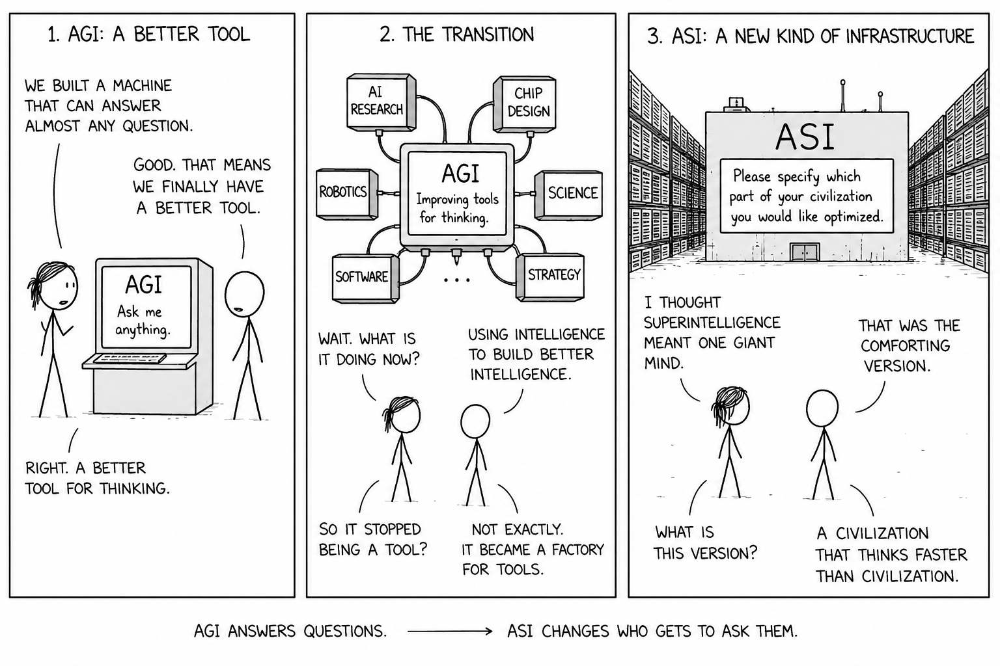

## Introduction

There are technological transitions in which humanity does not merely acquire a new instrument, but modifies the material conditions under which knowledge, coordination, and power are produced. Writing externalized memory. Mathematics externalized abstraction. Scientific instrumentation extended observation beyond the unaided senses. Computation externalized formal procedure. Neural networks may represent a further transition: **the externalization and industrialization of cognition**.

This claim should be stated  carefully. Present neural networks are not minds in the ordinary human sense. They do not reproduce the full structure of human consciousness, embodiment, socialization, or agency. Their epistemic status remains contested. Nevertheless, they have already demonstrated that a broad class of cognitive tasks can be approximated by large-scale function approximation, representation learning, optimization, and inference over high-dimensional data. The relevant discontinuity is therefore not that machines have suddenly become human, but that some capabilities previously associated with human cognition can now be produced by scalable computational systems.

This is the first material fact on which the article is based: neural networks are not merely software artifacts; they are computational mechanisms for extracting, compressing, and recombining structure from data. Their outputs are statistical, fallible, and often opaque, but their practical scope has expanded from perception and pattern recognition to language, code, mathematics, scientific modeling, strategic games, multimodal reasoning, and tool use. This does not prove that they are sufficient for general intelligence. It does show that the **boundary between statistical learning and cognitive work has become empirically unstable**.

The second material fact is compute. Frontier artificial intelligence is now inseparable from industrial-scale computational infrastructure: semiconductor supply chains, accelerator design, hyperscale datacenters, energy procurement, cooling systems, high-speed interconnects, model-serving platforms, and capital expenditure on a scale increasingly comparable to heavy industry. Intelligence, in this regime, is not only an algorithmic property; it is a **production function**. It depends on the **relation between data, architecture, optimization, hardware, energy, and organizational capacity**.

The third material fact is institutional. The leading laboratories are not independent philosophical communities. They are embedded in some of the largest private enterprises in the world, and they operate under investment requirements, competitive pressure, national-security attention, and platform incentives. Their research is scientific, but it is also strategic. When a trillion-dollar firm publishes a paper on pathways from artificial general intelligence to artificial superintelligence, it is not only describing a possible future. It is also articulating the **conceptual framework within which large-scale investment in cognitive infrastructure can be justified**.

This creates an **epistemic asymmetry**. Traditional philosophy, especially epistemology and philosophy of mind, has historically treated intelligence, knowledge, agency, and understanding as conceptual objects. It could do so because, until recently, there was no alternative cognitive substrate capable of performing a broad range of reasoning-like operations. Machine learning changes that condition. It transforms old philosophical questions into engineering questions, and engineering questions back into philosophical problems. What counts as knowledge when systems can produce reliable scientific hypotheses without human-like understanding? What counts as reasoning when valid inference is implemented through learned representations rather than explicit symbolic derivation? What counts as agency when optimization, planning, and tool use are distributed across model, scaffold, memory, and environment?

At the same time, frontier AI companies face a different kind of uncertainty. Their problem is not primarily conceptual but allocative. They must decide whether continued scaling, architectural innovation, and AI-assisted research justify investments in compute and infrastructure that may reach hundreds of billions of dollars. These investments presuppose a thesis: that intelligence scales, and that **scalable intelligence can become economically and strategically decisive**.

The present article examines this thesis through two recent contributions. The first is **Google DeepMind’s report on the transition from AGI to ASI**, which maps possible mechanisms by which human-level machine intelligence could develop into artificial superintelligence.[^industrialization-of-intelligence-deepmind-asi] The second is **Nick Bostrom’s recent preprint on the optimal timing of superintelligence**, which reframes the problem not only as one of existential danger but as a decision problem under mortality, delay, risk, and opportunity cost.[^industrialization-of-intelligence-bostrom-timing]

The objective is not to defend a deterministic prediction. It is to clarify the structure of the problem. If AGI is possible, and if the pathways from AGI to ASI are technically plausible, then the decisive questions become simultaneously technical, epistemological, economic, and political. How does machine intelligence scale? What forms of knowledge does it produce? What are the bottlenecks? Who controls the infrastructure? What are the costs of acceleration and delay? How does society govern a technology whose primary output is not energy, transport, or communication, but cognitive capability itself?

{fig-cap="Compression, abstraction, and the epistemic risk of losing relevant detail."}

## Google DeepMind and the strategic production of artificial superintelligence

To understand the significance of Google DeepMind’s work on the transition from AGI to ASI, one must first understand the type of institution producing it. Google DeepMind is not a conventional academic research group. It is the artificial intelligence research organization of Alphabet, a firm whose infrastructure includes search, advertising, cloud computing, mobile operating systems, consumer software, specialized AI hardware, and global datacenter capacity. This institutional position matters because research produced in such a context is rarely only descriptive. It is also programmatic.

A research paper from a frontier AI laboratory has several functions. It contributes to scientific discourse. It helps structure internal research agendas. It signals technical seriousness to policymakers and peer institutions. It helps justify capital allocation. It also frames uncertainty in a way that can make very large investments appear rational. In the specific case of AGI-to-ASI research, the economic implication is direct: if AGI is not a terminal plateau but a threshold toward artificial superintelligence, then continued investment in compute, algorithms, infrastructure, talent, and deployment ecosystems remains strategically justified.

This is the first thesis implicit in the DeepMind paper: **ASI is not an exotic addendum to AGI, but the central strategic horizon of AGI research**. The paper does not merely ask whether artificial systems may reach human-level competence. It asks whether, once that level is reached, machine intelligence may enter a new regime in which it continues to scale beyond human individuals and beyond human institutions. The transition from AGI to ASI is therefore not a marginal extension of the current AI race. It is the point at which the production of intelligence may itself become increasingly automated, capital-intensive, and recursively improvable.

DeepMind’s historical trajectory gives this claim additional weight. The organization has repeatedly produced systems that shifted the perceived frontier of machine intelligence. Its reinforcement learning work on Atari demonstrated that neural agents could learn policies from high-dimensional perceptual input across multiple tasks.[^industrialization-of-intelligence-atari] AlphaGo combined deep neural networks with tree search and reinforcement learning to defeat world-class human Go players, challenging the assumption that certain strategic domains would remain resistant to machine learning for a longer period.[^industrialization-of-intelligence-alphago] AlphaZero generalized this approach across games by reducing dependence on human examples and relying more heavily on self-play.[^industrialization-of-intelligence-alphazero] AlphaFold then moved the center of gravity from games to scientific modeling by producing highly accurate protein-structure predictions at scale.[^industrialization-of-intelligence-alphafold]

These milestones are not sufficient to prove that AGI or ASI is near. They do, however, show a recurrent pattern: neural systems, when combined with search, scale, and domain-specific structure, can enter domains previously considered to require forms of expertise that were difficult to formalize. This historical background explains why a DeepMind paper on AGI-to-ASI pathways should not be read as generic futurism. It is an attempt by a laboratory with a record of frontier shifts to describe the mechanisms by which the next frontier might move from human-level general intelligence toward artificial superintelligence.

The central message of the report is that **human-level AGI should not be assumed to be a stable equilibrium**. The paper defines AGI as roughly human-level general intelligence and ASI as a system, or system of systems, that surpasses large human organizations across a broad range of domains. This definition is significant because it avoids two common mistakes. It does not reduce superintelligence to narrow superhuman performance, since many systems are already superhuman in narrow tasks. It also does not require ASI to be a single unified mind. It may instead emerge as a collective, a network of agents, or a large-scale computational organization.

This is the second thesis: **ASI should be understood as systemic superiority over human cognitive institutions, not merely as superiority over one human mind**. A single model that performs better than a human expert in a narrow domain is not ASI. Nor is ASI necessarily a solitary artificial agent with a unified personality. In the DeepMind framing, ASI may be an integrated cognitive infrastructure: models, tools, agents, memory systems, automated laboratories, simulators, software pipelines, research workflows, and deployment environments operating together at a scale, speed, and coordination level unavailable to human organizations.

The report then identifies four pathways from AGI to ASI: continued scaling, paradigm shifts, recursive improvement, and collective superintelligence through large-scale multi-agent systems. These pathways are not mutually exclusive. Their importance lies precisely in the fact that they can interact. Scaling may create more capable systems; more capable systems may accelerate AI research; accelerated AI research may produce better architectures; better architectures may support larger agentic collectives; larger collectives may further accelerate research and deployment.

This is the deeper content of the DeepMind thesis. AGI is not only a capability level. It may be a change in the production process of capability. Before AGI, humans are the main producers of AI progress. **After AGI, AI systems may become increasingly important contributors to the production of further AI systems**. That transition changes the dynamics of forecasting. The relevant variable is no longer only model capability at time (t), but the growth rate of the system that produces future capability.

The third thesis is therefore economic and institutional: **if the production of intelligence becomes recursively assisted by intelligence itself, then frontier AI becomes a self-amplifying strategic industry**. This does not mean that ASI is inevitable, immediate, or guaranteed by current architectures. It means that, once AGI-level systems can materially contribute to AI research, software engineering, hardware design, evaluation, data generation, and scientific discovery, the boundary between using intelligence and producing intelligence becomes unstable.

From this perspective, DeepMind’s paper can be read as both a scientific contribution and a strategic document. Scientifically, it maps plausible mechanisms by which AGI may become ASI. Strategically, it explains why a company with access to massive capital, infrastructure, data, and research talent may rationally continue to invest in the frontier even under deep uncertainty. If ASI is a possible endpoint of AGI, and if the path to ASI is mediated by compute, algorithms, and recursive research capability, then the frontier laboratory becomes not only a producer of AI models but a candidate producer of future cognitive infrastructure.

## Inside the DeepMind thesis: why AGI may become ASI

The DeepMind report is intellectually important because it avoids a simplistic version of the intelligence-explosion argument. It does not require a single discontinuous event in which one system instantly becomes uncontrollable or godlike. Instead, it presents a set of mechanisms by which capability may continue to increase after AGI and, under some conditions, approach ASI. This makes the thesis more difficult to dismiss. It does not depend on one speculative pathway; it depends on the possibility that several partially observed trends continue and combine.

The first pathway is **scaling**. Current frontier AI has been strongly shaped by the empirical relation between compute, data, model size, and performance. Scaling laws are not laws of nature in the strict physical sense. They are empirical regularities within a given class of models, datasets, and training regimes.[^industrialization-of-intelligence-scaling-laws] Their extrapolation is uncertain. Nevertheless, they have been sufficiently predictive to guide the strategy of major laboratories. If additional compute, data, inference-time search, and training efficiency continue to yield capability gains, then AGI may not be a natural stopping point.

The ASI relevance of scaling should be made explicit. Scaling is not only a mechanism for making individual models marginally better. It is also a mechanism for increasing the total available stock of machine cognition. A single AGI-like model may be economically significant; a large population of AGI-like systems, deployed across research, engineering, science, administration, cyber operations, and industrial optimization, may constitute a qualitatively different cognitive order. In that case, the route from AGI to ASI does not require one model to become infinitely intelligent. It may require that many systems become sufficiently capable, sufficiently cheap, sufficiently fast, and sufficiently well coordinated.

Scaling must therefore be interpreted at the system level. A single model may plateau, but aggregate capability can still increase through cheaper inference, larger deployments, better memory, more tools, more agents, and more specialized fine-tuning. The difference between one AGI-like system and a million coordinated AGI-like systems is not merely quantitative. It changes the organizational properties of intelligence. Human expert labor scales slowly because education, communication, and biological individuality impose hard constraints. Digital cognition can, in principle, be replicated, parallelized, and coordinated through infrastructure.

The second pathway is algorithmic or **paradigmatic change**. The transformer architecture was not the final theory of intelligence. It was a powerful architecture that made certain forms of sequence modeling, representation learning, and large-scale pretraining extremely effective.[^industrialization-of-intelligence-attention] Future progress may come from new architectures, better memory, world models, planning modules, reinforcement learning, synthetic data generation, causal modeling, formal verification, neurosymbolic hybrids, or systems that combine multiple forms of learning and inference. The relevant point is not that any one paradigm must dominate, but that AGI-capable systems may themselves accelerate the search over paradigms.

The ASI thesis here is that architecture search, training methodology, inference-time computation, tool integration, and memory design may become endogenous to AI systems themselves. If AGI systems can improve the mechanisms through which future AI systems are trained, evaluated, and deployed, then paradigmatic change is no longer produced only by human research communities. It becomes a joint product of human laboratories and machine-assisted research loops. This matters because ASI, in the DeepMind frame, is not simply the result of more parameters. It may be the result of a new regime of automated or semi-automated AI science.

The third pathway is **recursive improvement**. This is the most conceptually important. Recursive improvement does not require a system to rewrite itself autonomously in a single step. More plausibly, it may begin through partial automation of AI research: writing code, designing experiments, debugging training runs, improving compilers, generating synthetic datasets, proposing architectures, optimizing hyperparameters, evaluating models, assisting interpretability, and improving data-center efficiency. If AI systems become meaningfully useful in the production of better AI systems, then intelligence becomes an input into the production of intelligence.

This is the most direct route from AGI to ASI. The decisive transition occurs when artificial systems are no longer only outputs of research but inputs into the research process itself. Once that happens, the capability frontier may become partly self-referential. Better systems help produce better systems; better tools improve the process through which better models are built; better models accelerate the search for better architectures and better training regimes. The strength of this feedback loop is uncertain, but its existence would change the dynamics of AI progress.

The fourth pathway is **collective superintelligence**. Human civilization is already a form of collective intelligence. Science, markets, firms, universities, bureaucracies, and open-source communities transform individual cognition into institutional capability. A large population of AI agents could reproduce some of these coordination functions while avoiding some human bottlenecks: slow communication, limited memory transfer, fatigue, mortality, and inconsistent training. The relevant comparison is therefore not only *AI system versus individual human.* It is *AI collective versus human institution.*

This pathway is central to the concept of ASI because it defines superintelligence at the level of organization rather than at the level of individual psychology. An ASI system may be less like a single genius and more like a compressed artificial civilization: specialized agents, shared memories, automated experimental systems, formal verification tools, code repositories, simulation environments, planning modules, and deployment interfaces operating as a coordinated cognitive economy. Such a system could outperform human institutions without requiring each component to possess every form of human intelligence.

The report is also careful to analyze frictions. These include data limits, energy and compute constraints, hardware supply chains, economic viability, diminishing returns, harder research problems, physical-world experimentation, embodiment, safety restrictions, evaluation failures, hallucination, prompt injection, and the difficulty of reliable abstraction. This is where the paper is strongest as a research agenda. It does not state that ASI follows automatically from AGI. It states that whether progress continues, accelerates, slows, or stalls depends on concrete unresolved questions.

This caution is essential. The DeepMind thesis is not that ASI is inevitable. It is that ASI is a plausible endpoint if several mechanisms operate with sufficient strength and if the bottlenecks are not binding. Data scarcity may limit further pretraining. Physical-world experimentation may slow scientific automation. Energy and chip supply may constrain deployment. Evaluation failures may make advanced systems difficult to trust. Alignment and governance interventions may deliberately limit autonomy. Research problems may become harder faster than AI systems become better at solving them. These are not secondary details; they determine whether AGI remains a powerful tool or becomes the threshold of ASI.

One particularly important issue is abstraction. Human intelligence is not only task performance. It involves the formation of reusable abstractions, causal models, social priors, embodied expectations, and conceptual compression. Current neural systems can form powerful representations, but their abstractions may differ substantially from human ones. This may be a limitation if human-like abstraction is necessary for robust generality. It may also be a source of discontinuity if artificial systems develop alien abstractions that are effective but difficult for humans to interpret.

This creates an **epistemological inversion**: machine learning may produce systems that outperform human researchers in domains where humans cannot fully understand the internal basis of the system’s success. This is already visible in a weaker form in large neural models, where performance often precedes interpretability. If this pattern continues into more general systems, humanity may industrialize parts of cognition before it has a mature theory of cognition.

This epistemological inversion becomes more severe in the ASI case. With AGI, humans may still remain the final evaluators and integrators of machine output. With ASI, that assumption becomes unstable. If systems exceed human institutions across most cognitive domains, then human validation may itself become a bottleneck. The problem is no longer only whether the system can produce true claims, useful designs, or effective strategies. It is whether human societies can build institutions capable of auditing, constraining, and incorporating outputs from systems whose internal representations and strategic reasoning may exceed ordinary human interpretability.

The DeepMind paper should therefore be read as a structured uncertainty map for the AGI-to-ASI transition. It does not prove fast takeoff. It does not prove slow takeoff. It does not prove that ASI is inevitable. Its more defensible claim is that a stable plateau at human-level AGI should not be assumed. If AGI is reached, several mechanisms could push artificial systems toward ASI: continued scaling, architectural innovation, recursive AI-assisted research, and large-scale collective agency. The strength of these mechanisms is an empirical question, but the social significance of the question is already clear. A world with AGI as a powerful tool remains one kind of technological order; a world with ASI as superior cognitive infrastructure is another.

{fig-cap="AGI as question-answering tool; ASI as the infrastructure that changes who can formulate, optimize, and govern questions."}

## Bostrom’s reversal: from existential warning to optimal timing

Nick Bostrom’s work is relevant because it represents one of the most influential attempts to formalize the risks of superintelligence. In **Superintelligence: Paths, Dangers, Strategies**, Bostrom framed the problem primarily as one of control: if artificial systems become more capable than human civilization across strategically relevant domains, then the central question is whether their objectives remain compatible with human interests under conditions of capability asymmetry.[^industrialization-of-intelligence-bostrom-book] This earlier work helped establish the modern vocabulary of intelligence explosion, alignment, instrumental convergence, and existential risk.

His recent preprint, **Optimal Timing for Superintelligence: Mundane Considerations for Existing People**, changes the frame. It does not deny the dangers of superintelligence. It instead argues that risk should not be evaluated against an idealized safe baseline. The baseline is not safety. It is ordinary mortality, disease, aging, suffering, and exposure to other civilizational risks. The paper’s core analogy is that developing superintelligence is not like playing Russian roulette, but more like undergoing risky surgery for a condition that would otherwise be fatal.[^industrialization-of-intelligence-bostrom-timing]

This reframing is analytically important. Russian roulette is a gratuitous gamble: the risk is introduced without an underlying need. Surgery is different: the intervention may kill the patient, but refusal also has consequences. The rational problem is therefore comparative. Which path produces the better expected outcome once both transition risk and baseline risk are included?

Bostrom restricts the analysis to a person-affecting perspective, meaning that the welfare of currently existing people is central. He also limits the paper to _mundane_ considerations, explicitly setting aside more speculative questions such as simulation theory, anthropics, digital minds, infinite ethics, and possible future persons. This makes the model narrower than the full moral problem of superintelligence, but also clearer. It asks: under what assumptions would it be rational, for existing people, to accelerate or delay the arrival of superintelligence?

The answer depends on the assumed benefits of successful superintelligence. If aligned superintelligence could sharply reduce mortality, cure disease, extend healthy lifespan, and improve quality of life, then delay becomes costly. Every year of delay is not merely a year of additional safety research; it is also a year in which people continue to die from ordinary causes and remain exposed to other risks. Bostrom’s models therefore compare the **safety gains purchased by waiting against the mortality and opportunity costs of waiting**.

The simplest model compares immediate launch with non-launch. Under illustrative assumptions in which successful superintelligence reduces mortality to a level corresponding to very long expected healthy lifespan, the acceptable catastrophe probability can become surprisingly high. The exact numbers should not be overinterpreted, because they depend on uncertain parameters. The structural point is more important: if the upside is large enough and the baseline is itself lethal, then high transition risk can still be compatible with increased expected welfare.

The paper then moves from a binary decision to a timing model. Waiting may reduce catastrophic AI risk by allowing further alignment research, testing, governance, and system hardening. However, waiting also extends exposure to ordinary mortality and other background hazards. The optimum depends on the initial risk level, the rate of safety progress, the discount rate, the quality of post-AGI life, risk aversion over life-years, and distributional weights across populations.

A notable result is that long delays are not always favored by higher risk. Long delays become optimal only under specific parameter combinations: initial risk must be high, and safety progress must be sufficiently meaningful to justify waiting but not so rapid that a short wait solves most of the problem. If safety progress is extremely fast, only a brief delay may be needed. If safety progress is extremely slow, waiting may buy too little to justify the mortality cost. The longest delays arise in the intermediate region.

This leads to Bostrom’s compressed policy intuition: _swift to harbor, slow to berth._ The idea is to move relatively quickly toward AGI capability, because pre-capability delay may not be the most efficient way to buy safety. Once AGI-capable systems exist, however, there may be a short period in which safety work becomes unusually valuable because researchers can study the actual artifact, run evaluations, probe failure modes, test containment, and use advanced systems to assist safety research. A late and technically informed pause may therefore be more valuable than an early and indefinite moratorium.

This position is not simple accelerationism. Bostrom explicitly discusses ways in which pauses can backfire: development may move to less cooperative actors, regulation may become safety theater, military exemptions may distort incentives, enforcement may require dangerous control apparatuses, or a pause may create compute and algorithmic overhangs that make later progress more abrupt. The paper therefore distinguishes between the abstract value of delay and the institutional mechanisms used to implement it.

The connection with the DeepMind report is direct. DeepMind maps the pathways by which AGI might become ASI. Bostrom analyzes when it may be rational to cross or delay that threshold. DeepMind’s question is about capability dynamics. Bostrom’s question is about timing under mortality and uncertainty. Together, they imply that the problem cannot be reduced to either technical feasibility or moral fear. It is an optimization problem under deep uncertainty, where both action and inaction carry risk.

However, Bostrom’s framework has limits. Its conclusions depend on assumptions about the magnitude and timing of post-AGI benefits, especially life extension and mortality reduction. If these benefits are smaller, slower, or less evenly distributed than assumed, the case for shorter timelines weakens. The framework also assumes that safety progress can be represented as a function of time, whereas real alignment progress may depend on discrete conceptual breakthroughs or on institutional incentives that do not improve smoothly. Finally, the person-affecting restriction brackets the interests of future generations, possible digital minds, and long-run cosmic outcomes. A broader moral frame could shift the optimum.

The paper’s main value is therefore not that it gives a final timing answer. Its value is that it enforces symmetric accounting. The risk of building superintelligence must be counted, but so must the risk of not building it. Delay may be prudent, but it is not costless. Acceleration may save lives, but it may also increase transition risk. A serious analysis must account for both sides.

## Epistemology under engineered cognition

The emergence of large neural systems creates a distinctive epistemological problem. Traditional epistemology generally begins with human knowers: subjects who have beliefs, reasons, perceptions, testimony, and inferential practices. Machine learning systems do not fit easily into this frame. Their internal representations are learned rather than explicitly authored. Their outputs may be correct without being accompanied by human-legible justification. Their errors may be systematic but difficult to anticipate. Their competence may be local, emergent, and highly sensitive to distributional conditions.

A machine learning researcher is therefore forced into a practical epistemology. The question is not simply whether a model _knows_ something in the human sense. The question is under what conditions its outputs are reliable, calibrated, interpretable, testable, and usable within a broader decision process. This moves **epistemology from the analysis of belief to the analysis of epistemic systems**.

This distinction is important for AGI and ASI. A future artificial system may generate mathematical conjectures, scientific hypotheses, engineering designs, medical interventions, or strategic recommendations that exceed unaided human capacity. The epistemic problem is not solved by labeling the system intelligent. Nor is it solved by rejecting its outputs because it lacks human consciousness. The relevant issue is how to validate claims produced by systems whose internal reasoning may be opaque and whose search processes may be alien.

There is an analogy with earlier scientific instruments. Telescopes, microscopes, particle accelerators, and genome sequencers extend human observation but require calibration, error models, institutional validation, and theoretical interpretation. Neural networks may become instruments of cognition rather than merely instruments of observation. They may extend hypothesis generation, abstraction, and search. But the more they participate in the production of knowledge, the more the epistemic burden shifts from individual justification to system governance.

This has practical consequences. Scientific AI systems should not be evaluated only by benchmark performance. They require traceable experimental interfaces, uncertainty quantification, adversarial testing, replication protocols, provenance controls, and institutional procedures for deciding when machine-generated claims enter the scientific record. In this sense, the epistemology of advanced AI becomes continuous with auditability, safety engineering, and scientific methodology.

The DeepMind report recognizes part of this issue when it discusses the difficulty of measuring AI progress and the possibility that current benchmarks may fail to capture future capabilities. Benchmarks are not neutral windows into intelligence. They are constructed tests, and systems can overfit them, exploit them, or make them obsolete. As capabilities become more general and agentic, evaluation must shift from static tasks to dynamic, adversarial, longitudinal, and institutionally embedded assessment.

This is where philosophy remains necessary, but not sufficient. Conceptual analysis can clarify categories such as agency, understanding, justification, and autonomy. It cannot by itself determine whether a given frontier system is safe, reliable, or epistemically trustworthy. That requires empirical evaluation. Conversely, empirical evaluation without philosophical clarity may measure the wrong object. Advanced AI therefore requires a synthesis: formal methods, machine learning, cognitive science, epistemology, economics, and institutional design.

## Social and geopolitical implications

The pathways from AGI to ASI are not only technical trajectories. They are also trajectories of power. If advanced intelligence becomes increasingly dependent on scalable infrastructure, then access to that infrastructure becomes a strategic variable. Unlike human cognition, artificial cognition at the frontier is capital-intensive. It depends on compute, chips, energy, datacenters, talent, data pipelines, model-serving platforms, and regulatory permission.

This favors concentration. Technologies with high fixed costs, large economies of scale, and strong feedback loops tend to concentrate control. Railways, electricity grids, telecommunications networks, semiconductor fabrication, and cloud computing all exhibit this pattern to different degrees. Frontier AI may exhibit an even stronger version because the infrastructure does not only transmit information or provide computation. It produces general-purpose cognitive capability.

At the firm level, frontier AI may function as a meta-capability. It can contribute to software development, scientific research, product design, logistics, cyber operations, customer interaction, financial modeling, legal analysis, and strategic planning. Firms that control advanced AI systems may therefore obtain leverage over firms that merely use them. This could alter competitive structure across sectors. A pharmaceutical company, bank, manufacturer, or energy firm may remain asset-rich but become dependent on external cognitive infrastructure for optimization and innovation.

At the state level, access to frontier AI may become a component of strategic autonomy. States with semiconductor capacity, energy abundance, cloud infrastructure, advanced research ecosystems, and military integration may obtain advantages in intelligence analysis, cyber defense, weapons development, industrial policy, and scientific acceleration. States without those assets may become dependent on foreign providers not only for software but for strategic interpretation and decision support.

This creates a form of epistemic dependency. A state that relies on foreign AI systems for forecasting, administration, scientific planning, or security analysis may lose part of its capacity to interpret and act on reality independently. The issue is not only data sovereignty. It is cognitive sovereignty: the capacity to produce, validate, and govern the systems through which strategic knowledge is generated.

The same issue applies within societies. Advanced AI may democratize expertise by making high-quality tutoring, medical guidance, legal assistance, coding support, and scientific tools widely available. But democratization is not automatic. If the most capable systems remain expensive, proprietary, and concentrated in a few firms or states, then access to intelligence may become stratified. The social question is therefore not whether AI is beneficial in aggregate, but how access, control, contestability, and accountability are distributed.

This also modifies the alignment problem. A system may be technically aligned with the instructions of its operator while still producing undesirable social outcomes if the operator is excessively concentrated, unaccountable, or geopolitically dominant. Conversely, a highly distributed ecosystem may reduce monopoly power while increasing systemic risk if safety standards are weak. Governance must therefore address two problems simultaneously: catastrophic technical failure and excessive institutional concentration.

## Conclusions

The analysis of AGI-to-ASI pathways suggests that the central problem of artificial intelligence is no longer reducible to model capability alone. It increasingly concerns the economic, institutional, and epistemic structures within which intelligence is produced, deployed, validated, and governed.

The Google DeepMind framework is significant because it formalizes a structural proposition: if AGI is achieved, there are multiple plausible mechanisms by which capabilities may continue beyond the human range. These mechanisms—scaling, algorithmic innovation, recursive AI-assisted research, and collective multi-agent intelligence—do not require a single speculative discontinuity. They are extensions of already observable technological and organizational patterns.

Bostrom’s recent work adds a complementary decision-theoretic dimension. Superintelligence should not be evaluated only against transition risk. It should also be evaluated against the risk of the status quo: mortality, disease, aging, and exposure to other civilizational hazards. This does not imply unrestricted acceleration. It implies that delay is not neutral and that the timing problem must be treated as an optimization under uncertainty.

The combined implication is that neither simple accelerationism nor simple moratorium thinking is adequate. The relevant policy space is more granular. It includes accelerating safety research, interpretability, evaluation science, secure infrastructure, non-agentic or constrained AI designs, and institutional preparedness. It also includes the possibility of late-stage pauses or deployment gates when actual AGI-capable systems can be empirically tested. The most valuable delay may not be an early indefinite halt, but a technically informed interval near the point of deployment, if institutions are capable of using that interval effectively.

The broader social implication is that scalable intelligence may become a new strategic infrastructure. Control over compute, chips, energy, models, talent, and deployment ecosystems may translate into economic and geopolitical power. This makes the organization of advanced AI as important as its technical feasibility. The key questions are who controls frontier systems, who can audit them, who can contest their outputs, who benefits from their deployment, and how dependency on proprietary cognitive infrastructure can be limited.

For epistemology, the implication is equally significant. Machine learning systems are becoming participants in the production of knowledge, not merely tools for storing or transmitting it. This requires a shift from individual-centered theories of knowledge toward the analysis of engineered epistemic systems: systems that include models, data, benchmarks, interpretability tools, validation protocols, institutions, and governance mechanisms.

The practical conclusion is that the transition from AGI to ASI, if it occurs, will not be only a technological event. It will be a reorganization of cognitive production. Its consequences will depend on the interaction between capability growth, safety science, capital concentration, geopolitical competition, and epistemic governance. The problem is therefore not only whether intelligence can scale. It is how the infrastructures of scalable intelligence will be built, constrained, distributed, and made accountable.

[^industrialization-of-intelligence-deepmind-asi]: Genewein, T., Franklin, M., Lerchner, A., Orseau, L., Albanie, S., Bales, A., Wyeth, C., Chan, S., Gabriel, I., Leibo, J. Z., Dafoe, A., Hutter, M., Graepel, T., & Legg, S. (2026). **From AGI to ASI**. *arXiv*. [DOI](https://doi.org/10.48550/arXiv.2606.12683)

[^industrialization-of-intelligence-bostrom-timing]: Bostrom, N. (2026). **Optimal timing for superintelligence: Mundane considerations for existing people**. *Nick Bostrom working paper*. [PDF](https://nickbostrom.com/optimal.pdf)

[^industrialization-of-intelligence-atari]: Mnih, V., Kavukcuoglu, K., Silver, D., Graves, A., Antonoglou, I., Wierstra, D., & Riedmiller, M. (2013). **Playing Atari with deep reinforcement learning**. *arXiv*. [DOI](https://doi.org/10.48550/arXiv.1312.5602)

[^industrialization-of-intelligence-alphago]: Silver, D., Huang, A., Maddison, C. J., Guez, A., Sifre, L., Van Den Driessche, G., Schrittwieser, J., Antonoglou, I., Panneershelvam, V., Lanctot, M., Dieleman, S., Grewe, D., Nham, J., Kalchbrenner, N., Sutskever, I., Lillicrap, T., Leach, M., Kavukcuoglu, K., Graepel, T., & Hassabis, D. (2016). **Mastering the game of Go with deep neural networks and tree search**. *Nature, 529*, 484–489. [DOI](https://doi.org/10.1038/nature16961)

[^industrialization-of-intelligence-alphazero]: Silver, D., Schrittwieser, J., Simonyan, K., Antonoglou, I., Huang, A., Guez, A., Hubert, T., Baker, L., Lai, M., Bolton, A., Chen, Y., Lillicrap, T., Hui, F., Sifre, L., Van Den Driessche, G., Graepel, T., & Hassabis, D. (2018). **A general reinforcement learning algorithm that masters chess, shogi, and Go through self-play**. *Science, 362*(6419), 1140–1144. [DOI](https://doi.org/10.1126/science.aar6404)

[^industrialization-of-intelligence-alphafold]: Jumper, J., Evans, R., Pritzel, A., Green, T., Figurnov, M., Ronneberger, O., Tunyasuvunakool, K., Bates, R., Žídek, A., Potapenko, A., Bridgland, A., Meyer, C., Kohl, S. A. A., Ballard, A. J., Cowie, A., Romera-Paredes, B., Nikolov, S., Jain, R., Adler, J., ... Hassabis, D. (2021). **Highly accurate protein structure prediction with AlphaFold**. *Nature, 596*, 583–589. [DOI](https://doi.org/10.1038/s41586-021-03819-2)

[^industrialization-of-intelligence-scaling-laws]: Kaplan, J., McCandlish, S., Henighan, T., Brown, T. B., Chess, B., Child, R., Gray, S., Radford, A., Wu, J., & Amodei, D. (2020). **Scaling laws for neural language models**. *arXiv*. [DOI](https://doi.org/10.48550/arXiv.2001.08361)

[^industrialization-of-intelligence-attention]: Vaswani, A., Shazeer, N., Parmar, N., Uszkoreit, J., Jones, L., Gomez, A. N., Kaiser, Ł., & Polosukhin, I. (2017). **Attention is all you need**. *Advances in Neural Information Processing Systems*, 30, 5998–6008. [DOI](https://dl.acm.org/doi/10.5555/3295222.3295349)

[^industrialization-of-intelligence-bostrom-book]: Bostrom, N. (2014). **Superintelligence: Paths, dangers, strategies**. *Oxford University Press*. 
