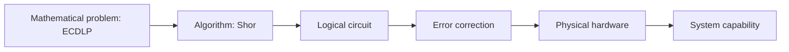
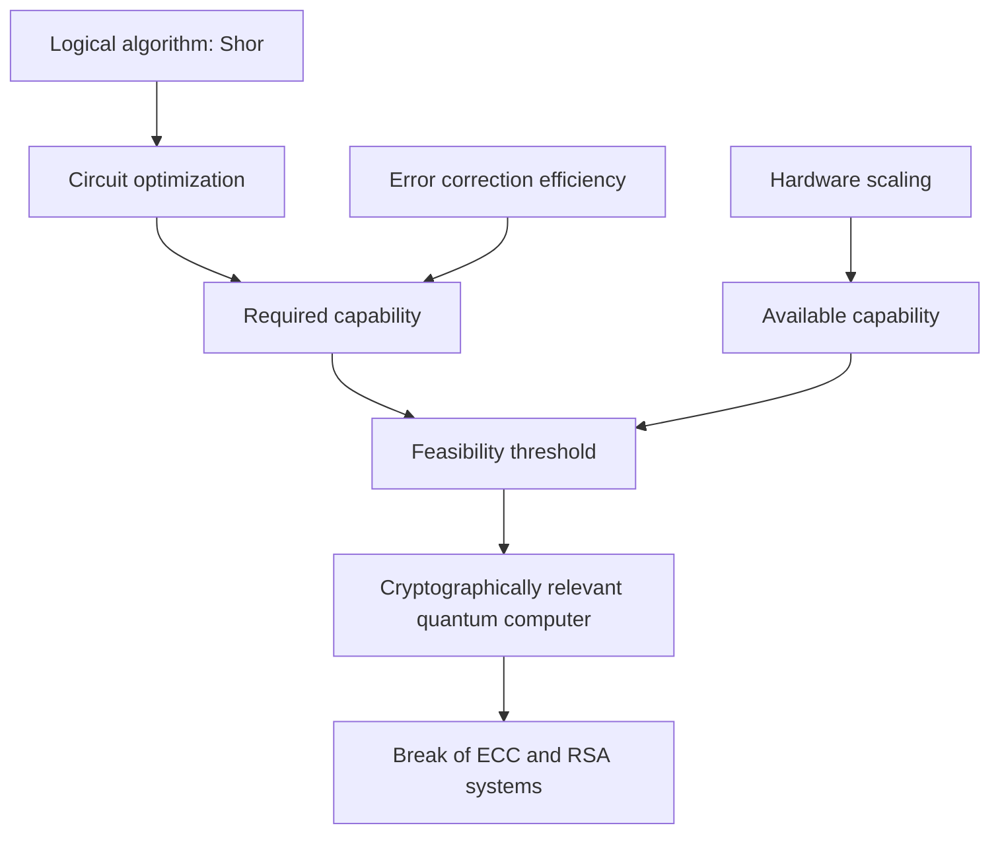
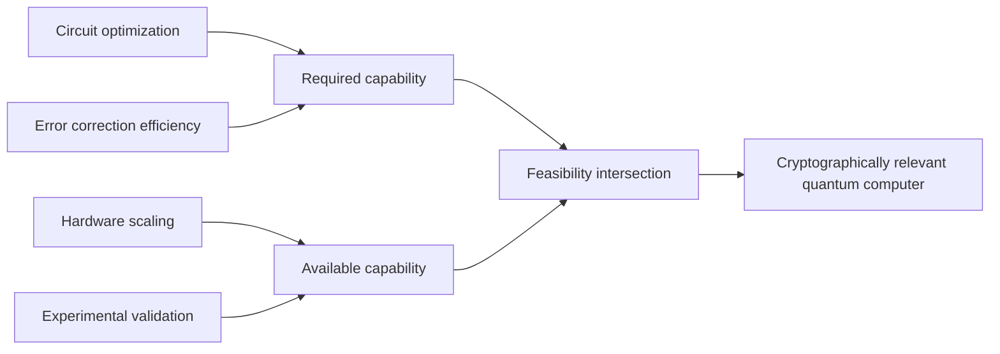

::: {.column-margin}

:::

## Introduction

The relationship between quantum computing and modern cryptography is often described in binary and therefore misleading terms, oscillating between the assertion that quantum attacks remain a distant theoretical construct and the opposite claim that current systems are on the verge of collapse, yet neither position survives a reconstruction from first principles, because the actual question is not whether Shor’s algorithm exists or whether elliptic curve cryptography is mathematically vulnerable, both of which have been established for decades, but rather how the physical realization of quantum computation translates abstract algorithmic complexity into concrete engineering requirements, and it is precisely this translation layer that has undergone a significant refinement through recent work by Google, which has provided updated resource estimates for breaking elliptic curve cryptography under realistic fault-tolerant assumptions, while parallel research efforts, such as the high-rate error-correction constructions discussed in a recent preprint[^quantum-cryptography-edge-feasibility-resource-estimates-architectural-divergence-systemic-risk-Oratomic26], suggest that these requirements may vary substantially depending on architectural choices rather than fundamental limits.

The consequence is that the problem must be reframed from a static statement about vulnerability to a dynamic system in which multiple layers, including logical circuit design, error correction efficiency, and hardware architecture, evolve simultaneously, thereby compressing the distance between theoretical possibility and practical feasibility in a manner that is neither linear nor easily extrapolated from past trends.

## Foundations from first principles

### Physical qubits as unreliable computational substrate

A quantum computer, when reduced to its most basic physical description, is a collection of quantum systems that encode information in superposed and entangled states, yet unlike the abstract qubits of quantum algorithms, physical qubits are subject to decoherence, control noise, and imperfect gate operations, which introduce errors with non-negligible probability at every computational step, and therefore any attempt to execute a deep quantum circuit directly on physical qubits would fail with overwhelming likelihood, since the accumulation of errors grows approximately linearly with circuit depth while the tolerance for error remains exponentially small for meaningful computations.

This immediately establishes a constraint that is independent of any particular cryptographic application, namely that scalable quantum computation requires a mechanism to suppress or correct errors, which in turn implies that the physical qubit is not the appropriate unit of analysis for computational capability, because its behavior is fundamentally unstable over the timescales required by algorithms such as Shor’s.

### Logical qubits and the necessity of error correction

To construct a stable computational model, quantum information is encoded into logical qubits through quantum error-correcting codes, which distribute the state of a single logical qubit across many physical qubits in such a way that errors can be detected and corrected without directly measuring the encoded information, and this encoding introduces a multiplicative overhead that depends on both the physical error rate and the desired reliability of the computation.

In practical terms, this implies that:

* a logical qubit is an abstract, error-corrected entity,
* a physical qubit is merely a component in its implementation,

and the ratio between the two is typically on the order of hundreds to thousands for surface-code-based constructions, which are the most mature and experimentally validated schemes, although alternative approaches, such as those explored in the Oratomic paper, aim to reduce this ratio by exploiting different trade-offs between connectivity, redundancy, and decoding complexity.

The total size of a quantum computer capable of executing a given algorithm can therefore be expressed as:

$$
\text{total physical qubits} = \text{logical qubits} \times \text{encoding overhead}
$$

which immediately shows that any improvement in encoding efficiency translates directly into a reduction in total system size, even if the logical algorithm remains unchanged.

### Gate sets, non-Clifford operations, and the true cost of computation

Quantum circuits are typically decomposed into a universal gate set composed of Clifford operations, which are relatively inexpensive under error correction, and non-Clifford operations, most notably the T gate or its equivalent constructions, which are significantly more costly because they require the preparation of high-fidelity ancillary states through a process known as magic state distillation, and this process dominates both the qubit count and the runtime of large-scale quantum computations.

Therefore, the cost of executing an algorithm such as Shor’s is not determined by the total number of gates in a naive sense, but rather by a weighted combination of:

* the number of logical qubits,
* the depth of the circuit,
* the number of non-Clifford gates,

and it is precisely the reduction of this last component that underlies much of the improvement reported in the Google analysis of elliptic curve cryptanalysis, where optimized circuit constructions significantly reduce the number of required Toffoli gates, thereby lowering the overall resource requirements when mapped onto a fault-tolerant architecture.

### Shor’s algorithm and the structure of cryptographic vulnerability

Shor’s algorithm provides a polynomial-time method for solving problems that are classically intractable, including integer factorization and discrete logarithms, and when applied to elliptic curve cryptography, it enables the recovery of private keys from public keys by solving the elliptic curve discrete logarithm problem, which forms the security foundation of widely deployed systems such as Bitcoin and Ethereum.

At the level of asymptotic complexity, this implies a complete break of elliptic curve cryptography in the presence of a sufficiently large quantum computer, yet this statement remains incomplete without specifying the constant factors and physical resource requirements, because polynomial time does not imply practical feasibility unless the underlying computation can be embedded into a physically realizable system.

This distinction, between mathematical vulnerability and engineering feasibility, is the central axis along which recent research has progressed, as evidenced by the updated resource estimates published by Google in its analysis of quantum attacks on cryptocurrency systems, and by alternative constructions such as those described in the Oratomic preprint[^quantum-cryptography-edge-feasibility-resource-estimates-architectural-divergence-systemic-risk-Oratomic26], which suggest that the efficiency of error correction may be the dominant variable in determining when such attacks become practically realizable.

[^quantum-cryptography-edge-feasibility-resource-estimates-architectural-divergence-systemic-risk-Oratomic26]: See: Cain, M., Xu, Q., King, R., Picard, L. R. B., Levine, H., Endres, M., Preskill, J., Huang, H.-Y., & Bluvstein, D. (2026). **Shor’s algorithm is possible with as few as 10,000 reconfigurable atomic qubits**. _arXiv_. [DOI](https://doi.org/10.48550/arXiv.2603.28627). _Abstract: Quantum computers have the potential to perform computational tasks beyond the reach of classical machines. A prominent example is Shor's algorithm for integer factorization and discrete logarithms, which is of both fundamental importance and practical relevance to cryptography. However, due to the high overhead of quantum error correction, optimized resource estimates for cryptographically relevant instances of Shor's algorithm require millions of physical qubits. Here, by leveraging advances in high-rate quantum error-correcting codes, efficient logical instruction sets, and circuit design, we show that Shor's algorithm can be executed at cryptographically relevant scales with as few as 10,000 reconfigurable atomic qubits. Increasing the number of physical qubits improves time efficiency by enabling greater parallelism; under plausible assumptions, the runtime for discrete logarithms on the P-256 elliptic curve could be just a few days for a system with 26,000 physical qubits, while the runtime for factoring RSA-2048 integers is one to two orders of magnitude longer. Recent neutral-atom experiments have demonstrated universal fault-tolerant operations below the error-correction threshold, computation on arrays of hundreds of qubits, and trapping arrays with more than 6,000 highly coherent qubits. Although substantial engineering challenges remain, our theoretical analysis indicates that an appropriately designed neutral-atom architecture could support quantum computation at cryptographically relevant scales. More broadly, these results highlight the capability of neutral atoms for fault-tolerant quantum computing with wide-ranging scientific and technological applications._

### Layered decomposition of the problem

The discussion above can be summarized by decomposing the quantum attack problem into distinct but interacting layers, each of which contributes multiplicatively to the total resource requirement.

This decomposition makes explicit that improvements at any layer, whether through circuit optimization, more efficient error correction, or advances in hardware architecture, propagate through the entire stack, and therefore the feasibility of breaking cryptographic systems is not determined by a single breakthrough but by the combined evolution of multiple components whose interactions must be analyzed jointly rather than in isolation. 

## Revised resource estimates and circuit-level optimization

### Scope and epistemic status of the result

The work published by Google, both in its research blog **Safeguarding cryptocurrency by disclosing quantum vulnerabilities responsibly** and in the associated technical whitepaper[^quantum-cryptography-edge-feasibility-resource-estimates-architectural-divergence-systemic-risk-Google226], must be understood precisely in terms of what it does and does not claim, because it does not introduce a new algorithm, does not demonstrate a working cryptanalytic attack, and does not alter the asymptotic complexity of Shor’s algorithm, but instead provides a **refined mapping between the logical requirements of the algorithm and the physical resources needed to execute it under a fault-tolerant model**, thereby reducing uncertainty in the engineering layer that separates theoretical vulnerability from practical exploitability.

[^quantum-cryptography-edge-feasibility-resource-estimates-architectural-divergence-systemic-risk-Google126]: See: [Google research blog]
(https://research.google/blog/safeguarding-cryptocurrency-by-disclosing-quantum-vulnerabilities-responsibly/)

[^quantum-cryptography-edge-feasibility-resource-estimates-architectural-divergence-systemic-risk-Google226]: See: [PDF]
(https://quantumai.google/static/site-assets/downloads/cryptocurrency-whitepaper.pdf)

The key contribution is therefore epistemic rather than algorithmic, in the sense that it improves the precision of the cost model rather than the structure of the computation itself, yet this refinement has direct implications for risk assessment because security margins depend on quantitative thresholds rather than purely asymptotic arguments.

### Quantitative results and normalization across layers

The central numerical result reported by Google is that solving the elliptic curve discrete logarithm problem for a 256-bit curve, such as secp256k1 used in Bitcoin, requires on the order of:

* approximately **1200 to 1450 logical qubits**,
* approximately **70 to 90 million Toffoli gates**,

which, when translated through a surface-code-based error correction model, corresponds to fewer than **500,000 physical qubits** under reasonable assumptions about physical error rates and code distances.

To interpret these numbers correctly, it is necessary to distinguish three layers:

1. logical requirement (algorithmic),
2. circuit cost (gate count and depth),
3. physical realization (error correction + hardware),

and to recognize that the apparent discrepancy between “~1200 qubits” and “~500,000 qubits” is not a contradiction but a transformation across these layers, where the latter includes the full overhead of fault tolerance.

### Circuit-level sources of improvement

The reduction relative to earlier estimates arises from a set of optimizations that operate entirely within the logical and circuit layers, and can be decomposed into three main components:

1. **finite field arithmetic**, which dominates elliptic curve operations, has been re-engineered using more efficient reversible circuits that reduce both the number of required operations and the number of ancillary qubits, particularly in modular multiplication and inversion, which are the most resource-intensive subroutines.

2. The global structure of the circuit has been optimized through **register reuse and uncomputation strategies**, which eliminate intermediate states as soon as they are no longer needed, thereby reducing both logical qubit footprint and circuit depth without altering the underlying computation.

3. The decomposition of arithmetic operations into the Clifford plus T gate set has been optimized to significantly reduce the number of **non-Clifford gates**, especially Toffoli gates, which are the dominant cost driver in a fault-tolerant architecture due to their reliance on magic state distillation.

These optimizations do not change the mathematical structure of Shor’s algorithm, but they reduce the constant factors that determine whether the algorithm is implementable in practice.

### Dominance of non-Clifford gates and magic state distillation

The most important aspect of the Google result is the reduction in Toffoli gate count, because in a fault-tolerant quantum computer, each Toffoli gate requires the preparation of high-fidelity magic states through a distillation process that consumes both time and a large number of physical qubits.

This implies that:

* total runtime is heavily influenced by T/Toffoli count,
* total qubit count is influenced by the number of parallel distillation factories required,

and therefore reducing the number of non-Clifford gates has a **non-linear effect** on total resource requirements, simultaneously decreasing runtime, qubit count, and system complexity.

This is the primary reason why the reported improvement, often described as an order-of-magnitude reduction relative to prior estimates, emerges even though the underlying algorithm remains unchanged.

### Runtime is not the limiting factor

One of the most consequential implications of the refined circuit is that, once a sufficiently large fault-tolerant quantum computer exists, the time required to execute the attack is relatively short compared to the effort required to build such a machine.

Given:

* ~10⁸ Toffoli gates,
* per-gate time on superconducting architectures on the order of microseconds,

the total execution time is on the order of:

* **10³ seconds, i.e., minutes to hours**,

which implies that the bottleneck in cryptographic attacks is not runtime but **machine construction**, and therefore the risk model must focus on when such machines become available rather than on how long an attack would take once executed.

### Structured representation of the Google resource model

The relationship between logical requirements, circuit optimization, and physical realization can be summarized as follows:

This diagram makes explicit that the Google contribution operates primarily between the logical and circuit layers, reducing the gate count and thereby lowering the burden on the error correction layer, while the mapping to physical qubits remains dependent on the chosen error correction scheme, which is precisely the dimension along which the Oratomic approach introduces further variability.

### Interpretation and limits

It is essential to emphasize that the result does not imply that current cryptographic systems are vulnerable today, because no existing quantum computer approaches the required scale or level of fault tolerance, but it does imply that the distance between current capability and required capability is smaller than previously estimated, and more importantly, that this distance is being reduced by ongoing improvements at multiple layers of the computational stack.

In this sense, the Google result should be interpreted not as a breakthrough in cryptanalysis, but as a **compression of uncertainty**, which forces a reassessment of timelines and migration strategies for post-quantum cryptography.

## Implications for cryptocurrencies and the broader cryptographic ecosystem

### Structural exposure of elliptic curve systems

Cryptocurrencies such as Bitcoin and Ethereum rely on elliptic curve digital signature schemes, most notably ECDSA and Schnorr variants, whose security is reducible to the hardness of the elliptic curve discrete logarithm problem, and therefore any entity capable of executing Shor’s algorithm at the scale described in the previous section would be able to derive private keys from public keys and produce valid signatures indistinguishable from legitimate ones, which implies a complete break of the authentication layer rather than a degradation of security.

However, the exposure is not uniform across all assets, because the attack requires access to a public key, and in many blockchain systems public keys are revealed only when funds are spent, meaning that:

* addresses that have never exposed their public key remain temporarily protected,
* addresses with reused or already exposed public keys are immediately vulnerable.

This introduces a dependency between **usage patterns and security posture**, which is unusual in classical cryptography but intrinsic to blockchain transaction models.

### Temporal asymmetry and attack window compression

A critical implication of the optimized quantum circuits described by Google is that, once the required hardware exists, the time needed to execute an attack is relatively short, on the order of minutes to hours, which creates a narrow but decisive window between the moment a public key is revealed and the moment an attacker can derive the corresponding private key.

This window can be further compressed through architectural strategies such as partial precomputation, in which a quantum system prepares generic intermediate states in advance and incorporates the specific public key only in the final stages of computation, thereby reducing the latency between observation and exploitation.

From a first-principles standpoint, this implies that:

* defense requires preemptive migration,
* attack can be executed reactively,

and therefore the system exhibits a **temporal asymmetry**, where the defender must act before the capability exists, while the attacker can act immediately once it does.

### ECC versus RSA: asymmetry in vulnerability timelines

A further implication, reinforced by recent resource estimates, is that elliptic curve cryptography is expected to become vulnerable earlier than RSA, not because of a difference in asymptotic complexity, but because optimized circuit constructions for elliptic curve discrete logarithms currently require fewer logical qubits and lower gate counts than comparable constructions for large-integer factorization.

This leads to a counterintuitive but important conclusion:

> systems that have migrated from RSA to elliptic curve cryptography for efficiency reasons may face earlier exposure in a quantum context.

Therefore, risk models that rely on RSA-based timelines may systematically underestimate the urgency of migration for systems predominantly using elliptic curves.

### Beyond cryptocurrencies: systemic cryptographic exposure

The implications extend far beyond cryptocurrencies, because elliptic curve and RSA-based primitives are deeply embedded in the global digital infrastructure, including:

* TLS protocols securing web communications,
* VPN systems and secure tunnels,
* digital identity frameworks and authentication systems,
* code signing and software update mechanisms,

and in many of these cases, the confidentiality requirement is long-lived, meaning that data encrypted today may still need to remain secure decades into the future, which introduces the well-known **harvest now, decrypt later** threat model, in which adversaries store encrypted data with the expectation of decrypting it once quantum capabilities become available.

### Convergence of independent improvement vectors

The most important structural shift emerging from the combination of recent results, including the Google analysis and the Oratomic approach, is that improvements are occurring simultaneously across multiple layers of the quantum computing stack, and these improvements interact multiplicatively rather than additively.

From a systems perspective, feasibility can be expressed as:

$$
\text{feasibility} \approx (\text{logical complexity reduction}) \times (\text{circuit optimization}) \times (\text{error correction efficiency}) \times (\text{hardware scaling})
$$

where:

* circuit optimization reduces gate counts (Google result),
* error correction efficiency reduces physical qubit overhead,
* hardware scaling increases available qubits and stability.

The key insight is that progress along each axis compounds, meaning that even moderate improvements at each layer can collectively produce a substantial reduction in the overall distance to a cryptographically relevant quantum computer.

### Architectural heterogeneity and uncertainty

Unlike classical computing, where architectural diversity converges toward a relatively small set of dominant paradigms, quantum computing currently exhibits multiple competing architectures, including superconducting circuits, trapped ions, photonic systems, and neutral atom arrays, each with distinct trade-offs in terms of connectivity, gate speed, error rates, and scalability.

This leads to fundamentally different feasibility profiles:

* high-connectivity systems may reduce error correction overhead but operate at lower clock speeds,
* fast-clock systems may achieve shorter runtimes but require larger qubit counts,

and therefore the timeline for practical cryptographic attacks is not determined by a single trajectory but by the interaction between these competing paradigms.

### System-level representation of convergence

The interaction between these layers and architectural choices can be represented as follows:

This diagram highlights that feasibility is reached when the required capability, reduced by improvements in circuit design and error correction, intersects with the available capability provided by hardware scaling, and that both sides of this equation are evolving simultaneously.

### Strategic implications: from cryptography to architecture

The final implication is that the transition to post-quantum cryptography is not merely a matter of replacing one algorithm with another, but a broader architectural transformation that requires:

* inventorying cryptographic dependencies across systems,
* enabling crypto-agility to support multiple algorithms concurrently,
* deploying hybrid schemes that combine classical and post-quantum primitives,
* coordinating migration across distributed and long-lived infrastructures,

and therefore the problem shifts from pure cryptography to **systems engineering and governance**, where the primary challenge is not the design of secure primitives, which already exist in standardized form, but the controlled and timely integration of these primitives into complex, interdependent systems.

### Conclusion of the impact analysis

Taken together, these considerations show that the significance of recent advances lies not in the immediate feasibility of quantum attacks, but in the **compression of the uncertainty space**, which reduces the margin for delayed action and increases the importance of proactive migration strategies, because the intersection between theoretical vulnerability and practical exploitability is no longer a distant abstraction but a moving boundary whose trajectory is shaped by multiple interacting technological trends.

## From theoretical vulnerability to architectural inevitability

### Reframing the problem

When reconstructed from first principles, the question of quantum impact on cryptography is not whether existing public-key systems are mathematically secure, because that question has already been answered in the negative by the existence of Shor’s algorithm, nor is it whether a large-scale quantum computer exists today, because it clearly does not, but rather how the evolving relationship between algorithmic requirements and physical realizability determines the point at which theoretical vulnerability becomes operationally exploitable.

Recent work by Google has reduced uncertainty on the **required capability side** by refining the mapping from logical computation to physical resources, while alternative constructions such as those described in the Oratomic preprint and related research directions indicate that the **efficiency of error correction**, rather than the logical structure of the algorithm, may be the dominant variable in determining total system size, and at the same time hardware platforms continue to scale, albeit along heterogeneous and partially divergent trajectories.

The result is that the problem must be understood as a **dynamic convergence process**, not a static threshold.

### The collapse of single-trajectory thinking

Historically, discussions of quantum risk implicitly assumed a single technological path, typically based on surface-code error correction and superconducting qubits, leading to estimates on the order of millions of physical qubits and therefore timelines perceived as distant and uncertain.

The emerging evidence invalidates this assumption, because multiple architectural equilibria are now plausible:

* high-redundancy, fast-clock systems with large qubit counts,
* lower-redundancy, high-connectivity systems with smaller qubit counts but longer runtimes,

and these equilibria correspond to different points in a multi-dimensional design space defined by:

* connectivity constraints,
* error correction overhead,
* gate fidelity and speed,
* system integration complexity.

Therefore, the relevant question is no longer “how many qubits are needed” in a universal sense, but:

> under which architectural assumptions, and with which trade-offs, a cryptographically relevant quantum computer becomes feasible.

### Compression of uncertainty as the primary signal

The most important shift introduced by recent results is not a dramatic reduction in a single parameter, but the **simultaneous tightening of bounds across multiple layers**, which reduces the uncertainty that previously separated theoretical possibility from engineering plausibility.

This can be expressed as a convergence between two evolving functions:

* required capability, which is decreasing due to circuit optimization and improved error correction,
* available capability, which is increasing due to hardware scaling and experimental progress,

and the intersection of these functions defines the feasibility threshold.

This representation emphasizes that no single breakthrough is required; rather, incremental improvements across multiple layers collectively move the system toward feasibility.

### Implications for risk and decision-making

From a risk perspective, the expected impact of quantum computing on cryptographic systems is already maximal, because the successful execution of Shor’s algorithm would completely break widely deployed primitives, and therefore the only variable that remains uncertain is the **time horizon**, which is itself becoming more constrained as estimates improve.

This leads to a critical asymmetry:

* the cost of early migration is bounded and largely known,
* the cost of delayed migration, if the threshold is crossed unexpectedly, is unbounded and potentially systemic,

and therefore rational decision-making must be based not on certainty of timelines, which is unattainable, but on the recognition that the **variance of the timeline is decreasing**, which increases the probability that the transition occurs within the planning horizon of current systems.

### From cryptographic primitives to system architecture

The final and perhaps most consequential implication is that the problem is no longer primarily cryptographic, because post-quantum algorithms have already been standardized and are available for deployment, but architectural, in the sense that real-world systems must be:

* inventoried to identify cryptographic dependencies,
* redesigned to support crypto-agility,
* migrated through hybrid states that combine classical and post-quantum primitives,
* coordinated across organizational and jurisdictional boundaries.

This transforms the challenge from one of mathematical security to one of **system integration, governance, and lifecycle management**, where the difficulty lies not in defining secure algorithms but in ensuring their consistent and timely adoption across complex and interdependent infrastructures.

### Final synthesis

Taken together, the current state of the field can be summarized as follows:

* the mathematical vulnerability of current public-key cryptography is established,
* the logical requirements for exploiting this vulnerability are increasingly well understood,
* the physical realization of these requirements is no longer anchored to a single, high-cost paradigm,
* multiple independent improvement vectors are simultaneously reducing the distance to feasibility,

and therefore:

> the transition from classical to post-quantum cryptography should be understood not as a reaction to a future breakthrough, but as an ongoing adaptation to a system whose feasibility boundary is already moving toward the present.

This reframing shifts the discussion from speculative forecasting to **active architectural planning**, which is the appropriate domain for addressing a risk that is both inevitable in principle and increasingly bounded in practice.

