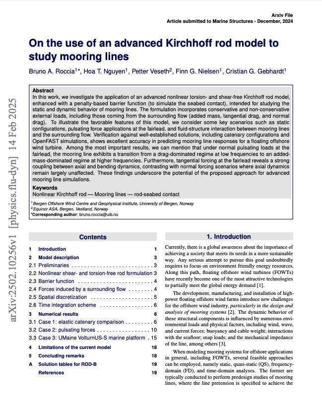
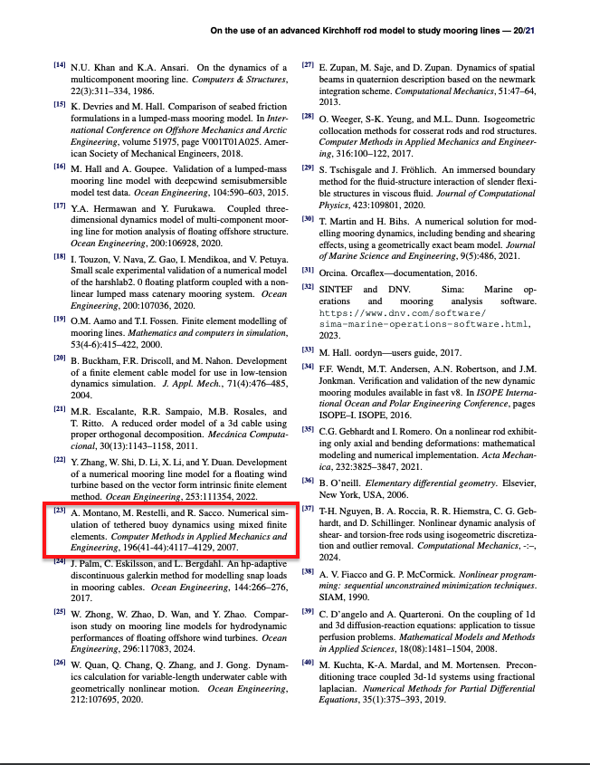
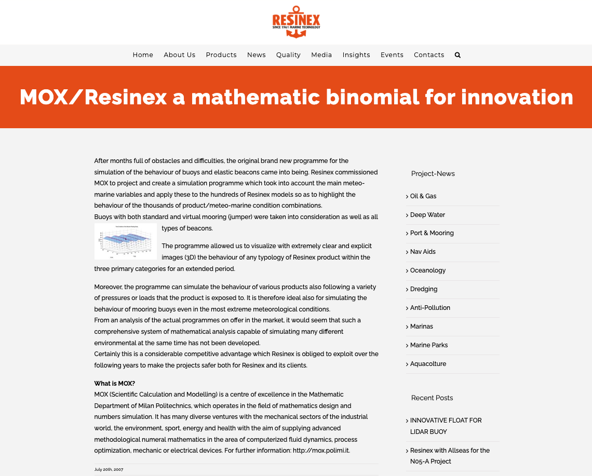
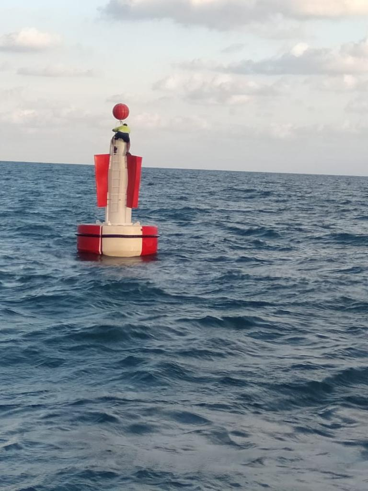
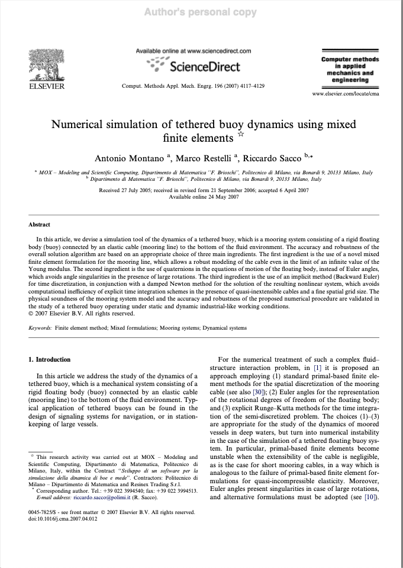

A few days ago, I received a fresh citation notification referencing an article titled [“On the use of an advanced Kirchhoff rod model to study mooring lines"](https://arxiv.org/abs/2502.10256). That small note sparked a surge of memories from the intense period when I was searching for a stable, accurate way to model a tethered buoy system. It seemed like the perfect moment to revisit a project that, for me, was marked by long stretches of frustration and the pure joy of each breakthrough.

It’s remarkable how twenty years can deepen one’s perspective on a project as intricate and rewarding as simulating a tethered buoy system. I initially aimed to model a buoy afloat on the ocean surface, secured by a cable so stiff that it scarcely stretched under large tension. Over the years, I’ve watched that early spark of curiosity evolve into a comprehensive understanding of the theoretical and practical details essential to making it all work. Despite countless hours testing equations, running simulations, and honing algorithms, this endeavor remains among the most gratifying I’ve undertaken.

::: {layout-ncol=2}

:::

## The challenge

Mixed finite elements emerged as the linchpin for dealing with a cable of extremely high Young’s modulus. In a more standard approach, tension might be computed strictly as a derivative of displacement, a method prone to severe numerical instability, especially when the model was pushed close to its inextensible limit. By employing a strategy akin to incompressible fluid simulations, in which pressure is treated separately from velocity, we disentangled tension from displacement. This demanded meticulous algebraic checks, careful boundary condition enforcement, and diverse validation tests. Yet the outcome was a stable formulation capable of handling real-world cable stiffness. It often reminded me of fluid mechanics, where treating pressure as an independent variable helps circumvent the pitfalls of near-incompressibility.

Quaternion-based buoy motion posed a similarly unconventional challenge. Large, abrupt rotations from rough seas or vigorous currents made Euler angles precarious—one intense swing could trigger numerical lockups or cause the entire orientation model to fail. By turning to quaternions, although less common in many engineering circles at the time, we found a smooth, singularity-free representation of every possible orientation in three-dimensional space. We tested the approach with simulations of tempest-level storms and sharp angle changes to confirm that the buoy’s motion stayed plausible. Repeatedly, quaternions rose to the occasion, allowing the buoy’s full rotational dynamics to unfold without numerical breakdown.

Implicit time-stepping formed the final cornerstone of our method. A cable on the brink of inextensibility transmits wave forces at high speeds, rendering an explicit solver prohibitively slow due to the tiny time steps required for stability. We chose a backward Euler scheme, tackling a large-scale, nonlinear system at each time increment. To manage the complexity, we turned to a damped Newton method, iterating on a solution guess while tuning the damping for smooth convergence. Though heavier computationally, this allowed for significantly larger time steps and a practical balance between accuracy and runtime. In numerous experiments, once the Newton iterations converged, the results were physically coherent and free of the instabilities we had feared.

## The results

Armed with these three pillars, we investigated diverse scenarios, from cables so stiff they bordered on rigid to longer, more flexible lines. We included realistic wave heights, wind speeds, and currents typical of commercial mooring installations. Observing the buoy’s subtle rocking, dramatic heaving, and swirling rotations underscored how the system responded to external forces. Each validation run comparing our data with known behavior reinforced confidence that we had captured the essential physics.

Even when we dialed stiffness to extremes, the simulation avoided catastrophic instability. Our mixed formulation for cable tension and displacement, coupled with an implicit time stepper, maintained a consistent evolution from step to step. Simultaneously, quaternions let us depict conditions ranging from tranquil seas, with mild buoy bobbing, to rough waters involving severe pitching and rolling. Feedback from industry contacts affirmed that these capabilities opened valuable avenues for mooring design, especially under extreme weather or when safeguarding delicate equipment on the buoy deck. By matching simulations to real-world observations—like how far a buoy might drift under heavy seas—we significantly bolstered trust in our overall approach.

In the end, the model bridged a gap between purely theoretical inquiry and the concrete engineering tasks that oceanographers, marine engineers, and equipment designers face. Running multi-day or even multi-week simulations without exorbitant computational overhead was an exciting prospect. This was no longer a mere academic puzzle; it was a practical tool likely to inform how mooring lines are specified, built, and managed, whether for scientific stations or navigation beacons in high-traffic waters.

::: {layout-ncol=2}

:::

This project also unified my engineering approach to physics and mathematics in a problem that originated from a company that, to this day, continues to produce buoys. The challenge wasn’t just academic; it was a real-world issue that required scientific rigor to solve. The culmination of our work was published in **Computer Methods in Applied Mechanics and Engineering** under the title **[Modeling and Numerical Simulation of Tethered Buoy Dynamics](https://doi.org/10.1016/j.cma.2007.04.012)**, co-authored with Marco Restelli and Riccardo Sacco. The publication validated our approach and demonstrated that tackling practical engineering problems with strong theoretical foundations could yield robust and widely applicable solutions.

::: {layout-ncol=1}

:::

## Looking back

Reflecting on this project, I’m amazed at the breadth of expertise required. We merged advanced finite element theories, wave force modeling, buoy geometry, and fluid–structure interaction, all in a single system. Yes, we faced frustrating snags—bug hunts that stretched late into the night or solver conflicts that cropped up unexpectedly—but each resolution felt like a tangible stride toward a robust, trustworthy model.

The satisfaction stands out most vividly. Every instance of pushing the model—testing bigger waves, trickier cables, or new geometric nuances—brought the thrill of seeing it hold firm. The mathematics we’d nurtured for so long manifested as on-screen visualizations of swirling seawater, with a buoy steadily riding the crests and troughs. It was then that I realized we had transcended theoretical musings, delivering a resource for engineers, researchers, and maritime professionals alike.

Two decades on, I still regard it as a testament to collaboration, persistence, and solid mathematical foundations. Tackling problems of this scope often demands stepping beyond familiar territory, whether by redefining tension as a separate unknown or adopting quaternions for orientation. My hope is that others may glean encouragement from our experiences, confident that even though the road is strewn with roadblocks and late-night coding trials, a thoroughly validated, widely beneficial system makes it all worthwhile.

I should also underline how indispensable the MOX environment at Politecnico di Milano was. The department teemed with resourceful researchers who offered both theoretical knowledge and practical engineering insight. They possessed a rare knack for fusing advanced mathematical techniques with real-world requirements, their open-minded spirit inspiring each brainstorming session. Working there meant a stream of fresh ideas, incisive critiques, and the kind of camaraderie that keeps tough projects alive.

To this day, nothing pleases me more than receiving word of a fresh citation or reference to our work. Each new mention affirms that the methods we pieced together continue to serve those who grapple with similarly challenging scenarios. That ongoing relevance speaks volumes about the enduring value of thorough research, well beyond the date of publication.

You can download a preprint [here](https://mox.polimi.it/reports-and-books/publication-results/?id=77).