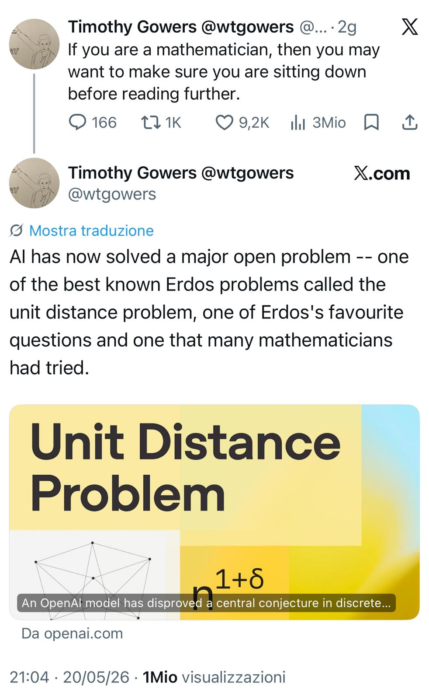

## A strange sentence

In May 2026, mathematician Timothy Gowers posted a sentence on X that immediately spread across the mathematical community:

> _If you are a mathematician, then you may want to make sure you are sitting down before reading further._

{fig-alt="Gowers on X" fig-align="center"}

The reason was not hype marketing, venture capital rhetoric, or another benchmark announcement. The announcement was that an AI system had contributed to solving a major open problem associated with Paul Erdős: the **unit distance problem**.[^the-erdos-moment-of-ai-openai]

For many observers outside mathematics, this may appear obscure. But among mathematicians, Erdős problems occupy a particular symbolic status. The OpenAI announcement itself stresses that the problem is described in *Research Problems in Discrete Geometry* as possibly the best-known and simplest-to-explain problem in combinatorial geometry, and reports Noga Alon's description of it as one of Erdős's favorite problems.[^the-erdos-moment-of-ai-erdos] They are usually simple to state, deceptively deep, resistant to brute force, and tightly connected to the structure of mathematical reasoning itself.

The significance is therefore not merely that an AI system produced a correct proof. The significance is that a system based fundamentally on statistical learning appears to have crossed into a domain previously considered one of the clearest expressions of human abstract reasoning.

The event matters not only for mathematics. It matters because mathematics is often the hardest possible environment for testing reasoning systems.

## The unit distance problem

The technical details are less important than the structure of the problem. The question concerns how many pairs of points in the plane can be exactly one unit apart among a finite set of points.

Very roughly:

- place many points on a plane,
- count how many pairs are separated by distance exactly equal to 1,
- determine the maximal asymptotic growth law.

What makes the problem difficult is that geometry, combinatorics, graph structure, and asymptotic reasoning interact in highly nontrivial ways.

The conjecture addressed by the OpenAI model was one of the central open questions in discrete geometry. According to the published material, the model generated a construction disproving a long-standing conjecture by showing that the true asymptotic behavior is larger than previously believed.[^the-erdos-moment-of-ai-construction]

The key point is not merely _AI found an answer_, but rather that the system explored an enormous conceptual search space and identified a non-obvious mathematical construction that human researchers had not discovered. The externally written remarks describe a human-verified, digested version of the OpenAI-generated counterexample and make clear that the final mathematical object was interpretable and checkable by specialists.[^the-erdos-moment-of-ai-remarks]

That is qualitatively different from symbolic theorem provers checking formal derivations. It is closer to creative mathematical exploration.

## Why mathematicians reacted strongly

Mathematicians are usually conservative toward claims of automation. For good reason. Most mathematical progress depends not on calculation but on:

- abstraction,
- analogy,
- construction of intermediate objects,
- recognition of hidden invariants,
- conceptual reframing.

For decades, AI systems were weak precisely where mathematics is strongest: long-horizon reasoning, symbol manipulation, generalization, proof structure, nonlocal dependencies.

Previous systems could assist with verification or narrow formal proof tasks, but they rarely produced genuinely surprising conceptual objects. That is why the judgment quoted by OpenAI is unusually strong: Gowers stated that, had the paper been submitted by a human to the *Annals of Mathematics*, he would have recommended acceptance without hesitation.[^the-erdos-moment-of-ai-annals] That is why the emotional reaction from some mathematicians was unusually strong. The event was perceived less as _automation of labor_ and more as a breach of a psychological boundary.

The attached X post captures this perfectly. Gowers does not frame the result as incremental progress. He frames it almost as disbelief. That reaction itself is evidence. Experts usually possess tacit calibration about what machines can and cannot do in their field. When domain experts become visibly surprised, it often signals that a capability threshold has been crossed.

## What actually changed technically

The most important shift is probably not raw intelligence in the human sense. The deeper shift is the emergence of systems capable of *guided exploration in abstract spaces*.

Modern reasoning models combine several properties:

1. gigantic latent representations learned from mathematics and text,
2. probabilistic search over symbolic structures,
3. iterative self-correction,
4. long-context reasoning,
5. tool-assisted verification,
6. reinforcement learning on reasoning trajectories.

The resulting system is not _thinking_ in the human phenomenological sense. But from an operational perspective, it can increasingly perform functions previously associated with expert cognition.

This distinction matters. Many discussions about AI become trapped in metaphysical arguments about consciousness or understanding. But engineering history repeatedly shows that systems do not need to reproduce human internal mechanisms to reproduce externally valuable outcomes:

- airplanes do not flap wings,
- calculators do not understand arithmetic,
- compilers do not understand software.

Yet all outperform humans in their operational domains. The relevant question is therefore not:

> _Does the model understand mathematics like a human?_

The relevant question is:

> _Can the system reliably generate novel valid mathematical structures?_

The answer now appears to be increasingly yes.

## The real implication is scientific acceleration

The public discussion often focuses on whether AI will replace mathematicians. That is probably the wrong frame. More important is the possibility that AI systems become *cognitive accelerators for frontier research*.

Historically, many scientific domains evolved through three phases:

| Phase             | Dominant bottleneck              |
| ----------------- | -------------------------------- |
| Experimental era  | Data acquisition                 |
| Computational era | Numerical simulation             |
| AI-assisted era   | Hypothesis generation and search |

The current transition suggests that parts of theoretical exploration itself may become computationally scalable. That changes the economics of discovery. If AI systems can generate:

* candidate conjectures,
* constructions,
* proof sketches,
* counterexamples,
* abstraction hierarchies,
* combinatorial searches,

then the limiting factor in science partially shifts from raw human ideation toward orchestration, validation, and interpretation. This does not eliminate researchers. It changes their role.

## Mathematics is only the beginning

The broader significance appears when we generalize beyond mathematics. Many hard engineering and scientific domains have similar structural properties:

* huge search spaces,
* hidden constraints,
* rare valid solutions,
* long dependency chains,
* symbolic structure,
* high-dimensional optimization.

This includes:

* materials science,
* compiler optimization,
* chip design,
* cryptography,
* molecular engineering,
* logistics,
* operations research,
* industrial process optimization,
* enterprise architecture,
* cybersecurity defense modeling.

In all these domains, humans currently act as heuristic search engines with domain intuition. AI systems increasingly augment or partially automate that search process.

The consequence is not simply productivity improvement, but that certain classes of discovery may become dramatically cheaper.

## Why this resembles an inflection point

The essay by the Machine Intelligence Research Institute correctly highlights something important: capability growth is becoming difficult to extrapolate linearly.[^the-erdos-moment-of-ai-miri] 

A common historical mistake is to assume that because systems failed at a task for decades, they will continue failing indefinitely. But many technological transitions are discontinuous. A system appears weak until some combination of:

* scale,
* architecture,
* training regime,
* compute,
* feedback loops,
* memory,
* tooling,

crosses a threshold. Then the behavior changes abruptly.

The public often interprets this as _sudden intelligence_. In reality it is usually phase transition behavior in complex systems. The reason this event matters is that mathematics had long been considered relatively insulated from such transitions. That assumption now appears increasingly fragile.

## The enterprise implication

The implications extend well beyond academia. Enterprises often underestimate how much of their strategic value depends on hidden reasoning processes:

* supply-chain optimization,
* pricing structures,
* process redesign,
* ERP architecture,
* fraud detection,
* manufacturing tuning,
* cybersecurity modeling,
* product portfolio design,
* infrastructure optimization.

These are not merely _data processing_ activities. They involve structured exploration of constrained solution spaces.

The same capability class emerging in mathematical AI can eventually propagate into industrial reasoning systems. An AI capable of discovering nontrivial combinatorial constructions today may tomorrow assist with:

* redesigning production flows,
* optimizing warehouse topologies,
* discovering cyberattack paths,
* proposing resilient network architectures,
* generating formal compliance proofs,
* synthesizing control-system configurations.

The transfer mechanism is the same: constraint reasoning, search, optimization, abstraction, and verification. This is why frontier mathematics matters operationally.

Mathematics is not the end application. It is the stress test.

## What the X post unintentionally reveals

The most revealing aspect of the viral post is not the theorem itself, but the social reaction.

For years, many people implicitly assumed there existed protected cognitive territories where human superiority would remain unquestioned:

* original mathematics,
* philosophy,
* scientific creativity,
* abstract reasoning.

The emotional intensity of the reactions reveals that these assumptions were partly identity structures rather than empirical conclusions.

Once a machine begins contributing to frontier mathematics, the distinction between _tool_ and _cognitive collaborator_ becomes harder to maintain psychologically. Whether one likes this development or not is secondary. The more relevant question is whether the capability is real. Increasingly, evidence suggests it is.

## Limits and caution

At the same time, several cautions are necessary:

1. Isolated breakthroughs do not imply general autonomous science.

2. Current systems still suffer from:

    * hallucinations,
    * instability,
    * opaque reasoning,
    * brittleness,
    * verification dependence,
    * poor grounding outside training distributions.

3. Mathematics remains unusually suitable for AI because correctness can ultimately be formally checked.

Real-world domains contain ambiguity, incomplete information, economics, politics, regulation, and physical uncertainty. Nevertheless, dismissing these advances because they are incomplete would repeat a common historical error. Technologies rarely arrive fully mature.

## Conclusion

The most important aspect of the Erdős-related result is not that AI solved a mathematical problem, but that AI systems are beginning to participate in domains previously thought to require irreducibly human conceptual invention.

That changes the strategic landscape for science, engineering, and knowledge work. For decades, computation amplified human calculation Now computation is beginning to amplify exploration itself.

That is a much larger shift and the consequence may not be a world where humans stop doing mathematics. More likely, it is the beginning of a world where discovery becomes increasingly hybrid:

>  human intuition + machine exploration + formal verification + iterative co-discovery.

If that trajectory continues, the real transformation will not be that machines replace scientists. It will be that the rate of possible scientific search expands beyond what purely human cognition could sustain alone.

[^the-erdos-moment-of-ai-openai]: OpenAI, ["An OpenAI model has disproved a central conjecture in discrete geometry"](https://openai.com/index/model-disproves-discrete-geometry-conjecture/), 20 May 2026.

[^the-erdos-moment-of-ai-erdos]: OpenAI's announcement cites the 2005 book *Research Problems in Discrete Geometry* by Brass, Moser, and Pach for the characterization of the unit distance problem, and quotes Noga Alon describing it as one of Erdős's favorite problems.

[^the-erdos-moment-of-ai-construction]: OpenAI states that its internal general-purpose reasoning model produced an infinite family of examples giving a polynomial improvement over the longstanding conjectured behavior, rather than merely checking an already known argument.

[^the-erdos-moment-of-ai-remarks]: Noga Alon, Thomas F. Bloom, W. T. Gowers, Daniel Litt, Will Sawin, Arul Shankar, Jacob Tsimerman, Victor Wang, and Melanie Matchett Wood, ["Remarks on the disproof of the unit distance conjecture"](https://arxiv.org/html/2605.20695v1), 2026.

[^the-erdos-moment-of-ai-annals]: The quotation about recommending acceptance at the *Annals of Mathematics* appears in OpenAI's announcement and is attributed there to W. T. Gowers.

[^the-erdos-moment-of-ai-miri]: Machine Intelligence Research Institute, ["The Erdős Proof and AI Capabilities"](https://intelligence.org/2026/05/22/the-erdos-proof-and-ai-capabilities/), 22 May 2026.
