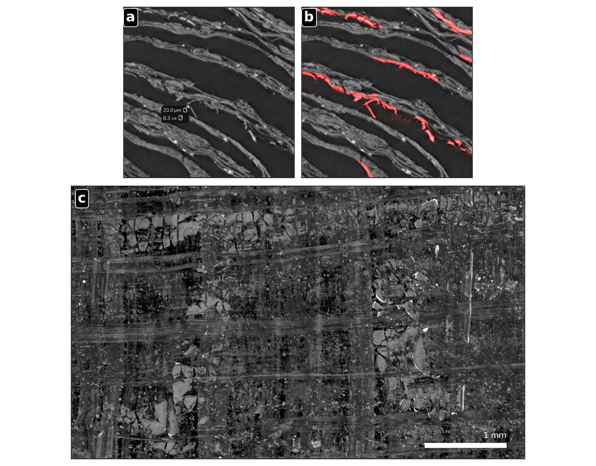
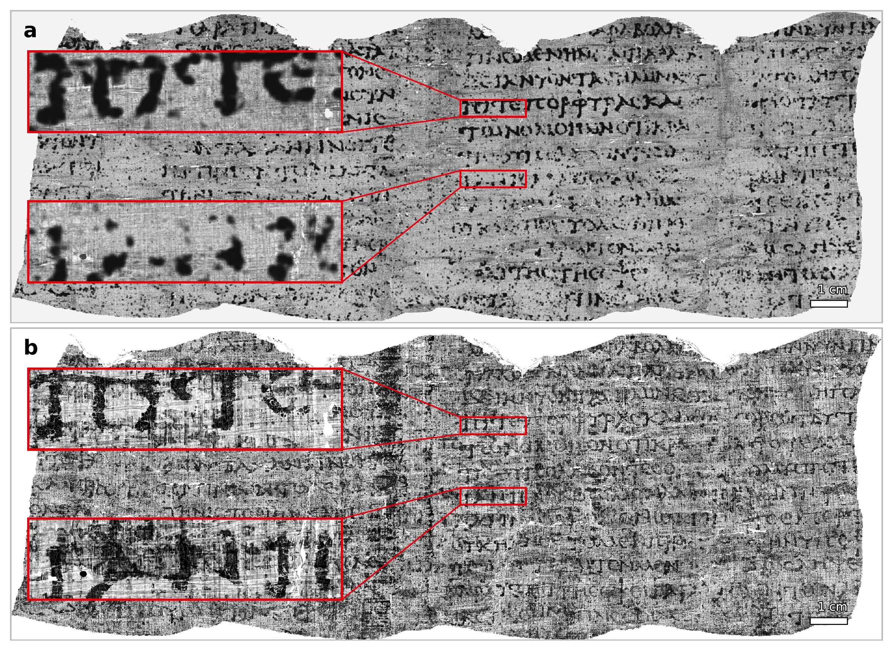
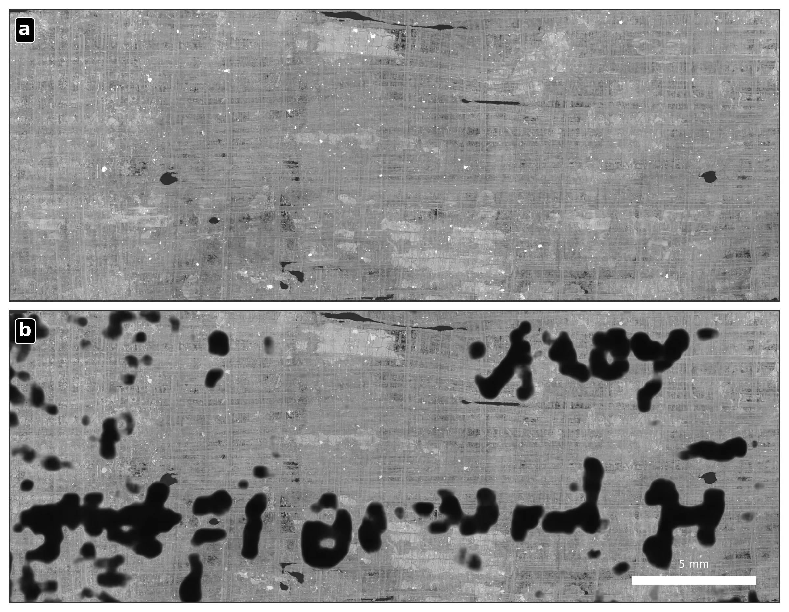

## Introduction: from preserved object to readable source

In June 2026, the Vesuvius Challenge announced that PHerc. 1667 had become the first still-rolled Herculaneum papyrus whose preserved writing surface had been virtually unwrapped and read from end to end without physically opening the object.[^the-first-scroll-read-by-machine-learning-announcement]


The qualification *preserved writing surface* is essential. PHerc. 1667 is not an intact ancient book. Earlier attempts to open it mechanically destroyed much of its exterior and left a compact inner core only about 8 centimetres high. The recovered result therefore does not reproduce every column of the original roll. It reconstructs and reads the surviving material assigned to the present object, including approximately twenty-two columns or column-equivalents of Greek text.[^the-first-scroll-read-by-machine-learning-completeness]

The achievement is nevertheless a historical threshold. Until now, preserving a sealed Herculaneum scroll and reading it were largely competing objectives. The new workflow separates physical access from textual access: the roll remains closed, while X-ray imaging, computational geometry, machine learning, and papyrological review create an inspectable representation of the writing surface.

This is not a case of an artificial-intelligence system translating an invisible document by itself. The machine-learning components neither recognize Greek words nor infer missing sentences from a language model. They help locate papyrus surfaces and amplify weak physical evidence associated with ink. Human specialists then decide which marks support defensible letterforms, words, and passages.[^the-first-scroll-read-by-machine-learning-not-ocr]

## The historical event and the opportunity for historians

The Herculaneum papyri were carbonized during the eruption of Mount Vesuvius in AD 79 and recovered from the Villa of the Papyri during eighteenth-century excavations. The collection is exceptional because it is the only large-scale library known to have survived directly from classical antiquity rather than through later copying traditions.[^the-first-scroll-read-by-machine-learning-library]

Carbonization created a preservation paradox. The heat converted the papyrus into extremely fragile carbon-rich material, while volcanic deposits protected it from many subsequent processes of decay. The books survived, but often as black, compressed rolls whose layers could not be separated without tearing, crushing, or delaminating them.

Historical opening campaigns recovered important philosophical works, especially texts associated with Epicureanism and Philodemus, but they also damaged or destroyed material. PHerc. 1667 itself underwent unsuccessful interventions in the nineteenth century, in 1969, and during the 1980s. According to the technical paper, these attempts reduced its diameter from 4.9 to 2 centimetres and its weight from 14 grams to approximately 6 grams.[^the-first-scroll-read-by-machine-learning-damage-history]

The opportunity therefore extends beyond one recovered treatise. Classical literature is a selected residue. Texts survived because they were copied, taught, collected, translated, or preserved by accident; other works disappeared because their material carriers decayed or because later institutions did not reproduce them. The Herculaneum library offers a different evidentiary channel: books buried in antiquity and therefore partially insulated from the later transmission process.

If virtual unwrapping can be generalized, historians may gain access not only to unknown works but also to new versions, titles, authorship evidence, scribal practices, book structures, and philosophical vocabularies. A recovered scroll is not merely a container of sentences. It is a material and intellectual artefact whose fibres, handwriting, column layout, corrections, lacunae, and paratextual elements all contribute evidence.[^the-first-scroll-read-by-machine-learning-papyrology]

## Why the scroll is difficult to read

The problem is best understood as four coupled challenges: conservation, imaging, geometry, and interpretation.

### Conservation

The roll cannot be treated as a normal manuscript waiting to be opened. Its layers are carbonized, compacted, distorted, and locally fused. A physical intervention may reveal one surface while destroying adjacent layers or erasing their original spatial relationships. Any viable method must therefore recover information without imposing mechanical separation.

### Imaging

The team used high-resolution phase-contrast X-ray computed microtomography on the BM18 beamline at the European Synchrotron Radiation Facility in Grenoble.[^the-first-scroll-read-by-machine-learning-microct] A synchrotron provides an intense and highly controlled X-ray beam, allowing extremely detailed scans of dense and fragile objects.[^the-first-scroll-read-by-machine-learning-synchrotron]

The result of the scan is a three-dimensional CT volume rather than a photograph.[^the-first-scroll-read-by-machine-learning-ct-volume] It contains a dense field of voxel intensities: numerical measurements associated with tiny three-dimensional elements distributed throughout the scroll.[^the-first-scroll-read-by-machine-learning-voxels] These measurements reveal fibres, cracks, voids, layer boundaries, contaminants, and—under favourable conditions—subtle evidence associated with ink.

Ordinary absorption contrast is weak because both the papyrus and much of the ink are carbon-rich. Phase contrast is useful because it also responds to changes in the phase of the X-ray wave as it passes through fine structures, making boundaries and small surface deposits more detectable than they would be in a conventional absorption image.[^the-first-scroll-read-by-machine-learning-phase-contrast]

### Geometry

Even an excellent scan does not contain flat pages. It contains a tightly wound and damaged sheet embedded in three-dimensional space. The writing surface must be identified, traced through the scroll, represented as a coherent mesh, and mapped into two dimensions without switching accidentally to a neighbouring wrap.

This is the geometric core of *virtual unwrapping*: the non-destructive reconstruction and flattening of a hidden sheet from a volumetric scan.[^the-first-scroll-read-by-machine-learning-virtual-unwrapping] The task becomes especially difficult where adjacent layers merge in the image, where the sheet tears, or where compression makes the local topology ambiguous.

### Interpretation

A dark mark in a rendered image is not automatically a Greek letter. It may arise from ink, fibres, cracks, surface misplacement, reconstruction artefacts, or the behaviour of the enhancement model. The final reading therefore requires papyrological review, repeated inspection of the three-dimensional context, and explicit notation of uncertainty and loss.

## The end-to-end workflow

The result depended on an integrated pipeline rather than on a single algorithm.

### 1. Protect and scan the object

Before scanning, the researchers created metric three-dimensional models of the exterior of each scroll using photogrammetry.[^the-first-scroll-read-by-machine-learning-photogrammetry] Those models were used to manufacture custom protective cases that supported transport and tomographic acquisition without imposing unnecessary stress on the artefacts.

At BM18, the objects were scanned using helical acquisition and phase-contrast configurations selected to balance layer separability, ink visibility, scan duration, and the enormous volume of generated data. The final reconstructions could occupy tens of terabytes, and the data were converted into multiscale OME-Zarr representations for storage and partial access.[^the-first-scroll-read-by-machine-learning-omezarr]

### 2. Predict the writing surface

The first machine-learning task was not ink detection but surface prediction. The researchers formulated the problem as supervised three-dimensional semantic segmentation: for every voxel, the model estimates whether it belongs to the target writing surface or to the background.[^the-first-scroll-read-by-machine-learning-semantic-segmentation]

The target was the *recto* surface—the side operationally defined as facing the scroll’s central axis and, where visible, associated with the horizontal-fibre layer.[^the-first-scroll-read-by-machine-learning-recto] Annotated meshes were converted into approximate volumetric training masks. These masks were necessarily imperfect because densely packed or damaged regions do not always support an unambiguous voxel-level boundary.

The predictor was a residual-encoder, nnU-Net-style three-dimensional U-Net.[^the-first-scroll-read-by-machine-learning-unet] Its objective combined cross-entropy, soft Dice, and a custom Medial Surface Recall term.[^the-first-scroll-read-by-machine-learning-losses] The purpose of the additional surface-recall term was to favour continuous thin-sheet predictions: a segmentation with small holes may score reasonably as a volume-overlap problem while still being unusable as a page.

The prediction was not accepted as the final surface. Dense neural outputs can contain mergers between adjacent sheets, gaps, and false positives. Instead, they were treated as evidence for a separate geometric reconstruction.

### 3. Build and correct an explicit surface mesh

The writing surface was represented as a quadrilateral mesh stored in the project’s `tifxyz` format.[^the-first-scroll-read-by-machine-learning-tifxyz] Each valid point in a regular two-dimensional grid stores an explicit (x,y,z) coordinate in the original CT volume. This creates a traceable correspondence between the flattened page and the physical location sampled inside the roll.

The reconstruction software extracted local centreline and orientation evidence from the neural surface predictions. It then grew and optimized a mesh while balancing regular spacing, smoothness, agreement with local orientations, and proximity to the predicted sheet.

The process remained semi-automated. Annotators inspected the mesh against orthogonal CT slices, rotated the three-dimensional scene, added control points, moved vertices, and marked geometrically approved regions. Small mesh gaps could be filled only when the surrounding sheet trajectory was unambiguous; this geometric inpainting did not invent CT intensities or ink evidence.[^the-first-scroll-read-by-machine-learning-geometric-inpainting]

The labour requirement is material to the result. The paper reports 31 reconstructed wraps and approximately 25 hours of manual annotation per wrap using the best available semi-automated tooling at the time.[^the-first-scroll-read-by-machine-learning-manual-effort] The achievement is therefore a human-machine system, not a fully automatic unrolling engine.

### 4. Flatten and render the surface

The corrected quadrilateral mesh was converted into a triangular OBJ mesh and parameterized into a low-distortion two-dimensional domain using SLIM and a symmetric Dirichlet distortion objective.[^the-first-scroll-read-by-machine-learning-parameterization] In practical terms, this optimization seeks a flat representation that does not stretch, compress, or fold local regions more than necessary.

At each pixel of the flattened canvas, the renderer recovered the corresponding three-dimensional point and the local surface normal.[^the-first-scroll-read-by-machine-learning-surface-normal] It then sampled a stack of CT values through the material around that surface. In the reported 2.4-micrometre workflow, 65 samples were taken from 32 voxels below to 32 voxels above the reference sheet.

This surface-conditioned representation is important because ink may not be expressed at exactly one depth. Sampling a thin volume around the estimated page gives the ink detector access to local texture, relief, and deposits while preserving the two-dimensional organization needed for reading.

### 5. Learn an ink signal from exposed fragments

The initial supervised ink labels came from detached Herculaneum fragments whose writing was already visible. Infrared photographs supplied high-contrast two-dimensional ink labels, while CT scans supplied the corresponding three-dimensional material signal. Registering the two modalities created training examples linking visible ink to its subtler tomographic expression.[^the-first-scroll-read-by-machine-learning-registration]

These fragment labels function as *ground truth* only within a bounded sense: they reliably locate visible ink in the surface plane, but they do not specify its exact depth inside the CT stack.[^the-first-scroll-read-by-machine-learning-ground-truth] The team therefore used a U-Net with a three-dimensional ResNet encoder and a two-dimensional decoder. The encoder processes local volumetric context; its features are pooled through depth before the decoder predicts a two-dimensional ink-probability map.[^the-first-scroll-read-by-machine-learning-resnet]

Crucially, the model was not trained on letters, Greek words, transcriptions, OCR targets, dictionaries, or language-model labels. Its 256-pixel input window represented approximately 614 micrometres—smaller than the complete letters the system was intended to reveal. The design restricts each prediction to local physical morphology and texture, greatly reducing the possibility that recognisable words are generated from linguistic expectations rather than imaging evidence.[^the-first-scroll-read-by-machine-learning-local-context]

### 6. Adapt the detector through conservative pseudo-labelling

A model trained on exposed fragments already detected initial ink traces in PHerc. 1667 and PHerc. 139. The researchers then adapted it to each scroll through iterative pseudo-labelling.[^the-first-scroll-read-by-machine-learning-pseudo-labels]

The model first generated candidate ink regions. Credible newly visible regions were added to the training set using the model’s own predictions as provisional labels. The model was fine-tuned and run again, and successful new detections became candidates for the next iteration. PHerc. 1667 used three columns for iterative labelling and five rounds of refinement, while a separate column was held out to observe whether performance improved on unseen material.

Training combined Dice loss and binary cross-entropy with strong label smoothing to reduce overfitting to noisy pseudo-labels.[^the-first-scroll-read-by-machine-learning-label-smoothing] The outputs remained visibility aids for expert review, not autonomous transcriptions.

### 7. Validate geometry, signal, and reading

Eight qualified papyrologists produced and reviewed the PHerc. 1667 transcription at column level. A reading was accepted only when the sampled surface was geometrically close to the papyrus layer, the candidate letterforms remained consistent across renderings or inference passes, and reviewers independently endorsed the interpretation or reached a consensus.[^the-first-scroll-read-by-machine-learning-review]

This layered validation separates three questions that are easily conflated:

1. **Is the reconstructed surface on the correct sheet?**
2. **Does the image contain a repeatable signal compatible with ink?**
3. **Do the surviving traces support a defensible Greek reading?**

A model can assist with the first two questions. The third remains a scholarly judgement grounded in the physical and computational evidence.

```{mermaid}
%%| label: fig-herculaneum-virtual-unwrapping-pipeline
%%| fig-cap: "The coupled imaging, geometry, machine-learning, and scholarly workflow used to recover text from a sealed Herculaneum scroll."
%%| fig-alt: "Flowchart from protected scroll and synchrotron micro-CT through surface prediction, mesh correction, flattening, ink enhancement, and papyrological review."
%%| fig-align: center
%%{init: {"theme": "neo", "look": "handDrawn", "layout": "elk"}}%%
flowchart LR
    A[Carbonized sealed scroll] --> B[Photogrammetry and protective case]
    B --> C[Phase-contrast synchrotron micro-CT]
    C --> D[3D CT volume]
    D --> E[Recto-surface prediction<br/>3D U-Net]
    E --> F[Explicit quad mesh]
    F --> G[Manual correction<br/>and approval]
    G --> H[Low-distortion flattening]
    H --> I[Surface-conditioned CT stack]
    I --> J[Ink-probability model<br/>3D encoder + 2D decoder]
    J --> K[Pseudo-label refinement]
    K --> L[Papyrological review<br/>and transcription]
    D --> M[Direct 3D ink segmentation<br/>where scan quality permits]
    M --> L
```

## The latest achievement

### PHerc. 1667: a complete result within explicit boundaries

PHerc. 1667 preserves the lower parts of the final columns of an otherwise unidentified philosophical work. The reconstructed writing surface contains twenty-two columns or column-equivalents over approximately 860 square centimetres. The broader unwrapping comprises 31 wraps and 1,231 square centimetres of papyrus surface.[^the-first-scroll-read-by-machine-learning-surface-statistics]

The paper defines *complete virtual unwrapping* geometrically: the preserved surface included in the claim is represented by an approved mesh, remains inspectable in the original CT volume, and is rendered in a flattened coordinate system. It defines *complete reading* papyrologically: all image-supported surviving text is considered, with uncertainty and physical loss explicitly marked. The first three columns contain about 33 square centimetres of traces too fragmentary for secure interpretation; this material is included geometrically but remains untranscribed.[^the-first-scroll-read-by-machine-learning-bounded-claim]

The surviving text appears to concern ethical theory and the moral perfectibility of human beings. Recurrent concepts include nature, impulse, practical wisdom, completion, good and evil, pleasure and pain, and the relation between technical arts and ethical judgement. The final preserved column mentions Aristocreon, the nephew and disciple of the Stoic philosopher Chrysippus. This reference, together with the vocabulary and themes, points toward a Stoic context and supports a date in the second century BC, while not proving the author or title.[^the-first-scroll-read-by-machine-learning-stoic-context]

The missing title matters. Ancient bookrolls often carried a title at the end, but PHerc. 1667 has lost much of its original height and exterior. The title may have occupied material that no longer survives. The result therefore reveals a substantial unknown text without yet identifying its author or work.

### PHerc. Paris 4: direct volumetric evidence for ink

PHerc. Paris 4 provides a different form of validation. In its optimized 2.4-micrometre BM18 scan, ink-bearing strokes appear directly in the tomographic volume as surface-associated deposits approximately 10–20 micrometres thick. These deposits can be segmented in three dimensions and projected onto the flattened surface.[^the-first-scroll-read-by-machine-learning-paris4]

{fig-alt="A high-resolution tomographic cross-section of PHerc. Paris 4 with a visible ink deposit, a red three-dimensional ink mask, and its projection onto the flattened surface." fig-align="center"}

The projected result corresponds to the text recovered in the 2023 Grand Prize. This does not prove that every ink model on every scroll is correct, but it establishes an independent physical validation case: under favourable acquisition and preservation conditions, the surface-conditioned signal aligns with deposits directly visible in the three-dimensional data.

{fig-alt="Two renderings of the same Greek text from PHerc. Paris 4, comparing the 2023 machine-learning result with the clearer later three-dimensional ink segmentation." fig-align="center"}

For this volumetric task, the researchers used a three-dimensional residual U-Net and a DINOv2-style representation model.[^the-first-scroll-read-by-machine-learning-dinov2] An expert selected visible ink voxels, whose learned feature vectors were averaged into an *ink prototype*. Cosine similarity between this prototype and other voxel representations generated an ink-likeness map.[^the-first-scroll-read-by-machine-learning-cosine]

The team constrained that map using an independently trained volumetric detector, masked air and void regions, trained a student detector, and refined the result through self-distillation.[^the-first-scroll-read-by-machine-learning-self-distillation] The purpose was not to maximise visually impressive output but to obtain conservative labels supported by more than one signal.

### PHerc. 139: identifying a work from its title

The same research recovered the end title of PHerc. 139: Philodemus, *On Gods*, Book 8. This result is historically distinct from reading continuous prose. A title provides bibliographic evidence: it identifies an author, a work, and a book number before the whole body text has been recovered.[^the-first-scroll-read-by-machine-learning-pherc139]

{fig-alt="A surface rendering and ink-enhanced image of the end title in PHerc. 139, identifying Philodemus and On Gods, Book 8." fig-align="center"}

The book number also changes the known bibliography of Philodemus: before this recovery, only the first book of *On Gods* was known. Virtual unwrapping can therefore expand the catalogue of ancient literature even before it yields a complete edition of every column.

## What the achievement does—and does not—show

The result demonstrates that a still-rolled Herculaneum papyrus can be converted into a continuous, inspectable scholarly surface without physical opening. It also demonstrates that machine-learning ink enhancement can be constrained by explicit geometry, local physical signals, repeated inference, and papyrological review.

It does not show that every sealed scroll is now automatically readable. The paper identifies two dominant bottlenecks.

The first is geometric. Surface networks can fail where layers are highly compressed, merge in the scan, tear, or bend anomalously. A single sheet switch can relocate apparent marks onto the wrong physical layer.

The second is radiometric: the measurable ink signal varies with the ink recipe, contaminants, deposit morphology, preservation state, X-ray energy, effective resolution, phase effects, and sample geometry. A model trained on one combination may not generalize reliably to another.[^the-first-scroll-read-by-machine-learning-bottlenecks]

The workflow is also not yet inexpensive in expert time. PHerc. 1667 required extensive manual correction of the surface mesh and specialist review of the writing. Scaling from one complete preserved roll to hundreds therefore requires better automated tracing, improved scan protocols, more robust cross-scroll ink models, and a larger scholarly capacity for transcription and edition.

The proper conclusion is consequently narrower and stronger than the claim that “AI solved the scrolls.” The feasibility question has changed. Non-invasive, scroll-scale recovery is now demonstrated. The remaining problem is how broadly, reliably, and efficiently that recovery can be repeated.

## Open science as part of the method

The Vesuvius Challenge has released tomographic volumes, reconstructed surfaces, meshes, model predictions, metadata, code, and trained model checkpoints.[^the-first-scroll-read-by-machine-learning-open-data] The data portal distinguishes primary volumetric scans, extracted surface segments, geometric representations, predictions, and provenance metadata. Large volumes are distributed in cloud-oriented formats that permit partial access rather than requiring researchers to download an entire multi-terabyte scan.

The project’s code repository includes data-access libraries, ink-detection tooling, the VC3D semi-automatic surface tracer, mesh-optimization software, and experimental approaches to global spiral fitting.[^the-first-scroll-read-by-machine-learning-code]

This openness is not peripheral to trustworthiness. A flattened image by itself conceals many possible failure modes. Releasing the volume, surface coordinates, rendering pipeline, predictions, and reviewable geometry allows other researchers to inspect whether a proposed letter originates from the intended papyrus layer and whether the image remains stable under alternative processing choices.

Open data also turns the work from a single institutional result into an extensible research programme. Computer-vision researchers can improve tracing or ink detection; imaging scientists can test reconstruction parameters; papyrologists can revisit readings; and software engineers can reduce the cost of handling volumes that may occupy tens of terabytes.

## Conclusion

The first complete virtual reading of the preserved text of PHerc. 1667 is best understood as an infrastructure event for the humanities.

The breakthrough is not a single neural network. It is a controlled chain linking conservation, synchrotron imaging, tomographic reconstruction, surface segmentation, explicit geometry, low-distortion flattening, local ink enhancement, and specialist textual judgement. Each stage constrains the next, and the final reading remains traceable to a location inside the physical scan.

Machine learning did not supply the lost philosophy from linguistic expectation. It made weak material evidence more visible and helped researchers navigate a geometric problem too large for unaided manual work. Papyrologists then converted that evidence into a text with explicit uncertainty and lacunae.

The method has not yet recovered the ancient library at scale. It has established that the central task is physically and computationally possible. The next threshold will be reached when complete recovery ceases to be an exceptional project for one roll and becomes a reproducible process applied across the collection.

## Appendix A: what survives in PHerc. 1667

The full Greek transcription and English translation belong to the research paper. The following table is a thematic and lacuna-oriented guide rather than a substitute for the critical edition.[^the-first-scroll-read-by-machine-learning-transcription]

| Columns | State of preservation                                                        | What can responsibly be said                                                                                                                              |
| ------- | ---------------------------------------------------------------------------- | --------------------------------------------------------------------------------------------------------------------------------------------------------- |
| 1–3     | Ink traces survive, but approximately 33 cm² cannot be transcribed securely. | The regions are included in the geometric unwrapping but excluded from the secure reading.                                                                |
| 4–8     | Severely fragmentary, with lost margins and discontinuous traces.            | Isolated terms occur, including language associated with impulse, but the syntax and argumentative sequence remain uncertain.                             |
| 9–12    | Partial lower lines survive.                                                 | The text begins to show connected ethical argument, including references to human beings, natural disposition, impulse, and features shared with animals. |
| 13–16   | Several consecutive lines are legible, although upper portions remain lost.  | The discussion concerns nature, pleasure and pain, deficiency and excess, impulse, completion, and what human beings require for progress.                |
| 17–19   | Among the clearest surviving passages.                                       | The text contrasts departure from one’s own nature with successful inquiry and compares practical wisdom with technical or mechanical arts.               |
| 20      | A comparatively continuous lower passage.                                    | The argument discusses goods, evils, beauty, ugliness, and happiness.                                                                                     |
| 21      | Fragmentary lower text.                                                      | Language concerning praise or celebration survives, but its argumentative role remains uncertain.                                                         |
| 22      | Final preserved column, still incomplete.                                    | The name Aristocreon is visible. This is important evidence for a Stoic context, but it does not establish authorship.                                    |

The manuscript lacks its upper portion, title, and much of the original roll. Square brackets in the scholarly transcription mark restored letters where the substrate is physically lost; underdots mark uncertain readings.[^the-first-scroll-read-by-machine-learning-editorial-signs] These conventions prevent a visually persuasive rendering from being mistaken for a complete and certain ancient text.

[^the-first-scroll-read-by-machine-learning-announcement]: Vesuvius Challenge. (2026, June 25). **We read an entire scroll—without ever opening it**. *Vesuvius Challenge*. [URL](https://scrollprize.org/firstscroll).

[^the-first-scroll-read-by-machine-learning-completeness]: Angelotti, G., et al. (2026). **Complete virtual unwrapping and reading of a rolled Herculaneum papyrus**. *arXiv*. [DOI](https://doi.org/10.48550/arXiv.2606.29085).

[^the-first-scroll-read-by-machine-learning-not-ocr]: Angelotti, G., et al. (2026). **Complete virtual unwrapping and reading of a rolled Herculaneum papyrus**. *arXiv*, Methods: “Ink detection: From fragments to sealed scrolls.” [DOI](https://doi.org/10.48550/arXiv.2606.29085).

[^the-first-scroll-read-by-machine-learning-library]: Angelotti, G., et al. (2026). **Complete virtual unwrapping and reading of a rolled Herculaneum papyrus**. *arXiv*, introduction. [DOI](https://doi.org/10.48550/arXiv.2606.29085).

[^the-first-scroll-read-by-machine-learning-damage-history]: Angelotti, G., et al. (2026). **Complete virtual unwrapping and reading of a rolled Herculaneum papyrus**. *arXiv*, Methods: “Complete PHerc. 1667 transcription and translation.” [DOI](https://doi.org/10.48550/arXiv.2606.29085).

[^the-first-scroll-read-by-machine-learning-papyrology]: Papyrology is the study of texts written on papyrus and related ancient writing materials. It combines linguistic interpretation with analysis of handwriting, layout, physical damage, editorial history, and the conventions used to represent uncertain or missing text.

[^the-first-scroll-read-by-machine-learning-microct]: X-ray computed microtomography, usually written µCT, reconstructs the internal structure of an object from many X-ray projections at micrometre-scale resolution. Unlike an ordinary radiograph, it produces a three-dimensional dataset rather than a single overlapping projection. Angelotti, G., et al. (2026). **Complete virtual unwrapping and reading of a rolled Herculaneum papyrus**. *arXiv*. [DOI](https://doi.org/10.48550/arXiv.2606.29085).

[^the-first-scroll-read-by-machine-learning-synchrotron]: A synchrotron accelerates charged particles around a storage ring and uses the resulting radiation to produce exceptionally intense and controllable X-ray beams. This permits imaging configurations and resolutions that are difficult to obtain with conventional laboratory scanners.

[^the-first-scroll-read-by-machine-learning-ct-volume]: A CT volume is the three-dimensional digital reconstruction produced from many X-ray measurements. It can be imagined as a stack of extremely thin virtual slices that together represent the scroll’s internal structure and can be inspected from any direction.

[^the-first-scroll-read-by-machine-learning-voxels]: A voxel is the three-dimensional equivalent of a pixel: a tiny volume element associated with one location in the scan. Its intensity is a numerical value derived from the reconstructed X-ray signal. Millions or billions of voxels together form the CT volume.

[^the-first-scroll-read-by-machine-learning-phase-contrast]: Phase-contrast imaging uses changes in the phase of an X-ray wave, not only differences in absorbed energy, to reveal boundaries and fine structures. It is particularly useful when neighbouring materials absorb X-rays similarly but have small differences in density, thickness, or refractive behaviour.

[^the-first-scroll-read-by-machine-learning-virtual-unwrapping]: Virtual unwrapping is a non-destructive computational process that identifies a rolled or folded writing surface inside a three-dimensional scan, reconstructs its geometry, and maps it into a flat image suitable for inspection.

[^the-first-scroll-read-by-machine-learning-photogrammetry]: Photogrammetry reconstructs a three-dimensional object from overlapping photographs by estimating camera positions, matching common image features, and triangulating the object’s surface.

[^the-first-scroll-read-by-machine-learning-omezarr]: OME-Zarr is a chunked, multiresolution format for large scientific images. It allows software to retrieve only the spatial region and resolution level required, which is important when a complete CT reconstruction occupies many terabytes. Vesuvius Challenge. (n.d.). **Data formats**. *Vesuvius Challenge*. [URL](https://scrollprize.org/data).

[^the-first-scroll-read-by-machine-learning-semantic-segmentation]: Semantic segmentation assigns a class to every pixel or voxel. In this case, the classes are broadly “target papyrus surface” and “background or other material,” rather than objects such as letters or words.

[^the-first-scroll-read-by-machine-learning-recto]: In papyrology, *recto* normally denotes the side of a papyrus sheet on which the fibres run horizontally and which was usually written first. In the paper’s operational geometric definition, it is the side facing the scroll’s central axis and corresponding, where visible, to the horizontal-fibre layer.

[^the-first-scroll-read-by-machine-learning-unet]: A U-Net is a neural-network architecture for image segmentation. An encoder progressively extracts contextual features, while a decoder reconstructs a spatially detailed prediction using connections from matching encoder levels. nnU-Net is a framework that configures U-Net pipelines systematically for a given biomedical-style segmentation task.

[^the-first-scroll-read-by-machine-learning-losses]: Cross-entropy penalizes incorrect class probabilities. Dice loss measures overlap between predicted and labelled regions. Medial Surface Recall is designed to reward recovery of a continuous thin surface and to penalize breaks that may be small in volume but destructive to sheet tracing.

[^the-first-scroll-read-by-machine-learning-tifxyz]: `tifxyz` is a Vesuvius Challenge surface format in which three aligned TIFF images store the (x), (y), and (z) coordinates of vertices arranged on a regular two-dimensional grid. Vesuvius Challenge. (n.d.). **Data formats**. *Vesuvius Challenge*. [URL](https://scrollprize.org/data).

[^the-first-scroll-read-by-machine-learning-geometric-inpainting]: Geometric inpainting fills a small gap in the mesh by interpolating the surrounding surface trajectory. It repairs the coordinate model only; it does not create new measured CT values or unsupported ink marks.

[^the-first-scroll-read-by-machine-learning-manual-effort]: Angelotti, G., et al. (2026). **Complete virtual unwrapping and reading of a rolled Herculaneum papyrus**. *arXiv*, Methods: “Statistics and reproducibility.” [DOI](https://doi.org/10.48550/arXiv.2606.29085).

[^the-first-scroll-read-by-machine-learning-parameterization]: Surface parameterization assigns two-dimensional coordinates to a three-dimensional mesh. SLIM—Scalable Locally Injective Maps—is an optimization method designed to flatten meshes while limiting distortion and avoiding local foldovers.

[^the-first-scroll-read-by-machine-learning-surface-normal]: A surface normal is a direction perpendicular to the local papyrus surface. Sampling along that direction examines a thin three-dimensional slab through and around the reconstructed writing layer.

[^the-first-scroll-read-by-machine-learning-registration]: Image registration aligns two representations of the same object so that corresponding physical points occupy matching coordinates. Here, infrared photographs showing exposed ink were aligned with CT-derived surface images of the same fragments.

[^the-first-scroll-read-by-machine-learning-ground-truth]: Ground truth is the reference information used to train or evaluate a model. The exposed fragments provide reliable two-dimensional ink locations, although they do not reveal the exact depth of the ink signal in the CT volume.

[^the-first-scroll-read-by-machine-learning-resnet]: A ResNet, or residual network, uses shortcut connections that allow layers to learn corrections to existing feature representations. A three-dimensional ResNet processes volumetric neighbourhoods rather than ordinary two-dimensional images.

[^the-first-scroll-read-by-machine-learning-local-context]: Angelotti, G., et al. (2026). **Complete virtual unwrapping and reading of a rolled Herculaneum papyrus**. *arXiv*, Methods: “Ink detection: From fragments to sealed scrolls.” [DOI](https://doi.org/10.48550/arXiv.2606.29085).

[^the-first-scroll-read-by-machine-learning-pseudo-labels]: Pseudo-labelling uses a model’s own sufficiently credible predictions as provisional labels for further training. It can extend a model to new data, but it must be constrained because mistakes can otherwise reinforce themselves across iterations.

[^the-first-scroll-read-by-machine-learning-label-smoothing]: Label smoothing replaces absolute target probabilities such as 0 and 1 with less extreme values. This discourages excessive confidence and can reduce overfitting when labels are noisy or partly generated by the model itself.

[^the-first-scroll-read-by-machine-learning-review]: Angelotti, G., et al. (2026). **Complete virtual unwrapping and reading of a rolled Herculaneum papyrus**. *arXiv*, Methods: “Validation and papyrological review.” [DOI](https://doi.org/10.48550/arXiv.2606.29085).

[^the-first-scroll-read-by-machine-learning-surface-statistics]: Angelotti, G., et al. (2026). **Complete virtual unwrapping and reading of a rolled Herculaneum papyrus**. *arXiv*, Results and Methods. [DOI](https://doi.org/10.48550/arXiv.2606.29085).

[^the-first-scroll-read-by-machine-learning-bounded-claim]: Angelotti, G., et al. (2026). **Complete virtual unwrapping and reading of a rolled Herculaneum papyrus**. *arXiv*, Results: “Complete unwrapping and reading of an unopened papyrus: PHerc. 1667.” [DOI](https://doi.org/10.48550/arXiv.2606.29085).

[^the-first-scroll-read-by-machine-learning-stoic-context]: Angelotti, G., et al. (2026). **Complete virtual unwrapping and reading of a rolled Herculaneum papyrus**. *arXiv*, Methods: “Complete PHerc. 1667 transcription and translation.” [DOI](https://doi.org/10.48550/arXiv.2606.29085).

[^the-first-scroll-read-by-machine-learning-paris4]: Angelotti, G., et al. (2026). **Complete virtual unwrapping and reading of a rolled Herculaneum papyrus**. *arXiv*, Results: “Volumetric validation of ink recovery: PHerc. Paris 4.” [DOI](https://doi.org/10.48550/arXiv.2606.29085).

[^the-first-scroll-read-by-machine-learning-dinov2]: DINOv2 is a self-supervised representation-learning method. Rather than being trained directly to identify ink, it learns feature vectors that capture recurring visual or volumetric structure; a task-specific classifier can then compare those representations.

[^the-first-scroll-read-by-machine-learning-cosine]: Cosine similarity compares the direction of two feature vectors rather than their absolute magnitude. A value near one indicates that the learned representations point in similar directions and may therefore describe similar local structures.

[^the-first-scroll-read-by-machine-learning-self-distillation]: Self-distillation trains a new or “student” model using softened or aggregated predictions produced by an earlier model. It can improve consistency, but its reliability depends on conservative filtering because the teacher’s errors can otherwise be inherited.

[^the-first-scroll-read-by-machine-learning-pherc139]: Angelotti, G., et al. (2026). **Complete virtual unwrapping and reading of a rolled Herculaneum papyrus**. *arXiv*, Results: “Identification of a sealed work from title evidence: PHerc. 139.” [DOI](https://doi.org/10.48550/arXiv.2606.29085).

[^the-first-scroll-read-by-machine-learning-bottlenecks]: Angelotti, G., et al. (2026). **Complete virtual unwrapping and reading of a rolled Herculaneum papyrus**. *arXiv*, Discussion. [DOI](https://doi.org/10.48550/arXiv.2606.29085).

[^the-first-scroll-read-by-machine-learning-open-data]: Vesuvius Challenge. (n.d.). **Data formats**. *Vesuvius Challenge*. [URL](https://scrollprize.org/data).

[^the-first-scroll-read-by-machine-learning-code]: ScrollPrize. (2026). **Villa: The Vesuvius Challenge monorepo**. *GitHub*. [URL](https://github.com/ScrollPrize/villa).

[^the-first-scroll-read-by-machine-learning-transcription]: Angelotti, G., et al. (2026). **Complete virtual unwrapping and reading of a rolled Herculaneum papyrus**. *arXiv*, Methods: “Complete PHerc. 1667 transcription and translation.” [DOI](https://doi.org/10.48550/arXiv.2606.29085).

[^the-first-scroll-read-by-machine-learning-editorial-signs]: In a papyrological edition, square brackets normally enclose letters restored where the writing material is missing, while a dot beneath a letter marks an uncertain reading. These signs distinguish measured or visible evidence from scholarly reconstruction.


