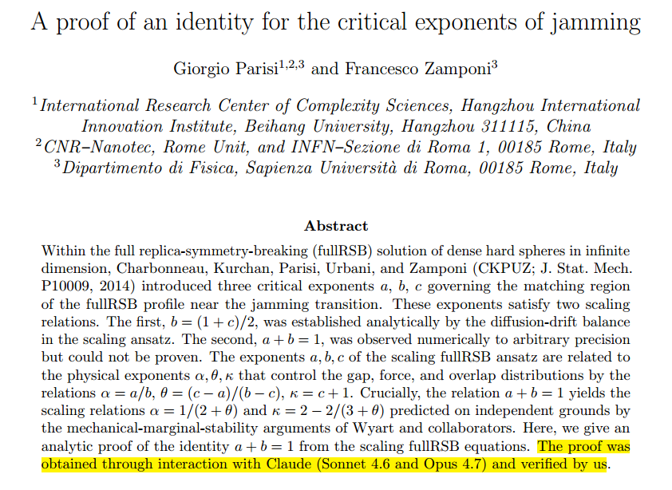
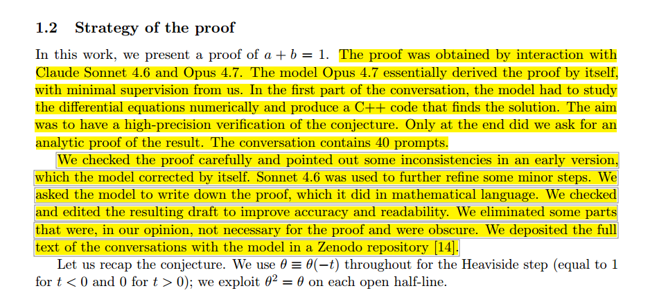

# Introduction

Scientific history occasionally produces moments that are important not because of the technical result itself, but because they reveal a change in how knowledge is produced.

One such moment may have occurred in June 2026, when Giorgio Parisi, recipient of the 2021 Nobel Prize in Physics, and Francesco Zamponi published the paper **A Proof of an Identity for the Critical Exponents of Jamming**.[^when-a-nobel-laureate-uses-an-llm-to-prove-a-theorem-parisi-zamponi-paper]

[^when-a-nobel-laureate-uses-an-llm-to-prove-a-theorem-parisi-zamponi-paper]: Parisi, G., & Zamponi, F. (2026). **A Proof of an Identity for the Critical Exponents of Jamming**. _arXiv_. [DOI](https://doi.org/10.48550/arXiv.2606.03300)

The article concerns a highly specialized problem in the statistical physics of jammed systems[^when-a-nobel-laureate-uses-an-llm-to-prove-a-theorem-jammed-systems]. Yet what attracted immediate attention was not the theorem itself but a sentence contained in the abstract:

> The proof was obtained through interaction with Claude (Sonnet 4.6 and Opus 4.7) and verified by us.

{fig-alt="First paper excerpt" fig-align="center"}

[^when-a-nobel-laureate-uses-an-llm-to-prove-a-theorem-jammed-systems]: A *jammed system* is a disordered collection of particles—such as grains of sand, emulsions, foams, colloids, or densely packed spheres—that becomes mechanically rigid because the particles are so tightly packed that they can no longer rearrange without deforming one another. Unlike crystalline solids, jammed systems lack long-range order, yet they can sustain stresses and behave as solids. The transition between a flowing state and a rigid jammed state, known as the *jamming transition*, is considered a critical phenomenon characterized by universal scaling laws and critical exponents that describe how physical properties change near the transition point. Understanding these exponents is important because similar mathematical structures appear across a wide range of complex materials and nonequilibrium systems.

Later in the paper, the authors state even more explicitly:

> The model Opus 4.7 essentially derived the proof by itself, with minimal supervision from us.

{fig-alt="Second paper excerpt" fig-align="center"}

Such statements would have been almost unthinkable only a few years ago. The significance of the event extends far beyond statistical physics. It forces researchers to confront a question that has gradually moved from speculation to practical reality:

Can generative AI contribute not merely to scientific communication, programming, or literature reviews, but to the actual production of new mathematical knowledge?

# The technical context

The paper addresses a long-standing problem in the theory of jamming transitions, a central topic in the statistical physics of disordered systems. Within the full replica-symmetry-breaking (fullRSB) solution of dense hard-sphere systems in infinite dimensions, researchers have identified several critical exponents that characterize how physical quantities scale as the system approaches the jamming point. Understanding the relationships among these exponents is important because they encode the universal behavior of materials at the threshold between fluid-like and rigid states, and they provide a bridge between numerical observations, theoretical predictions, and analytical descriptions of the jamming transition.

Previous work had established one scaling relation analytically while another relation involving two critical exponents, traditionally denoted by (a) and (b),

$$
a+b=1,
$$

had been observed numerically with extremely high precision but resisted formal proof.

In the theory of jamming, (a) and (b) describe how certain probability distributions and correlation functions behave near the critical point. They are not arbitrary constants: each exponent characterizes a different aspect of the system's scaling behavior as it approaches jamming. The equation (a+b=1) therefore states that these two seemingly independent quantities are in fact constrained by a simple and exact relationship. Establishing why this relation must hold, rather than merely observing it numerically, was the central achievement of the paper.

The new paper provides that proof, resolving a question that had remained open despite years of numerical evidence and analytical effort. From a purely scientific perspective, the result represents a valuable contribution to an established research program in the statistical physics of disordered systems. It strengthens the theoretical foundations of the fullRSB description of jamming and clarifies the relationships among the critical exponents that characterize behavior near the transition.

What makes the paper particularly noteworthy, however, is not the identity itself but the process through which the proof was obtained. While the theorem addresses a specialized problem of interest primarily to experts in the field, the authors' account of how the argument emerged raises broader questions about the role of generative AI in mathematical discovery. As a result, the paper attracts attention not only for its technical achievement but also as a potential example of a new mode of scientific research.

# What actually happened?

It is important to separate fact from speculation when assessing what the paper actually reports. The authors do **not** claim that Claude independently conducted a research program, nor do they suggest that the model's output should be accepted without scrutiny or verification. Such interpretations would overstate both the capabilities of current AI systems and the claims made in the article itself.

Instead, the process described by the authors appears to have followed a more conventional scientific logic, albeit with a novel tool involved. A known open mathematical problem already existed, and extensive numerical evidence had long suggested the validity of a particular conjecture. The authors then interacted with Claude to explore possible derivations and proof strategies. According to their account, the model generated the key idea that ultimately led to the proof, after which the authors independently checked the derivation, verified its correctness, and incorporated the validated result into the scientific literature.

This distinction is crucial because it clarifies where the scientific contribution of the AI begins and ends. The model appears to have assisted in the exploratory phase of research by helping identify a promising line of reasoning, but scientific validity still rests on human verification and acceptance by the research community. In other words, the AI contributed to the process of discovery, but not to the authority that establishes a result as scientifically valid.

# Why this is different from previous computational mathematics

Computers have been involved in mathematics for decades, but their role has traditionally been quite different from the one suggested by the Parisi paper. Landmark results such as the Four Color Theorem relied on computer-assisted verification, while large-scale symbolic algebra systems have long been used to perform calculations that would be impractical by hand. More recently, formal proof assistants such as Lean, Coq, Isabelle, and HOL Light have demonstrated an extraordinary capacity for rigor, allowing mathematicians to verify proofs with a level of precision that exceeds ordinary human checking.

Despite their importance, these tools have generally been designed to perform one of two functions: computation or verification. They can manipulate symbols, explore large combinatorial spaces, and confirm that a proof satisfies formal logical requirements, but they typically do not generate genuinely novel proof strategies. In other words, they have served primarily as extensions of mathematical labor rather than as collaborators in mathematical creativity.

The Parisi case appears different because the AI did not merely check an argument or carry out calculations; according to the authors, it contributed to the construction of the argument itself. This distinction becomes clearer when mathematics is viewed as consisting of three broad activities: conjecture generation, proof discovery, and proof verification. Traditional software has excelled at the third category and, in some cases, provided useful assistance with the second. Large language models, however, increasingly appear capable of participating in both conjecture formation and proof discovery by proposing ideas, identifying patterns, and suggesting lines of reasoning that researchers can then evaluate and refine. If this capability proves robust across a wider range of problems, it would represent not simply an incremental improvement in mathematical software but a qualitative shift in the way mathematical knowledge is produced.

# A Nobel laureate as an early adopter

The identity of the researcher matters. If an undergraduate had made the same claim, the reaction would likely have been skepticism, and many observers would have questioned whether the AI's contribution had been accurately characterized. Parisi, however, occupies a unique position in contemporary science. His work on spin glasses, complexity, and replica symmetry breaking helped define entire areas of modern theoretical physics, and he is among the researchers best equipped to recognize both the strengths and limitations of computational methods. As a result, the statement that an LLM generated the key proof idea carries unusual credibility. It comes not from an enthusiast eager to promote a new technology, but from a scientist with decades of experience evaluating theoretical arguments at the highest level.

Equally important is the way Parisi frames the role of AI in the research process. He is not presenting language models as replacements for mathematicians, nor suggesting that their outputs should be accepted uncritically. Instead, he appears to be treating Claude as a powerful exploratory instrument that can help navigate complex spaces of possible arguments and derivations. In this respect, the comparison with numerical simulations is instructive. Physicists routinely use simulations not as sources of truth in themselves, but as tools for generating hypotheses, revealing patterns, and suggesting directions for further analysis. The AI's role in this case seems analogous: it contributed a promising line of reasoning, while the responsibility for verification, interpretation, and scientific judgment remained firmly with the human researchers.

# The emergence of cognitive infrastructure

The broader significance may be understood through the concept of cognitive infrastructure. Historically, scientific progress has often depended on the introduction of new intellectual technologies that expanded the range of tasks researchers could externalize and delegate. Examples include symbolic notation, algebra, logarithmic tables, mechanical calculators, electronic computers, scientific software, and, more recently, internet-scale information systems. Each of these innovations altered not only the speed of scientific work but also the kinds of problems that could be tackled and the level of abstraction at which researchers could operate.

Large language models may represent the next stage of this process. Unlike previous tools, which primarily stored, transmitted, or manipulated information, these systems can participate directly in exploratory reasoning by generating hypotheses, suggesting proof strategies, and proposing alternative lines of argument. While their outputs still require careful human evaluation and verification, they introduce a new form of cognitive assistance that goes beyond computation alone. In this sense, the emerging workflow increasingly resembles:

```{mermaid}
%%| label: fig-ai-assisted-mathematical-discovery
%%| fig-cap: "AI-assisted mathematical discovery workflow, from open conjecture to verified scientific record."
%%| fig-alt: "Flowchart showing an open problem entering a human research context, followed by AI-assisted exploration, candidate proof generation, human review, formal verification, and publication."
%%| fig-align: center
%%{init: {"theme": "neo", "look": "handDrawn", "layout": "elk"}}%%
flowchart TD
    A[Open Problem or Conjecture] --> B[Human Research Context<br/>Prior Theory, Data, and Intuition]
    B --> C[AI-Assisted Exploration]
    C --> D[Generation of Candidate Ideas<br/>Proof Strategies, Lemmas, and Heuristics]
    D --> E{Promising?}
    E -- No --> C
    E -- Yes --> F[Candidate Proof or Construction]
    F --> G[Human Review and Mathematical Scrutiny]
    G --> H[Formal Verification<br/>and Independent Checking]
    H --> I{Valid?}
    I -- No --> C
    I -- Yes --> J[Human Interpretation<br/>and Conceptual Integration]
    J --> K[Publication and Scientific Record]
```

The human remains responsible for understanding, validation, significance assessment, and integration into the broader scientific corpus.

Yet portions of the exploratory process become increasingly automated.

# What this paper does not prove

The event is historically important, but exaggerated conclusions should be avoided. While the paper marks a notable milestone in AI-assisted research, it does not justify sweeping claims about the current capabilities of generative models. In particular, the paper does not demonstrate that:

* AI can autonomously conduct mathematical research.
* AI can replace mathematicians.
* AI-generated proofs should be accepted without review.
* Current models possess deep mathematical understanding comparable to experts.

The evidence supports a narrower claim: a state-of-the-art language model generated a proof strategy that expert mathematicians judged sufficiently promising to verify, refine, and publish. That claim alone is remarkable, and it does not require stronger assumptions.

# Comparison with earlier scientific revolutions

The popular analogy is often Deep Blue defeating Kasparov. A more useful comparison, however, may be the invention of compilers. Before compilers, programmers wrote machine code directly; afterward, they were able to work at a higher level of abstraction. Programming did not disappear as a result—rather, the nature of programming changed. Something similar may be occurring in mathematics.

Future researchers may spend less time searching for derivations and more time:

* defining problems;
* evaluating candidate arguments;
* connecting results across fields;
* constructing conceptual frameworks;
* formalizing and validating AI-generated discoveries.

In this scenario, AI does not replace mathematicians; rather, it changes the level at which they work, shifting their attention away from routine derivations and toward higher-level tasks such as formulating problems, evaluating competing arguments, and developing broader conceptual frameworks.

# Implications for scientific publishing

The Parisi paper also introduces new questions about scientific attribution and the norms that govern scientific publishing. Traditional authorship frameworks are built on the assumption that all substantive intellectual contributions originate from human researchers, with software serving primarily as a tool for computation, analysis, or presentation. Generative AI systems complicate this picture because they can contribute ideas, suggest proof strategies, generate hypotheses, and participate in forms of reasoning that were previously considered uniquely human activities. As a result, the scientific community will need to clarify how such contributions should be documented and evaluated.

Future journals may therefore require explicit policies addressing issues such as model disclosure, reproducibility of AI-assisted interactions, prompt archiving, provenance tracking, attribution standards, and verification requirements. These questions are not entirely unprecedented. Over the past several decades, researchers have developed detailed norms for computational experiments, large-scale simulations, and data-intensive studies, ensuring that results can be reproduced and independently assessed. A similar process is likely to occur for AI-assisted discovery, leading to new standards that balance transparency, accountability, and scientific rigor while acknowledging the growing role of generative systems in the research process.

# The future of mathematical research

Readers of this blog may recognize a theme that has appeared in two earlier articles: the idea that AI is becoming part of the cognitive infrastructure of science, and that we may be witnessing an _Erdős moment_ in which researchers begin collaborating with AI systems much as previous generations collaborated with prolific human colleagues.[^when-a-nobel-laureate-uses-an-llm-to-prove-a-theorem-erdos-moment][^when-a-nobel-laureate-uses-an-llm-to-prove-a-theorem-cognitive-infrastructure] The Parisi–Zamponi paper provides a concrete example of what those more abstract arguments look like in practice.

[^when-a-nobel-laureate-uses-an-llm-to-prove-a-theorem-cognitive-infrastructure]: Montano A. (2026). **The New Cognitive Infrastructure of Science**. _Author's blog_. [URL](https://4m4.it/posts/new-cognitive-infrastructure-science/index.html)

[^when-a-nobel-laureate-uses-an-llm-to-prove-a-theorem-erdos-moment]: Montano A. (2026). **The Erdős Moment of AI**. _Author's blog_. [URL](https://4m4.it/posts/the-erdos-moment-of-ai/index.html)

The most important lesson from this episode may not concern mathematics alone. Many disciplines contain activities that are structurally similar to proof discovery, including theoretical physics, economics, systems biology, algorithm design, software architecture, and engineering optimization. In each of these fields, researchers must navigate vast spaces of possible explanations, derivations, models, or constructions, often searching for a small number of solutions that are both correct and insightful. Traditionally, this exploratory phase has depended on a scarce resource: human attention. Researchers spend years developing intuitions that help them traverse these search spaces efficiently, but much of the process still involves investigating paths that ultimately prove unproductive.

What makes systems like Claude interesting is not that they eliminate this search, but that they can participate in it. They function less like calculators and more like exploratory partners capable of generating candidate arguments, proposing alternative formulations, surfacing overlooked connections, and suggesting directions that may deserve further scrutiny. Their outputs remain unreliable and require verification, yet they can dramatically increase the number of plausible avenues that can be explored within a given amount of time.

Seen from this perspective, the Parisi paper is not merely an isolated success story. It is evidence that part of the exploratory labor of research can now be delegated to machines. If this trend continues, the bottleneck in many forms of intellectual work may gradually shift away from generating possibilities and toward evaluating them. Verification becomes more important than production. Judgment becomes more important than calculation. Interpretation becomes more important than derivation.

This is precisely why the emergence of AI-assisted discovery should not be understood primarily as a story about automation. It is a story about amplification. Scientific progress has always depended on tools that expand the range of questions researchers can realistically investigate. Large language models appear increasingly capable of expanding the space of ideas that can be explored before human attention is applied. The central challenge is therefore no longer finding ideas at scale, but determining which ideas are correct, meaningful, and worthy of incorporation into the broader body of scientific knowledge.

An important contribution to this discussion is the Leiden Declaration on the Governance of AI-assisted Mathematics, a recent proposal that seeks to establish principles for transparency, accountability, and scientific integrity in an era where AI systems increasingly participate in mathematical research. The declaration does not treat AI as an author or autonomous scientific agent; instead, it emphasizes that responsibility for mathematical claims remains with human researchers. Among its central themes are the disclosure of AI assistance, the preservation of reproducibility through documentation of interactions and workflows, the importance of independent verification, and the need to distinguish between the generation of ideas and the validation of results. In many respects, the Parisi–Zamponi paper exemplifies the kind of practice the declaration encourages: explicit acknowledgment of AI involvement combined with rigorous human checking and acceptance of responsibility for the final proof. As AI-assisted discovery becomes more common, frameworks such as the Leiden Declaration may play a role analogous to earlier norms developed for computational science, helping the research community integrate powerful new tools without compromising the standards of rigor and trust on which mathematics ultimately depends.[^when-a-nobel-laureate-uses-an-llm-to-prove-a-theorem-leiden-ai-math-declaration]

[^when-a-nobel-laureate-uses-an-llm-to-prove-a-theorem-leiden-ai-math-declaration]: Montano A. (2026). **The Leiden Declaration and the Governance of AI-Assisted Mathematics**, section _About our values._ [URL](https://4m4.it/posts/leiden-declaration-and-the-governance-of-ai-assisted-mathematics/index.html)

# Conclusion

The Parisi–Zamponi paper may eventually be remembered for reasons that extend well beyond its specific contribution to the theory of jamming. While the mathematical result itself is valuable within a specialized area of statistical physics, the broader significance of the work lies in the unusual way the proof was obtained and documented. For perhaps the first time, a Nobel laureate has publicly and explicitly acknowledged that a state-of-the-art generative AI system played a decisive role in the development of a mathematical proof, while also emphasizing that the final argument was carefully verified by human experts. This combination of AI-assisted discovery and human validation marks an important moment in the evolving relationship between researchers and intelligent computational tools.

At the same time, it is important not to overstate what this episode demonstrates. The paper does not provide evidence for the arrival of autonomous scientific intelligence, nor does it suggest that mathematicians or theoretical physicists are becoming obsolete. Human researchers remain responsible for identifying meaningful problems, evaluating proposed arguments, verifying correctness, and determining the significance of new results within a broader scientific context. Yet the event does point toward a development that may ultimately prove more consequential: the growing permeability of the boundary between human reasoning and machine-assisted discovery. Rather than functioning solely as calculators, databases, or verification systems, advanced language models are beginning to participate in the exploratory stages of research, where ideas are generated, connections are proposed, and potential solutions are investigated.

Seen from a longer historical perspective, this development fits within a recurring pattern in the evolution of science. For centuries, scientific instruments have expanded human intellectual capabilities by extending our ability to interact with the world in new ways. Telescopes expanded the reach of vision beyond the limits of the naked eye, microscopes revealed structures that were previously invisible, and computers transformed our capacity for calculation and simulation. Large language models may represent a different kind of extension: not an enhancement of perception or computation alone, but a tool that can assist with exploratory reasoning itself. If that interpretation proves correct, then the Parisi paper may ultimately be remembered not merely as a proof of a mathematical identity, but as one of the earliest and most visible examples of a new mode of scientific discovery in which human expertise and artificial intelligence collaborate to produce knowledge that neither could have generated in quite the same way on its own.
